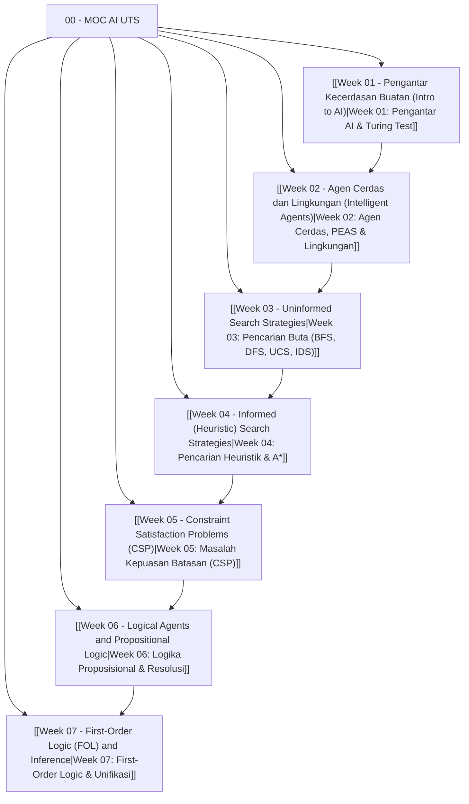
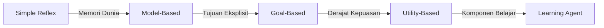

---
tags:
  - ai
  - uts
  - moc
  - study-guide
  - map-of-content
created: 2026-10-10
title: "00 - MOC AI UTS (Map of Content & Panduan Belajar Lengkap)"
---

# 00 - Map of Content (MOC) Kecerdasan Buatan - Persiapan UTS

> [!abstract] Ringkasan Eksekutif
> Catatan ini merupakan pusat navigasi (*Map of Content*) untuk seluruh materi Ujian Tengah Semester (UTS) mata kuliah **Kecerdasan Buatan (KOM321)**. Disusun secara sistematis dari **Week 01 hingga Week 07** berdasarkan 11 dokumen referensi kuliah, slide CS188 UC Berkeley, buku teks Russell & Norvig (*AIMA 3rd/4th Edition*), serta kumpulan solusi latihan soal resmi.

---

## 🗺️ Peta Navigasi Materi Mingguan

| Minggu | Topik Utama | Konsep Kunci | Catatan Vault |
| :---: | :--- | :--- | :--- |
| **01** | **Pengantar AI & Fondasi** | 4 Kuadran AI, Uji Turing, Sejarah & AI Winter, Etika AI & Bias | [[Week 01 - Pengantar Kecerdasan Buatan (Intro to AI)]] |
| **02** | **Agen Cerdas & Lingkungan** | Arsitektur Agen, Rasionalitas vs Kemahatahuan, Analisis PEAS, 7 Dimensi Lingkungan | [[Week 02 - Agen Cerdas dan Lingkungan (Intelligent Agents)]] |
| **03** | **Uninformed Search** | Formulasi Masalah, Tree vs Graph Search, BFS, DFS, UCS, IDS, Analisis Kompleksitas | [[Week 03 - Uninformed Search Strategies]] |
| **04** | **Informed (Heuristic) Search** | Heuristik $h(n)$, Greedy Search, Algoritma A\*, Admissibility, Consistency, Dominansi | [[Week 04 - Informed (Heuristic) Search Strategies]] |
| **05** | **Constraint Satisfaction (CSP)** | Variabel-Domain-Batasan, Backtracking, MRV, LCV, Forward Checking, AC-3, Tree CSP | [[Week 05 - Constraint Satisfaction Problems (CSP)]] |
| **06** | **Propositional Logic** | Wumpus World, Entailment, Model Checking, CNF Conversion, Resolusi Kontradiksi, Horn Clause | [[Week 06 - Logical Agents and Propositional Logic]] |
| **07** | **First-Order Logic (FOL)** | Term-Predikat-Fungsi, Kuantor $\forall$ dan $\exists$, Skolemization, Unifikasi, FOL Resolution | [[Week 07 - First-Order Logic (FOL) and Inference]] |

---

## ⚡ Master Cheat Sheet: Matriks Perbandingan Inti

### 1. Komparasi Algoritma Pencarian Klasik (Uninformed vs Informed)

| Algoritma | Fungsi Evaluasi $f(n)$ | Struktur Antrean | Complete? | Optimal? | Time Complexity | Space Complexity |
| :--- | :---: | :--- | :---: | :---: | :---: | :---: |
| **BFS** | Kedalaman $d$ | FIFO Queue | **Ya** (jika $b < \infty$) | **Ya** (jika cost identik) | $O(b^d)$ | $O(b^d)$ *(Boros!)* |
| **DFS** | $-d$ (kedalaman) | LIFO / Stack | **Tidak** (bisa loop) | **Tidak** | $O(b^m)$ | $O(bm)$ *(Hemat!)* |
| **IDS** | Iterasi limit $l$ | Stack berulang | **Ya** | **Ya** (jika cost identik) | $O(b^d)$ | $O(bd)$ *(Optimal!)* |
| **UCS** | $g(n)$ (past cost) | Priority Queue | **Ya** (jika $c \ge \epsilon$) | **Ya** | $O(b^{1 + \lfloor C^*/\epsilon \rfloor})$ | $O(b^{1 + \lfloor C^*/\epsilon \rfloor})$ |
| **Greedy** | $h(n)$ (heuristic) | Priority Queue | **Tidak** (tree search) | **Tidak** | $O(b^m)$ | $O(b^m)$ |
| **A\*** | $g(n) + h(n)$ | Priority Queue | **Ya** | **Ya** (jika $h$ valid) | $O(b^{\epsilon d})$ (bergantung $h$) | $O(b^{\epsilon d})$ |

---

### 2. Lima Arsitektur Agen Cerdas

- **Simple Reflex**: Rule `if-then` berbasis persepsi saat ini. Gagal total di *partially observable*.
- **Model-Based**: Menyimpan *Internal State* untuk melacak sejarah dunia yang tak tampak.
- **Goal-Based**: Mencari kombinasi aksi menuju target (*Search & Planning*).
- **Utility-Based**: Menggunakan fungsi utilitas skalar untuk menimbang *trade-off* dan ketidakpastian (*Max Expected Utility*).
- **Learning Agent**: 4 komponen: *Critic, Learning Element, Learning Goals / Problem Generator, Performance Element*.

---

### 3. Logika: Proposisional vs First-Order Logic (FOL)

| Karakteristik | Logika Proposisional (Week 06) | First-Order Logic / FOL (Week 07) |
| :--- | :--- | :--- |
| **Komitmen Ontologis** | Dunia berisi **Fakta** ($P, Q, R$) | Dunia berisi **Objek, Relasi/Predikat, dan Fungsi** |
| **Ekspresifitas** | Terbatas; sulit menyatakan hukum universal | Sangat tinggi; menggunakan kuantor $\forall$ dan $\exists$ |
| **Pola Implikasi Universal** | Tidak ada variabel universal | $\forall x \, [P(x) \implies Q(x)]$ *(Gunakan $\implies$, bukan $\land$!)* |
| **Pola Keberadaan Eksistensial**| Tidak ada variabel eksistensial | $\exists x \, [P(x) \land Q(x)]$ *(Gunakan $\land$, bukan $\implies$!)* |
| **Aturan Inferensi Utama** | Resolusi Proposisional, Horn Forward/Backward Chaining | Resolusi FOL dengan **Unifikasi ($\text{MGU}$)** & Skolemization |
| **Kompleksitas Pembuktian** | Decidable ($NP$-complete via SAT) | Semi-Decidable (Teorema Ketunggalan Gödel) |

---

## 🎯 10 Jebakan Klasik Soal Ujian (Common Exam Traps)

> [!warning] Jangan Terjebak di Soal-Soal Ini!
> 1. **Rasional $\ne$ Mahatahu (Omniscient)**: Agen rasional memaksimalkan *expected performance*, bukan hasil masa depan yang sempurna tanpa cacat.
> 2. **Goal Test pada UCS dan A\***: Pengujian goal **HANYA dilakukan saat node di-pop dari fringe**, BUKAN saat node pertama kali dibuat (*generated/enqueued*)!
> 3. **Syarat Optimalitas A\***:
>    - A\* *Tree Search* cukup memerlukan syarat **Admissible** ($0 \le h(n) \le h^*(n)$).
>    - A\* *Graph Search* memerlukan syarat **Consistent / Monotonic** ($h(n) \le c(n, a, n') + h(n')$).
> 4. **Dominasi Heuristik**: Jika $h_2(n) \ge h_1(n)$ untuk setiap $n$, maka $h_2$ mendominasi $h_1$ dan A\* dengan $h_2$ dijamin mengekspansi node lebih sedikit atau sama.
> 5. **MRV vs LCV pada CSP**:
>    - **MRV (Minimum Remaining Values)** memilih **VARIABEL** (yang domainnya paling sempit $\to$ *Fail-First*).
>    - **LCV (Least Constraining Value)** memilih **NILAI** (yang paling sedikit membatasi domain tetangga $\to$ *Fail-Last*).
> 6. **AC-3 Pruning**: Hapus nilai selalu dari **ekor (*tail*)** arc: pada arc $X \to Y$, nilai dibuang dari $D_X$, bukan $D_Y$!
> 7. **Tree CSP**: Graf batasan berbentuk pohon dapat diselesaikan dalam waktu linear $O(n d^2)$ **tanpa backtracking**.
> 8. **Implikasi Kosong pada Logika**: $P \implies Q$ bernilai **TRUE** secara otomatis jika $P$ bernilai FALSE!
> 9. **Kuantor $\forall$ vs $\land$**: $\forall x [P(x) \land Q(x)]$ berarti SEMUA objek di alam semesta adalah $P$. Yang benar adalah $\forall x [P(x) \implies Q(x)]$.
> 10. **Bukti Kontradiksi Resolusi**: Selalu tambahkan **negasi dari apa yang ingin dibuktikan** ($\neg \text{Goal}$) ke dalam himpunan klausa, lalu cari resolvent hingga menghasilkan klausa kosong $\Box$.

---

## ✅ Checklist Kesiapan Ujian (Exam Readiness Checklist)

Gunakan daftar centang interaktif ini untuk memantau progres belajarmu:

- [ ] **Week 01**: Mampu menjelaskan 4 kuadran pendekatan AI dan 6 disiplin ilmu Uji Turing.
- [ ] **Week 02**: Mampu menyusun tabel PEAS untuk agen apapun dan mengklasifikasikan 7 sifat lingkungannya.
- [ ] **Week 02**: Memahami perbedaan arsitektur Simple Reflex, Model-Based, Goal-Based, dan Utility-Based.
- [ ] **Week 03**: Mampu menelusuri (*tracing*) pencarian BFS, DFS, UCS, dan IDS pada graf berbobot.
- [ ] **Week 03**: Hafal rumus kompleksitas waktu dan memori untuk semua uninformed search.
- [ ] **Week 04**: Mampu menghitung $f(n) = g(n) + h(n)$ untuk A\* dan membuktikan admissibility serta consistency.
- [ ] **Week 04**: Paham konsep relaksasi masalah (8-puzzle misplaced tiles vs Manhattan distance).
- [ ] **Week 05**: Mampu memformulasikan masalah nyata ke dalam format CSP $\langle X, D, C \rangle$.
- [ ] **Week 05**: Mampu melakukan simulasi Backtracking dengan MRV, LCV, Forward Checking, dan algoritma AC-3.
- [ ] **Week 06**: Mampu mengonversi kalimat logika proposisional ke bentuk CNF dalam 5 langkah.
- [ ] **Week 06**: Mahir melakukan pembuktian resolusi kontradiksi hingga mendapatkan klausa kosong $\Box$.
- [ ] **Week 07**: Mampu menerjemahkan kalimat bahasa alami ke FOL tanpa salah memasang kuantor.
- [ ] **Week 07**: Mampu melakukan unifikasi ekspresi predikat dan memahami Skolemization.

---
*Semoga sukses menghadapi UTS Kecerdasan Buatan! Buka catatan pertama:* [[Week 01 - Pengantar Kecerdasan Buatan (Intro to AI)|Week 01 - Pengantar AI ➔]]
