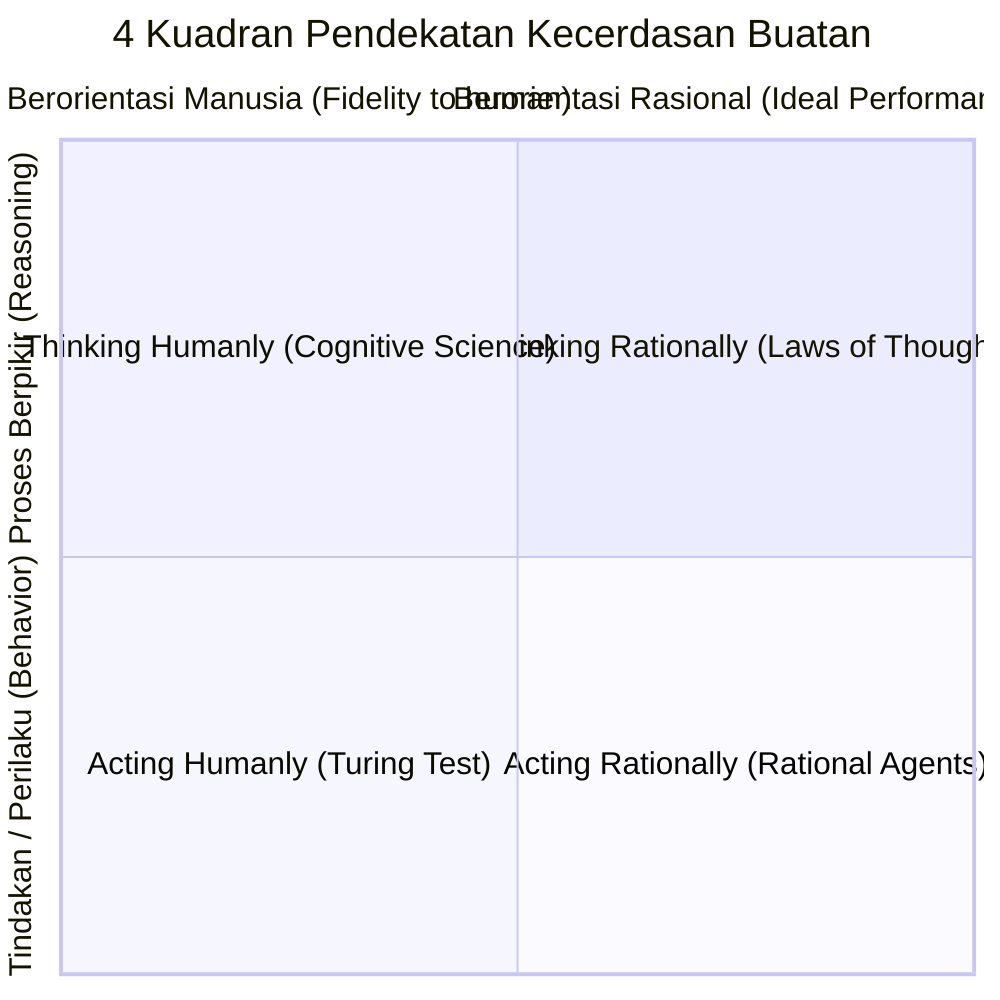
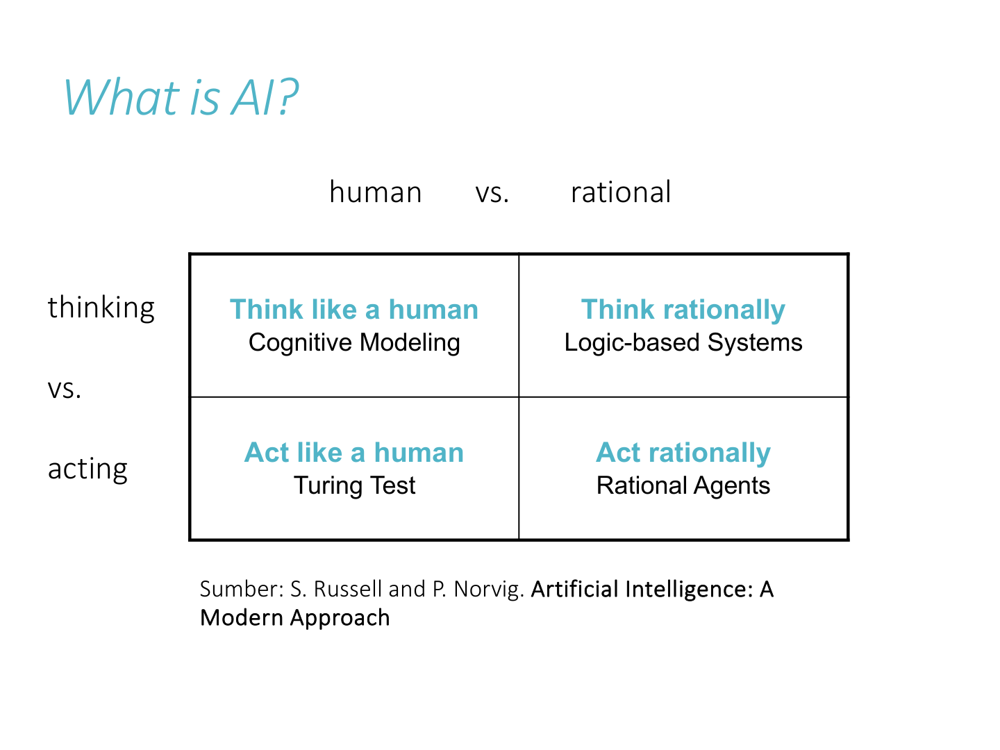
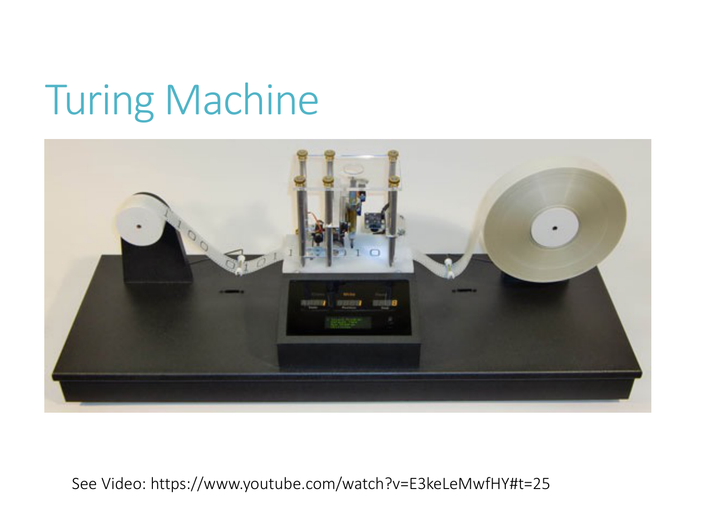
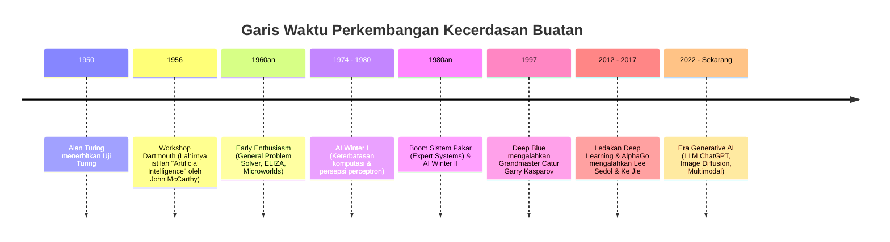

---
tags:
  - ai
  - uts
  - introduction
  - turing-test
  - rational-agent
  - ethics
created: 2026-10-10
week: 1
source: "Kuliah 01 - Intro to AI-2023.pdf, Russell & Norvig Chapter 1"
---

# Week 01 - Pengantar Kecerdasan Buatan (Intro to AI)

> [!summary] Navigasi Catatan
> - **MOC Master**: [[00 - MOC AI UTS|00 - Map of Content AI UTS]]
> - **Next**: [[Week 02 - Agen Cerdas dan Lingkungan (Intelligent Agents)|Week 02 - Agen Cerdas dan Lingkungan]]

---

## 1. Definisi Kecerdasan Buatan (Artificial Intelligence)

Kecerdasan Buatan adalah bidang ilmu komputer yang luas dengan beragam definisi tergantung sudut pandang (apakah fokus pada **proses berpikir** vs **perilaku**, dan apakah tolok ukurnya **manusiawi** vs **rasional**).

> [!quote] Definisi Klasik Tokoh AI
> - **Richard Bellman (1978)**: "Otomatisasi kegiatan yang dikaitkan dengan pemikiran manusia, seperti pengambilan keputusan (*decision-making*), pemecahan masalah (*problem-solving*), dan proses belajar (*learning*)."
> - **Ray Kurzweil (1990)**: "Seni menciptakan mesin yang dapat mengerjakan fungsi/tugas yang membutuhkan kecerdasan jika dilakukan oleh manusia."
> - **John Haugeland (1985)**: "Upaya baru yang menarik untuk membuat komputer berpikir... mesin yang dilengkapi akal pikiran dalam arti sepenuhnya."
> - **Charniak & McDermott (1985)**: "Studi tentang kemampuan mental melalui penggunaan model komputasi."
> - **Patrick Winston (1992)**: "Studi komputasi yang memungkinkan terbentuknya persepsi, penalaran (*reasoning*), dan tindakan (*action*)."
> - **Rich & Knight (1991)**: "Studi tentang bagaimana membuat komputer melakukan hal-hal yang saat ini dilakukan lebih baik oleh manusia."
> - **Russell & Norvig (2009)**: "Perancangan dan pembangunan agen cerdas (*rational agents*) yang menerima persepsi dari lingkungan dan mengambil tindakan yang memaksimalkan peluang keberhasilan."

---

## 2. Empat Pendekatan AI (The Four Approaches)

Stuart Russell dan Peter Norvig mengklasifikasikan definisi AI ke dalam **matriks 2 dimensi**:

| Dimensi | Berpikir (*Thinking*) | Bertindak (*Acting*) |
| :--- | :--- | :--- |
| **Seperti Manusia (*Human-like*)** | **Thinking Humanly**: Pendekatan Pemodelan Kognitif (*Cognitive Modeling*) | **Acting Humanly**: Uji Turing (*The Turing Test Approach*) |
| **Secara Rasional (*Rational*)** | **Thinking Rationally**: Hukum Pemikiran Logis (*The Laws of Thought / Logic*) | **Acting Rationally**: Agen Rasional (*The Rational Agent Approach*) |

---

### A. Acting Humanly: Pendekatan Turing Test

Diusulkan oleh **Alan Turing (1950)** dalam makalah terkenalnya *"Computing Machinery and Intelligence"*.

> [!important] Definisi Uji Turing (The Imitation Game)
> Komputer diuji oleh seorang penilai manusia (*interrogator*) melalui komunikasi teks jarak jauh. Jika penilai tidak dapat membedakan secara konsisten mana jawaban manusia dan mana jawaban komputer, maka komputer tersebut dinyatakan **lolos Uji Turing**.

Untuk lulus **Turing Test Standar**, komputer memerlukan 4 kemampuan dasar AI:
1. **Natural Language Processing (NLP)**: Berkomunikasi lancar dalam bahasa alami.
2. **Knowledge Representation**: Menyimpan informasi sebelum dan selama interogasi.
3. **Automated Reasoning**: Menggunakan pengetahuan yang tersimpan untuk menjawab pertanyaan dan menarik kesimpulan.
4. **Machine Learning (ML)**: Beradaptasi dengan keadaan baru serta mengenali pola.

Untuk lulus **Total Turing Test** (melibatkan interaksi fisik dan inspeksi visual):
5. **Computer Vision**: Mempersepsikan objek visual di dunia nyata.
6. **Robotics**: Memanipulasi dan menggerakkan objek fisik di lingkungan.

---

### B. Thinking Humanly: Pendekatan Pemodelan Kognitif

Fokus pada pemahaman **bagaimana otak dan pikiran manusia bekerja sebenarnya**.
- Menggabungkan model komputasi AI dengan teknik dari **Ilmu Kognitif (*Cognitive Science*)** dan **Neuropsikologi**.
- Tiga cara mengetahui cara kerja pikiran manusia:
  1. *Introspeksi*: Menangkap alur pemikiran sendiri saat memecahkan masalah.
  2. *Eksperimen Psikologis*: Mengamati perilaku dan respon orang saat diberi tes.
  3. *Brain Imaging* (fMRI/EEG): Mengamati aktivitas neurologis otak secara langsung.

---

### C. Thinking Rationally: Pendekatan Hukum Pemikiran (Laws of Thought)

Dimulai dari filsuf Yunani **Aristoteles** yang mencetuskan **Silogisme**: pola penalaran deduktif yang selalu menghasilkan kesimpulan benar jika premisnya benar.
- *Contoh klasik*:
  - Premis 1: Semua manusia fana (*mortal*).
  - Premis 2: Socrates adalah manusia.
  - Kesimpulan: Socrates fana.
- **Keterbatasan Pendekatan Logika Murni dalam AI**:
  1. Sulit menyatakan pengetahuan informal dunia nyata ke dalam format notasi logika formal yang 100% pasti.
  2. Kompleksitas komputasi: Membuktikan kebenaran proposisi logika kompleks membutuhkan waktu komputasi yang meledak secara eksponensial.

---

### D. Acting Rationally: Pendekatan Agen Rasional (Standar Modern)

> [!tip] Mengapa Agen Rasional Menjadi Standar Utama AI?
> **Agen Rasional** adalah agen yang bertindak sedemikian rupa untuk mencapai **hasil terbaik yang diharapkan** (*best expected outcome*), atau hasil dengan utilitas tertinggi saat ada ketidakpastian.

Keunggulan pendekatan ini:
1. **Lebih umum dari sekadar berpikir logis**: Berpikir rasional adalah bagian dari bertindak rasional (karena penalaran logis sering dibutuhkan untuk mengambil aksi terbaik). Namun, ada situasi refleks di mana agen harus bertindak tanpa inferensi rumit (misal: menarik tangan dari api panas).
2. **Lebih terukur secara ilmiah**: Rasionalitas didefinisikan secara matematis berdasarkan fungsi kinerja (*performance measure*), tidak terikat pada misteri psikologis otak manusia.

---

## 3. Tonggak Sejarah dan Perkembangan AI

- **1997 (IBM Deep Blue vs Garry Kasparov)**: Kemenangan komputer catur pertama atas juara dunia catur manusia melalui algoritma adversarial search (Alpha-Beta pruning) dan evaluasi perangkat keras khusus.
- **2016-2017 (Google DeepMind AlphaGo)**: Mengalahkan juara dunia permainan Go (permainan dengan *branching factor* luar biasa masif yang mustahil diselesaikan dengan brute force biasa) menggunakan kombinasi Monte Carlo Tree Search (MCTS) dan Deep Reinforcement Learning.
- **2022+ (Generative AI & LLMs)**: Model pondasi berskala masif (GPT-4, Claude, Gemini, Stable Diffusion) yang mampu menghasilkan teks, kode, musik, dan gambar realistis.

---

## 4. Etika AI (*AI Ethics*) dan Tantangan Sosial

Kemajuan AI menghadirkan konsekuensi hukum, sosial, dan etika nyata:

> [!warning] 3 Tantangan Etika Utama dalam Kuliah
> 1. **AI dan Bias**:
>    - Model belajar dari data historis. Jika data bias, output AI akan mendiskriminasi.
>    - *Kasus Nyata (Amazon 2018)*: Algoritma rekrutmen otomatis mendowngrade pelamar perempuan karena data latih didominasi profil karyawan pria masa lalu.
> 2. **AI dan Privasi / Hak Cipta**:
>    - Model generatif dilatih dengan miliaran data scraping dari internet tanpa *consent* kreator asli.
>    - *Kasus Nyata (Lensa AI & ChatGPT)*: Menggunakan karya seni digital seniman tanpa atribusi atau kompensasi finansial yang adil.
> 3. **AI dan Lingkungan (*Environmental Impact*)**:
>    - Pelatihan (*training*) LLM berskala triliunan parameter membutuhkan daya listrik raksasa dan pendinginan air masif yang meninggalkan jejak karbon tinggi (*carbon footprint*).

### Peran Pemangku Kepentingan (*Stakeholders*)
- **Akademisi**: Meneliti model statistik bebas bias, metodologi explainable AI (XAI), dan efisiensi algoritma (*Green AI*).
- **Pemerintah**: Regulasi keselamatan dan audit kepatuhan (contoh: *EU AI Act*, NSTC 2016).
- **Entitas Antarpemerintah (UNESCO 2021)**: Kesepakatan global etika AI yang ditandatangani 193 negara anggota.
- **Komunitas Non-Profit**: Menjaga inklusivitas (misal: *Black in AI*, *Queer in AI*, *Asilomar AI Principles* - 23 pedoman etika AI).
- **Perusahaan Swasta**: Membentuk tim audit etika internal (*Responsible AI teams*) dan kode etik korporat.

---

## 5. Ringkasan Kunci Ujian (Exam Quick Sheet)

> [!tip] Konsep Sering Keluar di Ujian
> 1. **4 Pendekatan AI**: Hafalkan matriks 2x2 (*Human vs Rational*, *Thought vs Action*). Pahami mengapa buku Russell & Norvig memilih fokus pada **Acting Rationally**.
> 2. **Turing Test**: Ketahui 4 komponen AI untuk tes standar + 2 komponen fisik tambahan untuk *Total Turing Test*.
> 3. **Definisi Agen Rasional**: Agen yang memilih tindakan untuk memaksimalkan ekspektasi ukuran kinerja berdasarkan persepsi yang diterima dan pengetahuannya.

---
*Lanjut ke materi minggu berikutnya:* [[Week 02 - Agen Cerdas dan Lingkungan (Intelligent Agents)|Week 02 - Agen Cerdas dan Lingkungan (Intelligent Agents) ➔]]
