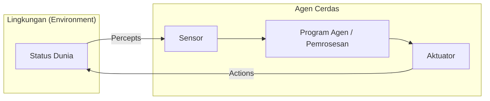
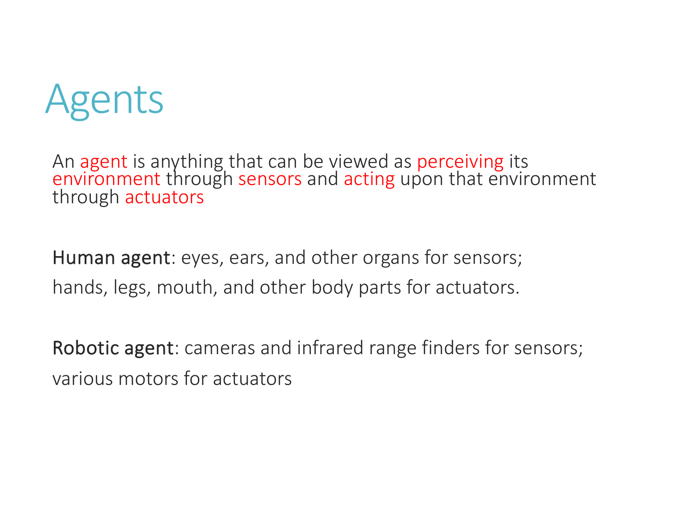
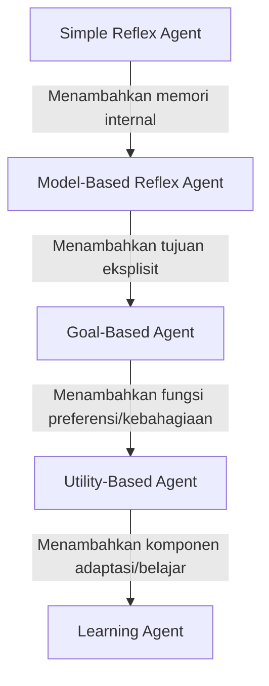
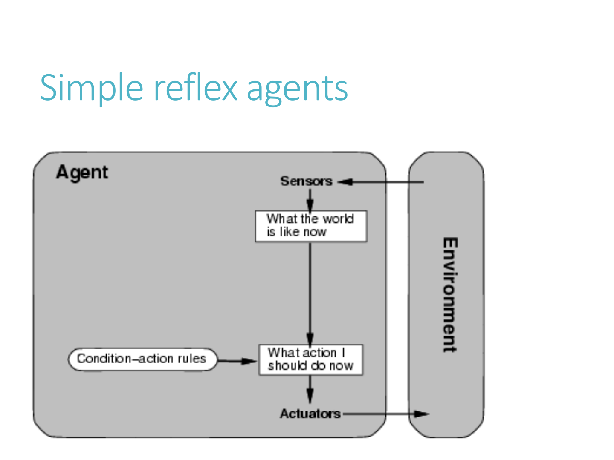
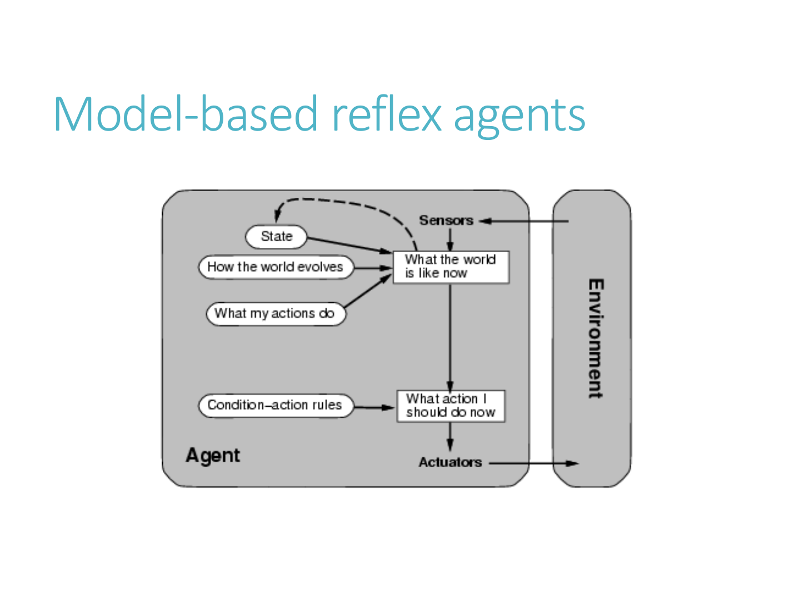
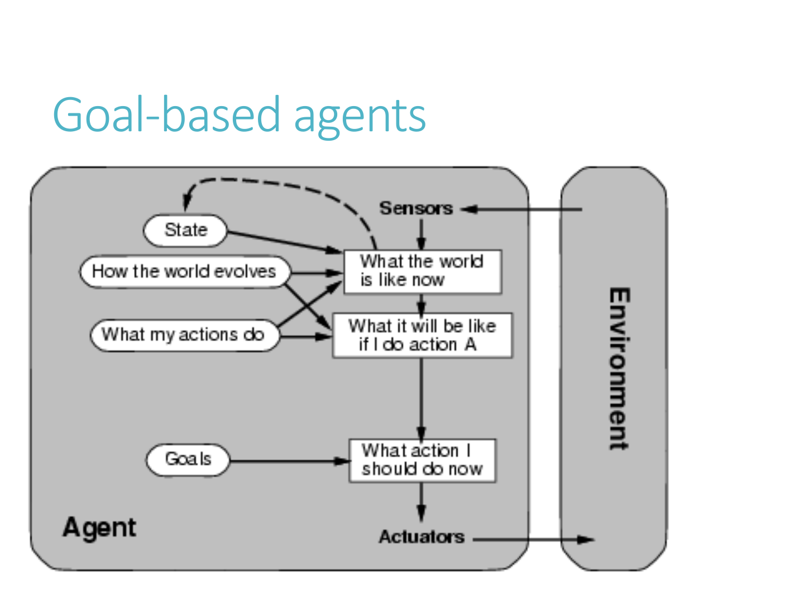
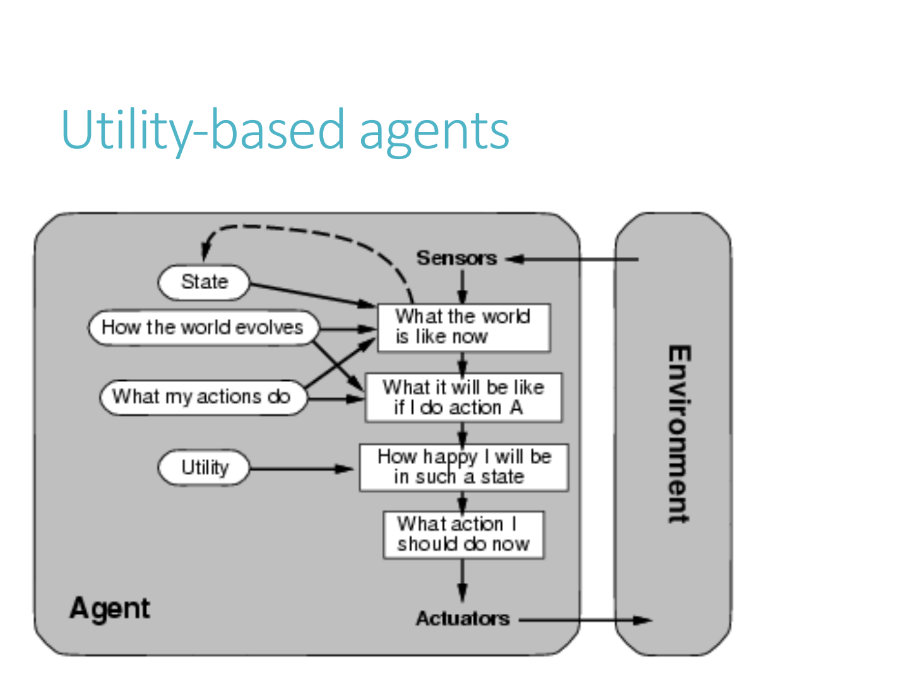
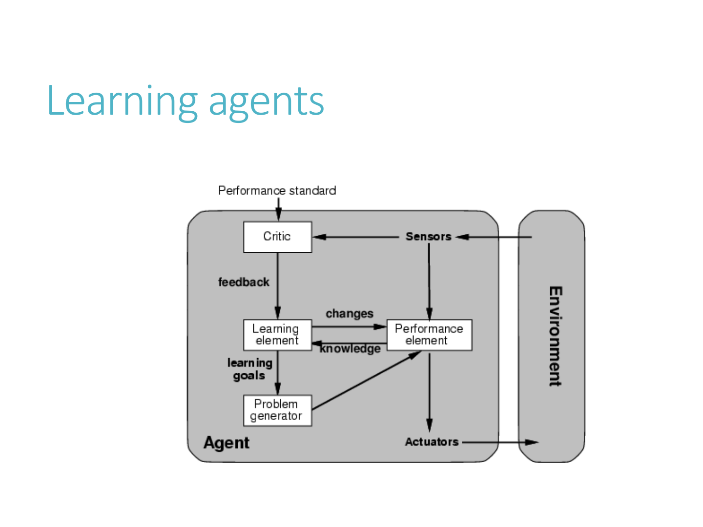

---
tags:
  - ai
  - uts
  - intelligent-agents
  - peas
  - environment-types
  - agent-architectures
created: 2026-10-10
week: 2
source: "Kuliah AI - Pertemun 2.pdf, Russell & Norvig Chapter 2"
---

# Week 02 - Agen Cerdas dan Lingkungan (Intelligent Agents)

> [!summary] Navigasi Catatan
> - **Prev**: [[Week 01 - Pengantar Kecerdasan Buatan (Intro to AI)|Week 01 - Pengantar Kecerdasan Buatan]]
> - **MOC Master**: [[00 - MOC AI UTS|00 - Map of Content AI UTS]]
> - **Next**: [[Week 03 - Uninformed Search Strategies|Week 03 - Uninformed Search Strategies]]

---

## 1. Konsep Dasar Agen dan Lingkungan

Agen adalah entitas apapun yang mempersepsikan lingkungannya melalui **sensor** dan bertindak atas lingkungan tersebut melalui **aktuator**.

### Istilah Kunci
- **Percept**: Masukan persepsi agen pada satu instan waktu tertentu.
- **Percept Sequence**: Riwayat lengkap seluruh persepsi yang pernah diterima agen dari awal hingga saat ini.
- **Agent Function**: Pemetaan matematis abstrak dari riwayat persepsi ke tindakan:
  $$f: P^* \to A$$
  *(di mana $P^*$ adalah himpunan semua kemungkinan urutan persepsi, dan $A$ adalah himpunan tindakan).*
- **Agent Program**: Implementasi konkret dari *agent function* yang berjalan di atas arsitektur fisik perangkat keras:
  $$\text{Agent} = \text{Architecture} + \text{Program}$$

> [!example] Studi Kasus: Vacuum-Cleaner World
> - **Dunia**: 2 petak (Petak A dan Petak B), status petak adalah Bersih (*Clean*) atau Kotor (*Dirty*).
> - **Percept**: Pasangan `[Lokasi, Status]`, contoh: `[A, Dirty]`.
> - **Actions**: `{Left, Right, Suck, NoOp}`.
> - **Aturan Agen Sederhana**:
>   - Jika petak saat ini kotor $\to$ lakukan `Suck`.
>   - Jika petak saat ini bersih dan di A $\to$ gerak `Right`.
>   - Jika petak saat ini bersih dan di B $\to$ gerak `Left`.

---

## 2. Konsep Rasionalitas (*The Concept of Rationality*)

> [!important] Definisi Agen Rasional
> Untuk setiap kemungkinan *percept sequence*, agen rasional harus memilih tindakan yang **memaksimalkan ekspektasi ukuran kinerja (*expected performance measure*)**, berdasarkan bukti yang diberikan oleh riwayat persepsi dan pengetahuan bawaan (*built-in knowledge*) yang dimiliki agen.

### Empat Faktor Penentu Rasionalitas
Rasionalitas suatu tindakan pada waktu $t$ bergantung pada 4 hal:
1. **Ukuran Kinerja (*Performance Measure*)**: Kriteria objektif penentu keberhasilan.
2. **Riwayat Persepsi (*Percept Sequence*)**: Semua informasi yang pernah ditangkap sensor agen sampai saat ini.
3. **Pengetahuan Bawaan (*Prior/Built-in Knowledge*)**: Pengetahuan awal agen tentang lingkungan sebelum beroperasi.
4. **Himpunan Tindakan yang Dapat Dilakukan (*Action Set*)**: Kapabilitas aktuator agen.

### Rasionalitas $\ne$ Kemahatahuan (*Omniscience*)
| Konsep | Penjelasan | Realitas di AI |
| :--- | :--- | :--- |
| **Omniscient (Mahatahu)** | Mengetahui hasil aktual masa depan dari semua tindakannya tanpa celah kesalahan. | **Tidak mungkin** tercapai di dunia nyata. |
| **Clairvoyant (Peramal)** | Mampu memprediksi peristiwa acak sebelum terjadi. | **Fiksi**. |
| **Rational (Rasional)** | Memaksimalkan **ekspektasi** hasil terbaik berdasarkan informasi yang tersedia saat itu. | **Standar Ilmiah AI Modern**. |

> [!warning] Jebakan Ujian: Rasionalitas Bukan Kesempurnaan
> Jika seseorang menyeberang jalan saat lampu hijau dan tiba-tiba ada pesawat jatuh menimpanya, tindakannya tetap **rasional** saat itu, meskipun hasilnya tidak sukses. Rasionalitas menilai kelayakan proses pengambilan keputusan berdasarkan persepsi, bukan kesempurnaan hasil akhir yang dipengaruhi faktor tak terduga.

### Otonomi Agen (*Autonomy*)
Sebuah agen dikatakan **otonom** jika perilakunya ditentukan oleh pengalamannya sendiri dalam belajar dan beradaptasi dengan lingkungan, bukan semata-mata mengandalkan pengetahuan awal yang di-*hardcode* oleh pembuatnya.

---

## 3. Kerangka Kerja PEAS

Sebelum merancang agen, perancang sistem **wajib** mendefinisikan lingkungan tugas (*task environment*) menggunakan akronim **PEAS**:
- **P** - *Performance Measure* (Ukuran Kinerja)
- **E** - *Environment* (Lingkungan)
- **A** - *Actuators* (Aktuator)
- **S** - *Sensors* (Sensor)

### Tabel Studi Kasus PEAS Lengkap

| Tipe Agen | Performance Measure (P) | Environment (E) | Actuators (A) | Sensors (S) |
| :--- | :--- | :--- | :--- | :--- |
| **Automated Taxi Driver** | Keselamatan, kecepatan, kepatuhan hukum lalu lintas, kenyamanan penumpang, maksimalisasi keuntungan / efisiensi bensin. | Jalan raya, lalu lintas kendaraan lain, pejalan kaki, penumpang, cuaca. | Kemudi setir (*steering*), pedal gas (*accelerator*), rem (*brake*), lampu sein, klakson, tampilan display. | Kamera video, LiDAR / sonar, speedometer, GPS, odometer, akselerometer, sensor mesin. |
| **Vacuum Cleaner Agent** | Kebersihan petak (poin per petak bersih), efisiensi konsumsi listrik, minimalisasi kebisingan, waktu tempuh. | Lantai ruangan, petak A & B, debu/kotoran, rintangan perabotan. | Roda penggerak, motor penyedot debu (*suction motor*), sikat pembersih. | Sensor kotoran (optik/inframerah), sensor sentuh (bumper), sensor lokasi / dinding. |
| **Medical Diagnosis System** | Pasien sembuh, meminimalkan biaya perawatan, meminimalkan kesalahan diagnosis (*false negative/positive*). | Pasien, staf rumah sakit, laboratorium uji klinis. | Tampilan layar rekomendasi terapi/obat, resep, rujukan tes lanjutan. | Keyboard masukan gejala, riwayat medis, hasil lab digital. |
| **Part-picking Robot** | Persentase komponen yang diletakkan di wadah yang tepat per menit. | Sabuk berjalan (*conveyor belt*), kotak komponen, bin target. | Lengan robotik manipulator, *gripper* / pencapit. | Kamera resolusi tinggi, sensor sudut persendian lengan. |
| **Interactive English Tutor** | Peningkatan nilai ujian murid, kepuasan belajar murid. | Kumpulan siswa, kurikulum bahasa Inggris. | Tampilan materi, latihan interaktif, audio ucapan suara. | Keyboard, mikrofon masukan suara siswa. |

---

## 4. Karakteristik & Klasifikasi Lingkungan Kerja

Sifat lingkungan kerja menentukan tingkat kompleksitas algoritma yang harus digunakan:

| Dimensi Karakteristik | Penjelasan | Contoh Ekstrem |
| :--- | :--- | :--- |
| **Fully Observable vs. Partially Observable** | Sensor dapat mengakses status penuh dunia setiap waktu vs. ada status yang tersembunyi (*noisy / incomplete*). | Catur (*Fully*) vs. Poker & Mengemudi (*Partially*) |
| **Single Agent vs. Multi-Agent** | Agen beroperasi sendirian vs. ada agen lain di lingkungan yang perilakunya mempengaruhi kinerja. | Menata puzzle (*Single*) vs. Catur / Sepak bola (*Multi*) |
| **Competitive vs. Cooperative** | Sifat multi-agent: memaksimalkan kinerja sendiri dengan menjatuhkan lawan vs. bekerja sama mencapai tujuan bersama. | Catur (*Competitive*) vs. Taxi bersama (*Cooperative*) |
| **Deterministic vs. Stochastic** | Status berikutnya ditentukan 100% oleh status saat ini dan aksi agen vs. ada unsur ketidakpastian acak (*chance*). | Catur (*Deterministic*) vs. Lempar dadu & Mengemudi (*Stochastic*) |
| **Episodic vs. Sequential** | Pengalaman dibagi menjadi episode atomik independen (tindakan sekarang tidak mempengaruhi masa depan) vs. tindakan saat ini mempengaruhi keputusan masa depan. | Klasifikasi cacat pabrik (*Episodic*) vs. Catur & Labirin (*Sequential*) |
| **Static vs. Dynamic vs. Semidynamic** | Lingkungan tidak berubah saat agen sedang berpikir vs. lingkungan terus berubah saat agen berpikir vs. lingkungan statis tapi skor kinerja berkurang seiring waktu. | TTS silang (*Static*) vs. Mengemudi (*Dynamic*) vs. Catur dengan batasan jam waktu (*Semidynamic*) |
| **Discrete vs. Continuous** | Status, waktu, persepsi, dan aksi terhitung diskrit (*distinct*) vs. nilai kontinu real (*smooth continuous*). | Catur (*Discrete*) vs. Kemudi mobil otonom (*Continuous*) |
| **Known vs. Unknown** | Agen mengetahui aturan hukum fisika lingkungan sejak awal vs. agen harus mencoba untuk mempelajari hukum lingkungan. | Solitaire (*Known*) vs. Video game baru tanpa panduan (*Unknown*) |

> [!summary] Matriks Karakteristik Lingkungan Nyata
> - **Catur tanpa batas waktu**: Fully observable, Deterministic, Sequential, Static, Discrete, Multi-agent (Competitive), Known.
> - **Mengemudi Taksi Otonom**: Partially observable, Stochastic, Sequential, Dynamic, Continuous, Multi-agent, Known/Unknown. *(Ini adalah kelas lingkungan tersulit di dunia AI!)*

---

## 5. Lima Arsitektur Utama Agen Cerdas

Russell & Norvig membagi agen menjadi 5 kelompok arsitektur berdasarkan tingkat kecerdasan dan kompleksitas internal:

---

### A. Simple Reflex Agents
- **Prinsip Kerja**: Memilih tindakan murni berdasarkan **persepsi saat ini**, mengabaikan seluruh riwayat persepsi masa lalu.
- **Logika Internal**: Menggunakan aturan kondisi-aksi (*Condition-Action Rules*):
  $$\text{if } \text{condition} \text{ then } \text{action}$$

> [!caution] Keterbatasan Fatal Simple Reflex Agent
> Hanya bekerja jika lingkungan bersifat **Fully Observable**! Jika lingkungan bersifat *Partially Observable*, agen refleks sederhana akan terjebak dalam **loop tak berujung (*infinite loop*)**.

---

### B. Model-Based Reflex Agents
- **Prinsip Kerja**: Menjaga status internal (*Internal State*) di dalam memori untuk melacak bagian dunia yang tidak terlihat saat ini.
- **Dua Model Pengetahuan Dunia**:
  1. *Model Transisi*: Bagaimana dunia berevolusi secara independen dari agen.
  2. *Model Sensor*: Bagaimana tindakan agen sendiri mempengaruhi status dunia.

- **Kelebihan**: Mampu mengatasi lingkungan **Partially Observable**.

---

### C. Goal-Based Agents
- **Prinsip Kerja**: Menggabungkan status internal dengan deskripsi kondisi akhir yang diinginkan (**Goal**).
- **Mekanisme**: Menggunakan teknik **Pencarian (*Search*)** dan **Perencanaan (*Planning*)** untuk menemukan jalur tindakan yang mencapai tujuan.

- **Kelebihan**: Lebih fleksibel dibanding reflex agents. Jika tujuan berubah (misal: tujuan rute peta berubah), agen cukup mengganti deskripsi goal tanpa perlu mengubah seluruh aturan kondisi-aksi.

---

### D. Utility-Based Agents
- **Latar Belakang Masalah Goal-Based**: Goal hanya memberikan perbedaan biner (*sukses* vs *gagal* / *happy* vs *unhappy*). Tidak bisa memilih ketika:
  1. Ada beberapa cara mencapai tujuan tapi biaya tempuhnya berbeda jauh.
  2. Ada beberapa tujuan yang saling bertentangan dan agen harus melakukan *trade-off* (misal: kecepatan vs keselamatan).
  3. Ada ketidakpastian mencapai tujuan.
- **Prinsip Kerja**: Menggunakan fungsi utilitas ($U: S \to \mathbb{R}$) yang memetakan status ke nilai riil tingkat kepuasan.
- **Rasionalitas Utilitas**: Memaksimalkan **Expected Utility**:
  $$\text{Action}^* = \arg\max_a \sum_{s'} P(s' \mid s, a) U(s')$$

---

### E. Learning Agents
Agen pembelajaran dipisahkan menjadi 4 modul konseptual:

1. **Learning Element**: Bertanggung jawab membuat perbaikan dan peningkatan pada program agen berdasarkan pengalaman.
2. **Performance Element**: Bertanggung jawab memilih tindakan eksternal (ini adalah keseluruhan arsitektur agen terdahulu: reflex/goal/utility).
3. **Critic**: Memberikan umpan balik evaluasi kepada learning element mengenai seberapa baik tindakan agen terhadap standar kinerja eksternal tetap.
4. **Problem Generator**: Mengusulkan tindakan eksploratif baru yang mungkin suboptimal dalam jangka pendek tetapi memberikan pengalaman dan pengetahuan baru yang berharga untuk jangka panjang (*exploration vs exploitation*).

---

## 6. Ringkasan Kunci Ujian (Exam Quick Sheet)

> [!tip] Cheat Sheet Ujian Minggu 2
> 1. **PEAS**: Jika diminta menyusun PEAS, selalu mulai dari Performance Measure (kriteria objektif sukses), bukan sensor/aktuator.
> 2. **Partially Observable + Simple Reflex**: Kombinasi ini menyebabkan *infinite loop*. Solusinya adalah beralih ke *Model-Based Agent* atau menggunakan *Randomization*.
> 3. **Perbedaan Goal vs Utility**:
>    - *Goal*: Biner (tercapai atau tidak).
>    - *Utility*: Skalar kontinu (seberapa efisien, seberapa bahagia, seberapa tinggi peluang sukses saat ada risiko).

---
*Lanjut ke materi minggu berikutnya:* [[Week 03 - Uninformed Search Strategies|Week 03 - Uninformed Search Strategies ➔]]
