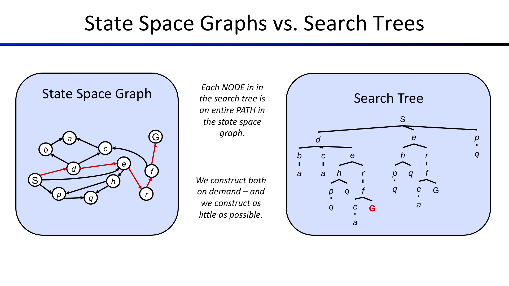
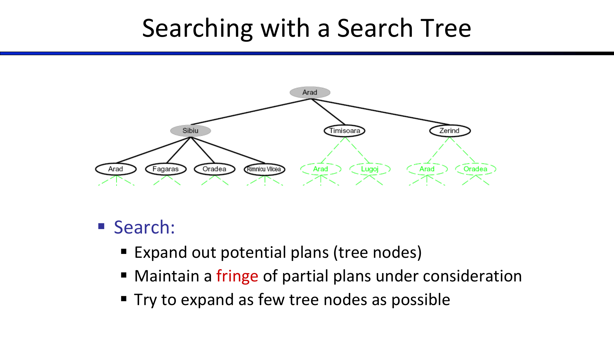
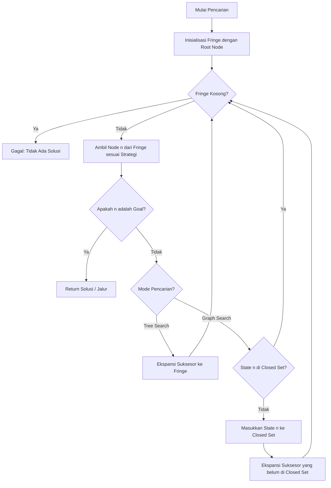
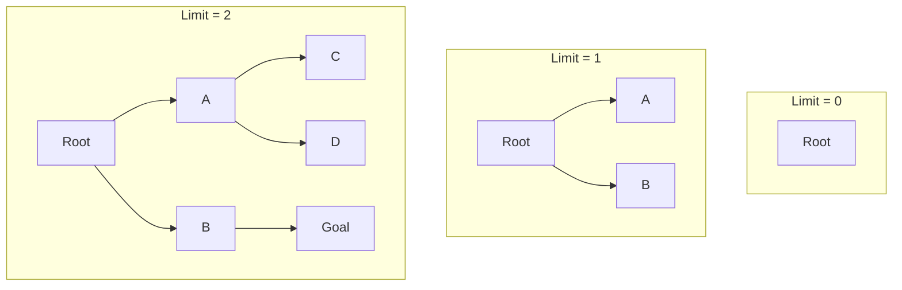

---
tags:
  - ai
  - uts
  - search-algorithms
  - uninformed-search
  - bfs
  - dfs
  - ucs
  - iddfs
created: 2026-10-10
week: 3
source: "Kuliah AI - Pertemuan 3.pdf, Russell & Norvig Chapter 3"
---

# Week 03 - Uninformed Search Strategies

> [!summary] Navigasi Catatan
> - **Prev**: [[Week 02 - Agen Cerdas dan Lingkungan (Intelligent Agents)|Week 02 - Agen Cerdas dan Lingkungan]]
> - **MOC Master**: [[00 - MOC AI UTS|00 - Map of Content AI UTS]]
> - **Next**: [[Week 04 - Informed (Heuristic) Search Strategies|Week 04 - Informed (Heuristic) Search Strategies]]

---

## 1. Formulasi Masalah Pencarian (Search Problem Formulation)

Agen berbasis tujuan (*goal-based planning agents*) merumuskan masalah sebagai proses pencarian urutan aksi yang mengubah status awal menjadi status tujuan.

> [!important] 5 Komponen Formal Masalah Pencarian
> 1. **Initial State ($s_0$)**: Status awal tempat agen memulai (contoh: berada di kota `Arad`).
> 2. **Actions($s$)**: Himpunan tindakan legal yang dapat dieksekusi agen saat berada di status $s$ (contoh: `{Go(Zerind), Go(Sibiu), Go(Timisoara)}`).
> 3. **Transition Model / Successor Function**: $Result(s, a)$ yang mendeskripsikan status hasil setelah agen mengambil tindakan $a$ pada status $s$.
> 4. **Goal Test**: Pengujian untuk menentukan apakah suatu status merupakan status tujuan (bisa berupa status eksplisit, misal: `state == Bucharest`, atau properti abstrak, misal: `checkmate == True`).
> 5. **Path Cost ($g(n)$)**: Fungsi numerik yang menjumlahkan biaya langkah (*step cost*) di sepanjang lintasan:
>    $$g(n) = \sum_{i=1}^k c(s_{i-1}, a_i, s_i)$$

- **Solusi (*Solution*)**: Urutan aksi (*a plan*) yang mengarahkan agen dari status awal ke status tujuan.
- **Solusi Optimal (*Optimal Solution*)**: Solusi yang memiliki *path cost* terendah di antara seluruh solusi yang mungkin.

---

## 2. State Space Graph vs. Search Tree

Memahami perbedaan antara *State Space* dan *Search Tree* adalah konsep fundamental AI:

| Aspek | State Space Graph (Graf Ruang Status) | Search Tree (Pohon Pencarian) |
| :--- | :--- | :--- |
| **Definisi Node** | Merepresentasikan **status dunia aktual** (*state*). | Merepresentasikan **jalur/rencana (*path*)** dari akar ke status tersebut. |
| **Duplikasi** | Setiap status unik hanya muncul **tepat satu kali**. | Status yang sama dapat muncul **berkali-kali** di cabang berbeda. |
| **Siklus / Loop** | Dapat memiliki siklus (*cycles / loops*). | Tidak memiliki siklus (selalu berbentuk pohon asiklik terarah). |
| **Ukuran** | Berhingga jika status dunia berhingga. | Bisa tak berhingga jika terdapat siklus dan tidak dikelola. |

### Anatomi Struktur Data Node dalam Search Tree
Node dalam memori pencarian adalah struktur data dengan atribut:

- `node.state`: Status dunia yang diwakili.
- `node.parent`: Pointer ke node induk pembuatnya.
- `node.action`: Tindakan yang dieksekusi dari parent untuk menghasilkan node ini.
- `node.path_cost` ($g(n)$): Biaya kumulatif dari root ke node ini.
- `node.depth` ($d$): Jumlah langkah dari akar ($depth(root) = 0$).

---

## 3. Tree Search vs. Graph Search

> [!warning] Perbedaan Krusial: Bahaya Tree Search
> - **Tree Search**: Tidak mencatat status yang pernah dikunjungi. Jika ada graf berulang (misal bolak-balik `Arad <-> Sibiu`), tree search bisa **terjebak loop tak berhingga (*infinite loop*)** meskipun ruang status aslinya kecil!
> - **Graph Search**: Memelihara **Explored Set / Closed List**. Status yang sudah pernah diekspansi tidak akan diekspansi lagi.

---

## 4. Empat Kriteria Evaluasi Algoritma Pencarian

Kinerja algoritma pencarian diukur dengan 4 parameter standar:
- **Completeness**: Apakah algoritma dijamin menemukan solusi jika solusi tersebut ada?
- **Time Complexity**: Berapa lama waktu yang dibutuhkan (jumlah node yang diekspansi)?
- **Space Complexity**: Berapa banyak memori yang dikonsumsi (jumlah node di *fringe*)?
- **Optimality**: Apakah algoritma menjamin menemukan solusi dengan *path cost* terendah ($C^*$)?

### Notasi Standar Kompleksitas
- $b$: *Branching factor* (faktor percabangan maksimum).
- $d$: Kedalaman solusi paling dangkal (*shallowest goal depth*).
- $m$: Kedalaman maksimum pohon pencarian (bisa $\infty$).
- $C^*$: Biaya solusi optimal.
- $\epsilon$: Batas bawah biaya per langkah (*minimum step cost*, $\epsilon > 0$).

---

## 5. Algoritma Pencarian Buta (Uninformed Search)

*Uninformed search* (pencarian buta) tidak memiliki informasi tambahan tentang seberapa dekat suatu status ke tujuan selain dari definisi formal masalah.

---

### A. Breadth-First Search (BFS)
- **Struktur Fringe**: Antrean FIFO (*First-In, First-Out*).
- **Mekanisme**: Mengekspansi seluruh node pada kedalaman $k$ sebelum mengekspansi node pada kedalaman $k+1$.
- **Pengujian Goal**: Dilakukan saat node **di-generate** (bukan saat di-pop) untuk efisiensi.
- **Sifat Kinerja**:
  - *Complete*: **Ya** (jika $b$ berhingga).
  - *Time Complexity*: $O(b^d)$ (mengeksplorasi $1 + b + b^2 + \dots + b^d$ node).
  - *Space Complexity*: $O(b^d)$ (seluruh tingkat daun disimpan di memori fringe).
  - *Optimal*: **Ya jika semua step cost sama ($c=1$)**; **Tidak** jika biaya langkah berbeda.

> [!caution] Kelemahan Fatal BFS
> Kebutuhan **memori (*space complexity*)** BFS meledak secara eksponensial. Memori komputer akan habis jauh sebelum waktu komputasinya habis!

---

### B. Depth-First Search (DFS)
- **Struktur Fringe**: Antrean LIFO (*Last-In, First-Out*) atau Stack.
- **Mekanisme**: Mengekspansi cabang terdalam pada pohon pencarian terlebih dahulu hingga mencapai dasar, lalu melakukan *backtracking*.
- **Sifat Kinerja**:
  - *Complete*: **Tidak** pada Tree Search (jika kedalaman $m = \infty$ atau terdapat siklus); **Ya** pada Graph Search di ruang status berhingga.
  - *Time Complexity*: $O(b^m)$ (bisa jauh lebih besar dari $b^d$ jika $m \gg d$).
  - *Space Complexity*: **$O(bm)$** — *Sangat hemat memori!* Hanya menyimpan node sepanjang jalur aktif dari akar ke daun serta saudara kandungnya (*siblings*).
  - *Optimal*: **Tidak** (menemukan solusi paling kiri tanpa peduli kedalaman atau biaya).

---

### C. Uniform-Cost Search (UCS)
Dikenal juga sebagai algoritma Dijkstra pada AI.
- **Struktur Fringe**: **Priority Queue** yang diurutkan secara menaik berdasarkan biaya jalur $g(n)$.
- **Mekanisme**: Mengekspansi node di fringe yang memiliki biaya kumulatif $g(n)$ terendah.

> [!important] Aturan Emas UCS
> 1. **Goal Test dilakukan saat node di-pop dari fringe**, BUKAN saat di-generate!
>    - *Alasan*: Node goal mungkin di-generate lewat jalur mahal terlebih dahulu. Kita harus menunggu sampai goal tersebut menjadi node termurah di antrean agar terbukti optimal.
> 2. **Jika node suksesor sudah ada di fringe dengan $g(n)$ lebih tinggi**, perbarui nilainya dengan nilai $g(n)$ yang lebih rendah (*decrease-key*).

- **Sifat Kinerja**:
  - *Complete*: **Ya**, jika biaya setiap langkah memiliki batas bawah positif $c(s, a, s') \ge \epsilon > 0$.
  - *Time Complexity*: $O(b^{1 + \lfloor C^* / \epsilon \rfloor})$ (mengeksplorasi semua node dengan biaya $\le C^*$).
  - *Space Complexity*: $O(b^{1 + \lfloor C^* / \epsilon \rfloor})$.
  - *Optimal*: **Ya**, selalu menjamin menemukan jalur dengan biaya terendah.

> [!warning] Kelemahan UCS
> UCS mengeksplorasi kontur biaya ke segala arah secara melingkar (*explores all directions equally*) tanpa mengetahui ke arah mana letak tujuan sebenarnya.

---

### D. Depth-Limited Search (DLS)
- **Mekanisme**: Menjalankan DFS dengan batas kedalaman maksimum $l$ (*depth limit*). Node pada kedalaman $l$ diperlakukan seolah-olah tidak memiliki suksesor.
- **Sifat Kinerja**:
  - Mengatasi masalah kedalaman tak berhingga pada DFS.
  - *Incomplete* jika kedalaman solusi $d > l$.
  - *Non-optimal* jika $l > d$.
  - *Time*: $O(b^l)$, *Space*: $O(bl)$.

---

### E. Iterative Deepening Search (IDS / IDDFS)
Menggabungkan keunggulan ruang DFS dengan kelengkapan dan optimalitas langkah BFS.

- **Mekanisme**: Menjalankan DLS berulang kali dengan menaikkan batas limit secara bertahap: $l = 0, 1, 2, 3, \dots, d$.

> [!tip] Pertanyaan Klasik Ujian: Apakah IDS Boros Komputasi?
> **Jawaban**: **TIDAK BOROS!**
> Pada pohon pencarian dengan faktor percabangan $b$, sebagian besar node berada di lapisan paling bawah.
> - Jumlah ekspansi node pada IDS:
>   $$N(\text{IDS}) = (d)b^1 + (d-1)b^2 + \dots + 1 \cdot b^d \in O(b^d)$$
> - Contoh untuk $b = 10, d = 5$:
>   - BFS mengekspansi: $1 + 10 + 100 + 1.000 + 10.000 + 100.000 = 111.111$ node.
>   - IDS mengekspansi: $5(10) + 4(100) + 3(1.000) + 2(10.000) + 1(100.000) = 123.450$ node.
>   - Overhead hanya $\approx 11\%$, tetapi IDS hanya membutuhkan memori **$O(bd)$** dibanding BFS yang butuh **$O(b^d)$**!

---

### F. Bidirectional Search
- **Mekanisme**: Menjalankan dua pencarian sekaligus secara simultan: satu maju dari status awal, satu mundur dari status tujuan. Berhenti ketika kedua pencarian bertemu di tengah.
- **Kompleksitas**: Waktu dan ruang turun menjadi $O(b^{d/2}) + O(b^{d/2}) = O(b^{d/2})$.
- **Tantangan**: Memerlukan kemampuan menghitung *predecessors* dari status tujuan dan memerlukan memori untuk menyimpan seluruh status salah satu arah pencarian.

---

## 6. Tabel Komparasi Super Lengkap Uninformed Search

| Algoritma | Complete? | Time Complexity | Space Complexity | Optimal? | Struktur Fringe |
| :--- | :--- | :--- | :--- | :--- | :--- |
| **BFS** | Ya$^1$ | $O(b^d)$ | $O(b^d)$ | Ya$^2$ | FIFO Queue |
| **DFS** | Tidak$^3$ | $O(b^m)$ | $O(bm)$ | Tidak | LIFO Queue (Stack) |
| **DLS** | Tidak$^4$ | $O(b^l)$ | $O(bl)$ | Tidak | LIFO dengan limit $l$ |
| **IDS** | Ya$^1$ | $O(b^d)$ | $O(bd)$ | Ya$^2$ | LIFO berulang |
| **UCS** | Ya$^5$ | $O(b^{1 + \lfloor C^*/\epsilon \rfloor})$ | $O(b^{1 + \lfloor C^*/\epsilon \rfloor})$ | Ya | Priority Queue ($g(n)$) |

*Catatan Kaki:*
- $^1$: Lengkap jika faktor percabangan $b$ berhingga.
- $^2$: Optimal jika seluruh biaya langkah (*step costs*) bernilai identik ($c=1$).
- $^3$: DFS lengkap pada ruang status berhingga jika menggunakan Graph Search (mencegah siklus).
- $^4$: Lengkap jika batas kedalaman $l \ge d$.
- $^5$: UCS lengkap jika biaya langkah minimal $\epsilon > 0$.

---

## 7. Abstraksi "The One Queue"

Secara konseptual di dalam kode, seluruh algoritma pencarian dapat diimplementasikan menggunakan fungsi umum yang sama, hanya dibedakan oleh **antrean prioritas (*Priority Queue*)**:
- **BFS**: Prioritas berdasarkan kedalaman terendah atau waktu tiba tertua (FIFO).
- **DFS**: Prioritas berdasarkan waktu tiba termuda (LIFO / Kedalaman tertinggi).
- **UCS**: Prioritas berdasarkan biaya kumulatif terkecil ($g(n)$).
- *(Minggu depan)* **Greedy**: Prioritas berdasarkan heuristik terkecil ($h(n)$).
- *(Minggu depan)* **A\***: Prioritas berdasarkan estimasi total biaya terkecil ($f(n) = g(n) + h(n)$).

---

## 8. Ringkasan Kunci Ujian (Exam Quick Sheet)

> [!tip] Rumus & Jebakan Ujian Minggu 3
> 1. **Kapan menggunakan BFS vs DFS**: Gunakan BFS jika solusi berada di kedalaman dangkal dan memori cukup. Gunakan DFS jika ruang memori terbatas dan semua cabang berhingga. Gunakan **IDS** sebagai pilihan terbaik secara umum untuk uninformed search.
> 2. **Goal Test UCS**: Ingat! Goal test pada UCS dilakukan saat **pop dari fringe**, bukan saat generate!
> 3. **Kompleksitas Memori**: Hafalkan bahwa DFS/IDS berorde linear terhadap kedalaman ($O(bm)$ / $O(bd)$), sedangkan BFS/UCS berorde eksponensial ($O(b^d)$ / $O(b^{C^*/\epsilon})$).

---
*Lanjut ke materi minggu berikutnya:* [[Week 04 - Informed (Heuristic) Search Strategies|Week 04 - Informed (Heuristic) Search Strategies ➔]]
