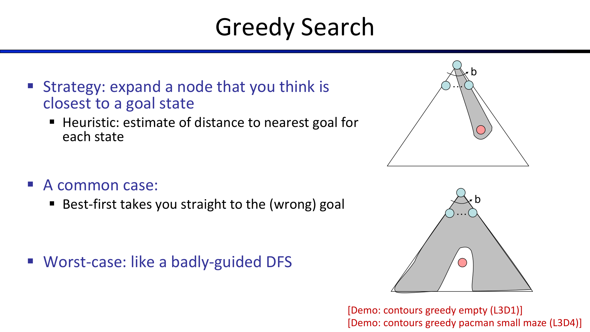
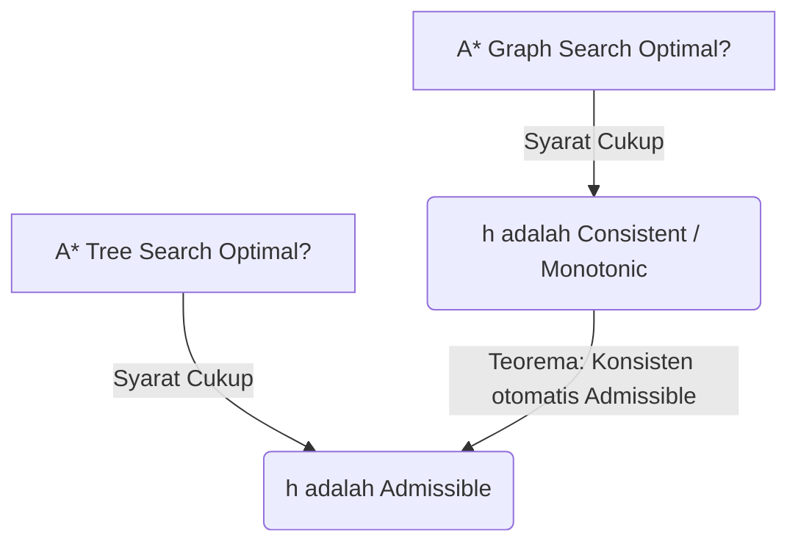
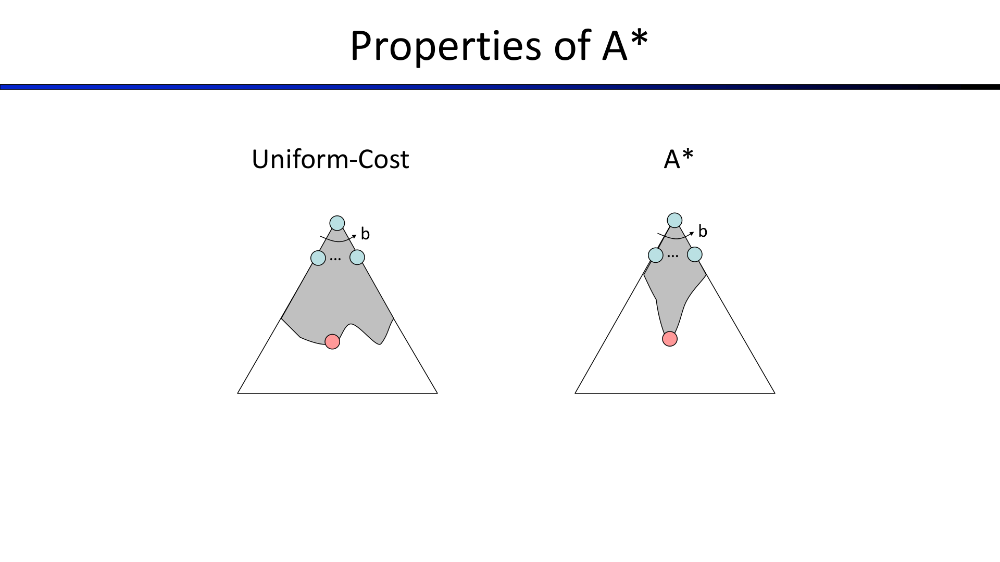

---
tags:
  - ai
  - uts
  - informed-search
  - heuristics
  - a-star
  - greedy-search
  - admissibility
  - consistency
created: 2026-10-10
week: 4
source: "Kuliah AI - Pertemuan 4.pdf, 2024-Additional_SP14 CS188 Lecture 3, Russell & Norvig Chapter 3"
---

# Week 04 - Informed (Heuristic) Search Strategies

> [!summary] Navigasi Catatan
> - **Prev**: [[Week 03 - Uninformed Search Strategies|Week 03 - Uninformed Search Strategies]]
> - **MOC Master**: [[00 - MOC AI UTS|00 - Map of Content AI UTS]]
> - **Next**: [[Week 05 - Constraint Satisfaction Problems (CSP)|Week 05 - Constraint Satisfaction Problems (CSP)]]

---

## 1. Konsep Fungsi Heuristik ($h(n)$)

Berbeda dengan *uninformed search* yang mencari secara buta ke segala arah, *informed search* memanfaatkan **informasi spesifik domain (*domain knowledge*)** berupa fungsi perkiraan biaya yang disebut **Heuristik ($h$)**.

> [!important] Definisi Fungsi Heuristik $h(n)$
> - $h(n)$ = estimasi biaya jalur termurah dari status node $n$ ke status tujuan (*goal*).
> - Selalu bernilai **0 pada status tujuan**: $h(\text{Goal}) = 0$.
> - Mengestimasi **Forward Cost** (biaya masa depan ke tujuan), sedangkan $g(n)$ adalah **Backward Cost** (biaya riil masa lalu dari awal).

```mermaid
graph LR
    Start((Start)) -->|g(n): Biaya Riil Tempuh| N((Node n))
    N -.->|h(n): Estimasi Sisa Biaya| Goal(((Goal)))
```

---

## 2. Greedy Best-First Search

Greedy Search selalu mengekspansi node yang diperkirakan **paling dekat dengan tujuan** saat ini.

- **Fungsi Evaluasi**:
  $$f(n) = h(n)$$
- **Struktur Fringe**: Priority Queue berdasar nilai terkecil $h(n)$.



### Sifat Kinerja Greedy Search
- **Completeness**: **Tidak** lengkap pada Tree Search (dapat terjebak loop tak berhingga jika heuristik menyesatkan); **Lengkap** pada Graph Search di ruang status berhingga.
- **Time Complexity**: $O(b^m)$ pada kasus terburuk (seperti DFS yang dipandu arah yang salah).
- **Space Complexity**: $O(b^m)$ (menyimpan semua node di memori).
- **Optimality**: **TIDAK OPTIMAL**. Greedy tergiur oleh estimasi langkah pendek lokal dan mengabaikan akumulasi biaya nyata yang telah dikeluarkan ($g(n)$).

---

## 3. Algoritma A* Search

Algoritma A* (A-Star) menggabungkan keunggulan **Uniform-Cost Search** (memperhitungkan biaya aktual yang telah ditempuh) dan **Greedy Search** (mengarahkan pencarian menuju tujuan).

> [!important] Fungsi Evaluasi A*
> $$f(n) = g(n) + h(n)$$
> - $g(n)$: Biaya nyata dari status awal ke node $n$ (*past cost*).
> - $h(n)$: Estimasi biaya dari node $n$ ke goal (*future cost*).
> - $f(n)$: Estimasi total biaya solusi termurah yang melalui node $n$.

### Aturan Terminasi A*
> [!caution] Jebakan Ujian: Kapan A* Berhenti?
> A* **HANYA BERHENTI saat node Goal di-pop dari fringe (*dequeued*)**, BUKAN saat goal pertama kali di-generate (*enqueued*)!
> *Alasan*: Node goal mungkin di-generate lebih dulu melalui jalur suboptimal. Kita harus menunggu sampai goal tersebut menjadi node dengan nilai $f(n)$ terendah di fringe agar terbukti merupakan jalur optimal.

---

## 4. Syarat Optimalitas A*: Admissibility dan Consistency

Agar A* menjamin menemukan solusi optimal ($C^*$), fungsi heuristik $h(n)$ harus memenuhi syarat matematika tertentu:



---

### A. Admissible Heuristic (Untuk A* Tree Search)

> [!important] Definisi Admissibility
> Fungsi heuristik $h(n)$ dikatakan **Admissible (Optimistik)** jika nilainya **tidak pernah melebihi biaya sebenarnya** untuk mencapai goal:
> $$0 \le h(n) \le h^*(n)$$
> *(di mana $h^*(n)$ adalah biaya solusi optimal sebenarnya dari node $n$ ke goal).*

- Heuristik optimistik menganggap jalan di depan lebih mudah dari aslinya, sehingga tidak pernah mengabaikan atau menolak rencana bagus.
- Heuristik pesimistik ($h(n) > h^*(n)$) dapat merusak optimalitas karena rencana optimal bisa "terjebak" di antrean fringe.

#### Bukti Formal Optimalitas A* Tree Search (Proof of Blocking)
Buktikan bahwa jika $h$ *admissible*, A* Tree Search tidak akan pernah mem-pop goal suboptimal $B$ sebelum goal optimal $A$:
1. Misal $A$ adalah goal optimal dengan biaya $f(A) = g(A) = C^*$.
2. Misal $B$ adalah goal suboptimal dengan biaya $f(B) = g(B) > C^*$ (karena $h(B) = 0$). Maka:
   $$f(A) < f(B)$$
3. Andaikan $B$ sudah berada di fringe dan akan di-pop. Karena goal optimal $A$ belum diekspansi, pasti ada suatu node leluhur $n$ dari $A$ yang sedang berada di fringe.
4. Nilai $f(n)$ dari leluhur tersebut memenuhi:
   $$f(n) = g(n) + h(n) \le g(n) + h^*(n) = f(A) \quad (\text{karena } h \text{ admissible})$$
5. Menggabungkan langkah 2 dan 4:
   $$f(n) \le f(A) < f(B)$$
6. Karena $f(n) < f(B)$, maka node $n$ **pasti diekspansi mendahului $B$**.
7. Dengan induksi matematika, semua leluhur $A$ dan node $A$ sendiri akan diekspansi sebelum $B$ sempat di-pop.
8. $\therefore$ A* Tree Search selalu mengembalikan solusi optimal $A$. ($\text{Q.E.D.}$)

---

### B. Consistent / Monotonic Heuristic (Untuk A* Graph Search)

Pada **Graph Search**, jika sebuah status pernah diekspansi, ia dimasukkan ke *Closed Set* dan tidak akan diekspansi ulang. Jika heuristik hanya *admissible* tetapi tidak *konsisten*, Graph Search bisa mengunjungi suatu status lewat jalur suboptimal terlebih dahulu, menutupnya, dan menolak jalur optimal berikutnya yang datang terlambat.



> [!important] Definisi Konsistensi (Pertidaksamaan Segitiga)
> Heuristik $h(n)$ dikatakan **Consistent (Monotonik)** jika untuk setiap node $n$ dan setiap suksesor $n'$ yang dihasilkan oleh aksi $a$ dengan biaya langkah $c(n, a, n')$:
> $$h(n) \le c(n, a, n') + h(n')$$

#### Konsekuensi Heuristik Konsisten
1. **$f(n)$ Tidak Pernah Berkurang Sepanjang Jalur (Non-decreasing)**:
   $$f(n') = g(n') + h(n') = g(n) + c(n, a, n') + h(n') \ge g(n) + h(n) = f(n)$$
2. **Optimalitas Graph Search**:
   Saat A* Graph Search mengekspansi suatu node $n$, biaya jalur $g(n)$ ke node tersebut **dijamin sudah merupakan biaya optimal**. Kita tidak perlu membuka kembali (*reopen*) node yang sudah berada di *Closed Set*.
3. **Teorema**: Setiap heuristik yang konsisten pasti admissible:
   $$\text{Consistent} \implies \text{Admissible}$$

---

## 5. Merancang Fungsi Heuristik (Heuristic Design)

Bagaimana cara menciptakan heuristik yang admissible dan konsisten?

### A. Masalah Santai (Relaxed Problems)
Metode paling standar adalah dengan **menghapus batasan aksi** dari masalah asli (*relaxing the constraints*).
> [!tip] Prinsip Masalah Santai
> Biaya solusi optimal pada masalah yang disederhanakan/direlaksasi selalu **admissible** dan **konsisten** untuk masalah asli, karena aksi pada masalah asli adalah *subset* dari aksi masalah santai.

#### Studi Kasus Klasik: 8-Puzzle
Mencari urutan pergeseran ubin angka 1-8 ke susunan tujuan.

| Masalah / Aturan | Nama Heuristik | Definisi Perhitungan | Sifat |
| :--- | :--- | :--- | :--- |
| **Aturan Asli** | Masalah Riil | Ubin digeser ke petak kosong yang bersebelahan. | Biaya riil $h^*(n)$ |
| **Relaksasi 1** | **$h_1$: Misplaced Tiles** | Ubin dapat berpindah ke petak mana saja jika petak tersebut adalah posisi tujuannya. | Menghitung jumlah ubin yang berada di luar petak seharusnya. | Admissible & Konsisten |
| **Relaksasi 2** | **$h_2$: Manhattan Distance** | Ubin dapat bergeser ke petak tetangga horizontal/vertikal meskipun petak itu ditempati ubin lain. | $\sum_{i=1}^8 (\lvert x_i - x_{i,\text{goal}} \rvert + \lvert y_i - y_{i,\text{goal}} \rvert)$ | Admissible & Konsisten |

---

### B. Dominasi Heuristik (Heuristic Dominance)

> [!important] Definisi Dominasi
> Jika untuk semua node $n$, berlaku:
> $$h_2(n) \ge h_1(n)$$
> maka dikatakan **$h_2$ mendominasi $h_1$** ($h_2$ lebih *tight* / lebih mendekati $h^*$).

- Menggunakan heuristik yang mendominasi **selalu lebih baik atau sama efisiennya**: A* dengan $h_2$ tidak akan pernah mengekspansi node lebih banyak daripada A* dengan $h_1$.
- **Bukti Empiris Andrew Moore (8-Puzzle)**:
  - Kedalaman solusi $d = 12$ langkah:
    - UCS (tanpa heuristik): $3.600.000$ node diekspansi.
    - A* dengan $h_1$ (Misplaced Tiles): $227$ node diekspansi.
    - A* dengan $h_2$ (Manhattan Distance): **hanya $73$ node diekspansi!**

### C. Menggabungkan Heuristik (Combining Heuristics)
Jika kita memiliki beberapa heuristik admissible $h_a(n), h_b(n), \dots, h_k(n)$, kita dapat membentuk heuristik gabungan menggunakan fungsi maksimum:
$$h(n) = \max(h_a(n), h_b(n), \dots, h_k(n))$$
- $h(n)$ baru ini dijamin **admissible**, **konsisten** (jika semua komponennya konsisten), dan **mendominasi seluruh heuristik individual penyusunnya**.

---

## 6. Contoh Tracing Komputasi A* (Step-by-Step)

Perhatikan contoh graf dengan Start = $S$ dan Goal = $G$:

```
S -> a (cost 1, h(a)=5)
S -> b (cost 2, h(b)=6)
S -> d (cost 4, h(d)=2)
a -> b (cost 1)
a -> d (cost 1)
b -> c (cost 1, h(c)=7)
d -> G (cost 2, h(G)=0)
```

| Iterasi | Pop Node | $g(n)$ | $h(n)$ | $f(n)$ | Suksesor Di-generate | Fringe Queue Terurut $(n, f(n))$ | Closed Set |
| :---: | :---: | :---: | :---: | :---: | :--- | :--- | :--- |
| **0** | - | - | - | - | $S$ | `[(S, 0+6=6)]` | `{}` |
| **1** | $S$ | 0 | 6 | 6 | $a (g=1, f=6)$, $b (g=2, f=8)$, $d (g=4, f=6)$ | `[(a, 6), (d, 6), (b, 8)]` | `{S}` |
| **2** | $a$ | 1 | 5 | 6 | $d (g=2, f=4)$ *(jalur lebih murah!)*, $b (g=2, f=8)$ | `[(d, 4), (d, 6), (b, 8)]` | `{S, a}` |
| **3** | $d$ | 2 | 2 | 4 | $G (g=4, f=4)$ | `[(G, 4), (d, 6), (b, 8)]` | `{S, a, d}` |
| **4** | $G$ | 4 | 0 | **4** | **GOAL TERCAPAI!** | Jalur: $S \to a \to d \to G$, Total Biaya = 4 | - |

---

## 7. Ringkasan Kunci Ujian (Exam Quick Sheet)

> [!tip] Rangkuman Formula Ujian Minggu 4
> 1. **Greedy**: $f(n) = h(n)$ $\implies$ Cepat tapi tidak optimal.
> 2. **A\***: $f(n) = g(n) + h(n)$ $\implies$ Menjamin optimal jika heuristik valid.
> 3. **Syarat Optimal A\***:
>    - Tree Search $\iff$ **Admissible** ($0 \le h(n) \le h^*(n)$).
>    - Graph Search $\iff$ **Consistent** ($h(n) \le c(n, a, n') + h(n')$).
> 4. **Dominasi**: $h_2(n) \ge h_1(n) \implies$ A* dengan $h_2$ mengekspansi node lebih sedikit.
> 5. **Penggabungan**: $h(n) = \max(h_1(n), h_2(n))$ selalu admissible dan dominan.

---
*Lanjut ke materi minggu berikutnya:* [[Week 05 - Constraint Satisfaction Problems (CSP)|Week 05 - Constraint Satisfaction Problems (CSP) ➔]]
