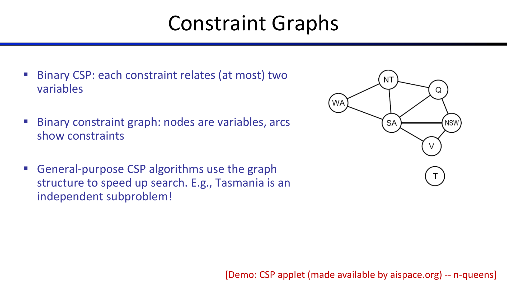
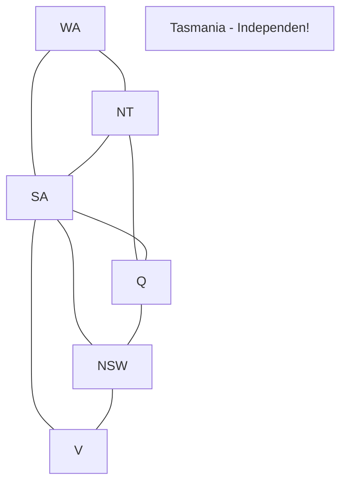
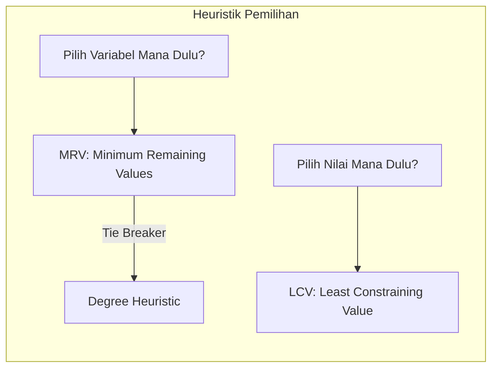
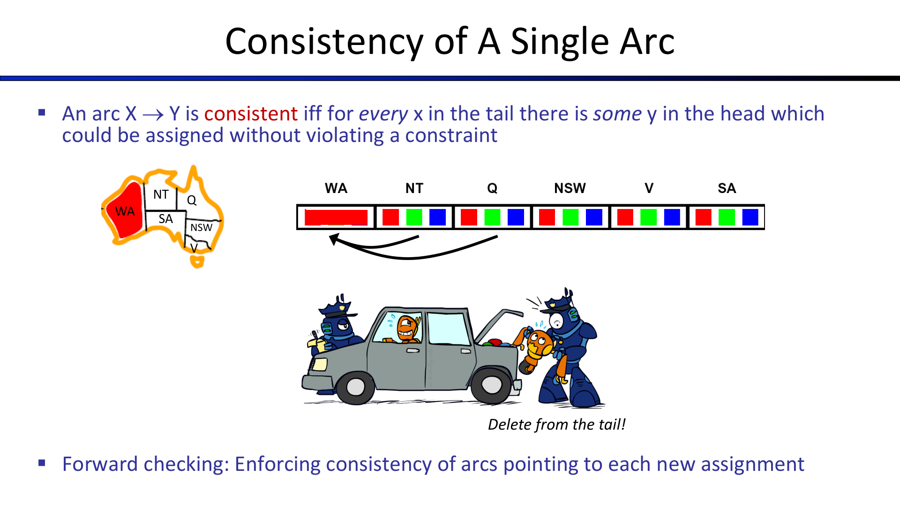
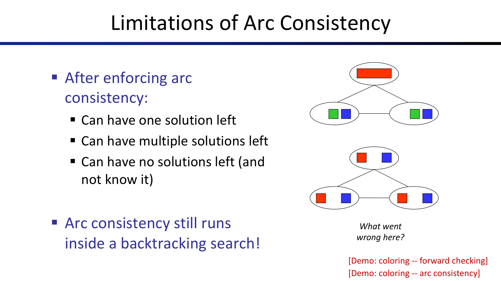
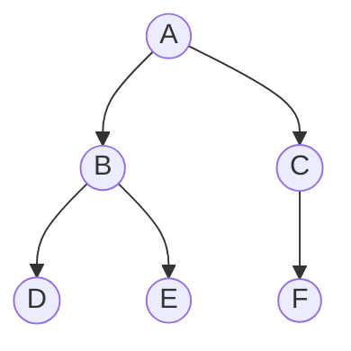

---
tags:
  - ai
  - uts
  - csp
  - backtracking
  - mrv
  - lcv
  - forward-checking
  - arc-consistency
  - ac3
created: 2026-10-10
week: 5
source: "Kuliah_5_AI.pdf, Russell & Norvig Chapter 6"
---

# Week 05 - Constraint Satisfaction Problems (CSP)

> [!summary] Navigasi Catatan
> - **Prev**: [[Week 04 - Informed (Heuristic) Search Strategies|Week 04 - Informed (Heuristic) Search Strategies]]
> - **MOC Master**: [[00 - MOC AI UTS|00 - Map of Content AI UTS]]
> - **Next**: [[Week 06 - Logical Agents and Propositional Logic|Week 06 - Logical Agents and Propositional Logic]]

---

## 1. Definisi Formal CSP

Pada *Standard Search* (BFS, DFS, A*), status dunia dianggap sebagai "Black Box" (struktur data arbitrer tanpa pemahaman isi internal). Sebaliknya, **Constraint Satisfaction Problems (CSP)** menggunakan representasi terstruktur (*factored representation*).

> [!important] Tiga Komponen Formal CSP: $\langle X, D, C \rangle$
> 1. **Variabel ($X$)**: Himpunan $n$ variabel:
>    $$X = \{X_1, X_2, \dots, X_n\}$$
> 2. **Domain ($D$)**: Himpunan nilai yang diperbolehkan untuk setiap variabel:
>    $$D = \{D_1, D_2, \dots, D_n\}$$
>    *(Jika setiap variabel memiliki ukuran domain maksimum $d$, terdapat $O(d^n)$ kemungkinan penetapan nilai lengkap).*
> 3. **Batasan / Constraints ($C$)**: Himpunan aturan yang menspesifikasikan kombinasi nilai legal antar variabel:
>    $$C = \{C_1, C_2, \dots, C_m\}$$
>    Setiap batasan terdiri dari cakupan variabel (*scope*) dan relasi nilai yang diperbolehkan (*relation*).

### Status Penugasan (Assignment Status)
- **Consistent / Legal**: Penugasan nilai tidak melanggar batasan apapun.
- **Complete**: Setiap variabel di dalam himpunan $X$ telah diberi nilai.
- **Partial**: Sebagian variabel belum diberi nilai.
- **Solusi CSP**: Penugasan yang bersifat **Complete** dan **Consistent**.

---

## 2. Contoh Klasik Masalah CSP

### A. Pewarnaan Peta (Map Coloring - Australia Map)
Mewarnai setiap wilayah bagian Australia dengan 3 warna (Merah, Hijau, Biru) sedemikian rupa sehingga tidak ada dua wilayah bertetangga yang memiliki warna sama.

- **Variabel ($X$)**: $\{WA, NT, SA, Q, NSW, V, T\}$ (Western Australia, Northern Territory, South Australia, Queensland, New South Wales, Victoria, Tasmania).
- **Domain ($D$)**: $D_i = \{\text{Red}, \text{Green}, \text{Blue}\}$ untuk setiap wilayah.
- **Batasan ($C$)**: Wilayah bersebelahan harus berbeda warna:
  $$WA \ne NT, WA \ne SA, NT \ne SA, NT \ne Q, SA \ne Q, SA \ne NSW, SA \ne V, Q \ne NSW, NSW \ne V$$
- **Solusi Legal Contoh**:
  $$\{WA=\text{Red}, NT=\text{Green}, SA=\text{Blue}, Q=\text{Red}, NSW=\text{Green}, V=\text{Red}, T=\text{Red}\}$$

> [!tip] Wawasan Struktur Graf
> Tasmania ($T$) tidak memiliki tetangga darat (tidak memiliki *arc* batasan). Dalam CSP, Tasmania merupakan sub-masalah independen yang dapat diselesaikan terpisah tanpa mempengaruhi daratan utama!

---

### B. Masalah N-Queens
Menempatkan $N$ bidak ratu pada papan catur ukuran $N \times N$ tanpa ada dua ratu yang saling menyerang.
- **Formulasi Kolom-Baris**:
  - Variabel: $X = \{Q_1, Q_2, \dots, Q_N\}$ (posisi kolom ratu $1$ sampai $N$).
  - Domain: $D_i = \{1, 2, \dots, N\}$ (nomor baris tempat ratu di kolom $i$ diletakkan).
  - Batasan:
    - Tidak satu baris: $Q_i \ne Q_j$ untuk setiap $i \ne j$.
    - Tidak satu diagonal: $\lvert Q_i - Q_j \rvert \ne \lvert i - j \rvert$.

---

### C. Teka-Teki Kriptaritmatika (Cryptarithmetic)
$$\begin{array}{r@{\quad}l}
  & \text{S E N D} \\
+ & \text{M O R E} \\
\hline
\text{M} & \text{O N E Y}
\end{array}$$
- **Variabel**: Huruf $\{S, E, N, D, M, O, R, Y\} \cup$ Sisa simpanan penjumlahan $\{C_1, C_2, C_3, C_4\}$.
- **Domain**: Huruf $\in \{0, 1, 2, \dots, 9\}$, Carry $C_i \in \{0, 1\}$.
- **Batasan**:
  - Digit awal bukan nol: $S \ne 0, M \ne 0$.
  - Semua huruf berbeda: $\text{Alldiff}(S, E, N, D, M, O, R, Y)$.
  - Persamaan kolom aritmatika:
    1. $D + E = Y + 10 \cdot C_1$
    2. $C_1 + N + R = E + 10 \cdot C_2$
    3. $C_2 + E + O = N + 10 \cdot C_3$
    4. $C_3 + S + M = O + 10 \cdot C_4$
    5. $C_4 = M$

---

## 3. Klasifikasi Batasan (Varieties of Constraints)

1. **Unary Constraint**: Melibatkan tepat 1 variabel.
   - *Contoh*: $SA \ne \text{Green}$.
   - *Penanganan*: Langsung menghapus nilai terlarang dari domain variabel tersebut.
2. **Binary Constraint**: Menghubungkan sepasang 2 variabel.
   - *Contoh*: $WA \ne NT$.
   - Dapat divisualisasikan sebagai sisi (*edge*) dalam **Binary Constraint Graph**.
3. **Higher-Order / Global Constraint**: Melibatkan 3 variabel atau lebih.
   - *Contoh*: Batasan kolom kriptaritmatika atau batasan $\text{Alldiff}(X_1, \dots, X_9)$ pada Sudoku.
4. **Soft Constraints (Preferences)**:
   - Batasan berbasis preferensi (misal: "Merah lebih disukai daripada Hijau").
   - Dimodelkan dengan fungsi bobot/biaya pada *Constrained Optimization Problems*.

---

## 4. Backtracking Search untuk CSP

Standard search naif (BFS/DFS) gagal pada CSP karena urutan penugasan bersifat **komutatif** ($[WA=\text{Red lalu } NT=\text{Green}]$ sama saja dengan $[NT=\text{Green lalu } WA=\text{Red}]$), menghasilkan $n! \cdot d^n$ daun pencarian yang redundan.

> [!important] Prinsip Backtracking Search
> Backtracking Search adalah **DFS** dengan 2 penyempurnaan utama:
> 1. **Satu Variabel per Kedalaman**: Pada setiap level pohon, hanya tetapkan nilai untuk satu variabel tertentu (pohon memiliki kedalaman tepat $n$).
> 2. **Pengecekan Batasan Bertahap (*Incremental Constraint Checking*)**: Hanya pilih nilai yang tidak berkonflik dengan variabel yang telah ditetapkan sebelumnya. Jika terjadi jalan buntu (*dead end*), langsung mundur (*backtrack*).

---

## 5. Tiga Heuristik Cerdas Mempercepat Backtracking

---

### A. Minimum Remaining Values (MRV)
- **Tujuan**: Menentukan **variabel mana** yang harus diberi nilai berikutnya.
- **Aturan**: Pilih variabel yang memiliki **jumlah nilai legal paling sedikit** yang tersisa di domainnya.
- **Nama Lain**: *"Most Constrained Variable"* atau strategi **"Fail-First"**.
- **Intuisi**: Jika sebuah variabel akan gagal karena domainnya sempit, lebih baik gagal sekarang di level atas daripada menunda kegagalan setelah ribuan langkah eksplorasi sia-sia.

---

### B. Degree Heuristic (Tie-Breaker untuk MRV)
- **Tujuan**: Memecah kebuntuan jika terdapat beberapa variabel dengan nilai MRV yang sama.
- **Aturan**: Pilih variabel yang memiliki **jumlah batasan terbanyak terhadap variabel lain yang BELUM diberi nilai**.
- **Intuisi**: Menetapkan variabel dengan derajat keterikatan tertinggi akan memangkas domain variabel tetangga paling banyak, sehingga mempersempit ruang pencarian ke depan.

---

### C. Least Constraining Value (LCV)
- **Tujuan**: Menentukan **urutan nilai** mana yang harus dicoba terlebih dahulu untuk variabel terpilih.
- **Aturan**: Pilih nilai yang **paling sedikit mengeliminasi pilihan nilai pada variabel-variabel tetangganya yang belum terisi**.
- **Nama Lain**: Strategi **"Fail-Last"**.
- **Intuisi**: Karena kita hanya membutuhkan *satu* solusi yang berhasil, menyisakan fleksibilitas maksimal bagi variabel lain meningkatkan peluang langsung menemukan solusi tanpa harus backtrack.

---

## 6. Penyaringan & Propagasi Batasan (Filtering & Constraint Propagation)

Menjalankan inferensi sebelum atau selama pencarian untuk memangkas nilai domain yang mustahil.

### A. Forward Checking
- **Mekanisme**: Setiap kali variabel $X$ diberi nilai, periksa seluruh variabel tetangga tak terpasang $Y$. Hapus nilai dari domain $Y$ yang berkonflik dengan nilai $X$.
- **Kondisi Backtrack**: Jika salah satu variabel tetangga kehabisan nilai (domain menjadi kosong $\emptyset$), batalkan penugasan dan segera backtrack.

> [!caution] Keterbatasan Forward Checking
> Forward Checking hanya memeriksa batasan antara variabel yang baru di-assign ke tetangga langsungnya. Ia **tidak mendeteksi konflik antar sesama tetangga tak terpasang** (tidak melakukan propagasi berantai).

---

### B. Arc Consistency (Algoritma AC-3)

Propagasi batasan penuh yang jauh lebih kuat dibanding Forward Checking.

> [!important] Definisi Konsistensi Suatu Arc Terarah $X_i \to X_j$
> Sebuah arc terarah $X_i \to X_j$ dikatakan **konsisten (*arc-consistent*)** jika dan hanya jika untuk **setiap** nilai $x \in D_i$, terdapat **setidaknya satu** nilai $y \in D_j$ yang memenuhi batasan biner antara $X_i$ dan $X_j$.
> 
> *Aturan Pemangkasan*: Jika ada nilai $x \in D_i$ yang tidak memiliki pasangan sah di $D_j$, **hapus $x$ dari domain ekor (*tail*) $D_i$!**

#### Mekanisme Algoritma AC-3
1. Inisialisasi antrean antrian (*queue*) $Q$ berisi seluruh arc berarah dalam masalah CSP:
   $$Q = \{(X_i, X_j) \mid \text{terdapat batasan antara } X_i \text{ dan } X_j\}$$
2. Selama $Q$ tidak kosong:
   - Ambil arc $(X_i, X_j)$ dari $Q$.
   - Jika ada nilai di $D_i$ yang dihapus agar arc $(X_i, X_j)$ konsisten:
     - Jika $D_i = \emptyset$, laporkan **GAGAL (Inkonsisten)**.
     - Masukkan kembali seluruh arc tetangga yang mengarah ke $X_i$, yaitu:
       $$\{(X_k, X_i) \mid X_k \in \text{Neighbors}(X_i) \setminus \{X_j\}\}$$
       ke dalam antrean $Q$! (Karena domain $D_i$ menyusut, tetangganya mungkin ikut kehilangan dukungan).

#### Kompleksitas AC-3
- Terdapat $c$ batasan biner, sehingga ada $2c$ arc terarah.
- Setiap variabel memiliki domain maksimum berukuran $d$. Setiap arc $(X_k, X_i)$ dapat dimasukkan ke antrean paling banyak $d$ kali (karena domain $X_i$ hanya bisa menyusut paling banyak $d$ kali).
- Pengecekan satu arc memakan waktu $O(d^2)$.
- **Total Kompleksitas Waktu Kasus Terburuk**:
  $$O(c \cdot d^3) \quad \text{atau} \quad O(n^2 \cdot d^3)$$

---

## 7. Struktur Masalah CSP: Tree-Structured CSPs

Jika graf batasan tidak memiliki siklus (berbentuk **Pohon / Tree**), masalah CSP dapat diselesaikan dalam waktu **linear** tanpa backtracking!

> [!tip] Teorema Linear Tree-Structured CSP
> Algoritma:
> 1. Pilih sembarang variabel sebagai akar, lakukan pengurutan topologis (*topological sort*) dari akar ke daun: $X_1, X_2, \dots, X_n$.
> 2. Lakukan *Directional Arc Consistency* **mundur dari daun ke akar** (untuk $j = n$ turun ke $2$, terapkan konsistensi pada arc $(\text{Parent}(X_j), X_j)$).
> 3. Lakukan penetapan nilai **maju dari akar ke daun** (untuk $i = 1$ naik ke $n$, pilih sembarang nilai di $D_i$ yang konsisten dengan orang tuanya).
> - **Kompleksitas Total**: Hanya **$O(n \cdot d^2)$**! Bebas dari backtracking (*backtrack-free*).

### Mengubah Graf Umum Menjadi Pohon (Cutset Conditioning)
Jika graf memiliki siklus:
1. Pilih himpunan kecil variabel yang disebut **Cycle Cutset** (himpunan variabel yang jika dihapus membuat sisa graf menjadi pohon).
2. Tetapkan nilai untuk variabel cutset.
3. Selesaikan sisa graf pohon dalam waktu linear $O((n-c)d^2)$.
4. Jika ukuran cutset adalah $c$, kompleksitas menjadi $O(d^c \cdot (n-c)d^2)$.

---

## 8. Ringkasan Kunci Ujian (Exam Quick Sheet)

> [!tip] Rangkuman Cepat Ujian Minggu 5
> 1. **Komponen CSP**: $\langle X, D, C \rangle$ (Variables, Domains, Constraints).
> 2. **MRV vs LCV**:
>    - **MRV** memilih **VARIABEL** (yang paling terkekang / domain terkecil $\to$ *Fail-First*).
>    - **LCV** memilih **NILAI** (yang paling sedikit membatasi tetangga $\to$ *Fail-Last*).
> 3. **AC-3**: Hapus nilai selalu dari **ekor (*tail*)** arc: pada arc $X \to Y$, nilai dihapus dari $D_X$ jika tidak ada pasangan di $D_Y$.
> 4. **Kompleksitas AC-3**: $O(c \cdot d^3)$.
> 5. **Tree CSP**: Bebas backtracking dengan kompleksitas waktu $O(n d^2)$.

---
*Lanjut ke materi minggu berikutnya:* [[Week 06 - Logical Agents and Propositional Logic|Week 06 - Logical Agents and Propositional Logic ➔]]
