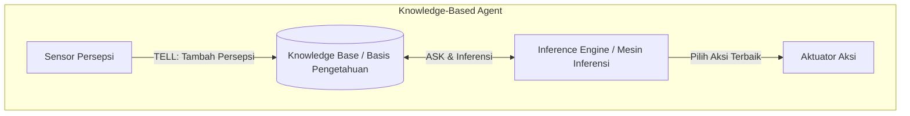
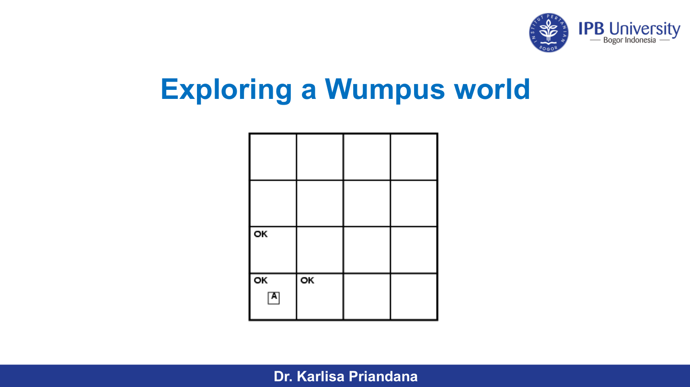
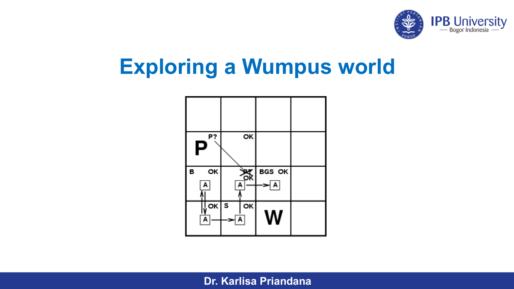

---
tags:
  - ai
  - uts
  - logic
  - propositional-logic
  - wumpus-world
  - resolution
  - cnf
  - horn-clause
  - entailment
created: 2026-10-10
week: 6
source: "Pertemuan 6 - Logical Agents and Propositional Logic.pdf, solutions-Propositional_Logic.pdf, Russell & Norvig Chapter 7"
---

# Week 06 - Logical Agents and Propositional Logic

> [!summary] Navigasi Catatan
> - **Prev**: [[Week 05 - Constraint Satisfaction Problems (CSP)|Week 05 - Constraint Satisfaction Problems (CSP)]]
> - **MOC Master**: [[00 - MOC AI UTS|00 - Map of Content AI UTS]]
> - **Next**: [[Week 07 - First-Order Logic (FOL) and Inference|Week 07 - First-Order Logic (FOL) and Inference]]

---

## 1. Knowledge-Based Agents (Agen Berbasis Pengetahuan)

Agen cerdas yang kompleks membutuhkan kemampuan untuk merepresentasikan dunia, memelihara status internal yang kaya, dan melakukan penalaran (*reasoning*) logis untuk menarik kesimpulan baru.

### Operasi Dasar pada Knowledge Base (KB)
1. $\text{TELL}(\text{KB}, \alpha)$: Menambahkan kalimat/fakta baru $\alpha$ ke dalam basis pengetahuan.
2. $\text{ASK}(\text{KB}, \alpha)$: Mengajukan pertanyaan apakah kalimat $\alpha$ dapat disimpulkan dari pengetahuan yang ada di KB.

---

## 2. Lingkungan Dunia Wumpus (The Wumpus World)

Dunia Wumpus adalah lingkungan benchmark klasik untuk menguji agen berbasis pengetahuan dalam kondisi *partially observable*.

### Karakterisasi PEAS Wumpus World
- **Performance Measure**: $+1000$ jika berhasil keluar gua membawa Emas, $-1000$ jika jatuh ke dalam Pit atau dimakan Wumpus, $-1$ untuk setiap langkah yang diambil, $-10$ untuk penggunaan panah.
- **Environment**: Gua petak $4 \times 4$.
  - Agen mulai di petak $[1, 1]$ menghadap ke Timur.
  - Terdapat **Wumpus** (monster buas pemakan agen). Petak bertetangga langsung horizontal/vertikal dengan Wumpus berbau busuk (**Stench**).
  - Terdapat beberapa lubang maut (**Pits**). Petak bertetangga langsung horizontal/vertikal dengan Pit berangin semilir (**Breeze**).
  - Terdapat tumpukan emas (**Gold**). Petak yang berisi emas memancarkan kilauan (**Glitter**).
- **Actuators**: Maju (*Forward*), Putar Kiri 90° (*TurnLeft*), Putar Kanan 90° (*TurnRight*), Ambil Emas (*Grab*), Tembak Panah (*Shoot*), Keluar Gua (*Climb*).
- **Sensors**: 5 bit persepsi: `[Stench, Breeze, Glitter, Bump, Scream]`
  - `Bump`: Diterima jika agen menabrak dinding gua.
  - `Scream`: Terdengar di seluruh penjuru gua saat Wumpus tertembak mati oleh panah.

### Sifat Lingkungan Wumpus World
| Karakteristik | Nilai | Penjelasan |
| :--- | :--- | :--- |
| **Observable** | **Partially Observable** | Agen hanya mempersepsikan kondisi lokal di petak saat ini. |
| **Deterministic** | **Deterministic** | Hasil aksi dapat diprediksi pasti (tidak ada elemen acak). |
| **Episodic** | **Sequential** | Keputusan saat ini menentukan hidup/mati di langkah masa depan. |
| **Static** | **Static** | Wumpus dan Pit tidak berpindah tempat saat agen berpikir. |
| **Discrete** | **Discrete** | Petak, arah, dan tindakan terhitung diskrit. |
| **Single/Multi** | **Single-Agent** | Wumpus hanya dianggap sebagai rintangan alam pasif. |

---

## 3. Logika: Sintaks, Semantik, dan Entailment

- **Sintaks (*Syntax*)**: Aturan formal penulisan kalimat legal dalam bahasa logika.
- **Semantik (*Semantics*)**: Aturan yang menentukan "arti" atau nilai kebenaran (*Truth value*: True/False) suatu kalimat dalam model dunia tertentu.
- **Model ($m$)**: Representasi abstrak dunia matematika yang memberikan interpretasi nilai kebenaran ke setiap simbol proposisi.
  - Notasi $M(\alpha)$: Himpunan seluruh model di mana kalimat $\alpha$ bernilai True.

> [!important] Definisi Entailment (Konsekuensi Logis): $\alpha \models \beta$
> Kalimat $\beta$ dikatakan di-*entail* oleh kalimat $\alpha$ ($\alpha \models \beta$) jika dan hanya jika **dalam setiap model di mana $\alpha$ bernilai True, $\beta$ juga bernilai True**:
> $$\alpha \models \beta \iff M(\alpha) \subseteq M(\beta)$$
> Artinya: Tidak ada situasi yang memungkinkan $\alpha$ bernilai True tetapi $\beta$ bernilai False.

---

## 4. Soundness dan Completeness pada Prosedur Inferensi

Prosedur inferensi $i$ menurunkan kalimat $\alpha$ dari basis pengetahuan $KB$, dinotasikan:
$$KB \vdash_i \alpha$$

| Properti Inferensi | Definisi Matematis | Makna Intuitif |
| :--- | :--- | :--- |
| **Soundness (Kebenaran / Kebenaran Terjamin)** | Jika $KB \vdash_i \alpha$, maka $KB \models \alpha$ | Prosedur **hanya menghasilkan kesimpulan yang benar**. Tidak pernah membuat klaim palsu (*truth-preserving*). |
| **Completeness (Kelengkapan)** | Jika $KB \models \alpha$, maka $KB \vdash_i \alpha$ | Prosedur mampu **menemukan seluruh kesimpulan yang benar**. Tidak ada kebenaran tersembunyi yang terlewat. |

---

## 5. Logika Proposisional (Propositional Logic)

### Sintaks & Tabel Kebenaran Operator Logika
Operator logika standar: Negasi ($\neg$), Konjungsi ($\land$), Disjungsi ($\lor$), Implikasi ($\implies$), Bikondisional ($\iff$).

| $P$ | $Q$ | $\neg P$ | $P \land Q$ | $P \lor Q$ | $P \implies Q$ | $P \iff Q$ |
| :---: | :---: | :---: | :---: | :---: | :---: | :---: |
| T | T | F | T | T | **T** | T |
| T | F | F | F | T | **F** | F |
| F | T | T | F | T | **T** | F |
| F | F | T | F | F | **T** | T |

> [!warning] Perhatikan Implikasi $P \implies Q$!
> Implikasi $P \implies Q$ bernilai **TRUE secara trivial** setiap kali premis $P$ bernilai FALSE, tidak peduli apakah $Q$ benar atau salah!

### Validitas, Keterpuasan, dan Teorema Deduksi
- **Valid (Tautologi)**: Kalimat yang bernilai True di **semua model** yang mungkin (contoh: $P \lor \neg P$).
  - **Teorema Deduksi (*Deduction Theorem*)**:
    $$KB \models \alpha \iff (KB \implies \alpha) \text{ adalah Valid}$$
- **Satisfiable**: Kalimat yang bernilai True di **setidaknya satu model**.
- **Unsatisfiable (Kontradiksi)**: Kalimat yang bernilai False di **semua model** (contoh: $P \land \neg P$).
  - **Prinsip Reductio ad Absurdum (Proof by Contradiction)**:
    $$KB \models \alpha \iff (KB \land \neg \alpha) \text{ adalah Unsatisfiable}$$

---

## 6. Algoritma Inferensi Logika Proposisional

### A. Model Checking (Truth Table Enumeration)
- Memeriksa setiap baris tabel kebenaran. Jika setiap baris di mana $KB = \text{True}$ juga menghasilkan $\alpha = \text{True}$, maka $KB \models \alpha$.
- **Kompleksitas**: Waktu $O(2^n)$ di mana $n$ adalah jumlah variabel simbol proposisi. Tidak praktis untuk $n$ besar.

---

### B. Aturan Ekuivalensi Logika Baku
1. Komutatif: $\alpha \land \beta \equiv \beta \land \alpha$, $\alpha \lor \beta \equiv \beta \lor \alpha$
2. Asosiatif: $(\alpha \land \beta) \land \gamma \equiv \alpha \land (\beta \land \gamma)$
3. Distributif: $\alpha \lor (\beta \land \gamma) \equiv (\alpha \lor \beta) \land (\alpha \lor \gamma)$
4. Hukum De Morgan:
   $$\neg(\alpha \land \beta) \equiv \neg \alpha \lor \neg \beta$$
   $$\neg(\alpha \lor \beta) \equiv \neg \alpha \land \neg \beta$$
5. Eliminasi Implikasi: $\alpha \implies \beta \equiv \neg \alpha \lor \beta$
6. Eliminasi Bikondisional: $\alpha \iff \beta \equiv (\alpha \implies \beta) \land (\beta \implies \alpha)$
7. Eliminasi Dobel Negasi: $\neg \neg \alpha \equiv \alpha$

---

### C. Konversi ke Conjunctive Normal Form (CNF)
Setiap kalimat logika proposisional dapat diubah ke dalam bentuk **CNF** (Konjungsi dari Disjungsi / himpunan klausa):
$$\text{Klausa}_1 \land \text{Klausa}_2 \land \dots \land \text{Klausa}_k \quad \text{di mana setiap klausa berbentuk } (l_1 \lor l_2 \lor \dots \lor l_m)$$

> [!important] 5 Langkah Standar Konversi ke CNF
> 1. **Eliminasi Bikondisional ($\iff$)**: Ganti $\alpha \iff \beta$ dengan $(\alpha \implies \beta) \land (\beta \implies \alpha)$.
> 2. **Eliminasi Implikasi ($\implies$)**: Ganti $\alpha \implies \beta$ dengan $\neg \alpha \lor \beta$.
> 3. **Dorong Negasi ke Dalam ($\neg$)**: Terapkan hukum De Morgan dan eliminasi dobel negasi sampai simbol negasi hanya menempel langsung di depan simbol literal.
> 4. **Distribusi Disjungsi ($\lor$) terhadap Konjungsi ($\land$)**: Gunakan sifat $\alpha \lor (\beta \land \gamma) \equiv (\alpha \lor \beta) \land (\alpha \lor \gamma)$.
> 5. **Pecah Konjungsi Menjadi Klausa-Klausa Terpisah**: Buat setiap baris menjadi satu klausa disjungtif.

---

### D. Algoritma Resolusi (Resolution Algorithm / Refutation)
Algoritma pembuktian lengkap (*complete*) berbasis kontradiksi:

> [!important] Aturan Resolusi Satuan & Penuh
> $$\frac{l_1 \lor \dots \lor l_i \lor \dots \lor l_k, \quad m_1 \lor \dots \lor \neg l_i \lor \dots \lor m_n}{l_1 \lor \dots \lor l_{i-1} \lor l_{i+1} \lor \dots \lor l_k \lor m_1 \lor \dots \lor m_n}$$
> Dua klausa yang memiliki sepasang **literal komplementer** ($P$ dan $\neg P$) dapat digabungkan menjadi klausa baru (*resolvent*) dengan menghilangkan pasangan komplementer tersebut.

#### Prosedur Bukti Resolusi Kontradiksi
Untuk membuktikan apakah $KB \models \alpha$:
1. Ubah seluruh kalimat di dalam $KB$ menjadi bentuk klausa CNF.
2. Tambahkan **negasi dari kalimat query** ($\neg \alpha$) ke dalam himpunan klausa.
3. Terapkan aturan resolusi secara berulang pada pasangan klausa yang memiliki literal komplementer.
4. Jika resolusi menghasilkan **Klausa Kosong (*Empty Clause* $\Box$ / False)**:
   - Terjadi kontradiksi matematis!
   - Berarti $KB \land \neg \alpha$ tidak dapat dipenuhi (*unsatisfiable*).
   - $\therefore$ Terbukti bahwa $KB \models \alpha$!
5. Jika tidak ada lagi klausa baru yang dapat diturunkan dan klausa kosong tidak tercapai, maka $KB \not\models \alpha$.

---

### E. Horn Clauses, Definite Clauses, Forward & Backward Chaining
Bentuk khusus logika yang memungkinkan penalaran dalam waktu **Linear $O(n)$**:
- **Definite Clause**: Klausa disjungsi yang memiliki **tepat satu** literal positif:
  $$\neg P \lor \neg Q \lor R \equiv (P \land Q \implies R)$$
- **Horn Clause**: Klausa disjungsi yang memiliki **paling banyak satu** literal positif.
- **Forward Chaining (Data-Driven)**: Memulai dari fakta-fakta yang diketahui di basis data, menarik premis implikasi untuk menghasilkan kesimpulan baru hingga tujuan tercapai.
- **Backward Chaining (Goal-Driven)**: Memulai dari tujuan/pertanyaan yang ingin dibuktikan, menelusuri mundur aturan-aturan yang memiliki tujuan tersebut sebagai konklusi.

---

## 7. Pembahasan Latihan Soal UTS (Dari Solution Sheets)

Berikut adalah rangkuman solusi soal-soal penalaran logika dari `solutions-Propositional_Logic.pdf`:

### Soal 1: Hubungan Entailment dan Tautologi
- **Apakah mungkin $(KB \models S)$ dan $(\neg KB \models S)$?**
  - **Jawaban: YA**. Contoh: jika $S$ adalah tautologi ($S \equiv \text{True}$), maka interpretasi apapun yang memenuhi $KB$ maupun $\neg KB$ pasti memenuhi $S$.
- **Apakah mungkin $(KB \models S)$ dan $(KB \models \neg S)$?**
  - **Jawaban: YA**. Contoh: jika $KB \equiv \text{False}$ (basis pengetahuan kontradiktif), maka $KB$ meng-entail kalimat apapun di dunia, termasuk $S$ dan $\neg S$.
- **Apakah mungkin $(KB \models S)$ dan $(KB \not\models S)$?**
  - **Jawaban: TIDAK**. Secara logika eksklusif, suatu proposisi tidak bisa sekaligus di-entail dan tidak di-entail oleh basis pengetahuan yang sama.

---

### Soal 2: Teka-Teki Anak Termuda Mrs. Baker (Pembuktian Resolusi)
> **Masalah**: Mrs. Baker memiliki 3 anak: Alice ($A$), Bill ($B$), dan Carl ($C$). Hanya satu yang paling muda.
> - Aturan 1: Alice anak termuda jika Bill bukan anak termuda ($\neg B \implies A$).
> - Aturan 2: Alice bukan anak termuda jika Carl bukan anak termuda ($\neg C \implies \neg A$).
> - Tunjukkan dengan resolusi bahwa **Bill adalah anak termuda ($B$)**!

#### Solusi Pembuktian:
1. **Background Knowledge (Tepat satu anak termuda)**:
   - Klausa 1: $A \lor B \lor C$ (Salah satu harus termuda)
   - Klausa 2: $\neg A \lor \neg B$ (Alice dan Bill tidak bisa bersamaan termuda)
   - Klausa 3: $\neg A \lor \neg C$
   - Klausa 4: $\neg B \lor \neg C$
2. **Pernyataan Mrs. Baker (dikonversi ke CNF)**:
   - $\neg B \implies A \equiv \neg(\neg B) \lor A \equiv B \lor A \implies$ **Klausa 5**: $A \lor B$
   - $\neg C \implies \neg A \equiv \neg(\neg C) \lor \neg A \equiv C \lor \neg A \implies$ **Klausa 6**: $\neg A \lor C$
3. **Negasi Query**: Kita ingin membuktikan $B$. Negasikan:
   - **Klausa 7**: $\neg B$
4. **Langkah Resolusi Menuju Empty Clause ($\Box$)**:
   - Dari Klausa 5 ($A \lor B$) dan Klausa 7 ($\neg B$) $\implies$ **Klausa 8**: $A$
   - Dari Klausa 3 ($\neg A \lor \neg C$) dan Klausa 6 ($\neg A \lor C$) $\implies$ **Klausa 9**: $\neg A$
   - Dari Klausa 8 ($A$) dan Klausa 9 ($\neg A$) $\implies$ **Klausa 10: $\Box$ (EMPTY CLAUSE / CONTRADICTION)**!
   - $\therefore$ Terbukti bahwa **Bill adalah anak termuda!**

---

### Soal 3: Teka-Teki Dua Anak (Truth-Teller vs. Liar)
> **Masalah**: Dua anak, satu berambut putih ($W$) dan satu berambut hitam ($B$). Salah satu anak laki-laki ($b$) dan satu anak perempuan ($g$).
> - Anak berambut hitam berkata: "Saya anak laki-laki."
> - Anak berambut putih berkata: "Saya anak perempuan."
> - Setidaknya satu dari mereka berbohong. Tunjukkan dengan resolusi bahwa **keduanya berbohong**!

#### Solusi Representasi:
- Simbol: $Bt$ (Hitam jujur), $Bb$ (Hitam laki-laki), $Wt$ (Putih jujur), $Wb$ (Putih laki-laki).
- Klausa Masalah:
  1. $Bb \lor Wb$ (Minimal satu anak laki-laki)
  2. $\neg Bb \lor \neg Wb$ (Minimal satu anak perempuan)
  3. $\neg Bt \lor Bb$ ($Bt \implies Bb$)
  4. $Bt \lor \neg Bb$ ($\neg Bt \implies \neg Bb$)
  5. $\neg Wt \lor \neg Wb$ ($Wt \implies \neg Wb$)
  6. $Wt \lor Wb$ ($\neg Wt \implies Wb$)
  7. $\neg Bt \lor \neg Wt$ (Minimal satu anak berbohong)
- Negasi Goal ($\neg(\neg Bt \land \neg Wt) \equiv Bt \lor Wt$):
  8. $Bt \lor Wt$
- Resolusi dari (3) dan (8) $\to Bb \lor Wt$; dari (5) $\to Bb \lor \neg Wb$; resolusi berantai menghasilkan $\Box$!

---

## 8. Ringkasan Kunci Ujian (Exam Quick Sheet)

> [!tip] Rangkuman Cepat Ujian Minggu 6
> 1. **Entailment**: $\alpha \models \beta \iff M(\alpha) \subseteq M(\beta)$.
> 2. **Soundness vs Completeness**: Sound = semua kesimpulan benar; Complete = semua kebenaran terbukti.
> 3. **Bukti Kontradiksi Resolusi**: Selalu tambahkan $\neg \text{Query}$ ke himpunan klausa CNF dan cari sepasang literal komplementer hingga menghasilkan klausa kosong $\Box$.
> 4. **Horn Clause**: Maksimal 1 literal positif, dapat dipecahkan dalam waktu linear $O(n)$ dengan Forward/Backward Chaining.

---
*Lanjut ke materi minggu berikutnya:* [[Week 07 - First-Order Logic (FOL) and Inference|Week 07 - First-Order Logic (FOL) and Inference ➔]]
