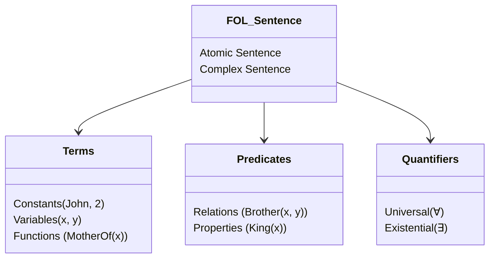

---
tags:
  - ai
  - uts
  - first-order-logic
  - fol
  - quantifiers
  - unification
  - skolemization
  - resolution
created: 2026-10-10
week: 7
source: "Pertemuan 7 - First Order Logic.pdf, Textbook First Order Logic.pdf, solutions-First-Order_Logic.pdf, Russell & Norvig Chapter 8 & 9"
---

# Week 07 - First-Order Logic (FOL) and Inference

> [!summary] Navigasi Catatan
> - **Prev**: [[Week 06 - Logical Agents and Propositional Logic|Week 06 - Logical Agents and Propositional Logic]]
> - **MOC Master**: [[00 - MOC AI UTS|00 - Map of Content AI UTS]]
> - **Index**: [[00 - MOC AI UTS|Kembali ke Master MOC]]

---

## 1. Mengapa First-Order Logic? (Keterbatasan Logika Proposisional)

Logika Proposisional memiliki keterbatasan ekspresif yang mendasar:
1. Hanya mampu menyatakan **fakta proposisi tunggal** ($P, Q$).
2. Tidak dapat mengekspresikan generalisasi atau hukum umum tanpa membuat salinan kalimat yang tak berhingga.
   - *Contoh*: Untuk menyatakan "Kotak di sebelah Pit pasti berangin semilir", logika proposisional harus menulis 16 kalimat terpisah untuk setiap petak $[x, y]$ di grid $4 \times 4$. Jika ukuran grid $100 \times 100$, dibutuhkan $10.000$ kalimat!

> [!important] Komitmen Ontologis & Epistemologis
> - **Logika Proposisional**: Mengasumsikan dunia berisi **Fakta** yang bernilai True atau False.
> - **First-Order Logic (FOL)**: Mengasumsikan dunia berisi:
>   1. **Objek (*Objects*)**: Hal-hal konkret atau abstrak dengan identitas individual (misal: orang, angka, rumah, kucing).
>   2. **Relasi / Predikat (*Relations / Predicates*)**: Hubungan antar objek (misal: *BrotherOf, BiggerThan, King*).
>   3. **Fungsi (*Functions*)**: Relasi khusus yang memetakan masukan objek ke tepat satu objek luaran (misal: *MotherOf, Plus, Sqrt*).

---

## 2. Sintaks dan Semantik First-Order Logic

Kalimat dalam First-Order Logic dibangun dari elemen-elemen formal berikut:

### Elemen Dasar Sintaks
1. **Konstanta (*Constant Symbols*)**: Menyebutkan objek spesifik. Contoh: $\text{John}, \text{Alice}, 2, \text{Jakarta}$.
2. **Variabel (*Variables*)**: Merujuk pada objek sembarang (ditulis huruf kecil). Contoh: $x, y, z, a$.
3. **Predikat (*Predicate Symbols*)**: Menyatakan relasi atau properti bernilai True/False. Contoh: $\text{Brother}(x, y)$, $\text{Dog}(x)$, $\text{Cute}(x)$.
4. **Fungsi (*Function Symbols*)**: Menghasilkan objek lain. Contoh: $\text{MotherOf}(x)$, $\text{HeadOf}(x)$, $\text{Plus}(x, y)$.
5. **Term**: Ekspresi logis yang mengacu pada suatu objek:
   - Sebuah konstanta adalah term.
   - Sebuah variabel adalah term.
   - Jika $f$ adalah simbol fungsi dan $t_1, \dots, t_n$ adalah term, maka $f(t_1, \dots, t_n)$ adalah term.
6. **Kalimat Atomik (*Atomic Sentences*)**: Dibentuk oleh predikat yang diaplikasikan ke term:
   $$\text{Predicate}(t_1, t_2, \dots, t_n) \quad \text{atau} \quad t_1 = t_2 \text{ (Equality)}$$
   *Contoh*: $\text{Brother}(\text{Richard}, \text{John})$, $\text{Married}(\text{FatherOf}(\text{John}), \text{MotherOf}(\text{John}))$.
7. **Kalimat Kompleks (*Complex Sentences*)**: Menggabungkan kalimat atomik menggunakan operator logika $(\neg, \land, \lor, \implies, \iff)$.

---

## 3. Kuantor: Universal ($\forall$) dan Eksistensial ($\exists$)

Kuantor memberikan First-Order Logic kekuatan ekspresif untuk menyatakan himpunan objek.

---

### A. Kuantor Universal ($\forall x$)
Menyatakan bahwa suatu pernyataan berlaku untuk **semua objek $x$** di dalam domain wacana.
- Format Penulisan:
  $$\forall x \, P(x)$$
  *(Dibaca: "Untuk setiap $x$, berlaku $P(x)$").*

> [!important] Aturan Emas Universal: Pasangan Alaminya adalah Implikasi ($\implies$)
> Kalimat "Semua manusia adalah fana":
> $$\forall x \, [\text{Man}(x) \implies \text{Mortal}(x)] \quad \text{(BENAR)}$$

> [!caution] Jebakan Klasik Ujian: Kuantor $\forall$ dengan Konjungsi ($\land$)
> Jika Anda menulis:
> $$\forall x \, [\text{Man}(x) \land \text{Mortal}(x)] \quad \text{(SALAH BESAR!)}$$
> Kalimat ini berarti: *"Segala sesuatu di alam semesta adalah manusia DAN segala sesuatu fana"* (termasuk meja, batu, dan bulan adalah manusia). Hindari menggunakan $\land$ sebagai penghubung utama di dalam $\forall$!

---

### B. Kuantor Eksistensial ($\exists x$)
Menyatakan bahwa terdapat **setidaknya satu objek $x$** di dalam domain yang memenuhi kondisi.
- Format Penulisan:
  $$\exists x \, P(x)$$
  *(Dibaca: "Ada setidaknya satu $x$ sedemikian rupa sehingga $P(x)$").*

> [!important] Aturan Emas Eksistensial: Pasangan Alaminya adalah Konjungsi ($\land$)
> Kalimat "Ada mahasiswa yang pintar":
> $$\exists x \, [\text{Student}(x) \land \text{Smart}(x)] \quad \text{(BENAR)}$$

> [!caution] Jebakan Klasik Ujian: Kuantor $\exists$ dengan Implikasi ($\implies$)
> Jika Anda menulis:
> $$\exists x \, [\text{Student}(x) \implies \text{Smart}(x)] \quad \text{(SALAH / TRIVIAL TRUE!)}$$
> Kalimat ini bernilai TRUE secara otomatis jika ada objek di dunia yang BUKAN mahasiswa (karena $\text{False} \implies \text{Anything}$ bernilai True)! Hindari menggunakan $\implies$ sebagai penghubung utama di dalam $\exists$!

---

### C. Urutan Kuantor Bersarang (Nested Quantifiers)

> [!warning] Perubahan Urutan Mengubah Makna Secara Radikal!
> - $\forall x \, \exists y \, \text{Loves}(x, y)$: "Setiap orang memiliki seseorang yang ia cintai" *(Setiap orang bisa mencintai orang yang berbeda).*
> - $\exists y \, \forall x \, \text{Loves}(x, y)$: "Ada satu orang yang dicintai oleh semua orang" *(Satu figur universal yang sama dicintai semua orang).*

---

### D. Hukum Dualitas De Morgan untuk Kuantor
Kuantor universal dan eksistensial saling terhubung melalui negasi:
1. $\forall x \, P(x) \equiv \neg \exists x \, \neg P(x)$ *(Semua orang suka es krim $\equiv$ Tidak ada orang yang tidak suka es krim).*
2. $\neg \forall x \, P(x) \equiv \exists x \, \neg P(x)$ *(Tidak semua orang kaya $\equiv$ Ada orang yang tidak kaya).*
3. $\exists x \, P(x) \equiv \neg \forall x \, \neg P(x)$
4. $\neg \exists x \, P(x) \equiv \forall x \, \neg P(x)$

---

## 4. Representasi Pengetahuan dalam Domain Nyata

### Domain Hubungan Kekerabatan (Kinship Domain)
- **Definisi Nenek (*Grandmother*)**:
  $$\forall x, y \, [\text{IsGrandMotherOf}(x, y) \iff \exists z \, (\text{IsMotherOf}(x, z) \land (\text{IsMotherOf}(z, y) \lor \text{IsFatherOf}(z, y)))]$$
- **Definisi Saudara Kandung (*Sibling*)**:
  $$\forall x, y \, [\text{Sibling}(x, y) \iff (x \ne y \land \exists m, f \, [m \ne f \land \text{Mother}(m, x) \land \text{Mother}(m, y) \land \text{Father}(f, x) \land \text{Father}(f, y)])]$$

---

## 5. Inferensi dalam First-Order Logic

Bagaimana komputer menarik kesimpulan baru dari kalimat berkuantor?

### A. Aturan Instansiasi & Skolemization
1. **Universal Instantiation (UI)**:
   Dari $\forall v \, \alpha$, kita dapat menyimpulkan $\text{SUBST}(\{v/g\}, \alpha)$ untuk sembarang ground term $g$ (term tanpa variabel).
   - *Contoh*: Dari $\forall x \, [\text{King}(x) \implies \text{Greedy}(x)]$, kita peroleh $\text{King}(\text{John}) \implies \text{Greedy}(\text{John})$.
2. **Existential Instantiation (EI) & Skolemization**:
   Dari $\exists v \, \alpha$, kita menyimpulkan $\text{SUBST}(\{v/k\}, \alpha)$ di mana $k$ adalah simbol konstanta baru (**Skolem Constant**) yang belum pernah digunakan di manapun dalam basis pengetahuan.
   - *Jika $\exists$ berada di dalam lingkup $\forall$*:
     $$\forall x \, \exists y \, \text{HeartOf}(y, x)$$
     Variabel $y$ bergantung pada $x$, sehingga harus diganti dengan **Skolem Function**:
     $$\forall x \, \text{HeartOf}(H(x), x)$$

---

### B. Unifikasi (Unification)
Proses pencarian substitusi variabel $\theta$ yang membuat dua ekspresi logika menjadi identik:
$$\text{UNIFY}(p, q) = \theta \quad \text{sehingga} \quad \text{SUBST}(\theta, p) = \text{SUBST}(\theta, q)$$

> [!example] Contoh Unifikasi
> - $\text{UNIFY}(\text{Knows}(\text{John}, x), \text{Knows}(\text{John}, \text{Jane})) = \{x / \text{Jane}\}$
> - $\text{UNIFY}(\text{Knows}(\text{John}, x), \text{Knows}(y, \text{Bill})) = \{x / \text{Bill}, y / \text{John}\}$
> - $\text{UNIFY}(\text{Knows}(\text{John}, x), \text{Knows}(y, \text{MotherOf}(y))) = \{y / \text{John}, x / \text{MotherOf}(\text{John})\}$
> - $\text{UNIFY}(\text{Knows}(\text{John}, x), \text{Knows}(x, \text{Bill})) = \text{FAIL}$ *(karena $x$ tidak bisa sekaligus John dan Bill).*

- **Most General Unifier (MGU)**: Unifier paling umum yang tidak membatasi variabel lebih dari yang diperlukan.
- **Occur Check**: Algoritma unifikasi harus memastikan variabel tidak di-unifikasi dengan term yang mengandung variabel itu sendiri (misal: $\text{UNIFY}(x, f(x)) = \text{FAIL}$).

---

### C. Generalized Modus Ponens (GMP)
Aturan inferensi utama untuk klausa definit (*definite clauses*) pada First-Order Logic:
$$\frac{p_1', p_2', \dots, p_n', \quad (p_1 \land p_2 \land \dots \land p_n \implies q)}{\text{SUBST}(\theta, q)}$$
di mana $\text{UNIFY}(p_i', p_i) = \theta$ untuk semua $i$.
- Menjadi pondasi bagi algoritma **Forward Chaining** dan **Backward Chaining** dalam sistem logika terprogram (misal: Prolog).

---

### D. Resolusi dalam First-Order Logic (FOL Resolution)
Algoritma pembuktian refutasi lengkap (*complete refutation*) untuk First-Order Logic.

#### Konversi Kalimat FOL ke CNF Berkuantor (9 Langkah):
1. **Eliminasi Implikasi & Bikondisional**: Ganti $\alpha \implies \beta$ dengan $\neg \alpha \lor \beta$.
2. **Geser Negasi ke Dalam**: Terapkan De Morgan dan kuantor: $\neg \forall x P(x) \equiv \exists x \neg P(x)$.
3. **Standarisasi Variabel**: Pastikan setiap kuantor menggunakan nama variabel yang berbeda.
4. **Skolemize**: Ganti variabel eksistensial ($\exists$) dengan konstanta atau fungsi Skolem.
5. **Drop Kuantor Universal**: Karena semua variabel yang tersisa berkuantor universal, simbol $\forall$ dapat dihilangkan secara implisit.
6. **Distribusi $\lor$ terhadap $\land$**: Ubah menjadi konjungsi klausa.
7. **Pecah Klausa**: Pisahkan setiap baris konjungsi menjadi klausa independen.
8. **Standarisasi Variabel per Klausa**: Beri nama variabel yang berbeda pada tiap klausa agar unifikasi tidak berbenturan.

---

## 6. Pembahasan Latihan Soal UTS & Problem Textbook 9.23

### Soal 1: Translasi Bahasa Alami ke FOL (Dari Solutions Sheet)
Gunakan predikat: $\text{Owns}(x, y), \text{Dog}(x), \text{Cat}(x), \text{Cute}(x), \text{Scary}(x)$.
- **"Joe has a cute dog"**:
  $$\exists x \, [\text{Owns}(\text{Joe}, x) \land \text{Dog}(x) \land \text{Cute}(x)]$$
- **"All of Joe's dogs are cute"**:
  $$\forall x \, [(\text{Owns}(\text{Joe}, x) \land \text{Dog}(x)) \implies \text{Cute}(x)]$$
- **"Unless Joe owns a dog, he is scary"**:
  $$\neg (\exists x \, [\text{Owns}(\text{Joe}, x) \land \text{Dog}(x)]) \implies \text{Scary}(\text{Joe})$$
- **"Not all dogs are both scary and cute"**:
  $$\exists x \, [\text{Dog}(x) \land \neg (\text{Scary}(x) \land \text{Cute}(x))]$$

---

### Soal 2: Validitas Kalimat FOL
- $P(A) \implies \exists x \, P(x)$ $\implies$ **VALID** (Jika fakta $P$ berlaku untuk konstanta $A$, maka pasti ada setidaknya satu $x$ yang memenuhi $P(x)$).
- $P(A) \implies \forall x \, P(x)$ $\implies$ **SATISFIABLE tapi TIDAK VALID** (Benar jika semua objek memiliki sifat $P$, tetapi tidak dijamin berlaku untuk semua model).

---

### Soal 3: Pembuktian Lengkap Problem 9.23 (Horses and Animals)
> **Premis**: "Horses are animals" ($\forall x \, [\text{Horse}(x) \implies \text{Animal}(x)]$).
> **Goal**: Buktikan bahwa "The head of a horse is the head of an animal":
> $$\forall h \, [(\exists y \, [\text{HeadOf}(h, y) \land \text{Horse}(y)]) \implies (\exists z \, [\text{HeadOf}(h, z) \land \text{Animal}(z)])]$$

#### Langkah Pembuktian Resolusi Refutasi:
1. **Konversi Premis ke CNF**:
   - $\forall x \, [\neg \text{Horse}(x) \lor \text{Animal}(x)] \implies$ **Klausa (1)**: $\neg \text{Horse}(x) \lor \text{Animal}(x)$
2. **Negasi Goal dan Konversi ke CNF**:
   - Negasikan goal: $\neg \forall h \, [\dots] \equiv \exists h \, \neg [\dots]$
   - Implikasi $\implies$ diubah ke $\neg A \lor B$, dinegasikan menjadi $A \land \neg B$:
     $$\exists h \, [(\exists y \, [\text{HeadOf}(h, y) \land \text{Horse}(y)]) \land \neg (\exists z \, [\text{HeadOf}(h, z) \land \text{Animal}(z)])]$$
   - Terapkan Skolem Constant untuk $h$ menjadi $H$, dan untuk $y$ menjadi $Y$:
     - **Klausa (2)**: $\text{HeadOf}(H, Y)$
     - **Klausa (3)**: $\text{Horse}(Y)$
   - Bagian kanan: $\neg \exists z \equiv \forall z \, [\neg \text{HeadOf}(H, z) \lor \neg \text{Animal}(z)]$:
     - **Klausa (4)**: $\neg \text{HeadOf}(H, z) \lor \neg \text{Animal}(z)$
3. **Pohon Resolusi Menuju Kontradiksi**:
   - Resolusi Klausa (2) $\text{HeadOf}(H, Y)$ dengan Klausa (4) menggunakan unifikasi $\{z / Y\}$:
     - **Klausa (5)**: $\neg \text{Animal}(Y)$
   - Resolusi Klausa (1) $\neg \text{Horse}(x) \lor \text{Animal}(x)$ dengan Klausa (5) menggunakan unifikasi $\{x / Y\}$:
     - **Klausa (6)**: $\neg \text{Horse}(Y)$
   - Resolusi Klausa (3) $\text{Horse}(Y)$ dengan Klausa (6):
     - **Klausa (7): $\Box$ (EMPTY CLAUSE / CONTRADICTION)**!
   - $\therefore$ **Terbukti secara formal bahwa kepala kuda adalah kepala binatang!**

---

## 7. Ringkasan Kunci Ujian (Exam Quick Sheet)

> [!tip] Rangkuman Cepat Ujian Minggu 7
> 1. **Pola Universal**: $\forall x \, [P(x) \implies Q(x)]$. Jangan gunakan $\land$!
> 2. **Pola Eksistensial**: $\exists x \, [P(x) \land Q(x)]$. Jangan gunakan $\implies$!
> 3. **Unifikasi**: Mencari pemetaan substitusi variabel paling umum ($\text{MGU}$) agar dua kalimat atomik identik.
> 4. **Skolemization**: Ganti $\exists$ dengan konstanta jika independen, atau fungsi Skolem jika berada di bawah $\forall$.
> 5. **Resolusi FOL**: Menggabungkan aturan resolusi proposisional dengan unifikasi variabel untuk mencapai klausa kosong $\Box$.

---
*Kembali ke Ringkasan Utama:* [[00 - MOC AI UTS|00 - Map of Content AI UTS ➔]]
