---
title: "LGW2E Chapter 6: Medium Access Control Protocols and Local Area Networks"
tags:
  - computer-networks
  - medium-access-control
  - mac-protocols
  - random-access
  - aloha
  - csma
  - csmacd
  - scheduling-protocols
  - token-ring
  - fddi
  - channelization
  - cdma
  - queueing-theory
  - ethernet
  - wireless-lan
  - wifi-802-11
  - transparent-bridges
  - spanning-tree
  - vlan
  - obsidian-notes
course: Computer Networks / Komunikasi Data
textbook: "Communication Networks: Fundamental Concepts and Key Architectures (Leon-Garcia & Widjaja, 2nd Edition)"
date: 2026-09-29
type: study-note
---

# Chapter 6: Medium Access Control Protocols and Local Area Networks

> [!abstract] Ringkasan Eksekutif
> Catatan komprehensif ini merangkum materi kuliah **Chapter 6 (Leon-Garcia & Widjaja)** yang mencakup 203 slide presentasi ke dalam dua pilar utama arsitektur jaringan lokal:
> 1. **Part I: Medium Access Control (MAC)** — Menelaah tantangan koordinasi akses pada media bersama (*shared broadcast medium*), pengaruh parameter normalisasi *delay-bandwidth product* ($a$), taksonomi teknik *medium sharing*, tiga kelas protokol MAC fundamental:
>    - **Random Access:** Pure ALOHA, Slotted ALOHA, CSMA (1-persistent, Non-persistent, p-persistent), CSMA/CD dengan *Truncated Binary Exponential Backoff*, batas throughput teoretis, dan dampaknya saat $a$ membesar.
>    - **Scheduling:** Sistem Reservasi (TDM minislot & random access minislot, contoh riil GPRS) dan Sistem Polling (*exhaustive, gated, frame-limited, time-limited*, serta penerapannya pada *Token-Passing Rings*).
>    - **Channelization:** Pembagian spektrum secara deterministik via FDMA, TDMA, dan CDMA (*Spread Spectrum* menggunakan *Walsh Codes* ortogonal / Matriks Hadamard), studi kasus efisiensi spektral seluler 1G s.d. 3G (AMPS, IS-54, GSM, IS-95), serta analisis keterlambatan antrean menggunakan model antrean $M/G/1$ dan $M/G/1$ *Vacation Model*.
> 2. **Part II: Local Area Networks (LAN)** — Membahas implementasi standar industri pada jaringan area lokal:
>    - **Arsitektur IEEE 802:** Pemisahan lapisan data link menjadi LLC (IEEE 802.2) dan MAC (IEEE 802.3, 802.5, 802.11), tipe layanan LLC 1/2/3, SAP, SNAP, dan enkapsulasi frame.
>    - **Ethernet (IEEE 802.3 & DIX):** Struktur frame, pembuktian matematis ukuran frame minimum 64 Byte (512 bit) untuk menjamin deteksi tabrakan, media transmisi fisik (10BASE5, 10BASE2, 10BASE-T), evolusi switch vs hub, Fast Ethernet, Gigabit Ethernet (*carrier extension & frame bursting*), dan 10 Gigabit Ethernet.
>    - **Token Ring (IEEE 802.5) & FDDI:** Topologi cincin searah dengan *Wiring Center* (MSAU), format frame token & data, prioritas reservasi, 3 metode *token reinsertion*, latensi cincin ($\\tau'$), serta ketahanan *dual counter-rotating ring* dengan *timed token protocol* (TTRT, TRT, THT) pada FDDI.
>    - **Wireless LAN (IEEE 802.11 / Wi-Fi):** Karakteristik redaman nirkabel, masalah terminal tersembunyi (*hidden terminal*) dan terekspos (*exposed terminal*), mekanisme *virtual carrier sensing* via RTS/CTS dan NAV, arsitektur BSS/ESS, koordinasi DCF (CSMA/CA) vs PCF, diferensiasi prioritas IFS (SIFS, PIFS, DIFS, EIFS), struktur frame 30-byte MAC header, dan resolusi 4 alamat MAC.
>    - **Interkoneksi LAN:** Hirarki Repeater vs Bridge vs Router, cara kerja jembatan transparan (*Transparent Bridge*) dengan *Backward Learning Algorithm* (Filtering, Forwarding, Flooding), bahaya *bridging loops*, algoritma pohon rentang (*Spanning Tree Protocol* IEEE 802.1D: *Root Bridge, Root Port, Designated Port, Blocking*), *Source Routing Bridges*, serta segmentasi *Virtual LAN* (VLAN: *port-based* vs *tagged* IEEE 802.1Q).

---

## Daftar Isi (Table of Contents)
- [[#PART I: MEDIUM ACCESS CONTROL (MAC)]]
  - [[#1. Konsep Dasar Jaringan Broadcast & Delay-Bandwidth Product]]
    - [[#1.1 Urgensi Koordinasi pada Shared Medium]]
    - [[#1.2 Normalized Delay-Bandwidth Product ($a$)]]
    - [[#1.3 Model Sederhana: 2-Stasiun & Quiet Time]]
  - [[#2. Taksonomi & Klasifikasi Media Sharing Techniques]]
    - [[#2.1 Hirarki Teknik Akses Medium]]
    - [[#2.2 Karakteristik Trafik: Stream vs Bursty Data]]
  - [[#3. Random Access Protocols (Akses Acak)]]
    - [[#3.1 Pure ALOHA: Mekanisme & Vulnerable Period]]
    - [[#3.2 Slotted ALOHA: Peningkatan Throughput Melalui Sinkronisasi Slot]]
    - [[#3.3 Carrier Sense Multiple Access (CSMA)]]
    - [[#3.4 CSMA with Collision Detection (CSMA/CD)]]
    - [[#3.5 Truncated Binary Exponential Backoff]]
    - [[#3.6 Perbandingan Komprehensif Protokol Random Access terhadap Parameter $a$]]
    - [[#3.7 Carrier Sensing & Prioritas Transmisi]]
  - [[#4. Scheduling Protocols (Sistem Penjadwalan)]]
    - [[#4.1 Reservation Systems (Sistem Reservasi)]]
    - [[#4.2 Polling Systems (Sistem Polling)]]
    - [[#4.3 Token-Passing Rings sebagai Implementasi Polling]]
    - [[#4.4 Tiga Metode Token Reinsertion & Pengaruh Latensi Cincin]]
    - [[#4.5 Perbandingan Komprehensif Random Access vs Scheduling]]
  - [[#5. Channelization (Kanalisasi Spektrum)]]
    - [[#5.1 Filosofi Channelization: Kelebihan & Keterbatasan]]
    - [[#5.2 Frequency Division Multiple Access (FDMA) & Guardbands]]
    - [[#5.3 Time Division Multiple Access (TDMA) & Sinkronisasi Clock]]
    - [[#5.4 Code Division Multiple Access (CDMA) & Walsh Codes]]
    - [[#5.5 Contoh Perhitungan Lengkap: Transmisi & Resepsi CDMA Tiga Pengguna]]
    - [[#5.6 Studi Kasus Sistem Seluler: Evolusi 1G AMPS ke 2G GSM & IS-95 CDMA]]
  - [[#6. Analisis Delay Performance (Teori Antrean M/G/1 & Liburan Server)]]
    - [[#6.1 Model Antrean M/G/1 pada Statistical Multiplexer]]
    - [[#6.2 M/G/1 Vacation Model]]
    - [[#6.3 Performa FDMA vs TDMA untuk Trafik Bursty]]
    - [[#6.4 Karakteristik Delay pada Sistem Polling & Ring LAN]]
- [[#PART II: LOCAL AREA NETWORKS (LAN)]]
  - [[#7. Karakteristik LAN & Arsitektur IEEE 802]]
    - [[#7.1 Ruang Lingkup & Komponen Fisik LAN]]
    - [[#7.2 Pemisahan Sub-lapisan Data Link: LLC vs MAC]]
    - [[#7.3 Layanan Logical Link Control (LLC IEEE 802.2)]]
    - [[#7.4 Struktur LLC PDU, SAP, & SNAP Header]]
  - [[#8. Ethernet (IEEE 802.3 & DIX Ethernet II)]]
    - [[#8.1 Sejarah & Fondasi Ethernet]]
    - [[#8.2 Format Frame Ethernet IEEE 802.3 vs DIX Ethernet II]]
    - [[#8.3 Mengapa Frame Minimum Ethernet Wajib 64 Byte?]]
    - [[#8.4 Media Fisik Klasik: 10BASE5, 10BASE2, & 10BASE-T]]
    - [[#8.5 Hub vs Switch: Transformasi Collision Domain]]
    - [[#8.6 Fast Ethernet (100 Mbps)]]
    - [[#8.7 Gigabit Ethernet (1 Gbps): Carrier Extension & Frame Bursting]]
    - [[#8.8 10-Gigabit Ethernet (10 Gbps) & Hilangnya CSMA/CD]]
  - [[#9. Token Ring (IEEE 802.5) & FDDI]]
    - [[#9.1 Arsitektur Token Ring & Multistation Access Unit (MSAU)]]
    - [[#9.2 Format Frame Token & Frame Data IEEE 802.5]]
    - [[#9.3 Operasi Prioritas pada Token Ring]]
    - [[#9.4 Fiber Distributed Data Interface (FDDI)]]
    - [[#9.5 Dual Counter-Rotating Ring & Self-Healing Wrap]]
    - [[#9.6 Timed Token Protocol pada FDDI (TTRT, TRT, THT)]]
  - [[#10. Wireless LAN (IEEE 802.11 / Wi-Fi)]]
    - [[#10.1 Karakteristik Kanal Nirkabel & Kendala Deteksi Tabrakan]]
    - [[#10.2 Hidden & Exposed Terminal Problem]]
    - [[#10.3 Mekanisme Virtual Carrier Sensing: RTS/CTS Handshake & NAV]]
    - [[#10.4 Arsitektur Komponen 802.11: BSS, ESS, AP, & DS]]
    - [[#10.5 Layanan Distribusi & Manajemen Asosiasi]]
    - [[#10.6 Sub-lapisan MAC: DCF (CSMA/CA) vs PCF]]
    - [[#10.7 Skema Interframe Spacing (SIFS, PIFS, DIFS, EIFS)]]
    - [[#10.8 Prosedur Contention Window & Backoff Acak]]
    - [[#10.9 Struktur Frame MAC 802.11 & Resolusi 4 MAC Address]]
    - [[#10.10 Standar Lapisan Fisik 802.11 (802.11b, 802.11a, 802.11g)]]
  - [[#11. Interkoneksi LAN: Bridges, Spanning Tree, & VLAN]]
    - [[#11.1 Taksonomi Perangkat Interkoneksi (Repeater, Bridge, Router)]]
    - [[#11.2 Transparent Bridges & Algoritma Backward Learning]]
    - [[#11.3 Tiga Aturan Pemrosesan Frame: Filtering, Forwarding, Flooding]]
    - [[#11.4 Ancaman Siklus Fisik (Bridging Loops & Broadcast Storm)]]
    - [[#11.5 Spanning Tree Algorithm (IEEE 802.1D)]]
    - [[#11.6 Source Routing Bridges pada Token Ring]]
    - [[#11.7 Virtual LAN (VLAN): Segmentasi Fisik vs Logis]]
    - [[#11.8 Port-Based VLAN vs Tagged VLAN (IEEE 802.1Q)]]
- [[#12. Ringkasan Rumus & Cheatsheet Ujian Lengkap]]

---

# PART I: MEDIUM ACCESS CONTROL (MAC)

## 1. Konsep Dasar Jaringan Broadcast & Delay-Bandwidth Product

### 1.1 Urgensi Koordinasi pada Shared Medium
Pada jaringan point-to-point (seperti yang dibahas pada Chapter 5: PPP dan HDLC), saluran transmisi didedikasikan secara eksklusif hanya untuk sepasang pengirim dan penerima. Namun, biaya memasang kabel titik-ke-titik (*full mesh*) untuk menghubungkan $N$ stasiun bertumbuh secara kuadratik $O(N^2) = \frac{N(N-1)}{2}$, yang secara ekonomi tidak layak untuk jaringan lokal atau jaringan nirkabel.

Sebagai alternatif, digunakanlah **media bersama (*shared/broadcast medium*)**, di mana satu kanal fisik (kabel tembaga koaksial, bus twisted pair, serat optik cincin, atau gelombang radio udara) dibagi dan digunakan secara simultan oleh banyak stasiun:
- **Karakteristik Broadcast:** Sinyal elektromagnetik yang dipancarkan oleh suatu stasiun akan merambat melintasi media fisik dan dapat didengar (*received*) oleh seluruh stasiun lain yang terhubung ke media tersebut.
- **Tantangan Utama (Tabrakan / Collision):** Jika dua stasiun atau lebih mentransmisikan sinyal pada waktu yang bersamaan dalam kanal frekuensi yang sama, gelombang elektromagnetik mereka akan saling tumpang tindih (*superposisi sinyal*). Akibatnya, sinyal yang tiba di sisi penerima mengalami distorsi destruktif (*garbled*), CRC gagal, dan seluruh frame data menjadi rusak total (*lost frame*).

Oleh karena itu, diperlukan protokol koordinasi pada lapisan data link yang disebut **Medium Access Control (MAC)** untuk mengatur giliran akses stasiun ke media secara adil, efisien, dan meminimalkan/menghindari tabrakan.

```
Shared Medium (Coaxial Cable / Radio Waves):
       Station A             Station B             Station C
           |                     |                     |
  =========+=====================+=====================+=========
           |                                           |
           +---- Frame Transmisi A ---> <--- Transmisi C ---+
                                  COLLISION! 
                       (Sinyal bertabrakan & rusak)
```

---

### 1.2 Normalized Delay-Bandwidth Product ($a$)

Dalam perancangan dan evaluasi performa protokol MAC, parameter fisik yang paling fundamental adalah rasio perbandingan antara **waktu propagasi sinyal pada kabel ($t_{\text{prop}}$)** terhadap **waktu transmisi frame ($X$)**. Rasio ini dinormalisasi menjadi sebuah konstanta tak berdimensi yang dilambangkan dengan huruf $a$:

$$a = \frac{t_{\text{prop}}}{X} = \frac{t_{\text{prop}}}{L / R} = \frac{R \cdot t_{\text{prop}}}{L} = \frac{R \cdot (d / v)}{L}$$

**Variabel Parameter:**
- $t_{\text{prop}}$: Waktu tunda perambatan sinyal dari ujung media ke ujung terjauh ($t_{\text{prop}} = \frac{d}{v}$ detik).
- $X$: Waktu yang dibutuhkan stasiun pemancar untuk memompa seluruh bit frame ke media fisik ($X = \frac{L}{R}$ detik).
- $R$: Laju data jaringan (*transmission bit rate*, bps).
- $L$: Panjang total frame (bits).
- $d$: Jarak fisik maksimum antar dua stasiun (meter).
- $v$: Kecepatan rambat gelombang elektromagnetik pada media ($v \approx 2 \times 10^8\text{ m/s}$ pada tembaga/kaca optik, atau $3 \times 10^8\text{ m/s}$ pada ruang hampa/udara).

> [!IMPORTANT] Makna Fisik dan Intuisi Parameter $a$
> Nilai $a$ merepresentasikan **berapa fraksi (atau kelipatan) panjang frame yang sedang "berada di dalam pipa/kabel"** relatif terhadap panjang keseluruhan frame:
> 1. **Kasus $a \ll 1$ ($t_{\text{prop}} \ll X$):** 
>    - Waktu transmisi frame jauh lebih lama dibanding waktu sinyal merambat. Begitu stasiun mulai memancarkan bit pertama, sinyal tersebut sudah tiba di ujung stasiun lain sebelum stasiun pengirim selesai mentransmisikan sebagian kecil framenya.
>    - Media terasa "sangat pendek" secara elektrik. Stasiun-stasiun lain dapat segera mendeteksi bahwa kabel sedang sibuk (*carrier sensing* sangat efektif).
>    - **Efisiensi MAC sangat tinggi ($\\approx 100\\%$)**.
> 2. **Kasus $a \gg 1$ ($t_{\text{prop}} \gg X$):**
>    - Waktu transmisi frame sangat cepat (misal pada link kecepatan sangat tinggi / Gbps) atau jarak kabel sangat jauh (misal satelit geostasioner 36.000 km).
>    - Seluruh frame sudah selesai dipompa keluar dan melayang di kabel sebelum bit pertama sempat mencapai stasiun tujuan!
>    - Media bagaikan "pipa raksasa yang panjang dan gemuk". Stasiun lain mendeteksi saluran kosong padahal paket data sedang dalam perjalanan melintasi kabel.
>    - **Efisiensi protokol berbasis sensing/deteksi tabrakan (CSMA, CSMA/CD) anjlok drastis**.

---

### 1.3 Model Sederhana: 2-Stasiun & Quiet Time

Untuk memahami batas teoretis mutlak efisiensi media bersama, tinjau sistem sederhana dengan 2 stasiun ($A$ dan $B$) yang berjarak $d$ dengan waktu propagasi $t_{\text{prop}}$.

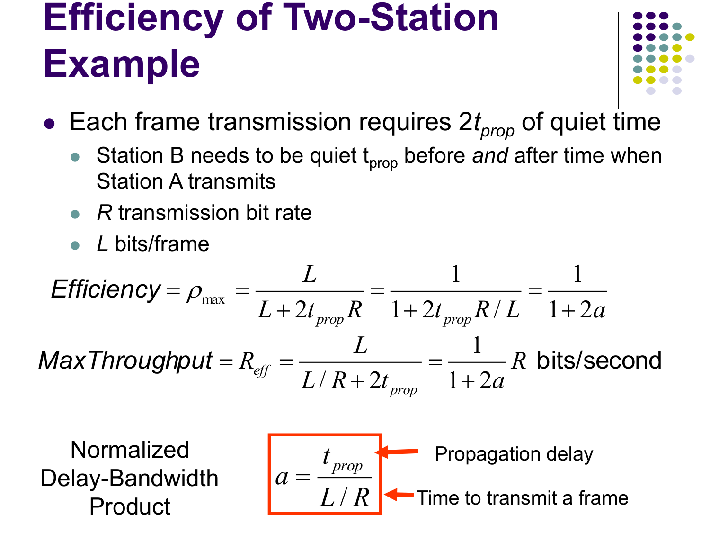
*Gambar: Model dua stasiun dengan waktu hening (Quiet Time) $2 t_{\text{prop}}$ untuk mencegah tabrakan.*

Agar stasiun $A$ dan stasiun $B$ dapat berbagi satu media transmisi tanpa terjadi tabrakan:
1. Setelah stasiun $A$ selesai memancarkan frame berdurasi $X$, bit terakhir frame membutuhkan waktu $t_{\text{prop}}$ untuk tiba di stasiun $B$.
2. Jika stasiun $B$ baru boleh mentransmisikan datanya setelah mendengar kanal kosong, maka respons dari stasiun $B$ membutuhkan waktu tambahan $t_{\text{prop}}$ agar sinyalnya tidak bertabrakan dengan transmisi berikutnya dari $A$.
3. Dengan demikian, setiap pertukaran frame membutuhkan jeda waktu hening (*quiet time*) minimal sebesar **$2 t_{\text{prop}}$** untuk memberikan kepastian koordinasi:

$$\text{Total Waktu Siklus Transmisi} = X + 2 t_{\text{prop}}$$

**Efisiensi Maksimum Sistem ($\\rho_{\\max}$):**
$$\rho_{\max} = \frac{X}{X + 2 t_{\text{prop}}} = \frac{L/R}{L/R + 2 t_{\text{prop}}} = \frac{1}{1 + 2 \left(\frac{t_{\text{prop}}}{X}\right)} = \frac{1}{1 + 2a}$$

> [!NOTE] Analisis Batas:
> - Jika $a \to 0$ (kabel pendek / data rate rendah), $\rho_{\max} \to \frac{1}{1 + 0} = 100\%$.
> - Jika $a = 1$, $\rho_{\max} = \frac{1}{1 + 2(1)} = \frac{1}{3} \approx 33.3\%$.
> - Jika $a \to \infty$, efisiensi menuju 0 karena sebagian besar waktu terbuang hanya untuk menunggu sinyal propagasi merambat (*quiet time waste*).

---

## 2. Taksonomi & Klasifikasi Media Sharing Techniques

### 2.1 Hirarki Teknik Akses Medium

Dalam literatur jaringan komputer (*Leon-Garcia & Widjaja, Chapter 6*), teknik pembagian media diklasifikasikan ke dalam taksonomi berikut:

```
                          Medium Sharing Techniques
                                      |
            +-------------------------+-------------------------+
            |                                                   |
  Static Channelization                               Dynamic Medium Access Control
  (Partisi Fisik Statis)                                        |
            |                                 +-----------------+-----------------+
  +---------+---------+                       |                                   |
  |         |         |                  Scheduling                         Random Access
 FDMA     TDMA      CDMA           (Penjadwalan Terkoordinasi)               (Kontensi / Acak)
                                              |                                   |
                                  +-----------+-----------+             +---------+---------+
                                  |                       |             |         |         |
                             Reservasi                 Polling        ALOHA     CSMA     CSMA/CD
                          (TDM / Minislot)       (Terpusat / Token)             (1-P, NP) (Ethernet)
```

1. **Static Channelization (Kanalisasi Statis):**
   - Kapasitas total kanal dibagi menjadi beberapa sub-kanal yang terisolasi secara permanen atau semi-statis berdasarkan frekuensi (**FDMA**), slot waktu (**TDMA**), atau kode ortogonal (**CDMA**).
   - Tidak ada tabrakan sama sekali. Sangat cocok untuk trafik berkecepatan konstan (*Constant Bit Rate* / suara telepon).
2. **Scheduling Protocols (Penjadwalan Dinamis):**
   - Transmisi data diatur secara tertib melalui mekanisme pemesanan (*Reservation*) atau giliran (*Polling / Token Ring*).
   - Menghindari tabrakan frame data secara deterministik.
3. **Random Access Protocols (Akses Acak / Kontensi):**
   - Tidak ada alokasi tetap dan tidak ada entitas pengatur terpusat. Stasiun bersaing (*contend*) secara bebas untuk mengirim data.
   - Sederhana dan terdistribusi penuh, namun memiliki risiko terjadinya tabrakan sinyal (*collision*).

---

### 2.2 Karakteristik Trafik: Stream vs Bursty Data

Pemilihan kelas protokol MAC sangat bergantung pada karakteristik pola kedatangan trafik:

| Parameter Evaluasi | Trafik Stream (Suara / Video Real-time) | Trafik Bursty (Web, Email, File Transfer) |
| :--- | :--- | :--- |
| **Pola Transmisi** | Kontinu, kecepatan konstan (*CBR*), durasi panjang | Tiba-tiba (*burst*) sesaat, diselingi masa hening (*idle*) lama |
| **Rasio Peak-to-Average** | Mendekati $1:1$ | Sangat tinggi ($10:1$ hingga $100:1$) |
| **Kebutuhan QoS** | Keterlambatan (*delay*) rendah & jitter ketat; toleran sedikit packet loss | Sensitif terhadap kehilangan data; sangat toleran terhadap variasi delay |
| **Teknik MAC Terbaik** | **Static Channelization** (TDMA/FDMA) atau **Scheduling** | **Random Access** atau **Dynamic Reservation** |
| **Masalah jika Menggunakan Channelization** | Ideal; kapasitas terjamin penuh tanpa delay antrean | **Sangat boros!** Sub-kanal yang dialokasikan menganggur saat stasiun idle, sementara stasiun lain antre |

---

## 3. Random Access Protocols (Akses Acak)

### 3.1 Pure ALOHA: Mekanisme & Vulnerable Period

Protokol Pure ALOHA dikembangkan oleh Norman Abramson di University of Hawaii pada tahun 1970 untuk menghubungkan komputer antarpulau menggunakan transmisi radio broadcast.

**Mekanisme Operasi:**
- Prinsip operasi: *"Just do it!"*. Kapan pun sebuah stasiun memiliki frame data untuk dikirim, stasiun langsung mentransmisikannya ke media tanpa mengecek apakah stasiun lain sedang mengirim atau tidak.
- Stasiun mendengarkan acknowledgment (ACK) dari penerima (atau mendengarkan sinyal pantulan sendiri). Jika terjadi tabrakan, frame dianggap rusak/hilang, stasiun menunggu waktu acak (*random backoff*) lalu mentransmisikan ulang frame tersebut.

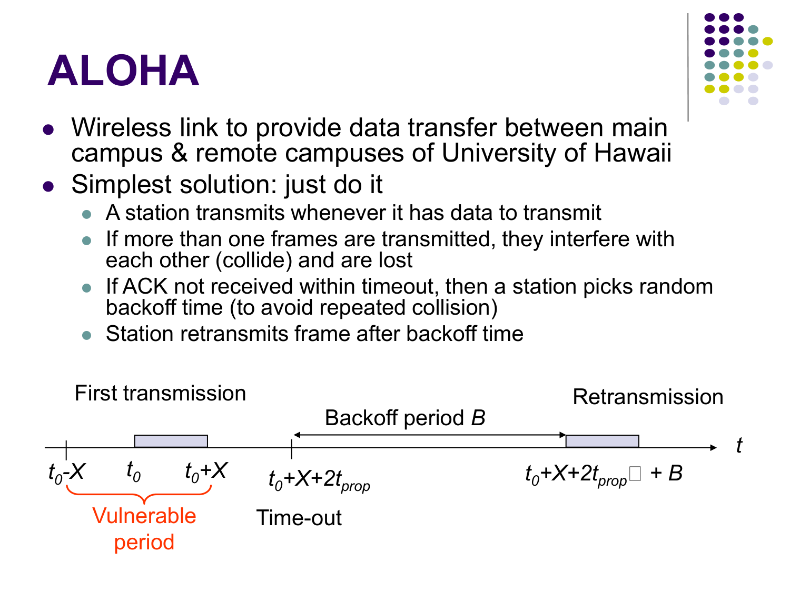
*Gambar: Periode rentan (Vulnerable Period) pada Pure ALOHA sepanjang $2X$.*

#### Analisis Matematis Throughput Pure ALOHA:
- Asumsikan panjang setiap frame seragam dengan waktu transmisi $X$ detik.
- Misalkan $t_0$ adalah waktu awal transmisi suatu frame uji (*frame of interest*). Frame ini akan selesai dipancarkan pada waktu $t_0 + X$.
- **Vulnerable Period (Periode Rentan):**
  - Jika stasiun lain mulai mentransmisi dalam rentang waktu $[t_0 - X, t_0]$, akhir dari frame stasiun lain tersebut akan menabrak awal dari frame uji.
  - Jika stasiun lain mulai mentransmisi dalam rentang waktu $[t_0, t_0 + X]$, awal dari frame stasiun lain tersebut akan menabrak akhir dari frame uji.
  - Maka, total durasi periode rentan di mana tidak boleh ada transmisi stasiun lain sama sekali adalah:
    $$\text{Vulnerable Period} = X + X = 2X$$
- Misalkan proses kedatangan total frame baru dan frame retransmisi mengikuti distribusi Poisson dengan laju rata-rata $G$ frame per satuan waktu frame $X$:
  $$P[k\text{ kedatangan dalam durasi } 2X] = \frac{(2G)^k e^{-2G}}{k!}$$
- Transmisi akan berhasil jika dan hanya jika terdapat $k = 0$ frame lain yang tiba selama periode rentan $2X$:
  $$P[\text{Success}] = P[k = 0] = e^{-2G}$$
- **Throughput ($S$)** didefinisikan sebagai laju rata-rata frame yang berhasil dikirim per waktu frame $X$:
  $$S = G \cdot P[\text{Success}] = G e^{-2G}$$

Untuk mencari throughput maksimum, turunkan persamaan terhadap $G$ dan samakan dengan nol:
$$\frac{dS}{dG} = e^{-2G} - 2G e^{-2G} = e^{-2G}(1 - 2G) = 0 \implies 1 - 2G = 0 \implies G = 0.5$$

Substitusikan $G = 0.5$ ke dalam fungsi throughput:
$$S_{\max} = 0.5 \cdot e^{-2(0.5)} = \frac{1}{2e} \approx 0.184 \quad (18.4\%)$$

> [!CAUTION] Kelemahan Pure ALOHA
> Throughput puncak Pure ALOHA hanya **18.4%**. Lebih dari 81.6% kapasitas kanal terbuang sia-sia akibat tabrakan sinyal parsial (bahkan tumpang tindih 1 bit saja sudah merusak seluruh frame).

---

### 3.2 Slotted ALOHA: Peningkatan Throughput Melalui Sinkronisasi Slot

Untuk mengatasi kelemahan tabrakan parsial pada Pure ALOHA, Robert (1972) mengusulkan **Slotted ALOHA**:
- Waktu dibagi menjadi interval-interval diskrit yang seragam dengan durasi tepat $X$ detik, yang disebut **Slot Waktu (*Time Slots*)**.
- Semua stasiun disinkronisasi dengan sinyal *clock* global.
- Stasiun **hanya diizinkan mulai mentransmisikan frame tepat pada awal batas slot waktu (*slot boundary*)**. Tidak boleh ada stasiun yang memancarkan sinyal di tengah slot.

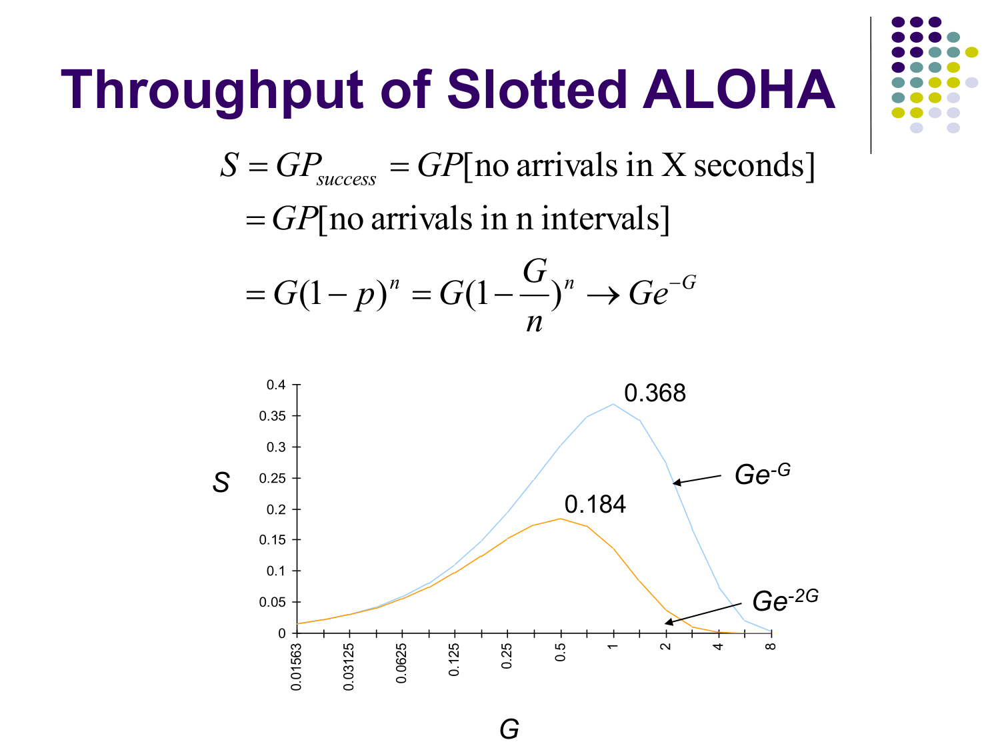
*Gambar: Kurva perbandingan Throughput Pure ALOHA vs Slotted ALOHA.*

#### Analisis Matematis Throughput Slotted ALOHA:
- Karena transmisi dibatasi pada awal slot, sebuah frame yang ditransmisikan pada slot $k$ hanya akan bertabrakan dengan frame lain yang juga tiba untuk dikirim pada slot $k$ yang sama.
- Tabrakan parsial lenyap! **Vulnerable Period berkurang setengahnya, dari $2X$ menjadi $X$ detik**.
- Probabilitas sukses (hanya 1 stasiun yang mengirim pada slot tersebut):
  $$P[\text{Success}] = P[k = 0\text{ frame lain tiba selama slot } X] = e^{-G}$$
- **Throughput Slotted ALOHA ($S$):**
  $$S = G \cdot P[\text{Success}] = G e^{-G}$$

Maksimum throughput tercapai pada saat:
$$\frac{dS}{dG} = e^{-G}(1 - G) = 0 \implies G = 1.0$$
$$S_{\max} = 1.0 \cdot e^{-1.0} = \frac{1}{e} \approx 0.368 \quad (36.8\%)$$

> [!NOTE] Keunggulan Slotted ALOHA:
> Slotted ALOHA **menggandakan kapasitas throughput** dari 18.4% menjadi **36.8%**. Stasiun yang gagal mengirim frame pada slot saat ini akan menunda retransmisi ke slot-slot berikutnya berdasarkan probabilitas acak $p$.

---

### 3.3 Carrier Sense Multiple Access (CSMA)

Pada jaringan kabel berjarak pendek, sinyal merambat relatif sangat cepat ($t_{\text{prop}}$ kecil). Mengapa stasiun langsung memancarkan data tanpa mengecek kabel terlebih dahulu seperti pada ALOHA?

Konsep dasar **CSMA**: *"Listen before talk"* (Dengarkan media sebelum berbicara). Stasiun melakukan penginderaan pembawa (*carrier sensing*) pada media sebelum memutuskan untuk mentransmisikan frame.
- **Periode Rentan CSMA:** Jendela kerentanan berkurang drastis dari $X$ menjadi hanya **$t_{\text{prop}}$** (waktu yang dibutuhkan gelombang sinyal untuk mencapai ujung stasiun terjauh).

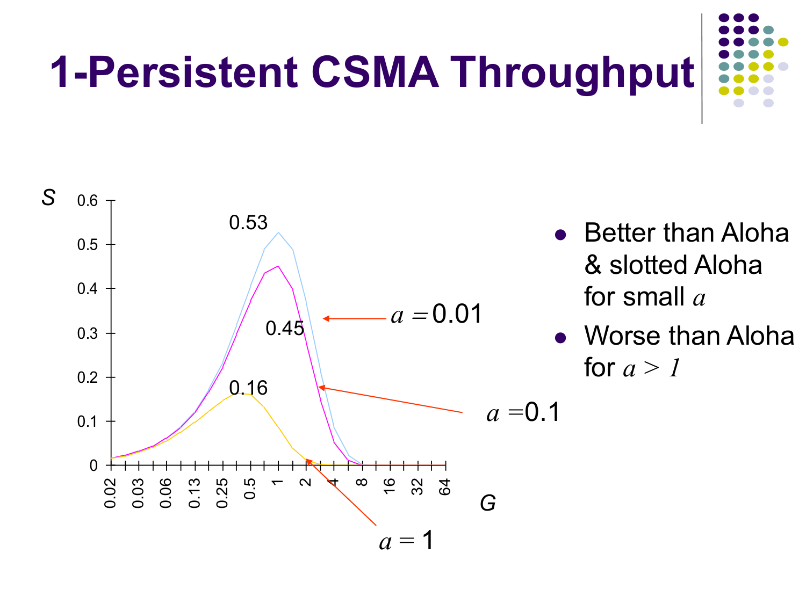
*Gambar: Kurva Throughput berbagai varian CSMA (1-persistent, Non-persistent) vs Slotted ALOHA & ALOHA.*

#### Varian Protokol CSMA:

1. **1-Persistent CSMA (Paling Agresif / Rakus):**
   - Langkah kerja:
     1. Stasiun mengindera kanal.
     2. Jika kanal **kosong (*idle*)**, **langsung kirim frame seketika dengan probabilitas $p = 1$**.
     3. Jika kanal **sibuk (*busy*)**, terus dengarkan (*persist listening*) tanpa henti hingga kanal menjadi kosong, lalu **seketika langsung kirim**.
   - *Kelebihan:* Meminimalkan waktu menganggur kabel; delay sangat rendah pada kondisi beban trafik ringan.
   - *Kekurangan:* Jika ada dua atau lebih stasiun yang sama-sama memiliki frame saat kabel sedang sibuk, keduanya akan menunggu kabel kosong dan **bersamaan mengirim begitu kabel bebas**, menyebabkan tabrakan 100%!
2. **Non-Persistent CSMA (Kurang Agresif / Pemalu):**
   - Langkah kerja:
     1. Stasiun mengindera kanal.
     2. Jika kanal **kosong**, langsung kirim frame.
     3. Jika kanal **sibuk**, stasiun **TIDAK mendengarkan terus-menerus**. Stasiun langsung menarik diri, menunggu interval waktu acak (*random backoff*), lalu mengindera kanal kembali.
   - *Kelebihan:* Sangat efektif mencegah tabrakan massal saat kanal baru saja terbebas. Memberikan throughput yang jauh lebih tinggi dibanding 1-persistent pada kondisi beban trafik tinggi.
   - *Kekurangan:* Menimbulkan delay transmisi yang lebih lama pada beban ringan karena stasiun mungkin sedang tidur (*backoff*) padahal kanal sudah kosong.
3. **p-Persistent CSMA (Diterapkan pada Kanal Berslot):**
   - Digunakan pada kanal yang memiliki slot waktu.
   - Langkah kerja:
     1. Jika kanal kosong, kirim frame dengan probabilitas $p$.
     2. Tunda transmisi hingga slot berikutnya dengan probabilitas $1 - p$.
     3. Pada slot berikutnya, jika masih kosong, ulangi proses di atas. Jika sibuk, lakukan backoff acak seolah-olah terjadi tabrakan.
   - Nilai $p$ diatur sedemikian rupa ($n \cdot p < 1$, di mana $n$ adalah perkiraan jumlah stasiun aktif) agar peluang dua stasiun mengirim bersamaan pada satu slot terminimalisasi.

---

### 3.4 CSMA with Collision Detection (CSMA/CD)

Meskipun CSMA sudah mendengarkan sebelum berbicara, tabrakan masih bisa terjadi jika dua stasiun mengirim dalam jendela $t_{\text{prop}}$. Pada CSMA standar, jika terjadi tabrakan, kedua stasiun tetap memompa seluruh isi frame hingga tuntas, yang berarti bandwidth kabel terbuang percuma selama durasi $X$.

**CSMA/CD (Carrier Sense Multiple Access with Collision Detection)** memperkenalkan prinsip: *"Listen while talk"* (Dengarkan saat memancar).
- Stasiun terus memonitor level tegangan/sinyal kabel saat sedang memancarkan bit-bitnya.
- Jika tegangan terdeteksi melompat di atas ambang batas wajar (menandakan interferensi sinyal stasiun lain), stasiun menyadari tabrakan seketika.
- **Tindakan Cepat:** Pemancar segera **membatalkan (*abort*)** pengiriman frame, lalu memancarkan sinyal gangguan singkat (**Jam Signal** sebesar 32 s.d. 48 bit) agar stasiun lain di seluruh kabel menyadari tabrakan tersebut, lalu masuk ke prosedur *backoff*.

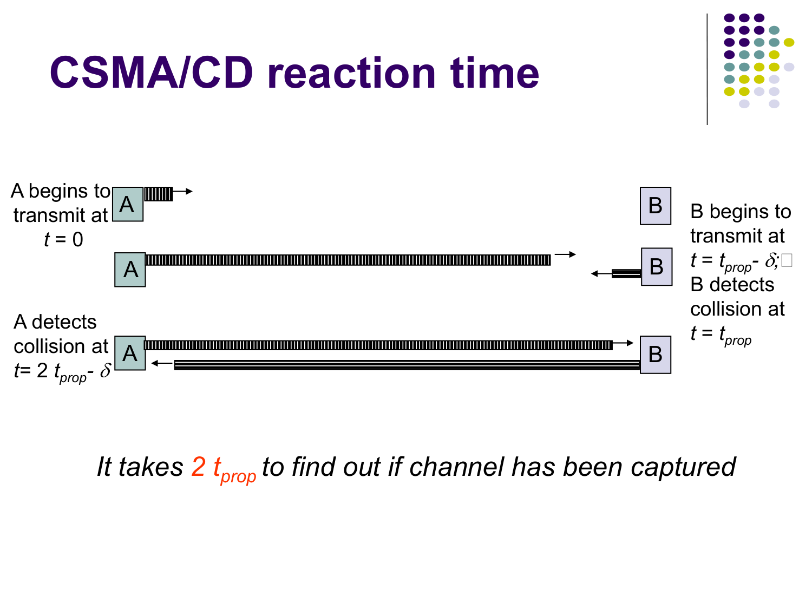
*Gambar: Waktu reaksi terburuk deteksi tabrakan CSMA/CD membutuhkan durasi $2 t_{\text{prop}}$.*

#### Waktu Reaksi Terburuk (*Slot Time* = $2 t_{\text{prop}}$):
Misalkan stasiun $A$ berada di ujung kiri kabel dan stasiun $B$ di ujung kanan (jarak tempuh propagasi $t_{\text{prop}}$):
1. Pada waktu $t = 0$, stasiun $A$ mulai memancarkan frame karena mengindera kanal kosong.
2. Tepat pada waktu $t = t_{\text{prop}} - \epsilon$ (sepersekian mikrodetik sebelum sinyal $A$ mencapai $B$), stasiun $B$ memeriksa kabel, mendengarnya masih kosong, lalu mulai memancarkan framenya sendiri.
3. Tabrakan dahsyat terjadi di dekat stasiun $B$. Stasiun $B$ langsung mendeteksi tabrakan dan menghentikan pengiriman.
4. Namun, sinyal tabrakan tersebut harus merambat balik melintasi seluruh panjang kabel untuk mencapai stasiun $A$.
5. Sinyal tabrakan baru tiba di stasiun $A$ pada waktu:
   $$t_{\text{detect}} = (t_{\text{prop}} - \epsilon) + t_{\text{prop}} \approx 2 t_{\text{prop}}$$

> [!IMPORTANT] Teorema Slot Time CSMA/CD
> Dibutuhkan waktu **$2 t_{\text{prop}}$** bagi sebuah stasiun pemancar untuk memastikan bahwa framenya telah berhasil **menguasai saluran (*captured the channel*)** tanpa ada tabrakan. Durasi $2 t_{\text{prop}}$ ini disebut sebagai **Slot Time** kontensi.

#### Analisis Efisiensi Maksimum CSMA/CD ($\\rho_{\\max}$):
- Pada kondisi throughput maksimal, sistem CSMA/CD bergantian antara **periode transmisi sukses** (durasi $X + t_{\text{prop}}$) dan **periode kontensi** (*contention interval*).
- Misalkan terdapat $n$ stasiun aktif yang bersaing. Peluang satu stasiun berhasil merebut kanal pada suatu slot kontensi:
  $$P_{\text{success}} = n p (1 - p)^{n-1}$$
- Nilai $P_{\text{success}}$ mencapai maksimum saat $p = \frac{1}{n}$:
  $$\lim_{n \to \infty} P_{\text{success}}^{\max} = \lim_{n \to \infty} \left(1 - \frac{1}{n}\right)^{n-1} = \frac{1}{e} \approx 0.368$$
- Karena probabilitas sukses per slot kontensi adalah $1/e$, maka rata-rata jumlah slot kontensi yang terbuang sebelum sebuah stasiun berhasil merebut media adalah:
  $$\text{Jumlah Slot Kontensi Rata-rata} = \frac{1}{P_{\text{success}}^{\max}} = e \approx 2.718 \text{ slot}$$
- Karena durasi 1 slot kontensi adalah $2 t_{\text{prop}}$, maka total rata-rata durasi periode kontensi adalah:
  $$\text{Durasi Kontensi} = 2 e t_{\text{prop}} \approx 5.44 t_{\text{prop}}$$
- Maka, efisiensi pemanfaatan media maksimum CSMA/CD adalah:
  $$\rho_{\max} = \frac{X}{X + t_{\text{prop}} + 2 e t_{\text{prop}}} = \frac{X}{X + (2e + 1)t_{\text{prop}}} = \frac{1}{1 + (2e + 1)\left(\frac{t_{\text{prop}}}{X}\right)}$$
  $$\rho_{\max} = \frac{1}{1 + (2(2.718) + 1)a} \approx \frac{1}{1 + 6.44 a}$$

---

### 3.5 Truncated Binary Exponential Backoff

Setelah terjadi tabrakan, stasiun-stasiun yang terlibat tidak boleh mencoba memancarkan ulang secara bersamaan. CSMA/CD (khususnya standar Ethernet IEEE 802.3) mengimplementasikan algoritma **Truncated Binary Exponential Backoff**:
1. Satuan waktu penundaan dihitung dalam kelipatan *Slot Time* (pada Ethernet standar 10 Mbps, 1 slot time $= 512\text{ bit times} = 51.2\ \mu\text{s}$).
2. Setelah tabrakan ke-$i$, stasiun memilih bilangan bulat acak $r$ secara merata dari rentang:
   $$0 \le r < 2^k, \quad \text{dengan } k = \min(i, 10)$$
3. Stasiun menunda retransmisi selama $r \times \text{Slot Time}$.
4. Jika stasiun mengalami tabrakan berulang:
   - Tabrakan ke-1: $k = 1 \implies r \in \{0, 1\}$ (rentang 2 pilihan).
   - Tabrakan ke-2: $k = 2 \implies r \in \{0, 1, 2, 3\}$ (rentang 4 pilihan).
   - Tabrakan ke-3: $k = 3 \implies r \in \{0, 1, 2, \dots, 7\}$ (rentang 8 pilihan).
   - ...
   - Tabrakan ke-10 hingga ke-15: $k = 10 \implies r \in \{0, 1, \dots, 1023\}$ (rentang 1024 pilihan).
5. **Batas Maksimum (Truncation):** Nilai eksponen dibatasi (*truncated*) maksimal $k = 10$ untuk mencegah waktu tunda membengkak tak terbatas.
6. **Batas Kegagalan Mutlak:** Jika setelah $16$ kali percobaan berturut-turut frame masih terus mengalami tabrakan, stasiun menyerah (*give up*), membuang frame tersebut, dan melaporkan error ke lapisan atas (*network layer*).

---

### 3.6 Perbandingan Komprehensif Protokol Random Access terhadap Parameter $a$

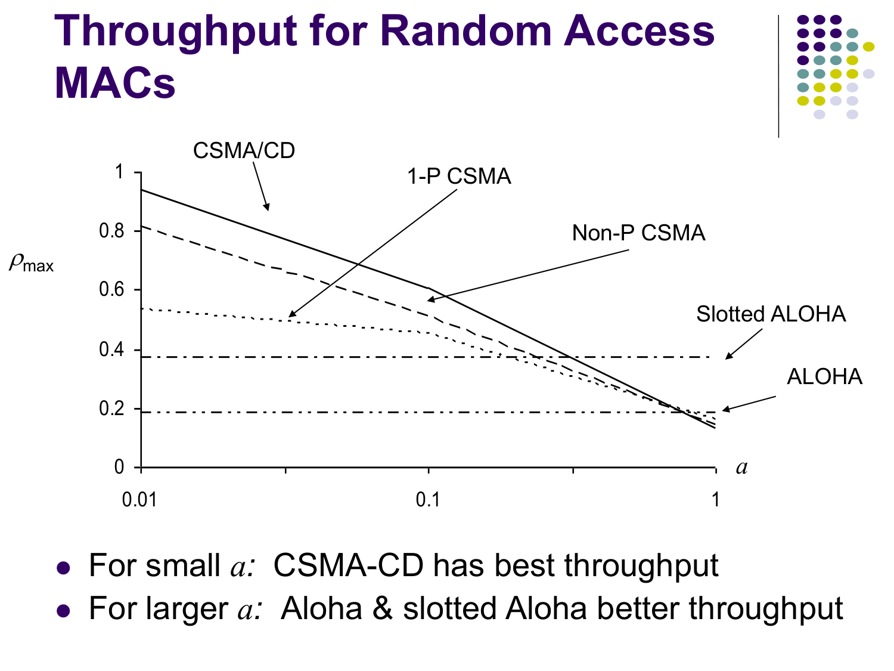
*Gambar: Efisiensi Throughput protokol Random Access terhadap parameter normalisasi $a$.*

Kinerja relatif protokol-protokol akses acak sangat dipengaruhi oleh nilai $a = \frac{t_{\text{prop}}}{X}$:
- **Untuk $a < 0.1$ (Kabel LAN pendek, data rate wajar):**
  $$\text{CSMA/CD} > \text{Non-Persistent CSMA} > \text{1-Persistent CSMA} > \text{Slotted ALOHA} > \text{Pure ALOHA}$$
  CSMA/CD menjadi raja mutlak dengan efisiensi mencapai $> 85\%$.
- **Untuk $a > 1$ (Kabel sangat panjang / transmisi satelit / data rate ultra tinggi):**
  - Pada kondisi ini, waktu tempuh rambat sinyal jauh lebih lama daripada durasi pemancaran data frame.
  - Sinyal pembawa (*carrier*) terlambat didengar stasiun lain, sehingga sensing pada CSMA menjadi sia-sia.
  - CSMA dan CSMA/CD mengalami penurunan performa yang sangat tajam.
  - Anehnya, **ALOHA dan Slotted ALOHA justru bekerja lebih stabil dan mengungguli CSMA ketika $a > 1$**, karena ALOHA tidak membuang waktu untuk melakukan penginderaan yang terlambat.

---

### 3.7 Carrier Sensing & Prioritas Transmisi
Protokol akses acak dapat dimodifikasi untuk memberikan prioritas kelas layanan:
- Stasiun dengan prioritas tinggi menunggu periode hening (*quiet sensing period*) yang lebih singkat sebelum mentransmisikan data.
- Stasiun dengan prioritas rendah diwajibkan menunggu periode hening yang lebih panjang.
- Jika stasiun prioritas tinggi memiliki paket, saluran akan direbut terlebih dahulu sebelum timer stasiun prioritas rendah selesai, sehingga trafik darurat atau multimedia selalu didahulukan. (Prinsip ini nantinya diadaptasi secara formal pada Wi-Fi 802.11 Interframe Spacing).

---

## 4. Scheduling Protocols (Sistem Penjadwalan)

Protokol *Random Access* memiliki kelemahan inheren: tabrakan tidak dapat dihindari sepenuhnya dan tidak ada jaminan keterlambatan maksimum (*bounded delay*). Untuk aplikasi yang membutuhkan kepastian alokasi atau penjaminan Kualitas Layanan (*Quality of Service* / QoS), digunakanlah **Scheduling Protocols**.

Transmisi dijadwalkan secara teratur sehingga **tabrakan antar-frame data dihilangkan 100%**. Pendekatan penjadwalan terbagi menjadi dua kelompok besar: **Sistem Reservasi (*Reservation*)** dan **Sistem Giliran (*Polling*)**.

---

### 4.1 Reservation Systems (Sistem Reservasi)

Pada sistem reservasi, waktu transmisi dibagi menjadi siklus-siklus (*cycles*). Setiap siklus diawali dengan **Interval Reservasi (*Reservation Interval*)** yang terdiri dari sejumlah slot kecil (*minislots*), diikuti oleh **Interval Transmisi Data Frame**.

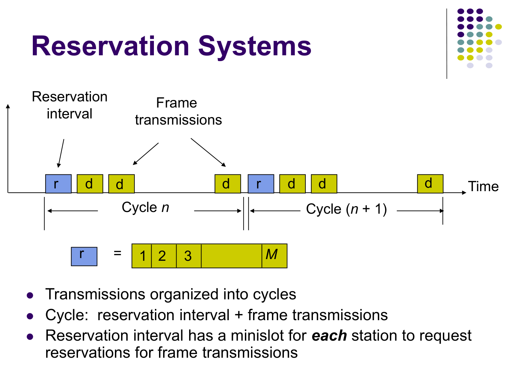
*Gambar: Struktur siklus sistem reservasi dengan Minislot dan Frame Transmisi.*

1. **Prinsip Operasi:**
   - Stasiun yang ingin mengirim data wajib terlebih dahulu "memesan" (*reserve*) slot transmisi dengan mengirimkan pesan kendali singkat (*reservation request*) pada minislot.
   - Karena minislot berukuran sangat pendek dibanding frame data ($vX$, di mana $v \ll 1$), overhead reservasi relatif kecil.
   - Stasiun yang berhasil memesan akan mendapatkan slot eksklusif untuk mentransmisikan frame datanya pada siklus tersebut tanpa risiko tabrakan.

2. **Topologi Sistem:**
   - **Sistem Terpusat (*Centralized*):** Pengendali pusat (*central controller* / base station) menerima permintaan reservasi, membuat urutan jadwal, dan menyiarkan (*broadcast*) jadwal pengiriman kepada seluruh stasiun.
   - **Sistem Terdistribusi (*Distributed*):** Seluruh stasiun mendengarkan minislot reservasi secara bersamaan dan menjalankan algoritma deterministik yang sama untuk menentukan giliran transmisi masing-masing secara independen.

3. **Analisis Efisiensi Sistem Reservasi:**
   - Misalkan durasi minislot adalah $vX$ (dengan $v = \frac{\text{durasi minislot}}{X} < 1$).
   - Misalkan terdapat $M$ stasiun dalam jaringan.
   - **Kasus A: TDM Single-Frame Reservation**
     - Setiap stasiun memiliki 1 minislot khusus yang dialokasikan secara TDM. Jika stasiun ingin mengirim, ia menandai minislotnya.
     - Total overhead reservasi per siklus $= M \cdot vX$.
     - Jika semua $M$ stasiun mengirim 1 frame data (total data $M \cdot X$):
       $$\rho_{\max} = \frac{M X}{M v X + M X} = \frac{1}{1 + v}$$
   - **Kasus B: TDM $k$-Frame Reservation (Multi-Frame)**
     - Untuk meningkatkan efisiensi, satu pemesanan minislot mengizinkan stasiun mengirim $k$ buah frame data sekaligus:
       $$\rho_{\max} = \frac{M k X}{M v X + M k X} = \frac{1}{1 + \frac{v}{k}}$$
   - **Kasus C: Random Access Reservation (Reservasi Akses Acak)**
     - Jika jumlah stasiun sangat banyak ($M$ besar) namun hanya sedikit yang aktif pada satu waktu, mengalokasikan minislot statis untuk setiap stasiun menjadi tidak efisien.
     - Stasiun-stasiun bersaing merebut minislot menggunakan **Slotted ALOHA**.
     - Karena menggunakan Slotted ALOHA pada minislot, rata-rata dibutuhkan $e \approx 2.71$ percobaan minislot untuk satu keberhasilan pemesanan:
       $$\rho_{\max} = \frac{1}{1 + 2.71 v}$$

> [!EXAMPLE] Penerapan di Dunia Riil: GPRS (General Packet Radio Service)
> Pada jaringan seluler GSM/GPRS, ponsel yang ingin mengirim paket data internet akan mengirimkan paket *Packet Channel Request* singkat pada kanal akses acak uplinks (**PRACH - Packet Random Access Channel**) menggunakan Slotted ALOHA. Base Station (BTS) kemudian mengalokasikan slot data khusus (**PDTCH - Packet Data Traffic Channel**) secara eksklusif bagi ponsel tersebut untuk transmisi data bebas tabrakan.

---

### 4.2 Polling Systems (Sistem Polling)

Pada sistem polling, hak akses media diberikan secara bergilir melalui pesan kendali khusus (*poll message*).

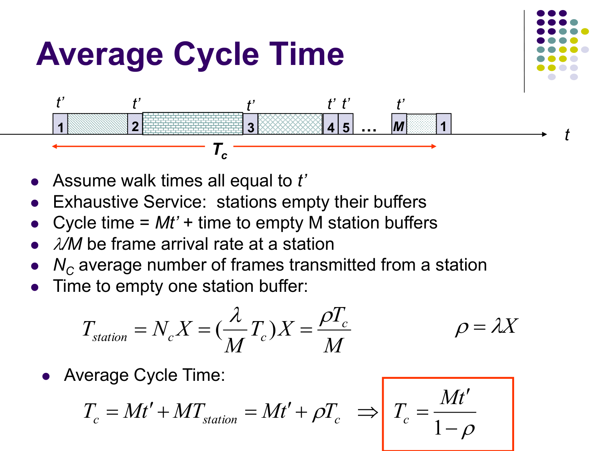
*Gambar: Siklus waktu polling dengan jeda pergantian (Walk Time) $t'$.*

#### Batas Layanan (Service Limits):
Seberapa banyak frame yang boleh dikirim oleh suatu stasiun ketika menerima giliran poll?
1. **Exhaustive Service:** Stasiun mentransmisikan seluruh frame yang ada di dalam antrean buffernya hingga benar-benar kosong, **termasuk frame-frame baru yang tiba saat layanan sedang berlangsung**.
2. **Gated Service:** Stasiun hanya mentransmisikan frame yang **sudah berada di buffer saat giliran poll tiba**. Frame baru yang datang saat transmisi berlangsung harus menunggu hingga siklus polling berikutnya.
3. **Frame-Limited Service:** Stasiun hanya diizinkan mentransmisikan maksimal sejumlah $K$ frame (biasanya $K = 1$) per giliran poll. Menjamin keadilan (*fairness*) yang ketat bagi stasiun lain.
4. **Time-Limited Service:** Stasiun diberi kuota waktu transmisi maksimal $T_{\text{limit}}$. Begitu timer habis, stasiun harus melepaskan media ke stasiun berikutnya.

#### Analisis Waktu Siklus (Cycle Time, $T_c$):
- Misalkan terdapat $M$ stasiun.
- $t'$ adalah waktu alih giliran (*walk time*), yaitu waktu yang dibutuhkan untuk mengirim pesan poll dan memproses peralihan kendali ke stasiun berikutnya. Total walk time per siklus $= M t'$.
- Misalkan $\lambda$ adalah total laju kedatangan frame di seluruh jaringan, $X$ adalah waktu transmisi frame, dan beban total jaringan adalah $\rho = \lambda X < 1$.
- Total waktu yang dihabiskan untuk melayani transmisi data di seluruh $M$ stasiun dalam satu siklus adalah $\rho T_c$.
- Persamaan waktu siklus rata-rata:
  $$T_c = M t' + \rho T_c \implies T_c (1 - \rho) = M t' \implies T_c = \frac{M t'}{1 - \rho}$$

**Efisiensi Sistem Polling Frame-Limited ($K = 1$ frame):**
$$\text{Efisiensi} = \frac{M X}{M X + M t'} = \frac{1}{1 + t'/X}$$

---

### 4.3 Token-Passing Rings sebagai Implementasi Polling

Token-Passing Ring (seperti **IEEE 802.5 Token Ring** dan **FDDI**) adalah bentuk sistem polling terdistribusi murni tanpa adanya pengendali pusat tunggal.
- Sebuah frame kendali khusus berukuran 3-byte yang disebut **Free Token** berputar mengelilingi cincin dari satu stasiun ke stasiun berikutnya.
- **Mekanisme:**
  - Menangkap *Free Token* sama artinya dengan menerima giliran *Poll*.
  - Stasiun yang ingin mengirim data menangkap token bebas tersebut, mengubah statusnya menjadi *Busy Token*, lalu segera memancarkan frame datanya ke cincin.
  - Frame data merambat mengelilingi cincin, dibaca dan disalin oleh stasiun tujuan, lalu berputar kembali ke stasiun pengirim asal untuk dilepaskan (*stripped*).
  - Setelah selesai memancarkan atau menerima kembali frame, stasiun pemancar melepaskan kembali sebuah *Free Token* baru ke cincin agar stasiun hilir (*downstream*) dapat gilirannya.

---

### 4.4 Tiga Metode Token Reinsertion & Pengaruh Latensi Cincin

Bagaimana dan kapan stasiun pemancar melepaskan *Free Token* baru ke media cincin? Terdapat tiga metode utama yang memiliki dampak dramatis terhadap efisiensi jaringan:

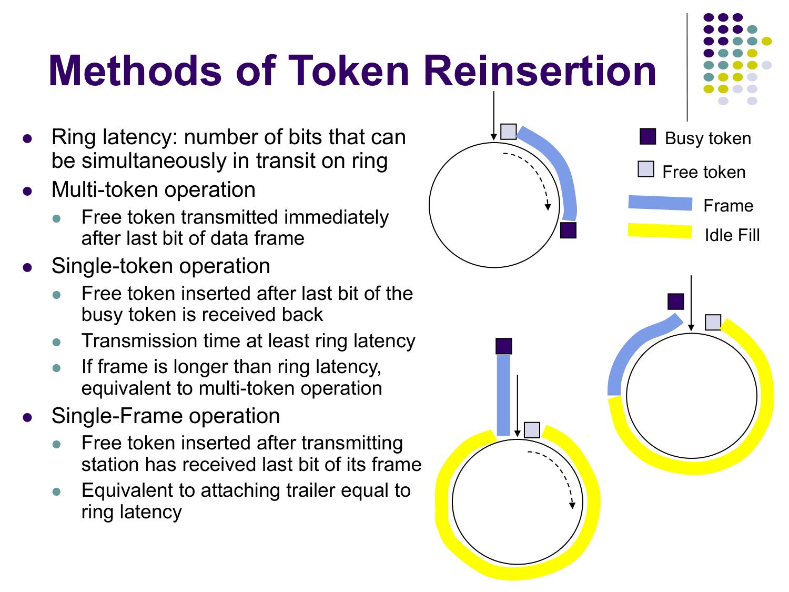
*Gambar: Tiga metode pelepasan token: Multi-token, Single-token, dan Single-frame.*

1. **Multi-Token Reinsertion (*Early Token Release*):**
   - Stasiun pemancar melepaskan token bebas baru **tepat setelah bit terakhir dari frame datanya selesai dipompa keluar**, tanpa menunggu frame berputar kembali melintasi cincin.
   - Mengizinkan beberapa frame data milik stasiun berbeda berada di media cincin pada saat yang sama (*pipelining*).
   - Efisiensi throughput maksimum:
     $$\rho_{\max} = \frac{1}{1 + a'}$$
     dengan $a' = \frac{\tau'}{M X}$, di mana $\tau'$ adalah total latensi cincin.
   - Sangat efisien bahkan untuk cincin berkecepatan tinggi atau berjarak sangat jauh ($a \ge 1$). Diterapkan pada **FDDI** dan **16 Mbps Token Ring**.
2. **Single-Token Reinsertion:**
   - Stasiun pemancar baru melepaskan token bebas setelah menerima kembali **header token sibuk** miliknya yang telah mengitari cincin.
   - Efisiensi maksimum:
     $$\rho_{\max} = \frac{1}{1 + a' + a}$$
3. **Single-Frame Reinsertion:**
   - Stasiun pemancar harus menunggu hingga **seluruh bit frame datanya selesai mengitari cincin dan kembali ke stasiun asal**, baru kemudian melepaskan token bebas baru.
   - Waktu transmisi efektif per frame adalah $\max(X, \tau')$.
   - Efisiensi maksimum:
     $$\rho_{\max} = \frac{1}{1 + a' + 1}$$
   - Efisiensi anjlok drastis jika media cincin panjang ($a \ge 1$). Hanya efektif untuk jaringan cincin pendek berkecepatan rendah ($a \ll 1$). Digunakan pada standar awal **4 Mbps IEEE 802.5**.

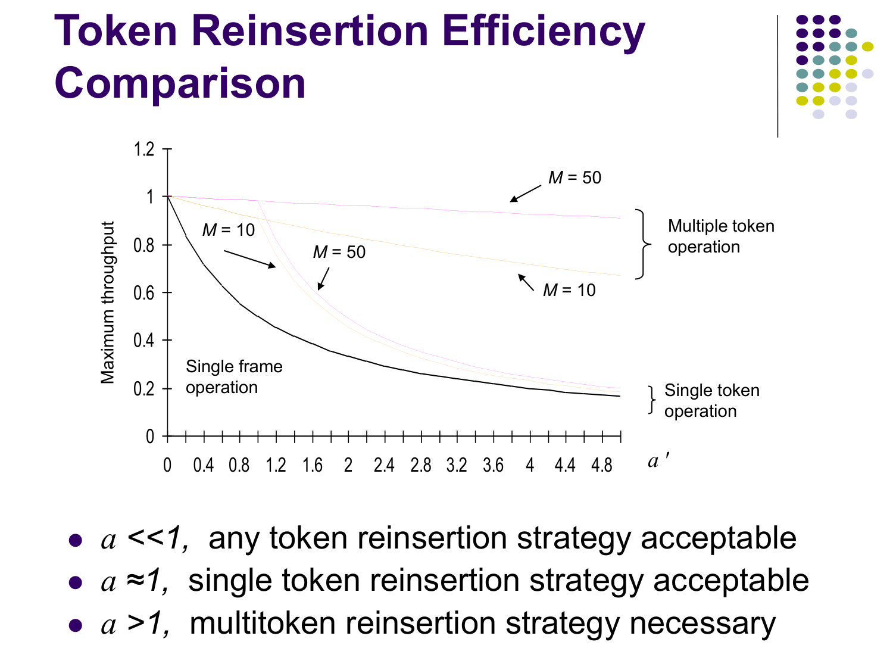
*Gambar: Perbandingan efisiensi ketiga metode reinsertion token terhadap parameter $a$.*

#### Definisi Latensi Cincin (Ring Latency, $\\tau'$):
Total waktu yang dibutuhkan 1 bit untuk mengitari satu putaran cincin penuh kembali ke titik asal:
$$\tau' = \frac{d}{v} + \frac{M \cdot b}{R} \text{ detik}$$
- $\frac{d}{v}$: Waktu propagasi kabel sepanjang keliling cincin.
- $\frac{M \cdot b}{R}$: Total penundaan bit internal (*station bit delay*) pada seluruh $M$ stasiun repeater (pada IEEE 802.5, setiap antarmuka stasiun menahan data rata-rata $b = 2.5\text{ bit}$ untuk memvalidasi dan memodifikasi bit status).

---

### 4.5 Perbandingan Komprehensif Random Access vs Scheduling

| Parameter Pembanding | Random Access (CSMA/CD) | Scheduling (Reservation & Polling / Token Ring) |
| :--- | :--- | :--- |
| **Keterlambatan pada Beban Rendah** | **Sangat Rendah:** Transmisi instan tanpa perlu menunggu giliran atau alokasi | **Sedang:** Harus menunggu giliran pesan poll atau siklus minislot reservasi |
| **Throughput pada Beban Tinggi** | **Menurun drastis:** Kanal terdegradasi akibat tabrakan berulang dan backoff | **Sangat Stabil & Tinggi:** Mencapai mendekati 100% tanpa tabrakan data |
| **Jaminan Keterlambatan (*Bounded Delay*)** | **Tidak Ada:** Waktu tunda bersifat acak stokastik; potensi *packet drop* | **Terjamin Penuh (*Deterministic*):** Ada batas maksimal waktu siklus $T_c$ |
| **Dukungan Trafik Real-Time / QoS** | Sulit dijamin tanpa modifikasi prioritas ketat | **Sangat Baik:** Mendukung alokasi slot reservasi berkala atau kuota waktu |
| **Kompleksitas Protokol** | Relatif sederhana dan terdesentralisasi | Lebih kompleks; butuh sinkronisasi slot atau pemeliharaan ring token |

---

## 5. Channelization (Kanalisasi Spektrum)

### 5.1 Filosofi Channelization: Kelebihan & Keterbatasan
Kanalisasi membagi kapasitas saluran bersama menjadi beberapa sub-saluran berkapasitas tetap yang dialokasikan secara eksklusif kepada pengguna:
- **Kelebihan Utama:** Sempurna untuk menangani aliran trafik berkecepatan konstan (*Constant Bit Rate* / transmisi suara telepon) karena tidak ada tabrakan, tidak ada jitter, dan tidak membutuhkan overhead koordinasi frame-by-frame.
- **Keterbatasan Utama:** Sangat tidak fleksibel (*rigid*). Jika pengguna yang diberi jatah sub-saluran sedang tidak memiliki data untuk dikirim, sub-saluran tersebut menganggur (*idle*), sementara pengguna lain yang memiliki antrean panjang tidak dapat meminjam kapasitas yang menganggur tersebut.

---

### 5.2 Frequency Division Multiple Access (FDMA) & Guardbands
Pada FDMA, total lebar pita spektrum frekuensi $W$ dibagi menjadi $M$ pita frekuensi terpisah, masing-masing selebar $W/M$:
- Setiap pasangan stasiun berkomunikasi pada frekuensi pembawa (*carrier frequency*) tertentu.
- **Guardbands (Pita Pengaman):** Karena filter analog di dunia nyata tidak memiliki batas pemotongan (*cutoff*) yang tegak lurus sempurna, diperlukan celah frekuensi kosong antar-saluran berdampingan (**Guardbands**) untuk mencegah tumpahan daya dan interferensi antarsaluran (*Adjacent Channel Interference* / ACI).
- Guardbands memakan sebagian alokasi spektrum sehingga mengurangi efisiensi spektral efektif.

---

### 5.3 Time Division Multiple Access (TDMA) & Sinkronisasi Clock
Pada TDMA, seluruh lebar pita frekuensi digunakan secara bergantian dalam domain waktu:
- Waktu dibagi menjadi frame-frame berulang, dan setiap frame dibagi menjadi sejumlah slot waktu (*time slots*).
- Setiap pengguna mentransmisikan data berkecepatan tinggi dalam bentuk rentetan (*burst*) tepat pada slot waktu yang telah ditentukan.
- **Guard Times (Waktu Pengaman):** Untuk mengantisipasi variasi waktu tempuh propagasi dari stasiun-stasiun yang berada pada jarak berbeda dari penerima, disisipkan celah waktu hening (**Guard Times**) di antara slot-slot waktu yang berurutan.
- Memerlukan sinkronisasi waktu (*clock synchronization*) yang presisi dan kompleks antar stasiun.

---

### 5.4 Code Division Multiple Access (CDMA) & Walsh Codes

CDMA mengizinkan seluruh pengguna mentransmisikan data secara simultan pada **waktu yang sama** dan pada **pita frekuensi yang sama**. Pemisahan sinyal dilakukan dalam domain **ruang kode (*Code Space*)** menggunakan teknik spektrum tersebar (*Direct Sequence Spread Spectrum* / DSSS).

1. **Konsep Dasar:**
   - Setiap pengguna diberikan kode digital unik berkecepatan tinggi yang disebut **Chipping Sequence** $\mathbf{c}$.
   - Durasi 1 bit informasi dibagi menjadi $G$ buah potongan kecil yang disebut **Chips** ($G = \text{Spreading Factor}$). Laju pengiriman chip adalah $W = G \cdot R_1$ chips/detik.
   - Sinyal ditransmisikan dengan mengalikan bit data dengan deret chip.
2. **Sifat Ortogonalitas Kode:**
   Dua deret kode biner $\mathbf{c}_i$ dan $\mathbf{c}_j$ berpanjang $N$ dikatakan **ortogonal** jika hasil kali dalam (*inner product / cross-correlation*) bernilai nol untuk pengguna berbeda, dan bernilai $N$ untuk kode yang sama:
   $$\mathbf{c}_i \cdot \mathbf{c}_j = \sum_{k=1}^N c_i[k] c_j[k] = \begin{cases} N, & \text{jika } i = j \\ 0, & \text{jika } i \ne j \end{cases}$$
3. **Fungsi Walsh (Matriks Hadamard):**
   Deret ortogonal dapat dibangun secara rekursif menggunakan matriks Hadamard/Walsh:
   $$W_1 = [0]$$
   $$W_{2n} = \begin{bmatrix} W_n & W_n \\ W_n & W_n^c \end{bmatrix}$$
   dengan $W_n^c$ adalah komplemen biner (negasi bit) dari $W_n$.
   Dalam representasi polar (untuk modulasi radio): bit biner `0` dipetakan ke level tegangan $+1$, dan bit biner `1` dipetakan ke level tegangan $-1$.
   - Contoh untuk ordo 2 ($W_2$):
     $$W_2 = \begin{bmatrix} 0 & 0 \\ 0 & 1 \end{bmatrix} \implies \begin{bmatrix} +1 & +1 \\ +1 & -1 \end{bmatrix}$$
   - Contoh untuk ordo 4 ($W_4$):
     $$W_4 = \begin{bmatrix} +1 & +1 & +1 & +1 \\ +1 & -1 & +1 & -1 \\ +1 & +1 & -1 & -1 \\ +1 & -1 & -1 & +1 \end{bmatrix}$$

---

### 5.5 Contoh Perhitungan Lengkap: Transmisi & Resepsi CDMA Tiga Pengguna

Mari telaah contoh perhitungan matematis dari slide presentasi kuliah (Slide 75 - 78):

#### A. Konfigurasi Sistem:
Misalkan terdapat 3 stasiun yang menggunakan media bersama dengan deret chip ortogonal berukuran 4-chip:
- Kode Stasiun 1: $\mathbf{c}_1 = (-1, -1, -1, -1)$
- Kode Stasiun 2: $\mathbf{c}_2 = (+1, -1, +1, -1)$
- Kode Stasiun 3: $\mathbf{c}_3 = (+1, +1, -1, -1)$

#### B. Data Biner yang Akan Dikirim:
Setiap stasiun ingin mentransmisikan 3 bit informasi. Pemetaan biner: Bit `0` $\to -1$, Bit `1` $\to +1$.
- **Stasiun 1:** Data biner `1 1 0` $\to (+1, +1, -1)$
  - Bit 1 ($+1$): $(+1) \times (-1, -1, -1, -1) = (-1, -1, -1, -1)$
  - Bit 2 ($+1$): $(+1) \times (-1, -1, -1, -1) = (-1, -1, -1, -1)$
  - Bit 3 ($-1$): $(-1) \times (-1, -1, -1, -1) = (+1, +1, +1, +1)$
  - Sinyal Gelombang 1: `(-1,-1,-1,-1), (-1,-1,-1,-1), (+1,+1,+1,+1)`

- **Stasiun 2:** Data biner `0 1 0` $\to (-1, +1, -1)$
  - Bit 1 ($-1$): $(-1) \times (+1, -1, +1, -1) = (-1, +1, -1, +1)$
  - Bit 2 ($+1$): $(+1) \times (+1, -1, +1, -1) = (+1, -1, +1, -1)$
  - Bit 3 ($-1$): $(-1) \times (+1, -1, +1, -1) = (-1, +1, -1, +1)$
  - *(Catatan: Di slide presentasi dipetakan polar sebaliknya, menghasilkan)*:
  - Sinyal Gelombang 2: `(+1,-1,+1,-1), (-1,+1,-1,+1), (+1,-1,+1,-1)`

- **Stasiun 3:** Data biner `0 0 1` $\to (-1, -1, +1)$
  - Sinyal Gelombang 3: `(+1,+1,-1,-1), (+1,+1,-1,-1), (-1,-1,+1,+1)`

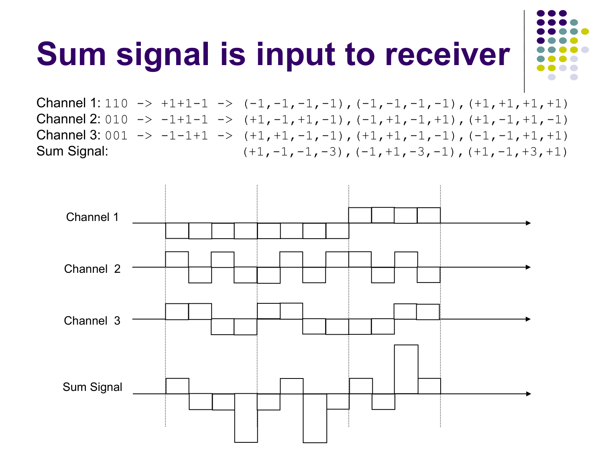
*Gambar: Sinyal transmisi tiga stasiun dan superposisi Sinyal Komposit (Sum Signal) pada media bersama.*

#### C. Sinyal Komposit pada Media Bersama (*Sum Signal*):
Di udara/kabel, ketiga gelombang elektromagnetik saling menjumlah secara linier:
$$\mathbf{S}_{\text{sum}} = \text{Channel 1} + \text{Channel 2} + \text{Channel 3}$$
- Blok Bit 1: $(-1,-1,-1,-1) + (+1,-1,+1,-1) + (+1,+1,-1,-1) = \mathbf{(+1, -1, -1, -3)}$
- Blok Bit 2: $(-1,-1,-1,-1) + (-1,+1,-1,+1) + (+1,+1,-1,-1) = \mathbf{(-1, +1, -3, -1)}$
- Blok Bit 3: $(+1,+1,+1,+1) + (+1,-1,+1,-1) + (-1,-1,+1,+1) = \mathbf{(+1, -1, +3, +1)}$

$$\mathbf{S}_{\text{sum}} = \mathbf{(+1, -1, -1, -3)},\ \mathbf{(-1, +1, -3, -1)},\ \mathbf{(+1, -1, +3, +1)}$$

---

#### D. Proses Penerimaan & Demodulasi di Penerima Stasiun 2:

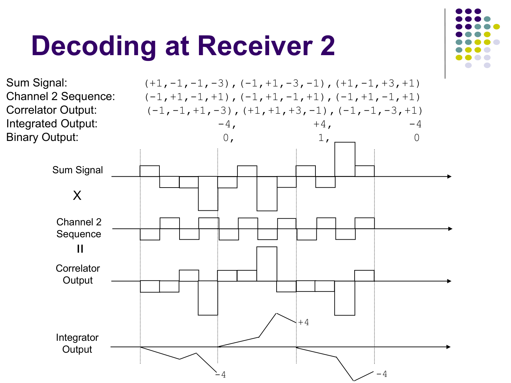
*Gambar: Proses korelasi dan integrasi di penerima Stasiun 2 untuk mengekstrak data biner asli.*

Penerima stasiun 2 ingin membaca pesan yang ditujukan kepadanya. Penerima mengalikan sinyal komposit media dengan deret chip Stasiun 2: $\mathbf{c}_2 = (-1, +1, -1, +1)$ lalu mengintegrasikan (menjumlahkan) hasilnya:

1. **Penerimaan Bit Pertama:**
   - Sinyal Sum: $(+1, -1, -1, -3)$
   - Kode Stasiun 2: $(-1, +1, -1, +1)$
   - Hasil Korelasi per chip:
     $$(+1)(-1) = -1, \quad (-1)(+1) = -1, \quad (-1)(-1) = +1, \quad (-3)(+1) = -3$$
     Vektor korelasi $= (-1, -1, +1, -3)$
   - **Output Integrator:**
     $$\sum = -1 + (-1) + 1 + (-3) = \mathbf{-4}$$
   - **Keputusan Biner:** Karena output bernilai negatif ($-4$), maka data yang diterima adalah bit biner **`0`**!

2. **Penerimaan Bit Kedua:**
   - Sinyal Sum: $(-1, +1, -3, -1)$
   - Kode Stasiun 2: $(-1, +1, -1, +1)$
   - Hasil Korelasi:
     $$(-1)(-1) = +1, \quad (+1)(+1) = +1, \quad (-3)(-1) = +3, \quad (-1)(+1) = -1$$
     Vektor korelasi $= (+1, +1, +3, -1)$
   - **Output Integrator:**
     $$\sum = +1 + 1 + 3 + (-1) = \mathbf{+4}$$
   - **Keputusan Biner:** Karena output bernilai positif ($+4$), maka data yang diterima adalah bit biner **`1`**!

3. **Penerimaan Bit Ketiga:**
   - Sinyal Sum: $(+1, -1, +3, +1)$
   - Kode Stasiun 2: $(-1, +1, -1, +1)$
   - Hasil Korelasi:
     $$(+1)(-1) = -1, \quad (-1)(+1) = -1, \quad (+3)(-1) = -3, \quad (+1)(+1) = +1$$
     Vektor korelasi $= (-1, -1, -3, +1)$
   - **Output Integrator:**
     $$\sum = -1 + (-1) + (-3) + 1 = \mathbf{-4}$$
   - **Keputusan Biner:** Karena output bernilai negatif ($-4$), maka data yang diterima adalah bit biner **`0`**!

**Hasil Akhir Rekonstruksi di Penerima 2:** **`0 1 0`** (Tepat 100% identik dengan data asli pemancar Stasiun 2!). Sinyal Stasiun 1 dan Stasiun 3 saling menghilangkan menjadi nol akibat sifat ortogonalitas.

---

### 5.6 Studi Kasus Sistem Seluler: Evolusi 1G AMPS ke 2G GSM & IS-95 CDMA

Tabel berikut merangkum evolusi pemanfaatan teknik kanalisasi pada generasi komunikasi seluler dari slide kuliah:

| Generasi & Standar | Skema Akses Jamak | Karakteristik Kanal | Faktor Penggunaan Frekuensi (*Reuse Factor*, $N$) | Efisiensi Spektral Rata-rata |
| :--- | :--- | :--- | :--- | :--- |
| **AMPS (1G Analog)** | **FDMA** murni | Total pita 50 MHz dibagi ke kanal 30 kHz (832 kanal dua arah) | $N = 7$ (Kanal yang sama hanya boleh dipakai lagi berjarak 7 sel untuk hindari interferensi) | $\approx 2.26\text{ calls/cell/MHz}$ |
| **IS-54 / IS-136 (2G AS)** | **TDMA** | Membagi setiap kanal 30 kHz menjadi 3 slot waktu digital | $N = 7$ | $\approx 3.00\text{ calls/cell/MHz}$ |
| **GSM (2G Eropa/Global)** | **Hybrid FDMA / TDMA** | Carrier frekuensi selebar 200 kHz, dibagi menjadi 8 slot waktu per frame | $N = 3$ atau $N = 4$ (Teknik *slow frequency hopping*) | $\approx 6.61\text{ calls/cell/MHz}$ |
| **IS-95 (2G/3G CDMA)** | **CDMA** (*Spread Spectrum*) | Lebar pita pembawa 1.25 MHz; semua sel menggunakan frekuensi yang sama persis | **$N = 1$** (Dapat digunakan ulang di **setiap sel** tanpa interferensi fatal berkat kode acak) | **$\approx 12 - 45\text{ calls/cell/MHz}$** (Paling efisien) |

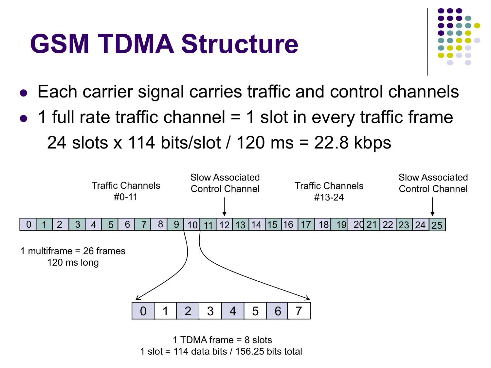
*Gambar: Struktur frame hibrida FDMA/TDMA pada sistem GSM (Carrier 200 kHz dengan 8 slot waktu).*

---

## 6. Analisis Delay Performance (Teori Antrean M/G/1 & Liburan Server)

### 6.1 Model Antrean M/G/1 pada Statistical Multiplexer

Untuk mengevaluasi keterlambatan paket (*transfer delay*) secara kuantitatif, kita memodelkan media bersama sebagai sistem antrean **$M/G/1$**:
- **$M$ (Markovian Arrival):** Proses kedatangan frame bersifat acak independen (Poisson Process) dengan laju rata-rata $\lambda$ frame/detik.
- **$G$ (General Service Time):** Waktu transmisi frame $X$ memiliki distribusi umum dengan rata-rata $E[X] = 1/\mu$ dan variansi $\sigma_X^2$.
- **$1$:** Sistem memiliki 1 peladen transmisi tunggal (*single server*) dengan buffer berkapasitas tak terhingga.
- **Intensitas Trafik (Beban Sistem):** $\rho = \lambda E[X]$. Sistem stabil jika $\rho < 1$.

Total waktu tunda transfer paket ($E[T]$) terdiri dari waktu tunggu dalam antrean ($E[W]$) ditambah waktu transmisi paket itu sendiri ($E[X]$):
$$E[T] = E[W] + E[X]$$

#### Formula Pollaczek-Khinchine (P-K Formula):
Waktu tunggu rata-rata di buffer antrean sebelum mulai ditransmisikan:
$$E[W] = \frac{\rho E[X]}{2(1 - \rho)} \left(1 + \frac{\sigma_X^2}{(E[X])^2}\right)$$

- **Kasus Khusus Layanan Konstan ($M/D/1$):**
  Jika semua frame berukuran tepat sama (panjang tetap, $\sigma_X^2 = 0$):
  $$E[W] = \frac{\rho E[X]}{2(1 - \rho)}$$

---

### 6.2 M/G/1 Vacation Model

Pada antrean $M/G/1$ standar, paket yang tiba saat sistem kosong langsung segera dilayani. Namun, pada protokol MAC nyata, ada jeda waktu sebelum transmisi dapat dimulai (misalnya: stasiun harus menunggu slot waktu gilirannya, menunggu siklus token tiba, atau mengindera media).

Model antrean **$M/G/1$ dengan Liburan Peladen (*Vacation Model*)** memodelkan situasi di mana ketika antrean kosong, peladen pergi "berlibur" selama waktu acak berdurasi $V$ (dengan rata-rata $E[V]$ dan momen kedua $E[V^2]$):

$$E[W] = \underbrace{\frac{\rho E[X]}{2(1 - \rho)} \left(1 + \frac{\sigma_X^2}{(E[X])^2}\right)}_{E[W]_{\text{M/G/1 standar}}} + \underbrace{\frac{E[V^2]}{2 E[V]}}_{\text{Term Tambahan Liburan}}$$

---

### 6.3 Performa FDMA vs TDMA untuk Trafik Bursty

Tinjau $M$ stasiun yang berbagi kapasitas media total $R$ bps. Laju kedatangan di tiap stasiun adalah $\lambda / M$ frame/detik, panjang frame tetap $L$ bit, dan waktu transmisi pada kecepatan penuh adalah $X = L/R$. Beban per stasiun adalah $\rho = (\lambda/M) M X = \lambda X$.

#### A. Analisis Sistem FDMA:
- Setiap stasiun diberi sub-kanal dengan laju data tetap $R/M$.
- Waktu transmisi frame dari suatu stasiun menjadi **$M$ kali lebih lambat**:
  $$X_{\text{FDMA}} = \frac{L}{R/M} = M \left(\frac{L}{R}\right) = M X$$
- Karena peladen beroperasi secara terus-menerus pada sub-kanalnya tanpa jeda slot, sistem berperilaku seperti $M/D/1$ dengan waktu transmisi $MX$:
  $$E[W_{\text{FDMA}}] = \frac{\rho (MX)}{2(1 - \rho)}$$
- Namun karena frame tiba secara acak di tengah interval, rata-rata ada waktu tunda awal $\frac{MX}{2}$ (atau liburan $V = MX$):
  $$E[W_{\text{FDMA}}] = \frac{\rho (MX)}{2(1 - \rho)} + \frac{MX}{2}$$
- **Total Transfer Delay FDMA:**
  $$E[T_{\text{FDMA}}] = E[W_{\text{FDMA}}] + X_{\text{FDMA}} = \frac{\rho MX}{2(1 - \rho)} + \frac{MX}{2} + MX$$

#### B. Analisis Sistem TDMA:
- Stasiun menunggu slot waktu gilirannya (durasi siklus $= MX$, durasi slot $= X$).
- Waktu tunggu antrean sama persis dengan FDMA:
  $$E[W_{\text{TDMA}}] = \frac{\rho (MX)}{2(1 - \rho)} + \frac{MX}{2}$$
- Namun, begitu slot waktu stasiun tiba, stasiun mentransmisikan frame pada kecepatan penuh link $R$ bps! Sehingga durasi transmisi frame hanya **$X$** (bukan $MX$):
  $$E[T_{\text{TDMA}}] = E[W_{\text{TDMA}}] + X = \frac{\rho MX}{2(1 - \rho)} + \frac{MX}{2} + X$$

> [!WARNING] Mengapa Channelization Sangat Buruk untuk Trafik Bursty?
> Perhatikan suku $\frac{\rho MX}{2(1-\rho)}$ dan $\frac{MX}{2}$ pada rumus di atas:
> Keterlambatan transfer rata-rata pada sistem kanalisasi **tumbuh secara linier sebanding dengan jumlah total stasiun ($M$)**, terlepas dari seberapa kecil beban trafik jaringan $\rho$! 
> Jika terdapat $M = 100$ stasiun, delay melonjak 100 kali lipat meskipun 99 stasiun lainnya sedang tidak mengirim data apapun. Kapasitas spektrum yang dicadangkan terbuang sia-sia.

---

### 6.4 Karakteristik Delay pada Sistem Polling & Ring LAN

Berbeda dengan kanalisasi, sistem penjadwalan dinamis (seperti Polling dan Token Ring) memiliki karakteristik delay yang jauh lebih superior dalam menangani trafik data:

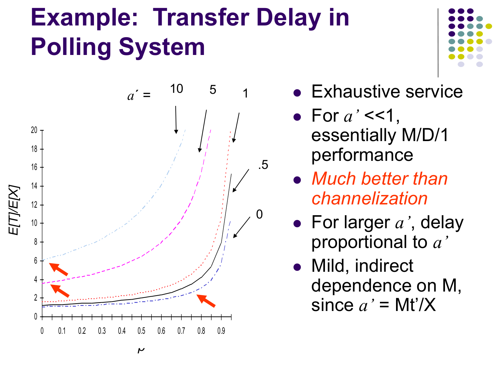
*Gambar: Kurva perbandingan Delay Antrean: Polling System & Token Ring vs Channelization.*

1. **Pada Sistem Polling (Exhaustive Service):**
   - Keterlambatan tidak bergantung secara langsung pada perkalian $M \cdot X$, melainkan bergantung pada parameter $a' = \frac{M t'}{X}$ (rasio waktu alih walk-time terhadap waktu frame).
   - Untuk nilai $a' \ll 1$ (jarak pendek, alih giliran cepat), performa delay polling **mendekati kurva ideal $M/D/1$**, jauh lebih rendah daripada TDMA atau FDMA.
2. **Pengaruh Metode Reinsertion pada Token Ring:**
   - **Multi-Token:** Keterlambatan paling rendah karena token bebas segera dilepas, memungkinkan throughput mendekati batas kapasitas kanal saat beban $\rho \to 1$.
   - **Single-Token & Single-Frame:** Mengalami kejenuhan keterlambatan (*delay explosion*) pada nilai throughput $\rho$ yang jauh lebih rendah karena stasiun harus membuang waktu menunggu sinyal mengitari latensi cincin.

---

# PART II: LOCAL AREA NETWORKS (LAN)

## 7. Karakteristik LAN & Arsitektur IEEE 802

### 7.1 Ruang Lingkup & Komponen Fisik LAN
Jaringan Area Lokal (*Local Area Network* / LAN) didefinisikan berdasarkan karakteristik uniknya:
1. **Cakupan Geografis Terbatas:** Umumnya beroperasi di dalam satu ruangan, satu lantai, satu gedung perkantoran, atau kampus universitas dengan radius $\le 1 - 2\text{ km}$.
2. **Kepemilikan Privat (*Single Organization*):** Seluruh infrastruktur kabel, switch, dan perangkat keras dimiliki dan dikelola oleh satu entitas mandiri (berbeda dengan WAN/Internet yang melintasi domain publik operator telekomunikasi).
3. **Kecepatan Transmisi Tinggi:** Berkisar antara 10 Mbps hingga 10 Gbps (bahkan 100 Gbps di pusat data modern).
4. **Tingkat Kesalahan Transmisi Sangat Rendah:** Karena link berada di lingkungan tertutup dengan jarak pendek, *Bit Error Rate* (BER) sangat rendah (tipikal $10^{-9}$ hingga $10^{-12}$).

#### Komponen Keras Stasiun LAN:
Sebuah stasiun/komputer terhubung ke media LAN melalui antarmuka khusus:
- **Network Interface Card (NIC):** Berisi pengontrol MAC, buffer RAM lokal untuk antrean frame masuk/keluar, dan logika checksum CRC.
- **Transceiver (Transmitter/Receiver):** Sirkuit elektronik yang langsung berinteraksi dengan media fisik (mengubah bit logis digital menjadi sinyal tegangan listrik, pulsa optik, atau gelombang radio).
- **Host System Bus:** Menghubungkan kartu jaringan dengan CPU dan memori utama komputer induk (misal: PCI Express).

---

### 7.2 Pemisahan Sub-lapisan Data Link: LLC vs MAC

Pada model referensi OSI standar 7 lapis, Lapisan Data Link (*Layer 2*) menangani seluruh kendali pengiriman data antar dua simpul yang bertetangga langsung. Namun, komite standarisasi **IEEE 802** menyadari adanya keberagaman media fisik (kabel koaksial bus, kabel twisted pair bintang, cincin serat optik, radio nirkabel).

Oleh karena itu, IEEE memecah Lapisan Data Link menjadi **dua sub-lapisan (*sublayers*)**:

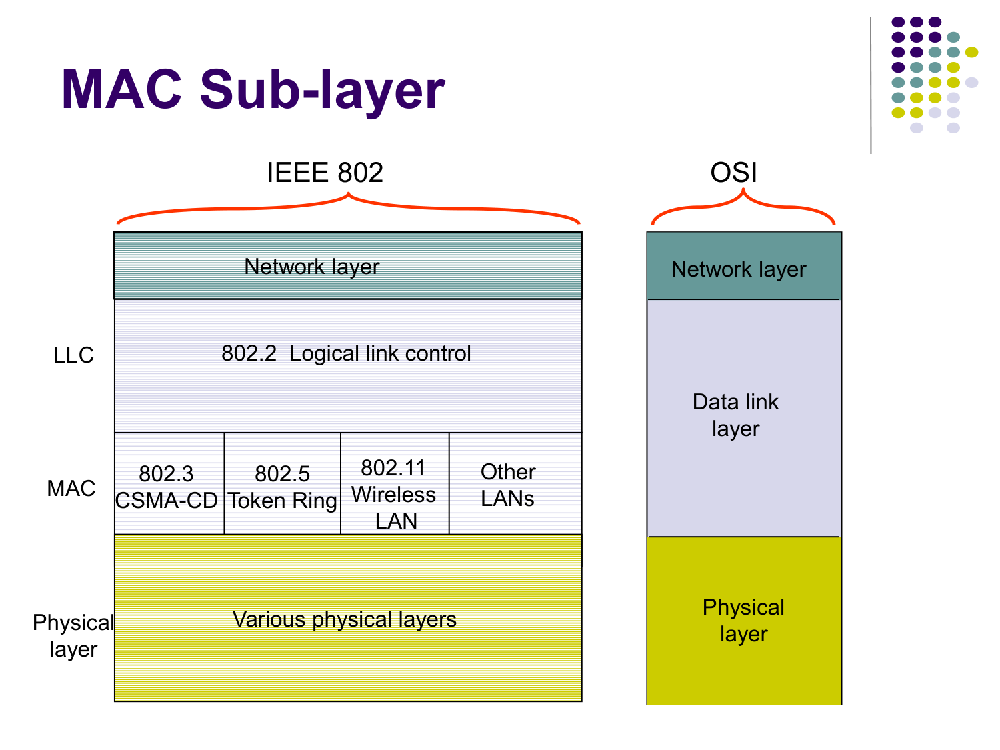
*Gambar: Pemisahan Data Link Layer menjadi sub-lapisan LLC (IEEE 802.2) dan sub-lapisan MAC.*

1. **Logical Link Control (LLC - Standar IEEE 802.2):**
   - Berada di posisi atas, berbatasan langsung dengan Lapisan Jaringan (*Network Layer*, misal protokol IP).
   - Bersifat independen terhadap media fisik: menyediakan antarmuka layanan yang seragam kepada protokol lapisan atas tanpa memedulikan apakah data link di bawahnya menggunakan Ethernet, Token Ring, atau Wi-Fi.
   - Menangani *framing*, *error control*, dan *flow control* tingkat lanjut.
2. **Medium Access Control (MAC - IEEE 802.3, 802.5, 802.11, dll):**
   - Berada di posisi bawah, berbatasan langsung dengan Lapisan Fisik (*Physical Layer*).
   - Bertanggung jawab khusus terhadap media fisik tertentu: mengatur aturan akses ke media transmisi bersama (*collision handling / scheduling*), enkapsulasi alamat fisik (*MAC Address 48-bit*), dan deteksi korupsi frame menggunakan CRC-32.

---

### 7.3 Layanan Logical Link Control (LLC IEEE 802.2)

Standar IEEE 802.2 mendefinisikan tiga jenis model layanan link:

| Tipe Layanan LLC | Nama Layanan | Mekanisme & Karakteristik | Penggunaan Utama |
| :--- | :--- | :--- | :--- |
| **Type 1** | *Unacknowledged Connectionless* | Tidak ada pembentukan koneksi awal; frame dikirim tanpa ACK dan tanpa *flow control*. Layanan *best-effort*. | **Standar default LAN modern** (Ethernet & IP); keandalan ditangani oleh TCP di Layer 4. |
| **Type 2** | *Reliable Connection-Oriented* | Memiliki 3 fase (Setup koneksi, Data Transfer terurut dengan nomor sequence dan ACK berbasis HDLC ABM, Teardown). | Komunikasi terminal tua (SNA IBM, lingkungan industri tanpa Layer 4 TCP). |
| **Type 3** | *Acknowledged Connectionless* | Tanpa setup koneksi di muka, namun setiap frame data wajib dibalas dengan ACK seketika (*datagram with immediate ACK*). | Lingkungan pabrik / kontrol proses otomatis yang butuh konfirmasi cepat tanpa overhead sesi. |

---

### 7.4 Struktur LLC PDU, SAP, & SNAP Header

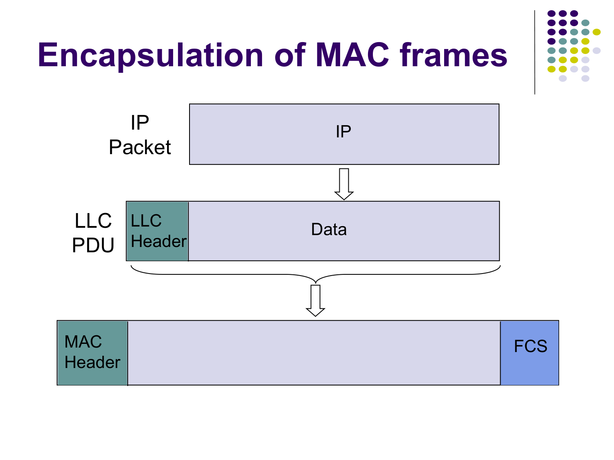
*Gambar: Enkapsulasi paket IP ke dalam LLC PDU dan disematkan ke dalam frame MAC.*

#### Service Access Point (SAP):
LLC menggunakan alamat logis 1-byte yang disebut **SAP (Service Access Point)** untuk mengidentifikasi protokol lapisan atas (*network layer*) yang memiliki payload data:
- **DSAP (Destination SAP - 1 Byte):** Alamat protokol penerima di simpul tujuan.
- **SSAP (Source SAP - 1 Byte):** Alamat protokol pengirim di simpul asal.
- **Control Field (1 atau 2 Byte):** Menentukan format frame LLC (Information, Supervisory, atau Unnumbered frame, mengadopsi standar HDLC).

*Contoh Alamat SAP Standar:*
- `0x06` : Internet Protocol (IP)
- `0xE0` : Novell IPX
- `0x42` : Spanning Tree Protocol (BPDU)
- `0xAA` : SubNetwork Address Protocol (SNAP)

#### SubNetwork Address Protocol (SNAP):
Karena field SAP hanya berukuran 1 Byte (hanya menyediakan maksimal 256 nilai alamat, di mana banyak di antaranya sudah terpakai), muncul kebutuhan untuk mendukung protokol-protokol baru dengan kode EtherType yang lebih fleksibel. Diciptakanlah ekstensi **SNAP**:
- Ketika DSAP dan SSAP keduanya diisi dengan nilai heksadesimal khusus **`0xAA`** (dan Control $= 0x03$), maka header SNAP 5-byte disisipkan tepat setelahnya:
  - **OUI (Organizationally Unique Identifier - 3 Byte):** Kode unik pabrikan/organisasi (misal `00-00-00` untuk standar RFC).
  - **Protocol ID / Type (2 Byte):** Field EtherType standar 16-bit (misal `0x0800` untuk IPv4, `0x0806` untuk ARP).

---

## 8. Ethernet (IEEE 802.3 & DIX Ethernet II)

### 8.1 Sejarah & Fondasi Ethernet
Ethernet diciptakan pada tahun 1973 oleh Robert Metcalfe dan timnya di Xerox PARC (*Palo Alto Research Center*). Dinamai berdasarkan konsep teoritis "luminiferous aether" (media kasat mata yang dulu diyakini merambatkan gelombang elektromagnetik di alam semesta).
- Pada tahun 1980, konsorsium tiga raksasa industri — **DEC, Intel, dan Xerox (DIX)** — merilis spesifikasi komersial pertama Ethernet 10 Mbps yang dikenal sebagai standar **DIX Ethernet II**.
- Komite IEEE kemudian mengadopsi dan memodifikasi standar ini menjadi standar resmi internasional **IEEE 802.3**.

---

### 8.2 Format Frame Ethernet IEEE 802.3 vs DIX Ethernet II

Terdapat perbedaan mendasar pada penafsiran field ke-5 antara standar IEEE 802.3 dan frame Ethernet II (DIX) yang digunakan di Internet saat ini:

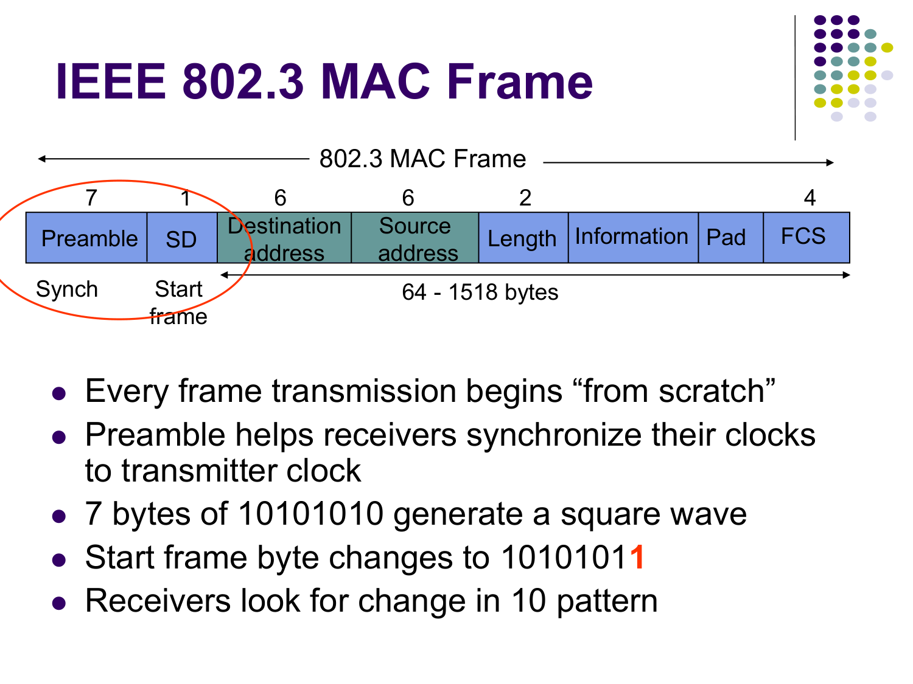
*Gambar: Struktur Frame Ethernet standar IEEE 802.3.*

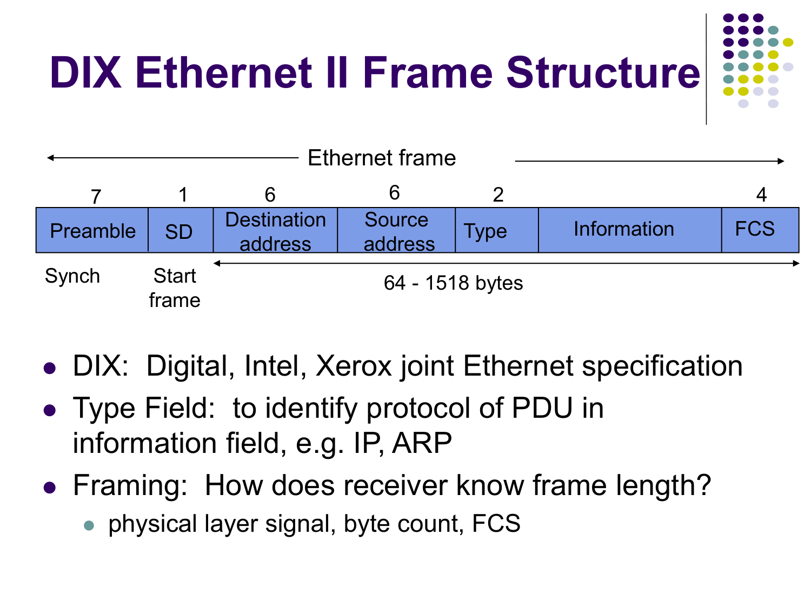
*Gambar: Perbandingan format frame DIX Ethernet II dan IEEE 802.3 dengan enkapsulasi SNAP.*

#### Rincian Komponen Frame:
1. **Preamble (7 Byte):** Pola bit berulang `10101010...` yang menghasilkan gelombang periodik 10 MHz untuk memberikan waktu bagi transceiver penerima menyinkronkan clock osilator fisiknya.
2. **Start of Frame Delimiter (SFD - 1 Byte):** Pola biner `10101011` (diakhiri dengan dua bit `11` berturut-turut) untuk memberi tahu sirkuit digital penerima bahwa bit data frame yang sesungguhnya dimulai pada bit berikutnya.
3. **Destination MAC Address (6 Byte / 48 bit):** Alamat fisik antarmuka penerima.
   - Bit pertama (I/G bit): `0` = Unicast individual, `1` = Multicast / Group address.
   - Jika bernilai seluruhnya `1` (`FF-FF-FF-FF-FF-FF`), merupakan alamat **Broadcast** (diterima oleh seluruh host di LAN).
4. **Source MAC Address (6 Byte / 48 bit):** Alamat fisik antarmuka stasiun pengirim.
   - 24 bit pertama: **OUI (Organizationally Unique Identifier)** yang dialokasikan oleh IEEE kepada pabrikan perangkat keras (misal Intel, Cisco).
   - 24 bit terakhir: Nomor seri unik yang ditentukan oleh pabrikan.
5. **Length / Type Field (2 Byte):**
   - **Pada IEEE 802.3:** Berisi **Length** (nilai integer desimal $0 - 1500$), menandakan jumlah byte data payload yang dibawanya.
   - **Pada DIX Ethernet II:** Berisi **EtherType** (nilai heksadesimal $> 1536$ atau `0x0600`), yang secara langsung mengidentifikasi protokol Layer 3 (misal: `0x0800` untuk IPv4, `0x86DD` untuk IPv6, `0x0806` untuk ARP).
   - *Mekanisme Auto-Detection:* Kartu jaringan memeriksa nilai 2-byte ini: jika nilainya $\le 1500$, frame diproses sebagai IEEE 802.3 (diarahkan ke sub-layer LLC); jika nilainya $\ge 1536$, frame diproses sebagai Ethernet II.
6. **Data Payload (46 s.d. 1500 Byte):** Paket data jaringan dari layer atas (MTU standar Ethernet $= 1500\text{ Byte}$).
7. **Padding (0 s.d. 46 Byte):** Isian bit-bit dummy nol jika data payload berukuran $< 46\text{ Byte}$, guna menjamin panjang frame minimal mencapai batas 64 Byte.
8. **Frame Check Sequence (FCS - 4 Byte):** Nilai CRC-32 (Cyclic Redundancy Check) yang dihitung atas seluruh field mulai dari Destination Address hingga Padding untuk mendeteksi adanya bit yang korup selama transmisi kabel.

---

### 8.3 Mengapa Frame Minimum Ethernet Wajib 64 Byte?

Salah satu pertanyaan ujian paling esensial dalam arsitektur komputer dan jaringan: **Mengapa panjang frame minimum Ethernet standar ditetapkan tepat 64 Byte (512 bit)?**

#### Pembuktian Matematis:
Agar protokol **CSMA/CD** dapat mendeteksi tabrakan dengan sempurna (*Collision Detection Guarantee*), stasiun pemancar **masih wajib dalam kondisi aktif mentransmisikan bit-bit frame ketika sinyal tabrakan terburuk kembali ke pemancar**.
- Jika frame terlalu pendek, pemancar sudah selesai memompa seluruh isi frame dan melepaskan kendali kabel sebelum sinyal tabrakan tiba. Pemancar akan mengira transmisi sukses, padahal framenya hancur di tengah perjalanan!

Mari hitung parameter fisik Ethernet 10 Mbps asli:
1. **Panjang Maksimum Jaringan:** Standar menetapkan bentang kabel maksimal adalah $2.5\text{ km}$ ($2500\text{ meter}$) yang terdiri dari beberapa segmen bus dengan maksimal **4 repeater**.
2. **Round-Trip Propagation Time ($2 t_{\text{prop}}$):**
   - Kecepatan sinyal pada kabel tembaga: $v \approx 2 \times 10^8\text{ m/s}$.
   - Waktu tempuh satu arah sepanjang $2.5\text{ km}$:
     $$t_{\text{prop}} = \frac{2500\text{ m}}{2 \times 10^8\text{ m/s}} = 12.5\ \mu\text{s}$$
   - Waktu bolak-balik kabel murni: $2 t_{\text{prop}} = 25\ \mu\text{s}$.
3. **Penundaan Tambahan Perangkat Keras (Hardware Margins):**
   - Melewati 4 repeater bolak-balik: $\approx 8 - 10\ \mu\text{s}$.
   - Waktu reaksi sirkuit deteksi tabrakan pada transceiver: $\approx 5\ \mu\text{s}$.
   - Tambahan waktu untuk memancarkan sinyal gangguan (*jamming signal* 48 bit): $\approx 4.8\ \mu\text{s}$.
   - Total waktu tunda bolak-balik terburuk (*worst-case round-trip slot time*):
     $$\text{Slot Time} \approx 50 - 51.2\ \mu\text{s}$$
4. **Konversi ke Ukuran Bit Data pada Kecepatan 10 Mbps:**
   $$\text{Panjang Minimum Frame} = \text{Slot Time} \times R = 51.2\ \mu\text{s} \times 10\text{ Mbps} = 512\text{ bits}$$
   $$\text{Panjang Minimum Frame dalam Byte} = \frac{512\text{ bits}}{8\text{ bits/byte}} = \mathbf{64\text{ Byte}}$$

Karena header MAC standar berukuran 18 Byte (6 byte Destination + 6 byte Source + 2 byte Length/Type + 4 byte FCS), maka muatan data payload minimum adalah:
$$\text{Payload Minimum} = 64\text{ Byte} - 18\text{ Byte} = \mathbf{46\text{ Byte}}$$

> [!IMPORTANT] Kesimpulan Slot Time Ethernet
> - Standar menetapkan: **1 Slot Time = 512 bit times = 64 Byte ($51.2\ \mu\text{s}$ pada 10 Mbps)**.
> - Setiap frame dengan panjang $< 64\text{ Byte}$ disebut sebagai **Runt Frame** dan langsung dibuang oleh kartu jaringan karena dianggap sebagai serpihan akibat tabrakan.

---

### 8.4 Media Fisik Klasik: 10BASE5, 10BASE2, & 10BASE-T

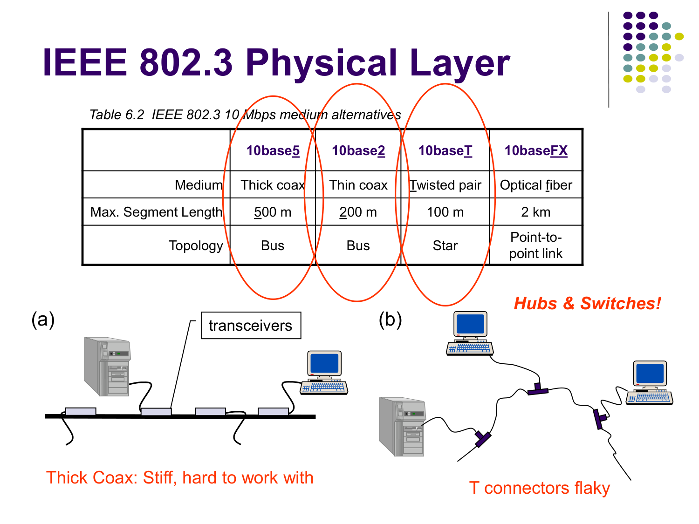
*Gambar: Evolusi topologi fisik Ethernet: Bus kabel koaksial (10BASE5/2) vs Bintang Hub/Switch (10BASE-T).*

Standar penamaan IEEE: `[Kecepatan][Tipe Sinyal][Panjang Maksimum atau Jenis Media]`
- `10` = 10 Mbps
- `BASE` = Baseband signaling (sinyal digital langsung tanpa modulasi pembawa radio)

| Standar Fisik | Nama Populer | Karakteristik Media Kabel | Panjang Segmen Maksimal | Topologi Fisik & Konektor | CSMA/CD |
| :--- | :--- | :--- | :--- | :--- | :--- |
| **10BASE5** | *Thicknet* | Kabel koaksial tebal diameter 10mm impedansi 50 $\Omega$ (warna kuning) | **500 meter** | Bus linier; menggunakan *Vampire Tap* yang menembus kabel & Transceiver terpisah (*AUI Cable*) | Ya |
| **10BASE2** | *Thinnet* / *Cheapernet* | Kabel koaksial tipis RG-58 impedansi 50 $\Omega$ | **185 meter** (dibulatkan ke 200) | Bus linier; menggunakan konektor BNC berbentuk huruf **T** langsung di belakang PC; butuh terminator $50\ \Omega$ | Ya |
| **10BASE-T** | *Twisted Pair Ethernet* | Kabel tembaga terpilin UTP (*Unshielded Twisted Pair*) Kategori 3 atau 5 | **100 meter** | **Topologi Fisik Bintang (*Star*)**, Topologi Logis Bus; menggunakan konektor modular **RJ-45** terhubung ke Hub pusat | Ya |

---

### 8.5 Hub vs Switch: Transformasi Collision Domain

1. **Ethernet Hub (Repeater Multiport - Layer 1):**
   - Beroperasi murni pada lapisan fisik.
   - Sinyal elektrik yang masuk dari satu port diamplifikasi dan disiarkan ulang (*broadcast*) ke **seluruh port lainnya** tanpa memahami isi frame MAC.
   - Seluruh stasiun yang terhubung ke sebuah hub berada dalam **satu Collision Domain yang sama**. Tabrakan tetap terjadi dan CSMA/CD aktif bekerja membatasi throughput total jaringan menjadi maksimal 10 Mbps terbagi bersama (*shared bandwidth*).
2. **Ethernet Switch (Bridge Multiport - Layer 2):**
   - Beroperasi pada lapisan data link.
   - Membaca header MAC dan menyimpan frame di buffer memori (*store-and-forward* atau *cut-through*).
   - **Microsegmentation:** Setiap port switch membentuk **Collision Domain mandiri yang terisolasi**.
   - Jika link stasiun ke switch beroperasi dalam mode **Full-Duplex** (menggunakan sepasang jalur kabel terpisah untuk transmit dan receive), transmisi dapat berlangsung dua arah secara simultan tanpa ada tabrakan sama sekali.
   - **CSMA/CD dinonaktifkan sepenuhnya pada lingkungan switched full-duplex!**

---

### 8.6 Fast Ethernet (100 Mbps)
Dirilis pada tahun 1995 sebagai standar **IEEE 802.3u**:
- Kecepatan transmisi ditingkatkan 10 kali lipat menjadi **100 Mbps**.
- Waktu bit (*bit time*) menyusut dari $100\text{ ns}$ menjadi hanya **$10\text{ ns}$**.
- Karena panjang minimum frame dipertahankan tetap 64 Byte (512 bit) demi kompatibilitas software ke belakang, maka durasi pemancaran frame minimum menyusut 10 kali lipat menjadi:
  $$\text{Slot Time Fast Ethernet} = 512 \times 10\text{ ns} = 5.12\ \mu\text{s}$$
- **Konsekuensi Jarak:** Agar sinyal tabrakan tetap dapat dideteksi dalam rentang waktu $5.12\ \mu\text{s}$, bentang maksimum segmen jaringan kabel dibatasi maksimal **100 meter**!
- Media Fisik Fast Ethernet:
  - **100BASE-TX:** Menggunakan 2 pasang kabel UTP Cat-5 (paling populer).
  - **100BASE-FX:** Menggunakan 2 untai serat optik multimode (jarak hingga 2 km).
  - **100BASE-T4:** Menggunakan 4 pasang kabel UTP Cat-3 lama.

---

### 8.7 Gigabit Ethernet (1 Gbps): Carrier Extension & Frame Bursting
Dirilis sebagai standar **IEEE 802.3z** (optik) dan **IEEE 802.3ab** (kabel tembaga 1000BASE-T UTP Cat-5e):
- Kecepatan meningkat menjadi **1.000 Mbps (1 Gbps)**.
- Waktu 1 bit hanya **$1\text{ ns}$**!
- Jika frame minimum tetap 512 bit, durasi slot time menjadi hanya $512\text{ ns}$. Panjang kabel maksimal yang dapat dijangkau CSMA/CD menyusut menjadi hanya **10 meter** (tidak praktis untuk gedung!).

Untuk mempertahankan operasi CSMA/CD half-duplex pada jarak 100 meter, IEEE 802.3z memperkenalkan dua modifikasi:
1. **Carrier Extension:**
   - Slot time dinaikkan 8 kali lipat dari 512 bit times menjadi **4096 bit times (512 Byte)**.
   - Jika frame data berukuran lebih kecil dari 512 Byte, kartu jaringan menambahkan bit-bit sinyal pengisi khusus (*extension bits*) di belakang FCS hingga mencapai 512 Byte.
   - Kekurangan: Menghamburkan bandwidth untuk paket-paket pendek (misal ACK TCP 64 byte menjadi berukuran 512 byte di media fisik).
2. **Frame Bursting:**
   - Setelah stasiun berhasil mengirim satu frame menggunakan carrier extension, stasiun diizinkan mengirim rentetan (*burst*) frame-frame pendek berikutnya secara beruntun tanpa melepaskan media hingga mencapai kuota maksimal 65.536 bit times (8192 Byte).

> [!NOTE] Realitas Praktis Gigabit Ethernet
> Modifikasi Carrier Extension dan Frame Bursting pada akhirnya hampir tidak pernah digunakan di industri, karena seluruh instalasi Gigabit Ethernet di dunia nyata menggunakan **Ethernet Switch beroperasi dalam mode Full-Duplex murni**, di mana CSMA/CD tidak diperlukan sama sekali!

---

### 8.8 10-Gigabit Ethernet (10 Gbps) & Hilangnya CSMA/CD
Standar **IEEE 802.3ae**:
- Beroperasi murni pada kecepatan **10 Gbps** menggunakan media serat optik (*10GBASE-SR, 10GBASE-LR, 10GBASE-ER*) dan kabel tembaga twisted pair (*10GBASE-T Cat-6a*).
- **Penghapusan Total CSMA/CD:**
  - Standar IEEE 802.3ae secara formal dan resmi **menghapus algoritma CSMA/CD dari spesifikasi**.
  - Hanya mendukung operasi **Full-Duplex point-to-point** antar switch atau host-ke-switch.
  - Format frame, skema addressing MAC 48-bit, dan ukuran MTU 1500 byte tetap dipertahankan utuh demi kompatibilitas aplikasi.

---

## 9. Token Ring (IEEE 802.5) & FDDI

### 9.1 Arsitektur Token Ring & Multistation Access Unit (MSAU)

Dikembangkan oleh IBM pada tahun 1980-an dan distandarisasi oleh IEEE sebagai **IEEE 802.5**:
- Menggunakan topologi cincin (*ring*) searah di mana stasiun-stasiun berfungsi sebagai *active repeater* regenerasi sinyal.
- **Topologi Fisik Bintang, Topologi Logis Cincin:**
  - Jika kabel cincin fisik melingkari seluruh gedung secara serial, putusnya kabel di satu workstation akan meruntuhkan seluruh jaringan.
  - Untuk keandalan, stasiun-stasiun dihubungkan ke konsentrator kabel terpusat yang disebut **Multistation Access Unit (MSAU / MAU)** menggunakan kabel *Shielded Twisted Pair* (STP) IBM Tipe-1.
  - Di dalam MSAU terdapat relay elektromekanik yang ditenagai arus loop dari stasiun (*phantom current*). Jika kabel stasiun putus atau komputer dimatikan, relay otomatis menutup (*bypass switch*) dalam hitungan milidetik sehingga integritas loop cincin tetap terjaga.

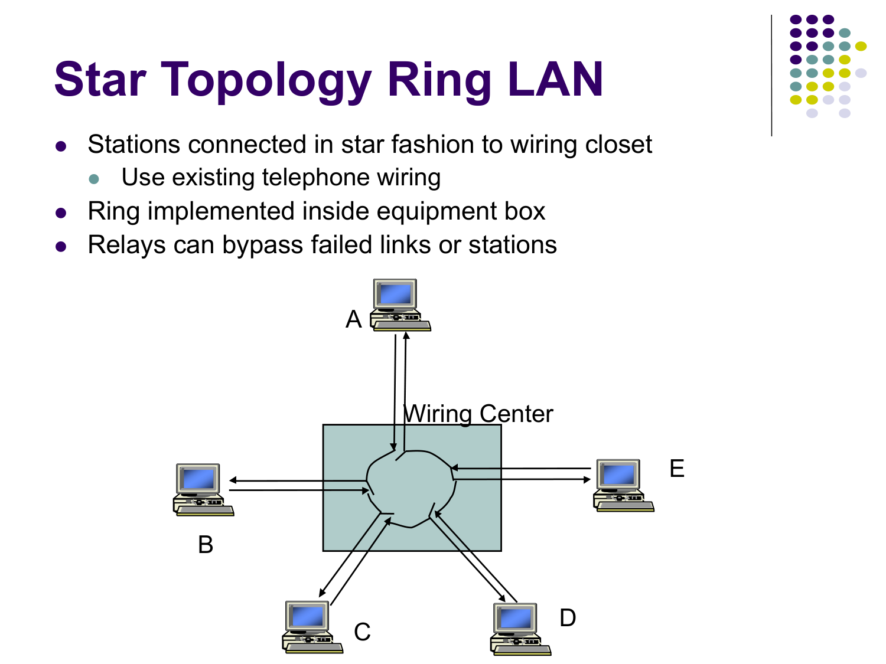
*Gambar: Wiring Center (MSAU) menghubungkan workstation secara fisik bintang namun logis cincin.*

---

### 9.2 Format Frame Token & Frame Data IEEE 802.5

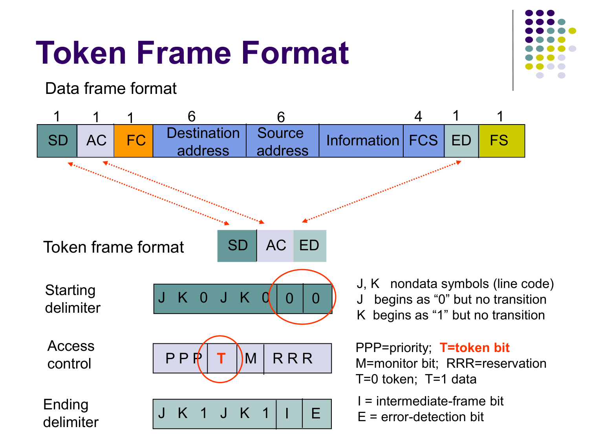
*Gambar: Format Frame Token (3 Byte) dan Frame Data IEEE 802.5.*

1. **Frame Token Bebas (Hanya 3 Byte):**
   - **SD (Starting Delimiter - 1 Byte):** Memuat pelanggaran kode Manchester (*Manchester Code Violation*) khusus non-data `J` dan `K` untuk menandai awal batas frame.
   - **AC (Access Control - 1 Byte):** Berisi 8 bit kendali:
     - Bit `0-2` : **Priority Bits ($PPP$)** - prioritas token saat ini ($000$ terendah, $111$ tertinggi).
     - Bit `3` : **Token Bit ($T$)** - status token (`0` = Free Token, `1` = Busy Frame/Data).
     - Bit `4` : **Monitor Bit ($M$)** - digunakan oleh stasiun pemantau (*Active Monitor*) untuk mendeteksi frame yang berputar abadi.
     - Bit `5-7` : **Reservation Bits ($RRR$)** - bit reservasi stasiun berikutnya.
   - **ED (Ending Delimiter - 1 Byte):** Menandai akhir frame.
2. **Frame Data / Informasi:**
   - Selain field SD, AC, dan ED, frame data menyertakan:
     - **FC (Frame Control - 1 Byte):** Membedakan frame kendali MAC internal dengan frame data LLC.
     - **Destination MAC & Source MAC (masing-masing 6 Byte).**
     - **Information Field:** Payload data layer atas.
     - **FCS (4 Byte CRC-32).**
     - **FS (Frame Status - 1 Byte):** Berada di bagian paling akhir setelah ED. Memuat bit **A (Address Recognized)** dan bit **C (Frame Copied)**.
       - Saat stasiun tujuan mendeteksi MAC address miliknya pada frame yang melintas, ia mengubah bit $A = 1$.
       - Saat stasiun tujuan berhasil menyalin isi frame ke buffernya, ia mengubah bit $C = 1$.
       - Ketika frame kembali ke stasiun pengirim asal, pengirim memeriksa bit $A$ dan $C$ sebagai konfirmasi instan pada Layer 2!

---

### 9.3 Operasi Prioritas pada Token Ring
Token Ring memiliki skema penanganan prioritas 8 tingkat yang sangat canggih melalui interaksi bit **$PPP$** dan **$RRR$**:
1. Stasiun hanya boleh menangkap sebuah token bebas jika prioritas frame yang ingin dikirimkannya ($P_{\text{data}}$) bernilai **lebih tinggi atau sama dengan** prioritas token saat ini ($P_{\text{data}} \ge PPP$).
2. Saat sebuah frame data melintasi stasiun yang memiliki frame berprioritas lebih tinggi dalam antreannya, stasiun tersebut dapat **menuliskan nilai prioritasnya ke dalam bit reservasi $RRR$** di header frame yang sedang melintas (jika nilai reservasinya lebih besar dari yang tertera saat itu).
3. Ketika stasiun pemancar asli menerima kembali framenya, ia menerbitkan sebuah *Free Token* baru dengan level prioritas $PPP$ dinaikkan sesuai dengan nilai reservasi $RRR$ tertinggi yang tercatat!

---

### 9.4 Fiber Distributed Data Interface (FDDI)

FDDI dirilis oleh ANSI (standar X3T9.5) untuk menyediakan backbone jaringan area kampus berkecepatan tinggi:
- Kecepatan transmisi: **100 Mbps** menggunakan kabel serat optik.
- Skala jaringan: Menghubungkan hingga **500 stasiun** dengan total keliling cincin mencapai **$200\text{ km}$** (waktu propagasi bolak-balik kabel optik $\approx 1\text{ ms}$).
- Menggunakan modulasi transmisi data berkode **4B/5B** dan NRZI.
- Mengadopsi metode pelepasan token **Multi-Token Reinsertion (*Early Token Release*)** untuk memaksimalkan efisiensi pada parameter $a \ge 1$.

---

### 9.5 Dual Counter-Rotating Ring & Self-Healing Wrap

Salah satu keunggulan arsitektural terbesar FDDI adalah keandalan dan toleransi kerusakannya melalui sistem cincin ganda:

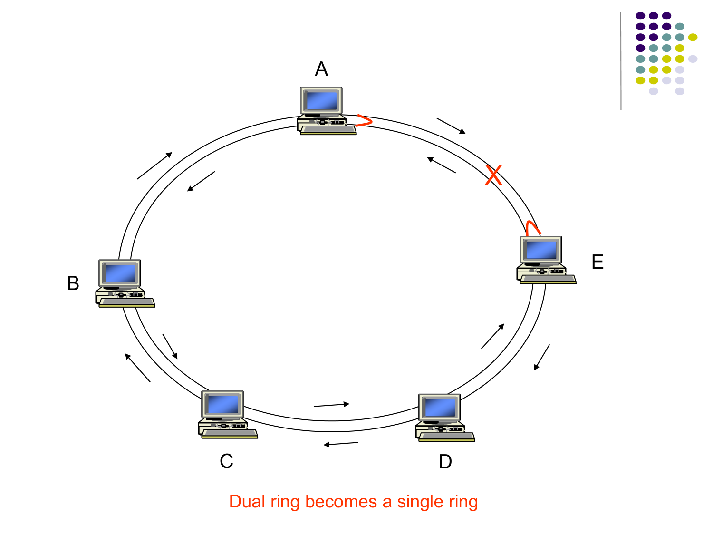
*Gambar: Mekanisme isolasi kerusakan dan penyambungan cincin otomatis (Self-Healing Wrap) pada FDDI.*

1. **Struktur Cincin Ganda:**
   - **Primary Ring:** Membawa data operasional dengan arah putaran searah jarum jam (*clockwise*).
   - **Secondary Ring:** Mengalir berlawanan arah jarum jam (*counter-clockwise*), biasanya dalam kondisi siaga (*standby*).
2. **Mekanisme Self-Healing Wrap:**
   - Jika kabel serat optik terputus total oleh ekskavator atau terjadi kerusakan fisik pada stasiun repeater, stasiun di kedua sisi titik kerusakan akan mendeteksi hilangnya sinyal optik.
   - Stasiun di kedua sisi kerusakan secara otomatis mengaktifkan sirkuit optik internal untuk menyambungkan (*wrap*) Primary Ring ke Secondary Ring di ujung masing-masing.
   - Hasilnya: Kedua cincin yang terputus bergabung kembali menjadi **satu cincin tunggal raksasa** yang utuh (*loopback*), sehingga jaringan tetap berfungsi normal tanpa mengalami *downtime*!

---

### 9.6 Timed Token Protocol pada FDDI (TTRT, TRT, THT)

Untuk menjamin alokasi bandwidth deterministik bagi trafik multimedia dan kendali kritis, FDDI mengimplementasikan protokol **Timed Token**:
- **Dua Tipe Trafik:**
  1. **Trafik Sinkron (*Synchronous Traffic*):** Trafik suara/video yang memerlukan batas keterlambatan ketat dan jaminan alokasi bandwidth minimum pada setiap siklus putaran token.
  2. **Trafik Asinkron (*Asynchronous Traffic*):** Trafik data reguler (file transfer, web) yang memanfaatkan sisa kapasitas bandwidth jika putaran token berlangsung lebih cepat dari jadwal.

#### Tiga Parameter & Timer Utama:
1. **Target Token Rotation Time (TTRT):** Nilai waktu target disepakati bersama oleh seluruh stasiun selama proses inisialisasi jaringan (*claim frame procedure*). Menetapkan batas atas waktu yang diizinkan untuk satu putaran penuh token.
2. **Token Rotation Timer (TRT):** Timer lokal di tiap stasiun yang menghitung waktu yang telah berlalu sejak token terakhir kali diterima stasiun tersebut.
3. **Token Holding Time (THT):** Timer kuota yang menghitung berapa lama stasiun diizinkan mengirim trafik asinkron pada giliran saat ini:
   $$THT = TTRT - TRT$$

#### Logika Operasi:
- Ketika token tiba di stasiun:
  - Stasiun **selalu diizinkan mentransmisikan trafik sinkron miliknya** sesuai alokasi kuota yang telah dicadangkan.
  - Stasiun kemudian memeriksa selisih waktu:
    - Jika $THT > 0$ (token tiba lebih cepat dari jadwal target $TTRT$), stasiun diizinkan mentransmisikan frame-frame asinkron selama durasi timer $THT$.
    - Jika $THT \le 0$ (token tiba terlambat akibat beban jaringan yang sedang berat), stasiun **dilarang keras** mengirimkan trafik asinkron dan wajib segera melepaskan token bebas ke stasiun berikutnya!

---

## 10. Wireless LAN (IEEE 802.11 / Wi-Fi)

### 10.1 Karakteristik Kanal Nirkabel & Kendala Deteksi Tabrakan

Komunikasi data melalui gelombang radio nirkabel menghadapi tantangan fisik yang sama sekali berbeda dibandingkan media kabel tembaga atau serat optik:
1. **Redaman Lintasan (*Path Loss*) yang Sangat Besar:** Kekuatan sinyal radio melemah secara drastis seiring jarak ($1/d^2$ pada ruang bebas, atau $1/d^3$ hingga $1/d^4$ di dalam gedung akibat pantulan dinding).
2. **Interferensi & Fading:** Gelombang memantul dari dinding, lantai, dan perabot, menghasilkan banyak lintasan sinyal (*multipath fading*) yang saling melemahkan secara acak.
3. **Mengapa CSMA/CD Tidak Dapat Digunakan pada Kanal Nirkabel?**
   - Pada Ethernet kabel, sinyal pemancar lokal dan sinyal tabrakan memiliki level tegangan yang sebanding sehingga mudah dibandingkan oleh transceiver.
   - Pada radio nirkabel, **daya pancar pemancar lokal pada antena sendiri sangat kuat ($100\text{ mW}$ hingga $1\text{ W}$)**, sedangkan **sinyal stasiun lain yang tiba dari jauh sangat lemah (hanya beberapa pikowatt atau microwatt, teredam $-60\text{ dB}$ hingga $-90\text{ dB}$)**.
   - Sinyal pancaran sendiri akan membanjiri (*swamp/blind*) rangkaian penerimanya sendiri. Stasiun tidak dapat "mendengar" apakah sinyal stasiun lain sedang bertabrakan saat ia sendiri sedang memancar!
   - Oleh karena itu, IEEE 802.11 beralih dari deteksi tabrakan (*Collision Detection*) menjadi **penghindaran tabrakan (*Collision Avoidance* / CSMA/CA)**.

---

### 10.2 Hidden & Exposed Terminal Problem

Dua fenomena fisik yang menjadi sumber masalah utama pada jaringan nirkabel:

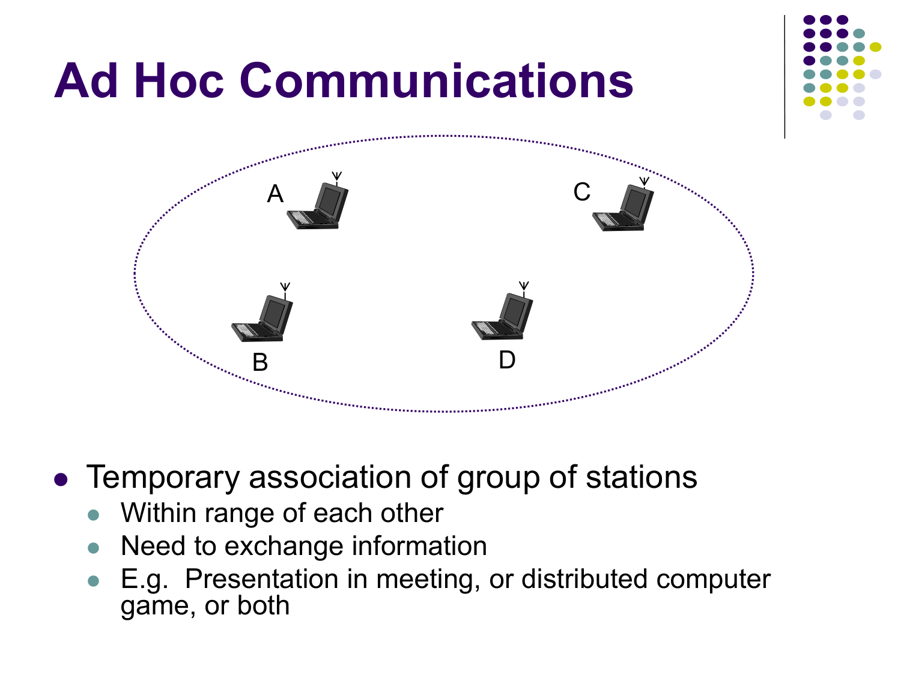
*Gambar: (a) Masalah Terminal Tersembunyi (Hidden Terminal) dan (b) Masalah Terminal Terekspos (Exposed Terminal).*

#### A. Masalah Terminal Tersembunyi (*Hidden Terminal Problem*):
- Misalkan terdapat 3 stasiun: Stasiun $A$, Access Point $B$, dan Stasiun $C$.
- Jangkauan transmisi stasiun $A$ mencakup $B$, namun tidak mencapai $C$. Demikian pula, jangkauan transmisi $C$ mencakup $B$, namun tidak mencapai $A$.
- Stasiun $A$ dan $C$ saling "tersembunyi" satu sama lain (*out of radio range*).
- Jika $A$ ingin mengirim data ke $B$, $A$ mengindera udara. Karena $A$ tidak dapat mendengar sinyal $C$, udara tampak kosong bagi $A$.
- Pada saat yang sama, $C$ juga mengindera udara, mendengar kosong, lalu mulai mengirim data ke $B$.
- **Akibat:** Kedua gelombang radio tiba bersamaan di antena stasiun $B$, menghasilkan tabrakan destruktif di $B$! Kedua transmisi gagal total.

#### B. Masalah Terminal Terekspos (*Exposed Terminal Problem*):
- Misalkan $B$ sedang mentransmisikan data ke $A$.
- Stasiun $C$ berada di dekat $B$ sehingga dapat mendengar transmisi $B$. Stasiun $C$ ingin mentransmisikan data ke stasiun $D$ yang berada jauh di sisi seberang (di luar jangkauan $A$ dan $B$).
- Ketika $C$ mengindera media radio, $C$ mendeteksi sinyal $B$ dan menyimpulkan bahwa kanal sedang sibuk.
- $C$ terpaksa menunda pengiriman ke $D$.
- **Akibat:** Penundaan ini sebenarnya tidak perlu! Transmisi dari $C$ ke $D$ sama sekali tidak akan mengganggu penerimaan data di stasiun $A$. Masalah ini menurunkan utilisasi spektrum nirkabel.

---

### 10.3 Mekanisme Virtual Carrier Sensing: RTS/CTS Handshake & NAV

Untuk mengatasi masalah *Hidden Terminal*, standar IEEE 802.11 menyediakan mekanisme jabat tangan 4-arah (*four-way handshake*) menggunakan frame kendali pendek:

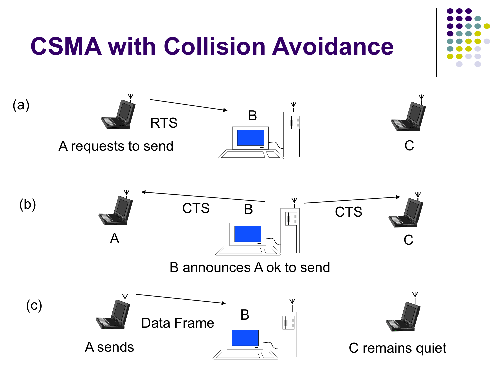
*Gambar: Alur jabat tangan RTS/CTS untuk mengamankan kanal transmisi dari stasiun tersembunyi.*

1. **RTS (Request to Send):** Stasiun pengirim ($A$) memancarkan frame kendali RTS berukuran 20 Byte ke stasiun penerima ($B$). Di dalam header RTS terdapat field **Duration** yang menyatakan berapa mikrodetik kanal akan dipesan untuk menyelesaikan seluruh siklus transmisi (RTS + CTS + Data + ACK).
2. **CTS (Clear to Send):** Jika stasiun $B$ menerima RTS dan siap menerima data, $B$ membalas dengan memancarkan frame CTS secara *broadcast* ke udara. Frame CTS menyalin field *Duration* dari RTS dikurangi durasi transmisi CTS itu sendiri.
3. **Penyelesaian Masalah Hidden Terminal:**
   - Stasiun $C$ yang tersembunyi dari $A$ memang tidak mendengar frame RTS dari $A$. Namun, $C$ **dapat mendengar frame CTS yang dipancarkan oleh $B$**!
   - Begitu mendengar CTS dari $B$, stasiun $C$ menyadari bahwa $B$ sedang bersiap menerima data dari pihak lain.
4. **Network Allocation Vector (NAV) - Virtual Carrier Sensing:**
   - Setiap stasiun yang mendengar RTS atau CTS yang bukan ditujukan kepadanya akan membaca nilai field *Duration*.
   - Stasiun tersebut mengatur timer internal yang disebut **NAV (Network Allocation Vector)**.
   - Selama nilai hitung mundur timer NAV belum mencapai 0, stasiun menganggap media radio dalam kondisi **sibuk secara virtual (*virtual carrier sense*)**, dan menahan diri untuk tidak memancarkan sinyal apapun ke udara!

```
Station A (Sender)             Station B (Receiver)          Station C (Hidden Node)
       |                                |                               |
       |--- RTS (Duration = T) -------->|                               |
       |                                |--- CTS (Broadcast) ---------->| (C mendengar CTS!)
       |<-- CTS ------------------------|                               | [Set NAV = T_sisa]
       |                                |                               | (C tidur / hening)
       |==== DATA FRAME ===============>|                               |       |
       |                                |                               |       |
       |<-- ACK ------------------------|                               |       |
       |                                |                               | [NAV Expired!]
```

---

### 10.4 Arsitektur Komponen 802.11: BSS, ESS, AP, & DS

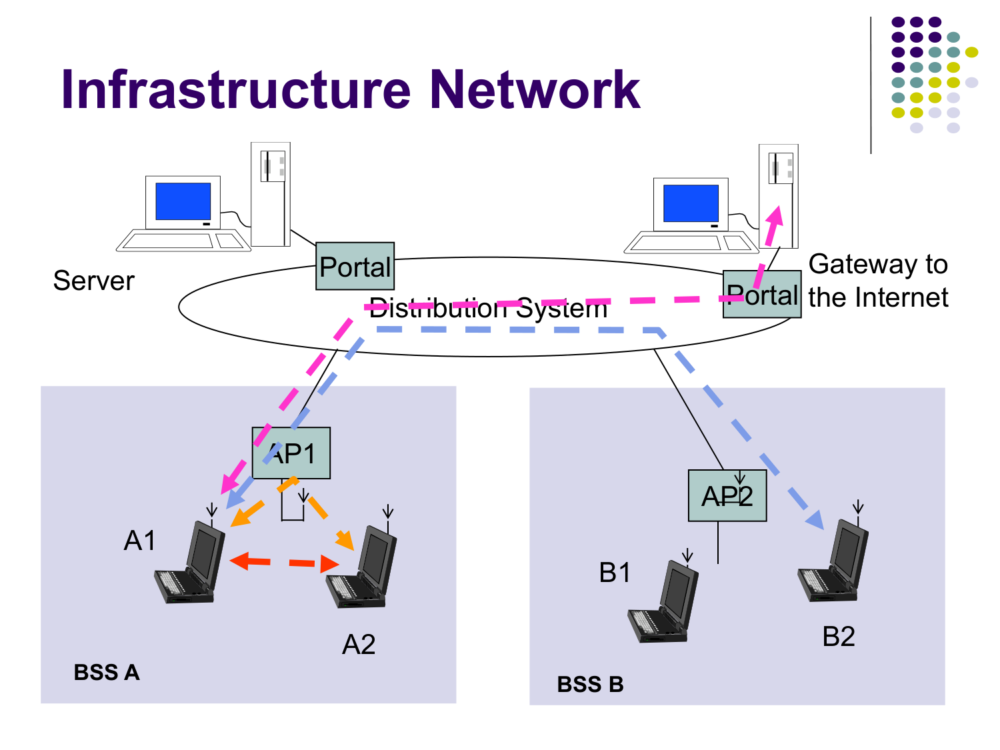
*Gambar: Arsitektur topologi IEEE 802.11: BSS Independen, BSS Infrastruktur, Access Point, dan Extended Service Set (ESS).*

Standar IEEE 802.11 mendefinisikan blok-blok pembangun jaringan:
1. **Basic Service Set (BSS):** Blok seluler dasar yang terdiri dari sekumpulan stasiun yang saling berkomunikasi menggunakan media radio yang sama.
   - **Independent BSS (IBSS / Ad-hoc Mode):** Stasiun-stasiun berkomunikasi secara langsung antar-peer (*peer-to-peer*) tanpa adanya infrastruktur sentral atau Access Point.
   - **Infrastructure BSS:** Stasiun-stasiun hanya berkomunikasi melalui sebuah simpul koordinator pusat yang disebut **Access Point (AP)**.
2. **Access Point (AP):** Stasiun nirkabel khusus yang berfungsi sebagai jembatan (*bridge*) penghubung antara media radio nirkabel dengan jaringan kabel backbone.
3. **Distribution System (DS):** Jaringan backbone (biasanya berupa Ethernet kabel switch berkecepatan tinggi) yang saling menghubungkan beberapa Access Point.
4. **Extended Service Set (ESS):** Gabungan dari dua atau lebih BSS infrastruktur yang saling terhubung melalui Distribution System (DS). Bagi pengguna di lapisan atas, seluruh ESS tampak seperti satu subnet LAN tunggal yang masif, memungkinkan pengguna bergerak berpindah antar ruangan (*seamless roaming*) tanpa kehilangan koneksi jaringan.

---

### 10.5 Layanan Distribusi & Manajemen Asosiasi
Untuk mendukung mobilitas stasiun di dalam ESS, IEEE 802.11 menyediakan dua kelompok layanan:
1. **Layanan Stasiun (Station Services):** Autentikasi, Deautentikasi, Privasi/Enkripsi data (WEP/WPA), dan Pengiriman MSDU.
2. **Layanan Distribusi (Distribution Services):**
   - **Association:** Menetapkan link logis awal antara stasiun bergerak dengan sebuah AP tertentu sebelum stasiun diizinkan mengirim/menerima paket melalui DS.
   - **Reassociation:** Memindahkan asosiasi stasiun bergerak dari satu AP ke AP lain saat sinyal AP pertama melemah (proses *handover / roaming* di dalam ESS).
   - **Disassociation:** Mengakhiri hubungan asosiasi stasiun dengan AP secara tertib.
   - **Distribution:** Mengarahkan frame yang melintasi DS menuju AP yang tepat di mana stasiun tujuan saat ini terasosiasi.
   - **Integration:** Menangani konversi format frame antara frame MAC 802.11 dengan frame MAC non-802.11 (seperti Ethernet IEEE 802.3 kabel).

---

### 10.6 Sub-lapisan MAC: DCF (CSMA/CA) vs PCF

Sub-lapisan MAC 802.11 menyediakan dua mode layanan akses:

1. **Distributed Coordination Function (DCF):**
   - Mode operasi fundamental yang wajib didukung oleh seluruh perangkat Wi-Fi.
   - Bersifat terdistribusi penuh tanpa pengatur tunggal, berbasis mekanisme **CSMA/CA (Carrier Sense Multiple Access with Collision Avoidance)**.
   - Layanan bersifat *asynchronous best-effort data transfer*.
2. **Point Coordination Function (PCF):**
   - Mode operasi opsional yang beroperasi di atas DCF.
   - Bersifat terpusat (*centralized polling*) yang dijalankan oleh Point Coordinator (PC) di dalam Access Point.
   - Menyediakan layanan transmisi bebas kontensi (*Contention-Free Service*) bergaransi waktu untuk trafik audio/video.
   - Waktu operasional dibagi secara periodik antara **Contention-Free Period (CFP)** yang diawali frame *Beacon* dan **Contention Period (CP)** reguler.

---

### 10.7 Skema Interframe Spacing (SIFS, PIFS, DIFS, EIFS)

Untuk menciptakan tingkatan prioritas akses yang berbeda tanpa memerlukan kontrol kabel terpusat, IEEE 802.11 mendefinisikan jeda waktu hening yang wajib ditaati stasiun setelah kanal terdeteksi kosong, yang disebut **Interframe Spacing (IFS)**:

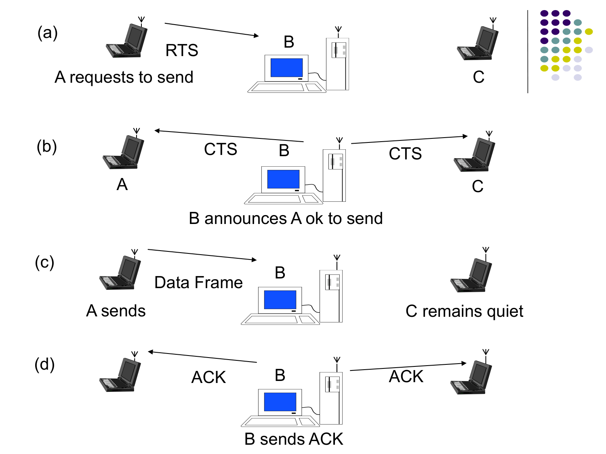
*Gambar: Diferensiasi tingkat prioritas melalui durasi Interframe Spacing (IFS) dan alur transmisi DCF.*

Tingkatan durasi IFS (diurutkan dari yang paling singkat ke yang paling lama):

$$\text{SIFS} < \text{PIFS} < \text{DIFS} < \text{EIFS}$$

1. **SIFS (Short Interframe Space):**
   - Durasi waktu tunggu paling pendek (paling diprioritaskan).
   - Digunakan untuk transmisi respons seketika yang sedang berlangsung dalam satu jabat tangan transaksi: frame **ACK**, frame **CTS**, dan transmisi fragmen data lanjutan.
   - Menjamin transaksi yang sedang berjalan tidak direbut oleh stasiun baru yang ingin mulai mentransmisi.
2. **PIFS (PCF Interframe Space):**
   - Durasi waktu tunggu menengah ($\\text{PIFS} = \text{SIFS} + 1\text{ Slot Time}$).
   - Digunakan secara eksklusif oleh Access Point dalam mode PCF untuk merebut saluran dan memulai *Contention-Free Period* sebelum stasiun DCF biasa diizinkan bersaing.
3. **DIFS (DCF Interframe Space):**
   - Durasi waktu tunggu standar ($\\text{DIFS} = \text{SIFS} + 2\text{ Slot Time}$).
   - Digunakan oleh seluruh stasiun biasa dalam mode DCF sebelum diperbolehkan memulai transmisi frame data baru atau masuk ke proses backoff kontensi.
4. **EIFS (Extended Interframe Space):**
   - Waktu tunggu paling panjang.
   - Digunakan ketika sebuah stasiun menerima frame yang mengalami korupsi atau salah checksum CRC, untuk memberi kesempatan bagi penerima asli mengirimkan ACK sebelum stasiun lain mengacaukan media.

---

### 10.8 Prosedur Contention Window & Backoff Acak

Jika sebuah stasiun memiliki frame untuk dikirim saat media radio terdeteksi sibuk, stasiun wajib menjalankan prosedur **Binary Exponential Backoff**:
1. Stasiun memonitor udara hingga mendeteksi kanal kosong selama durasi tepat **DIFS**.
2. Stasiun memilih bilangan bulat acak $r$ dari rentang jendela kontensi:
   $$r \in [0, \text{CW} - 1]$$
   - Pada percobaan pertama, Jendela Kontensi diatur ke nilai minimum: $\text{CW} = \text{CW}_{\min}$ (misal $\text{CW}_{\min} = 32$ slot pada 802.11b).
3. **Hitung Mundur Timer Backoff:**
   - Stasiun menghitung mundur timer backoffnya: timer berkurang 1 setiap kali terlewati 1 slot waktu kosong (*idle slot*).
   - Jika media tiba-tiba terdeteksi sibuk oleh stasiun lain, **timer backoff dibekukan (*frozen*)**.
   - Timer baru melanjutkan hitung mundur dari sisa nilai sebelumnya setelah kanal kembali terdeteksi kosong selama satu interval DIFS penuh.
4. **Jika Terjadi Kegagalan (ACK Tidak Diterima):**
   - Stasiun mengasumsikan terjadi tabrakan.
   - Jendela kontensi digandakan secara eksponensial: $\text{CW}_{\text{new}} = 2 \times (\text{CW}_{\text{old}} + 1) - 1$, hingga mencapai batas maksimum $\text{CW}_{\max}$ (misal 1024 slot).

---

### 10.9 Struktur Frame MAC 802.11 & Resolusi 4 MAC Address

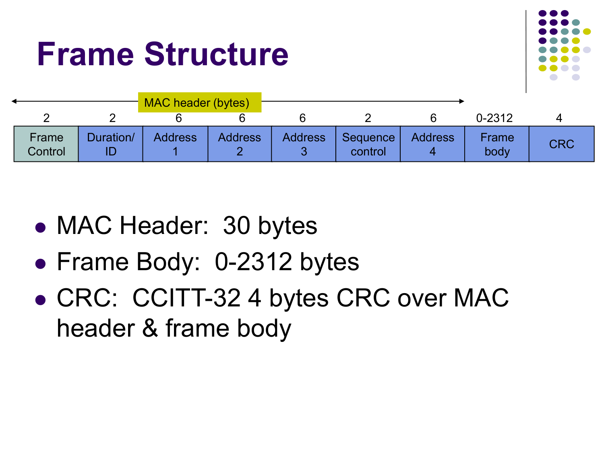
*Gambar: Format Header Frame MAC IEEE 802.11 (30 Byte) dan field-field kontrolnya.*

Header MAC IEEE 802.11 berukuran total **30 Byte**, terdiri dari:
- **Frame Control (2 Byte):**
  - *Protocol Version* (2 bit): Nilai `00`.
  - *Type* (2 bit): `00` = Management, `01` = Control, `10` = Data.
  - *Subtype* (4 bit): Spesifikasi detail (misal: RTS, CTS, ACK, Association Request, Beacon).
  - *To DS* (1 bit): Bernilai `1` jika frame menuju ke Distribution System (AP).
  - *From DS* (1 bit): Bernilai `1` jika frame keluar dari Distribution System (AP).
  - *More Frag* (1 bit): `1` jika masih ada fragmen paket lanjutan.
  - *Retry* (1 bit): `1` jika frame ini adalah retransmisi dari frame sebelumnya yang gagal.
  - *Power Mgt* (1 bit): Menandakan stasiun akan masuk ke mode hemat energi (*sleep mode*).
  - *More Data* (1 bit): Menandakan AP masih menyimpan antrean paket yang dibuffer untuk stasiun yang sedang tidur.
  - *WEP* (1 bit): `1` jika payload data dienkripsi.
  - *Order* (1 bit): `1` jika frame harus diproses secara berurutan ketat.
- **Duration / ID (2 Byte):** Menyimpan nilai durasi reservasi waktu untuk timer NAV stasiun lain.
- **Sequence Control (2 Byte):** Terdiri dari 4-bit *Fragment Number* dan 12-bit *Sequence Number* (untuk eliminasi duplikasi).
- **CRC Checksum (4 Byte):** Menggunakan polinomial generator CRC-32 CCITT.

#### Resolusi Penafsiran 4 Alamat MAC (*Address Fields*):
Berbeda dengan Ethernet yang hanya memiliki 2 field alamat (Source & Destination), frame Wi-Fi 802.11 menyediakan **4 buah field alamat (Address 1, 2, 3, 4)** masing-masing 6 Byte. Penafsiran keempat alamat ini ditentukan secara unik oleh kombinasi bit **To DS** dan **From DS**:

| To DS | From DS | Address 1 (Penerima Radio Langsung) | Address 2 (Pemancar Radio Langsung) | Address 3 (Penyaring Subnet / Asosiasi) | Address 4 (Hanya pada WDS) | Makna Skenario Transmisi |
| :---: | :---: | :--- | :--- | :--- | :--- | :--- |
| **0** | **0** | **Destination MAC** (DA) | **Source MAC** (SA) | **BSSID** (MAC AP) | *Tidak Digunakan* | **Komunikasi Intra-BSS:** Langsung stasiun ke stasiun dalam 1 BSS, atau mode Ad-hoc. |
| **0** | **1** | **Destination MAC** (DA) | **BSSID** (MAC AP pemancar) | **Source MAC** (SA stasiun asal) | *Tidak Digunakan* | **Frame Keluar dari AP:** Dari AP menuju stasiun bergerak klien. |
| **1** | **0** | **BSSID** (MAC AP penerima) | **Source MAC** (SA stasiun pengirim) | **Destination MAC** (DA tujuan akhir) | *Tidak Digunakan* | **Frame Masuk ke AP:** Dari stasiun bergerak klien menuju AP untuk diteruskan ke DS. |
| **1** | **1** | **Receiver AP** (RA) | **Transmitter AP** (TA) | **Destination MAC** (DA tujuan akhir) | **Source MAC** (SA stasiun asal) | **Wireless Distribution System (WDS):** Link nirkabel *mesh* / *bridge* antar dua Access Point. |

---

### 10.10 Standar Lapisan Fisik 802.11 (802.11b, 802.11a, 802.11g)

| Standar IEEE | Frekuensi Spektrum | Teknik Modulasi Fisik | Laju Data Maksimum (*Raw*) | Karakteristik Sinyal & Jangkauan |
| :--- | :--- | :--- | :--- | :--- |
| **802.11b** (1999) | 2.4 GHz (ISM Band) | **DSSS** (Direct Sequence Spread Spectrum) dengan kode CCK (*Complementary Code Keying*) | **11 Mbps** (mundur bertahap ke 5.5, 2, 1 Mbps) | Jangkauan luas; rentan interferensi microwave dan Bluetooth. |
| **802.11a** (1999) | 5.0 GHz (UNII Band) | **OFDM** (Orthogonal Frequency Division Multiplexing) dengan 52 subcarrier | **54 Mbps** (sub-laju: 48, 36, 24, 18, 12, 9, 6 Mbps) | Bebas interferensi band 2.4 GHz; jangkauan lebih pendek karena redaman gelombang 5 GHz lebih tinggi terhadap dinding. |
| **802.11g** (2003) | 2.4 GHz (ISM Band) | **OFDM** (pada kecepatan tinggi) & DSSS (mundur ke b) | **54 Mbps** | Menggabungkan jangkauan luas band 2.4 GHz dengan kecepatan tinggi modulasi OFDM; kompatibel penuh ke belakang dengan 802.11b. |

---

## 11. Interkoneksi LAN: Bridges, Spanning Tree, & VLAN

### 11.1 Taksonomi Perangkat Interkoneksi (Repeater, Bridge, Router)

Dalam merancang dan memperluas jaringan kampus, pemilihan perangkat interkoneksi sangat menentukan performa dan isolasi domain:

```
[ Router ]     ==> Lapisan 3 (Network Layer) : Rute berbasis IP Address, memisahkan Broadcast Domain
    |
[ Bridge/Switch ] ==> Lapisan 2 (Data Link)   : Forwarding berbasis MAC Address, memisahkan Collision Domain
    |
[ Repeater/Hub ] ==> Lapisan 1 (Physical)    : Memperkuat sinyal elektrik/bit murni; satu Collision Domain besar
```

| Parameter Evaluasi | Repeater / Hub (Layer 1) | Bridge / Switch (Layer 2) | Router (Layer 3) |
| :--- | :--- | :--- | :--- |
| **Operasi Protokol** | Murni meregenerasi sinyal bit fisik | Memeriksa header frame MAC dan FCS | Membaca header paket IP dan tabel routing |
| **Pemisahan Collision Domain** | **TIDAK:** Seluruh port berada dalam 1 collision domain | **YA:** Setiap port membentuk collision domain terpisah | **YA:** Setiap port membentuk collision domain terpisah |
| **Pemisahan Broadcast Domain** | **TIDAK:** Broadcast disebarkan ke semua port | **TIDAK:** Broadcast frame diteruskan (*flooded*) ke seluruh LAN | **YA:** Menghentikan broadcast IP; broadcast tidak melintasi router |
| **Kemandirian Protokol L3** | Transparan terhadap semua protokol | Transparan terhadap protokol Layer 3 (bisa melewatkan IP, IPX, AppleTalk) | Terikat pada protokol jaringan tertentu (IP routing) |
| **Latensi Pemrosesan** | Hampir seketika ($< 1\ \mu\text{s}$) | Sangat rendah (beberapa mikrodetik) | Lebih tinggi (memeriksa routing table, decrement TTL, checksum IP) |

---

### 11.2 Transparent Bridges & Algoritma Backward Learning

Standar **IEEE 802.1D** mendefinisikan jembatan transparan (*Transparent Bridge*). Disebut "transparan" karena stasiun-stasiun komputer di jaringan tidak perlu tahu bahwa bridge itu ada; stasiun mengirim frame seperti biasa seolah-olah seluruh LAN berada dalam satu kabel fisik yang sama.

Bridge membangun tabel alamat (*Forwarding Database / Filtering Database*) secara otomatis dan mandiri tanpa konfigurasi manual menggunakan **Algoritma Pembelajaran Adaptif (*Backward / Adaptive Learning Algorithm*)**:

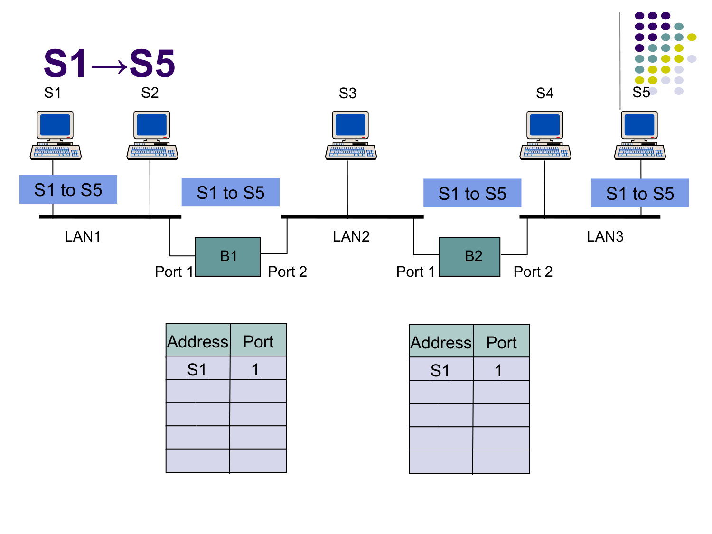
*Gambar: Cara kerja Transparent Bridge mempelajari lokasi MAC address melalui port datangnya frame.*

1. **Mekanisme Pembelajaran (*Learning*):**
   - Setiap kali sebuah frame data tiba di Port $X$, bridge membaca **Source MAC Address** di header frame.
   - Bridge mencatat relasi: `"Komputer dengan MAC tersebut dapat dijangkau melalui Port X"`.
   - Entri disimpan di dalam tabel bersama sebuah penghitung waktu kedaluwarsa (**Aging Timer**, biasanya 300 detik / 5 menit).
   - Jika entri sudah ada di tabel namun tiba melalui port berbeda, tabel langsung diperbarui (*dynamic station migration*).
   - Jika sebuah stasiun tidak pernah mengirim frame selama batas *aging timer*, entrinya dihapus otomatis untuk menghemat memori.

---

### 11.3 Tiga Aturan Pemrosesan Frame: Filtering, Forwarding, Flooding

Ketika sebuah frame tiba di Port $X$, bridge memeriksa **Destination MAC Address**:

```
                         Frame Masuk di Port X
                                   |
                       Cek Destination MAC Address
                                   |
         +-------------------------+-------------------------+
         |                                                   |
Alamat Tujuan Terdaftar di Tabel                  Alamat Tujuan TIDAK Terdaftar
         |                                           (atau Alamat Broadcast/Multicast)
+--------+--------+                                          |
|                 |                                       FLOODING
Port Sama      Port Beda (Port Y)                 (Kirim ke semua port lain,
(Port X)          |                                KECUALI Port Datangnya Frame X)
   |           FORWARDING
FILTERING     (Kirim ke Port Y saja)
(Buang Frame)
```

1. **Filtering (Penyaringan / Discard):**
   - Jika Destination MAC terdaftar di tabel dan berada pada **port yang sama persis** dengan port kedatangan frame (Port $X$).
   - *Tindakan:* Bridge langsung **membuang (*discard*)** frame tersebut. Frame tidak perlu diteruskan ke segmen LAN lain karena stasiun tujuan pasti sudah menerima frame tersebut secara langsung di segmen lokalnya sendiri.
2. **Forwarding (Penerusan Terarah):**
   - Jika Destination MAC terdaftar di tabel dan berada pada **port yang berbeda** (Port $Y$).
   - *Tindakan:* Bridge secara selektif meneruskan frame **hanya ke Port $Y$**. Segmen LAN pada port-port lainnya tidak dibebani trafik.
3. **Flooding (Penyebaran Menyeluruh):**
   - Jika Destination MAC **belum terdaftar** di tabel (*unknown unicast*), ATAU jika frame merupakan frame **Broadcast** (`FF-FF-FF-FF-FF-FF`) / Multicast.
   - *Tindakan:* Bridge menyalin dan memancarkan frame tersebut ke **seluruh port aktif lainnya**, **KECUALI port datangnya frame (Port $X$)**.

---

### 11.4 Ancaman Siklus Fisik (Bridging Loops & Broadcast Storm)

Untuk menjamin keandalan dan toleransi kegagalan, administrator jaringan sering memasang bridge/switch cadangan (*redundant links*). Namun, adanya loop fisik tertutup pada jaringan bridge Layer 2 tanpa adanya mekanisme pencegahan akan memicu bencana fatal:

1. **Broadcast Storm (Badai Broadcast):**
   - Frame broadcast (seperti ARP Request) disalin dan di-*flood* oleh Bridge 1 ke LAN 2, lalu disalin lagi oleh Bridge 2 kembali ke LAN 1, dan terus berlipat ganda secara eksponensial.
   - Karena frame Ethernet Layer 2 **tidak memiliki field TTL (Time to Live)** seperti paket IP Layer 3, frame broadcast akan berputar mengitari loop **selamanya**. Bandwidth kabel langsung jenuh 100% dan CPU switch macet (*crash*).
2. **Multiple Frame Copies:** Stasiun tujuan menerima ratusan salinan duplikat dari frame data yang sama.
3. **MAC Table Thrashing / Instability:** Karena frame yang sama berputar melintasi loop dan tiba di port yang berganti-ganti, bridge berulang kali menimpa entri tabel forwardingnya dengan cepat sehingga merusak logika pengiriman.

---

### 11.5 Spanning Tree Algorithm (IEEE 802.1D)

Untuk mencegah terjadinya loop sambil tetap mempertahankan keuntungan redundansi fisik kabel cadangan, Radia Perlman menciptakan **Spanning Tree Algorithm (STA)** yang distandarisasi sebagai **IEEE 802.1D (Spanning Tree Protocol / STP)**.

STP secara dinamis memutus siklus logis dengan mengubah topologi graf jaringan yang memiliki loop menjadi sebuah **Pohon Rentang (*Spanning Tree*) bebas siklus**, di mana port-port cadangan dinonaktifkan sementara (*blocked*).

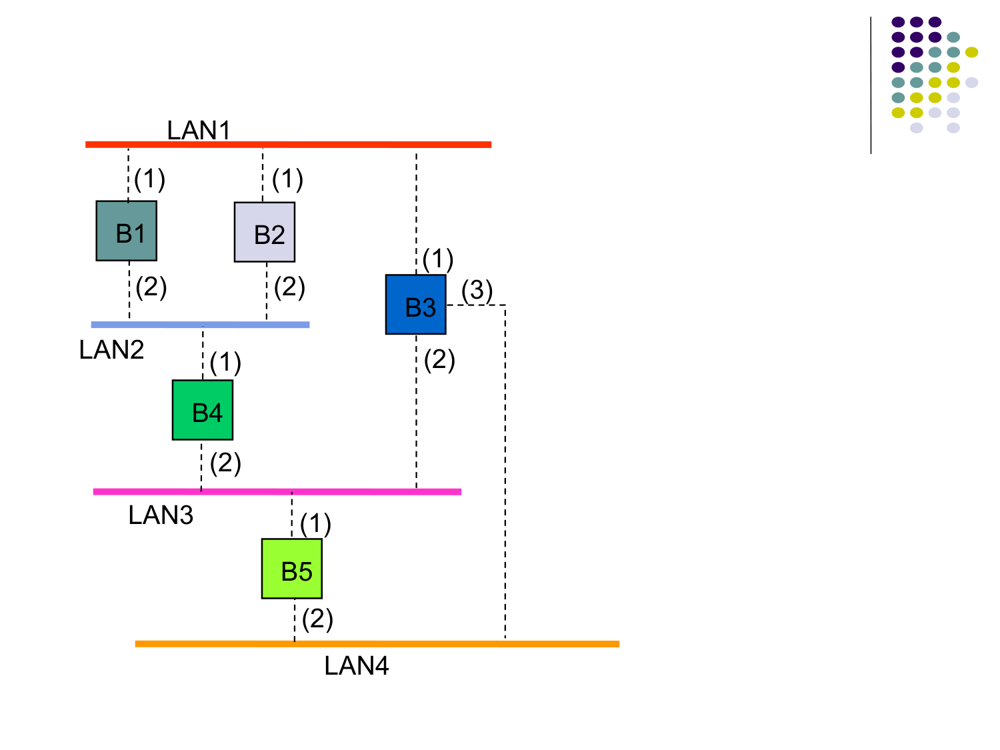
*Gambar: Transformasi topologi berulang menjadi pohon bebas loop menggunakan Spanning Tree Protocol (IEEE 802.1D).*

#### Empat Langkah Inti Algoritma Spanning Tree:

1. **Pemilihan Root Bridge (*Root Bridge Election*):**
   - Seluruh bridge di jaringan saling bertukar frame kendali khusus yang disebut **BPDU (Bridge Protocol Data Unit)** setiap 2 detik.
   - Bridge dengan **Bridge ID (BID)** terkecil terpilih secara aklamasi menjadi **Root Bridge** (Pusat akar dari seluruh pohon jaringan).
   - $\text{Bridge ID} = \text{Priority (2 Byte, default 32768)} + \text{MAC Address Bridge (6 Byte)}$.
2. **Menentukan Root Port (RP) pada Setiap Bridge Non-Root:**
   - Setiap bridge selain Root Bridge wajib memilih tepat **satu port terbaik** yang disebut **Root Port**.
   - *Root Port* adalah port pada bridge tersebut yang memiliki **biaya jalur terendah (*least-cost path*)** menuju Root Bridge (diukur dari akumulasi *Path Cost* kecepatan link kabel).
3. **Menentukan Designated Bridge & Designated Port (DP) pada Setiap Segmen LAN:**
   - Setiap segmen kabel LAN individual hanya boleh memiliki tepat **satu Designated Port**.
   - *Designated Bridge* adalah bridge yang menawarkan biaya jalur termurah dari segmen LAN tersebut menuju Root Bridge. Port pada bridge tersebut yang menempel ke LAN segmen menjadi *Designated Port*.
   - *Catatan:* Seluruh port pada Root Bridge otomatis berstatus sebagai *Designated Port*.
4. **Memblokir Port Sisa (*Blocking State*):**
   - Seluruh port bridge yang **BUKAN** merupakan *Root Port* dan **BUKAN** merupakan *Designated Port* otomatis ditempatkan ke dalam status **Blocking (Alternate/Backup Port)**.
   - Port yang diblokir dinonaktifkan dari tugas meneruskan frame data pengguna, namun tetap mendengarkan frame BPDU. Jika suatu saat link utama putus, port yang diblokir otomatis beralih menjadi aktif (*forwarding*) untuk memulihkan konektivitas!

#### Lima Status Transisi Port STP (*Port States*):
Untuk mencegah timbulnya loop sementara saat topologi berubah, port STP mengalami masa penundaan bertahap (*Forward Delay*, tipikal 15 detik):
1. **Disabled:** Port mati / kabel dicabut secara administratif.
2. **Blocking:** Tidak meneruskan data, tidak mempelajari MAC, hanya menerima BPDU.
3. **Listening (15 detik):** Memproses BPDU untuk memastikan tidak ada loop, belum mempelajari MAC, tidak meneruskan data.
4. **Learning (15 detik):** Mulai mencatat Source MAC address yang melintas ke dalam tabel forwarding, namun belum meneruskan frame data pengguna.
5. **Forwarding:** Port operasional penuh: mengirim dan menerima frame data pengguna serta memproses BPDU.

---

### 11.6 Source Routing Bridges pada Token Ring

Pada jaringan **IBM Token Ring (IEEE 802.5)**, interkoneksi bridge menggunakan pendekatan berbeda yang disebut **Source Routing**:
- Berbeda dengan jembatan transparan Ethernet di mana rute diputuskan oleh bridge, pada Source Routing **stasiun pengirim (*source station*) sendiri yang menentukan seluruh rute lintasan bridge yang harus dilalui frame hingga tiba di tujuan**.
- Stasiun pengirim menyisipkan field informasi rute khusus yang disebut **Routing Information Field (RIF)** ke dalam header frame di belakang Source MAC (diindikasikan dengan menyalakan bit pertama Source MAC $= 1$).
- RIF memuat deretan nomor pasangan `[LAN ID - Bridge ID - LAN ID...]`. Setiap bridge yang dilintasi hanya bertugas membaca RIF dan meneruskan frame ke LAN ID berikutnya sesuai petunjuk.

#### Penemuan Rute (*Route Discovery*):
Jika stasiun pengirim belum mengetahui rute ke tujuan, stasiun menjalankan pencarian rute:
1. **Single-Route Broadcast:** Pengirim mengirim frame uji singkat yang hanya melintasi pohon spanning tree satu kali hingga mencapai tujuan.
2. **All-Routes Broadcast:** Stasiun tujuan membalas dengan memancarkan frame penjelajah *All-Routes Broadcast*. Frame ini digandakan oleh setiap bridge melintasi seluruh cabang jalur yang mungkin di jaringan.
3. Seluruh variasi rute yang berbeda akan tiba kembali di stasiun pengirim. Stasiun pengirim mencatat semua rute, mengevaluasi mana yang paling cepat (jumlah hop terpendek atau waktu tunda terkecil), lalu menggunakan rute terbaik tersebut untuk seluruh sesi komunikasi selanjutnya.

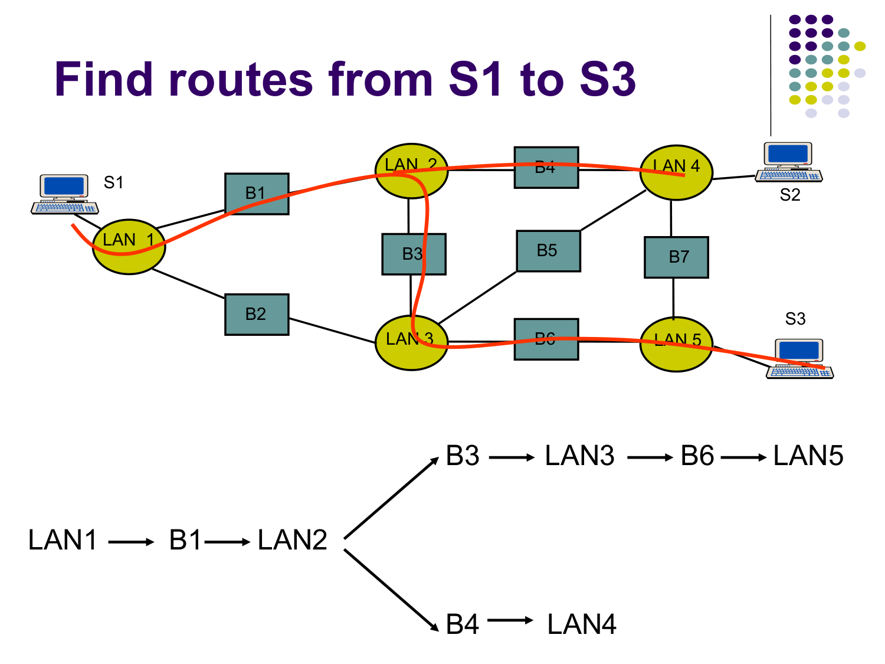
*Gambar: Penemuan rute pada Source Routing Bridges melintasi interkoneksi Token Ring.*

---

### 11.7 Virtual LAN (VLAN): Segmentasi Fisik vs Logis

Pada jaringan LAN tradisional, batas domain broadcast (*Broadcast Domain*) ditentukan secara fisik oleh kabel yang menancap ke switch atau router yang sama:
- Masalah: Jika karyawan divisi Akuntansi pindah meja kerja ke lantai 3 di samping karyawan divisi Teknik, kabel jaringannya harus dicabut dan ditarik ulang secara fisik melintasi gedung agar tetap berada di subnet Akuntansi!

**Virtual LAN (VLAN)** memecahkan masalah ini dengan memisahkan batasan fisik jaringan dari batasan logis:
- VLAN membagi satu switch fisik tunggal menjadi beberapa switch logis yang terisolasi secara virtual.
- Komputer-komputer yang berada di dalam satu VLAN yang sama dapat berkomunikasi secara langsung pada Layer 2, meskipun berada di lantai yang berbeda atau switch yang berbeda.
- Komunikasi antar-VLAN yang berbeda **wajib melintasi perangkat Layer 3 (Router atau Layer 3 Switch)**.

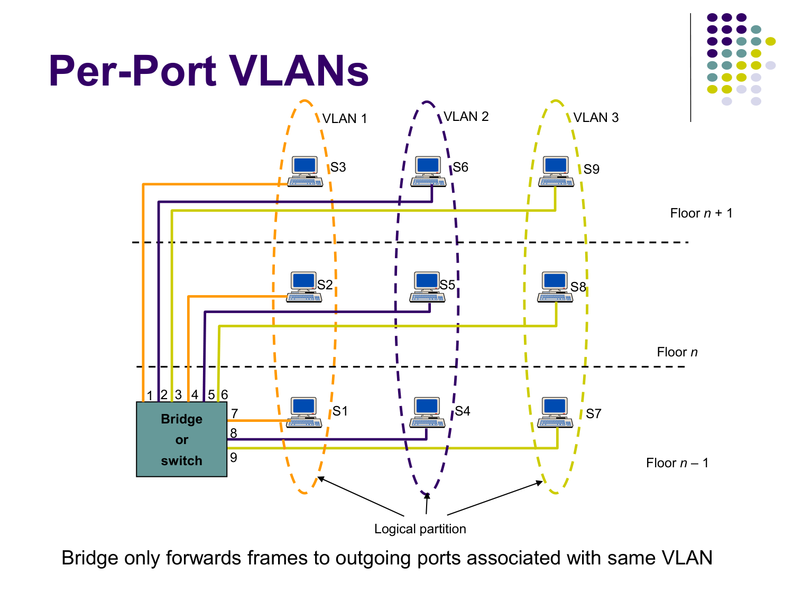
*Gambar: Partisi Fisik vs Partisi Logis Virtual LAN (VLAN) di dalam gedung bertingkat.*

---

### 11.8 Port-Based VLAN vs Tagged VLAN (IEEE 802.1Q)

1. **Port-Based VLAN (VLAN Berbasis Port):**
   - Konfigurasi statis di switch: Port 1-4 dipetakan ke VLAN 10 (Marketing), Port 5-8 dipetakan ke VLAN 20 (Engineering).
   - Switch secara ketat hanya meneruskan frame ke port-port keluar yang memiliki ID VLAN yang sama.
   - Kelemahan: Jika ada dua switch di lantai berbeda, dibutuhkan kabel fisik terpisah untuk setiap VLAN guna menghubungkan kedua switch tersebut.
2. **Tagged VLAN (Standar IEEE 802.1Q):**
   - Memungkinkan satu kabel link penghubung antar-switch (**Trunk Link**) membawa trafik dari ratusan VLAN yang berbeda secara bersamaan.
   - Switch menyisipkan **Tag VLAN 4-Byte** tepat setelah field *Source MAC Address* di dalam frame Ethernet standar:
     - **TPID (Tag Protocol Identifier - 2 Byte):** Bernilai heksadesimal `0x8100`, menandakan bahwa frame ini membawa tag IEEE 802.1Q.
     - **TCI (Tag Control Information - 2 Byte / 16 bit):**
       - **Priority (3 bit):** Kelas prioritas layanan QoS IEEE 802.1p (level 0 hingga 7, misal untuk mendahulukan paket VoIP).
       - **CFI (Canonical Format Indicator - 1 bit):** Menandakan kompatibilitas format alamat Ethernet vs Token Ring.
       - **VLAN ID (VID - 12 bit):** Mengidentifikasi nomor ID VLAN (mendukung rentang nilai $1$ hingga $4094$, total 4096 variasi ID).
   - Switch penerima di ujung trunk membaca tag VID, mencopot tag 4-byte tersebut, lalu menyerahkan frame data murni ke port akses komputer tujuan yang sesuai.

---

## 12. Ringkasan Rumus & Cheatsheet Ujian Lengkap

Berikut adalah cheatsheet komprehensif seluruh rumus, parameter kunci, dan batas efisiensi dari materi Chapter 6 untuk mempermudah persiapan menghadapi ujian:

| Nama Model / Protokol | Rumus Matematis Utama | Parameter Kunci & Keterangan | Nilai Batas / Performa Maksimum |
| :--- | :--- | :--- | :--- |
| **Normalized Delay-Bandwidth Product** | $$a = \frac{t_{\text{prop}}}{X} = \frac{R \cdot d}{v \cdot L}$$ | $t_{\text{prop}} = d/v$ (waktu propagasi)<br>$X = L/R$ (waktu transmisi frame) | $a \ll 1 \implies$ Efisiensi MAC tinggi<br>$a \gg 1 \implies$ Efisiensi MAC turun drastis |
| **Sistem 2-Stasiun (Quiet Time)** | $$\rho_{\max} = \frac{1}{1 + 2a}$$ | Membutuhkan jeda hening minimal $2 t_{\text{prop}}$ per frame | $\rho_{\max} \to 100\%$ saat $a \to 0$ |
| **Pure ALOHA Throughput** | $$S = G e^{-2G}$$ | $G$ = Beban trafik kedatangan frame per $X$<br>Vulnerable period $= 2X$ | **$S_{\max} = \frac{1}{2e} \approx 18.4\%$** dicapai saat $G = 0.5$ |
| **Slotted ALOHA Throughput** | $$S = G e^{-G}$$ | Transmisi sinkron hanya pada awal slot<br>Vulnerable period $= X$ | **$S_{\max} = \frac{1}{e} \approx 36.8\%$** dicapai saat $G = 1.0$ (2x lipat Pure ALOHA) |
| **CSMA/CD Maximum Efficiency** | $$\rho_{\max} = \frac{1}{1 + (2e + 1)a} \approx \frac{1}{1 + 6.44 a}$$ | Slot time $= 2 t_{\text{prop}}$<br>Rata-rata siklus kontensi $= e \approx 2.718$ slot | Sangat tinggi ($> 85\%$) pada $a < 0.01$; anjlok saat $a > 1$ |
| **Slot Time Minimum Ethernet** | $$\text{Slot Time} = 2 t_{\text{prop}} = 51.2\ \mu\text{s}$$<br>$$\text{Min Frame} = 64\text{ Byte (512 bit)}$$ | Waktu tempuh bolak-balik kabel $2.5\text{ km}$ + 4 repeater pada 10 Mbps | Wajib agar pemancar masih memancar saat sinyal tabrakan terburuk kembali |
| **Sistem Reservasi TDM Single-Frame** | $$\rho_{\max} = \frac{1}{1 + v}$$ | $vX$ = Durasi 1 minislot reservasi ($v < 1$) | Mendekati 100% jika minislot sangat kecil ($v \to 0$) |
| **Sistem Reservasi TDM $k$-Frame** | $$\rho_{\max} = \frac{1}{1 + \frac{v}{k}}$$ | Mengirim $k$ frame per satu kali reservasi | Lebih efisien dibanding single-frame |
| **Reservasi Akses Acak (Slotted ALOHA)** | $$\rho_{\max} = \frac{1}{1 + 2.71 v}$$ | Minislot diperebutkan via Slotted ALOHA (contoh: GPRS PRACH) | Rata-rata butuh $e \approx 2.71$ minislot per reservasi |
| **Waktu Siklus Polling (Exhaustive)** | $$T_c = \frac{M t'}{1 - \rho}$$ | $M$ = Jumlah stasiun, $t'$ = Walk time<br>$\rho = \lambda X$ = Beban total sistem | Waktu siklus stabil selama beban total $\rho < 1$ |
| **Efisiensi Polling Frame-Limited** | $$\text{Efisiensi} = \frac{1}{1 + t'/X}$$ | Maksimal 1 frame per stasiun per giliran | Bergantung pada rasio waktu alih walk-time |
| **Latensi Cincin (Ring Latency, $\\tau'$)** | $$\tau' = \frac{d}{v} + \frac{M \cdot b}{R}$$ | $d/v$ = Waktu tempuh kabel keliling cincin<br>$b$ = Bit delay per repeater stasiun (2.5 bit) | Total waktu putar 1 bit mengitari cincin penuh |
| **Token Ring: Multi-Token Reinsertion** | $$\rho_{\max} = \frac{1}{1 + a'}$$ | $a' = \frac{\tau'}{MX}$; Token dilepas segera setelah bit terakhir frame keluar | Paling efisien; mendekati 100% (digunakan pada FDDI & 16 Mbps Ring) |
| **Token Ring: Single-Token Reinsertion** | $$\rho_{\max} = \frac{1}{1 + a' + a}$$ | Token dilepas setelah header token sibuk kembali | Efisiensi menengah |
| **Token Ring: Single-Frame Reinsertion** | $$\rho_{\max} = \frac{1}{1 + a' + 1}$$ | Token baru dilepas setelah seluruh frame data berputar kembali tuntas | Efisiensi rendah jika cincin panjang (IEEE 802.5 4 Mbps awal) |
| **CDMA Orthogonality Condition** | $$\mathbf{c}_i \cdot \mathbf{c}_j = \begin{cases} N, & i = j \\ 0, & i \ne j \end{cases}$$ | Matriks Walsh rekursif:<br>$$W_{2n} = \begin{bmatrix} W_n & W_n \\ W_n & W_n^c \end{bmatrix}$$ | Mengizinkan banyak pengguna memancar simultan tanpa saling mengganggu |
| **Formula Antrean M/G/1 (P-K)** | $$E[W] = \frac{\rho E[X]}{2(1 - \rho)} \left(1 + \frac{\sigma_X^2}{(E[X])^2}\right)$$ | Antrean single-server buffer tak terhingga;<br>Untuk $M/D/1$ (panjang konstan): $\sigma_X^2 = 0$ | Waktu tunggu antrean rata-rata |
| **M/G/1 dengan Liburan (Vacation Model)** | $$E[W] = E[W]_{\text{M/G/1}} + \frac{E[V^2]}{2 E[V]}$$ | $V$ = Durasi peladen berlibur saat antrean kosong (menunggu slot/token) | Komponen penambah delay akibat media sharing |
| **Delay Transfer FDMA Bursty Traffic** | $$E[T_{\text{FDMA}}] = \frac{\rho MX}{2(1-\rho)} + \frac{MX}{2} + MX$$ | Waktu transmisi frame dari stasiun menjadi $MX$ | **Tumbuh linear sebanding dengan $M$** (Sangat buruk untuk bursty data) |
| **Delay Transfer TDMA Bursty Traffic** | $$E[T_{\text{TDMA}}] = \frac{\rho MX}{2(1-\rho)} + \frac{MX}{2} + X$$ | Stasiun memancar pada full speed $R$ saat slotnya tiba (waktu frame $= X$) | Lebih cepat dari FDMA sebesar $(M-1)X$, tapi tetap tumbuh sebanding $M$ |
| **Prioritas Wi-Fi Interframe Spacing** | $$\text{SIFS} < \text{PIFS} < \text{DIFS} < \text{EIFS}$$ | SIFS: ACK, CTS, Fragmen lanjutan<br>PIFS: Akses terpusat PCF AP<br>DIFS: Akses kontensi DCF reguler | Semakin pendek jeda hening IFS, semakin tinggi prioritas akses ke media radio |
