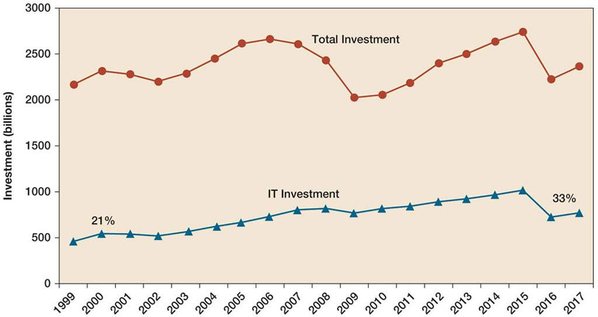
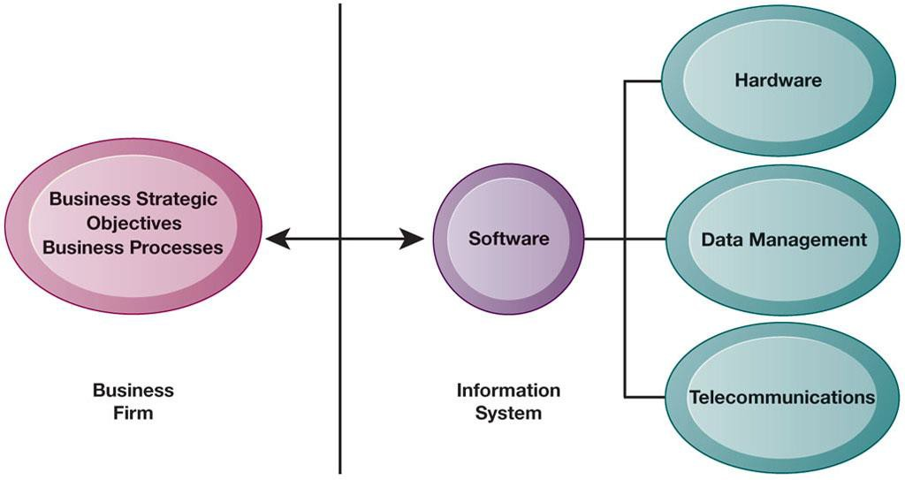
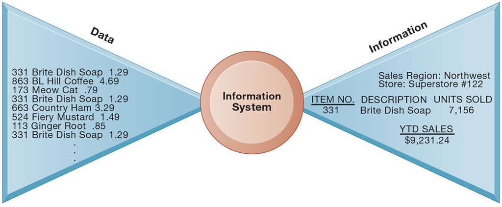
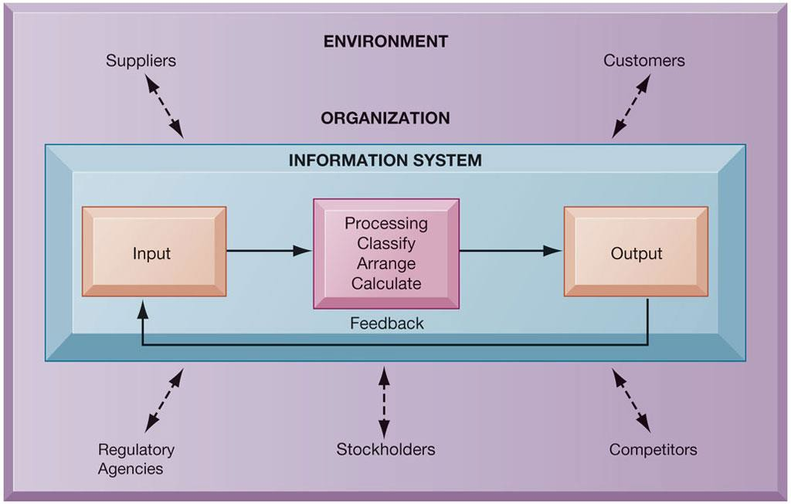
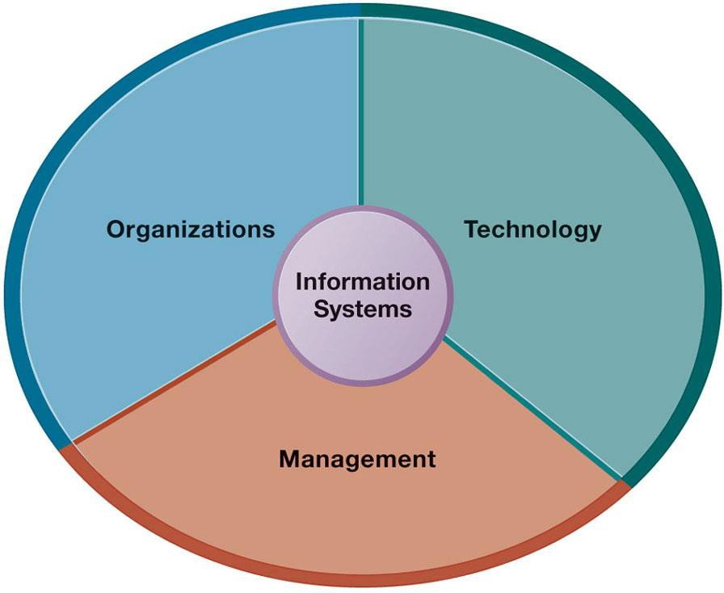
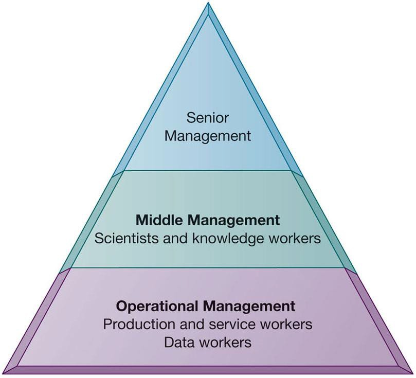
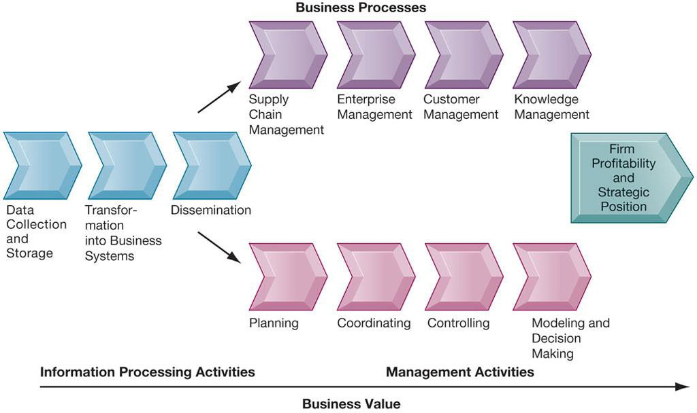
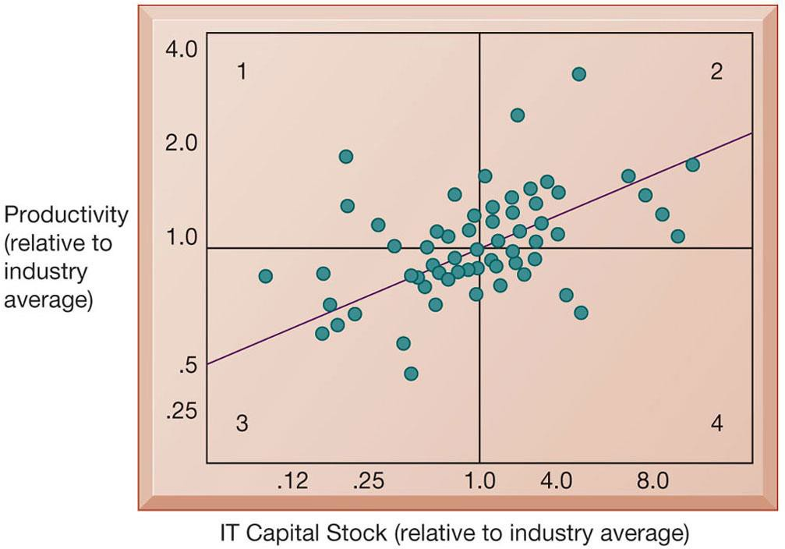
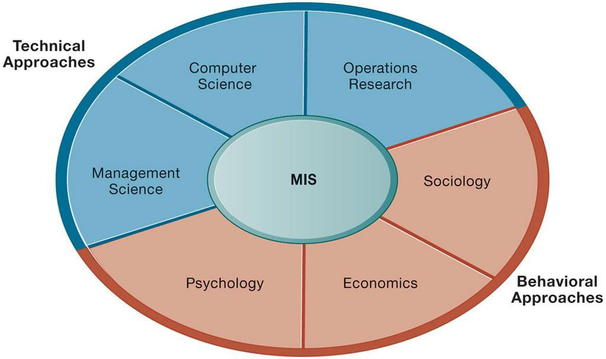
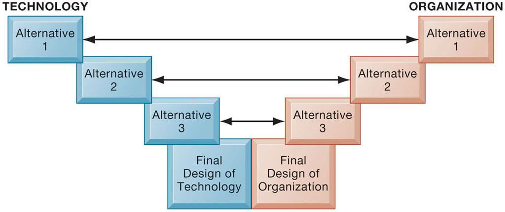

# Week 1: Information Systems in Global Business Today

> [!abstract] Ringkasan Eksekutif
> Catatan ini mengkaji peranan esensial **Sistem Informasi (SI)** dalam mentransformasi operasional bisnis global modern. Pokok bahasan mencakup definisi **Perusahaan Digital (*The Emerging Digital Firm*)**, **6 Sasaran Bisnis Strategis** investasi SI, pemahaman distingtif antara **Data vs. Informasi**, **Tiga Dimensi Sistem Informasi** (Organisasi, Manajemen, Teknologi), rantai nilai informasi bisnis (*Business Information Value Chain*), aset komplementer (*Complementary Assets*), serta pendekatan integratif **Sistem Sosioteknikal (*Sociotechnical Systems*)**.

---

## Daftar Isi (Table of Contents)
- [[#1. Transformasi Bisnis Berbasis TI dan Globalisasi]]
  - [[#1.1 Mengapa Sistem Informasi Begitu Esensial Saat Ini?]]
  - [[#1.2 Apa yang Baru dalam Sistem Informasi Manajemen?]]
  - [[#1.3 Tantangan dan Peluang Globalisasi: A Flattened World]]
  - [[#1.4 Karakteristik Munculnya Perusahaan Digital (The Emerging Digital Firm)]]
- [[#2. 6 Sasaran Bisnis Strategis Sistem Informasi]]
  - [[#2.1 Keunggulan Operasional (Operational Excellence)]]
  - [[#2.2 Produk, Layanan, dan Model Bisnis Baru (New Products, Services, & Business Models)]]
  - [[#2.3 Keintiman dengan Pelanggan dan Pemasok (Customer & Supplier Intimacy)]]
  - [[#2.4 Peningkatan Pengambilan Keputusan (Improved Decision Making)]]
  - [[#2.5 Keunggulan Kompetitif (Competitive Advantage)]]
  - [[#2.6 Kelangsungan Hidup Bisnis (Survival)]]
  - [[#2.7 Interdependensi Organisasi dan Sistem Informasi]]
- [[#3. Hakikat dan Komponen Sistem Informasi]]
  - [[#3.1 Perbedaan Konseptual: Data vs Informasi]]
  - [[#3.2 Siklus Pemrosesan Informasi (Input, Processing, Output, Feedback)]]
- [[#4. Tiga Dimensi Sistem Informasi (Dimensions of IS)]]
  - [[#4.1 Dimensi Organisasi (Organizations)]]
  - [[#4.2 Dimensi Manajemen (Management)]]
  - [[#4.3 Dimensi Teknologi (Technology)]]
  - [[#4.4 Studi Kasus Komprehensif: Sistem Pelacakan UPS (DIAD & ORION)]]
- [[#5. Perspektif Bisnis terhadap Sistem Informasi]]
  - [[#5.1 Rantai Nilai Informasi Bisnis (Business Information Value Chain)]]
  - [[#5.2 Variasi Pengembalian Investasi TI (Variation in Returns)]]
  - [[#5.3 Aset Komplementer: Modal Organisasi, Manajerial, dan Sosial]]
- [[#6. Pendekatan Kontemporer terhadap Sistem Informasi]]
  - [[#6.1 Pendekatan Teknis (Technical Approach)]]
  - [[#6.2 Pendekatan Perilaku (Behavioral Approach)]]
  - [[#6.3 Pendekatan Sosioteknikal (Sociotechnical Perspective)]]
- [[#7. Ringkasan & Latihan Ujian (Cheatsheet)]]

---

## 1. Transformasi Bisnis Berbasis TI dan Globalisasi

### 1.1 Mengapa Sistem Informasi Begitu Esensial Saat Ini?
Dalam lanskap bisnis modern, sistem informasi bukan lagi sekadar alat administrasi pelengkap di divisi back-office, melainkan **fondasi penentu daya hidup (*vital foundation*)** bagi kelangsungan usaha. Transformasi ini dipicu oleh:
- **Pengeluaran Modal TI Masif:** Investasi teknologi informasi menyumbang lebih dari 50% dari total pengeluaran modal peralatan bisnis di negara maju.


*Gambar 1.1: Tren Investasi Modal Teknologi Informasi Korporat (Laudon & Laudon)*
- **Operasional Real-Time:** Pasar keuangan, e-commerce, dan rantai pasokan global bergerak secara instan 24/7.
- **Ketergantungan Ekosistem:** Tanpa infrastruktur komputasi dan jaringan, operasional ritel besar (seperti Amazon, Walmart), perbankan, dan manufaktur akan lumpuh total.

### 1.2 Apa yang Baru dalam Sistem Informasi Manajemen?
Perkembangan teknologi informasi dikelompokkan ke dalam tiga pilar utama:
1. **Pilar Teknologi (*Technology*):**
   - *Cloud Computing Platform:* Pergeseran dari server lokal ke infrastruktur komputasi awan elastis (AWS, Azure, Google Cloud).
   - *Big Data & IoT (Internet of Things):* Lonjakan volume data dari sensor cerdas, perangkat wearable, dan log transaksi.
   - *Mobile Digital Platform:* Pertumbuhan smartphone dan tablet sebagai antarmuka utama pekerjaan eksekutif dan staf lapangan.
   - *Kecerdasan Buatan (AI) & Machine Learning:* Penerapan analitik prediktif, pemrosesan bahasa alami (NLP), dan otomatisasi proses robotik (RPA).
2. **Pilar Manajemen (*Management*):**
   - *Enterprise Social Networking:* Penggunaan Slack, Microsoft Teams, dan workplace tools untuk koordinasi instan.
   - *Business Intelligence & Visual Dashboards:* Pengambilan keputusan berbasis visualisasi data real-time menggantikan intuisi tebakan.
   - *Kolaborasi Virtual Global:* Peningkatan drastis rapat virtual jarak jauh dan tim terdistribusi lintas benua.
3. **Pilar Organisasi (*Organizations*):**
   - *Social Business:* Pelibatan pelanggan, karyawan, dan pemasok melalui media sosial korporat.
   - *Telework & Fleksibilitas Lokasi:* Bekerja dari mana saja (*remote work*) menjadi model operasi permanen.
   - *Co-creation of Value:* Pelanggan terlibat langsung dalam mendesain dan memberi masukan produk secara interaktif.

### 1.3 Tantangan dan Peluang Globalisasi: A Flattened World
Thomas Friedman mencetuskan istilah *"The World is Flat"* untuk menggambarkan bagaimana internet dan telekomunikasi global meruntuhkan hambatan geografis dan biaya komunikasi.
- **Peluang:** Perusahaan kecil dapat mengakses pasar global dan merekrut talenta terbaik di seluruh dunia dengan biaya rendah.
- **Tantangan Kompetisi Sengit:** Pasar lokal kini rentan diserbu oleh pesaing global berkemampuan biaya rendah (*low-cost producers*).
- **Kebutuhan Adaptasi Cepat:** Bisnis wajib memiliki sistem pelacakan persediaan dan komunikasi instan agar tidak tersingkir.

### 1.4 Karakteristik Munculnya Perusahaan Digital (The Emerging Digital Firm)
> [!info] Definisi Perusahaan Digital
> **Perusahaan Digital (*Digital Firm*)** adalah organisasi di mana hampir semua hubungan bisnis signifikan dengan pelanggan, pemasok, dan karyawan dimediasi dan didukung secara digital.

Ciri-ciri fundamental Perusahaan Digital:
- **Digitalisasi Proses Bisnis Inti:** Proses operasional diselesaikan melalui jaringan digital lintas enterprise atau antarentitas.
- **Manajemen Aset Digital:** Aset korporat utama (keuangan, kekayaan intelektual, sumber daya manusia) dikelola dan ditransaksikan secara digital.
- **Respon Cepat terhadap Perubahan Lingkungan:** Deteksi dini fluktuasi pasar berkat umpan balik sensor dan analitik data langsung.
- **Fleksibilitas Waktu dan Ruang (*Time Shifting & Space Shifting*):**
  - *Time Shifting:* Operasional bisnis tidak dibatasi oleh jam kerja tradisional 08.00–17.00; transaksi berlangsung kontinu 24 jam sehari.
  - *Space Shifting:* Pekerjaan diselesaikan di luar batasan fisik kantor atau batas wilayah negara.

---

## 2. 6 Sasaran Bisnis Strategis Sistem Informasi

Perusahaan berinvestasi masif dalam sistem informasi untuk mencapai enam sasaran bisnis strategis (*strategic business objectives*):

```
                     ┌────────────────────────────────────────┐
                     │  6 SASARAN STRATEGIS SISTEM INFORMASI  │
                     └───────────────────┬────────────────────┘
         ┌───────────────┬───────────────┼───────────────┬────────────────┐
         ▼               ▼               ▼               ▼                ▼
   1. OPERATIONAL   2. PRODUK &     3. KEINTIMAN    4. KEPUTUSAN     5. KEUNGGULAN
     EXCELLENCE     MODEL BISNIS    PELANGGAN &      BERKUALITAS      KOMPETITIF
                     BARU             PEMASOK
                                                                          │
                                         ┌────────────────────────────────┘
                                         ▼
                                    6. SURVIVAL
                                 (Bertahan Hidup)
```

### 2.1 Keunggulan Operasional (Operational Excellence)
- **Tujuan:** Mencapai tingkat efisiensi dan produktivitas tertinggi dalam operasi bisnis untuk menghasilkan profitabilitas superior.
- **Peran SI:** Mengotomasi alur kerja, menghilangkan pemborosan waktu, dan memangkas biaya perantara.
- **Contoh Kasus Klasik: Walmart Retail Link System**
  - Walmart menghubungkan sistem kasir kasir (*Point of Sale - POS*) langsung ke sistem persediaan para pemasoknya (seperti Procter & Gamble).
  - Begitu satu kotak deterjen dipindai di kasir, pesanan pengganti langsung dibuat di pabrik pemasok secara otomatis.
  - Hasil: Biaya penyimpanan gudang mendekati nol, perputaran barang sangat cepat, dan harga jual menjadi yang termurah di industri.

### 2.2 Produk, Layanan, dan Model Bisnis Baru (New Products, Services, & Business Models)
- **Model Bisnis:** Cara perusahaan menghasilkan, mendistribusikan, dan menjual produk/jasa untuk menciptakan kekayaan finansial.
- **Peran SI:** Menjadi landasan (*enabler*) bagi penciptaan model bisnis yang mustahil ada di era konvensional.
- **Contoh Nyata:**
  - *Apple:* Mengubah total industri musik fisik (kaset/CD) menjadi industri distribusi digital melalui iTunes dan Apple Music, kemudian merevolusi smartphone lewat ekosistem App Store.
  - *Netflix:* Bermigrasi dari penyewaan DVD fisik via pos menjadi platform *streaming video-on-demand* global berbasis algoritma rekomendasi.
  - *Uber & Grab:* Menghubungkan pengemudi dan penumpang secara dinamis tanpa memiliki armada mobil pribadi.

### 2.3 Keintiman dengan Pelanggan dan Pemasok (Customer & Supplier Intimacy)
- **Keintiman dengan Pelanggan (*Customer Intimacy*):**
  - Mengenal pelanggan secara mendalam meningkatkan kepuasan dan memicu pembelian berulang (*repeat order*).
  - *Contoh: Mandarin Oriental Hotel Group.* Sistem sentral merekam preferensi personal tamu (suhu ruangan favorit, koran yang dibaca, nomor kamar kesukaan). Ketika tamu check-in di cabang hotel mana pun di seluruh dunia, kamar telah disetel sesuai preferensi mereka.
- **Keintiman dengan Pemasok (*Supplier Intimacy*):**
  - Semakin dekat komunikasi dengan pemasok, semakin akurat mereka merespons pasokan bahan mentah, menurunkan biaya produksi.
  - *Contoh: JCPenney.* Pemasok kemeja pria di Hong Kong dapat langsung memonitor angka penjualan kemeja di setiap gerai JCPenney di AS dan menjadwalkan pengiriman kain secara presisi tanpa menunggu surat pemesanan formal.

### 2.4 Peningkatan Pengambilan Keputusan (Improved Decision Making)
- **Masalah Pendekatan Tradisional:** Manajer mengandalkan ramalan (*forecast*), intuisi, atau keberuntungan akibat ketiadaan data akurat. Dampaknya: *overproduction*, alokasi sumber daya meleset, dan kehilangan pelanggan.
- **Solusi SI:** Menyediakan data operasional yang akurat, terstruktur, dan disajikan secara *real-time*.
- **Contoh: Verizon Executive Dashboard**
  - Manajer Verizon memonitor kinerja jaringan, komplain pelanggan, dan tingkat pemadaman sinyal melalui antarmuka dasbor digital real-time.
  - Keputusan perbaikan teknis dan alokasi teknisi darurat dapat dieksekusi dalam hitungan menit, bukan berhari-hari.

### 2.5 Keunggulan Kompetitif (Competitive Advantage)
- Tercapai ketika perusahaan melakukan satu atau lebih hal berikut:
  - Melakukan sesuatu lebih baik dari para pesaing.
  - Menjual produk berkualitas sama dengan harga lebih murah.
  - Merespons kebutuhan pelanggan dan pemasok secara real-time.
- Menggabungkan keunggulan operasional, keintiman pelanggan, dan produk inovatif berujung pada laba di atas rata-rata industri (*contoh: Apple, Walmart, Amazon*).

### 2.6 Kelangsungan Hidup Bisnis (Survival)
- **Pendorong Kebutuhan:** Perusahaan berinvestasi dalam sistem informasi semata-mata karena **keharusan bertahan hidup (*necessity of doing business*)**.
- **Kategori Pendorong:**
  1. *Standar Industri:* Pengenalan mesin ATM (*Automated Teller Machine*) oleh Citibank pada 1977 memaksa seluruh bank di dunia ikut menyediakan ATM agar tidak kehilangan nasabah.
  2. *Kepatuhan Regulasi Pemerintah:*
     - UU Sarbanes-Oxley (SOX) di AS menuntut sistem pencatatan audit keuangan terenkripsi.
     - UU Perlindungan Data Pribadi (UU PDP) di Indonesia menuntut korporasi membangun sistem pengamanan data yang tersertifikasi.

### 2.7 Interdependensi Organisasi dan Sistem Informasi
Hubungan antara strategi bisnis, aturan, dan prosedur organisasi dengan perangkat keras, perangkat lunak, dan basis data bersifat **timbal balik (*interdependent*)**:


*Gambar 1.2: Hubungan Interdependensi Antara Organisasi dan Sistem Informasi*
- Strategi bisnis menentukan sistem informasi apa yang harus dibangun.
- Sistem informasi yang dimiliki saat ini menentukan strategi bisnis apa yang realistis untuk dieksekusi di masa depan.

```
┌─────────────────────────────────┐           ┌─────────────────────────────────┐
│     STRATEGI, ATURAN, DAN       │◄─────────►│     PERANGKAT KERAS, PERANGKAT  │
│   PROSEDUR BISNIS PERUSAHAAN    │           │    LUNAK, BASIS DATA & JARINGAN │
└─────────────────────────────────┘           └─────────────────────────────────┘
                ▲                                              ▲
                │                  PERUBAHAN                   │
                └──────────────────────────────────────────────┘
```

---

## 3. Hakikat dan Komponen Sistem Informasi

### 3.1 Perbedaan Konseptual: Data vs Informasi
> [!note] Definisi Kritis
> - **Data:** Aliran fakta mentah (*raw facts*) yang mewakili peristiwa yang terjadi dalam organisasi atau lingkungan fisik sebelum diorganisasikan ke dalam bentuk yang dapat dipahami dan digunakan manusia.
> - **Informasi:** Data yang telah diolah, dibentuk, dan disusun ke dalam format yang memiliki makna dan nilai guna bagi manusia untuk mengambil keputusan.


*Gambar 1.3: Konsep Data Mentah vs Informasi yang Diproses*

#### Tabel Komparasi: Data vs Informasi
| Parameter | Data | Informasi |
| :--- | :--- | :--- |
| **Bentuk** | Fakta mentah, angka acak, kode | Laporan terstruktur, grafik, tren, ringkasan |
| **Konteks** | Tidak memiliki konteks eksplisit | Memiliki konteks bisnis dan relevansi waktu |
| **Contoh Kasus Supermarket** | `3311 02/10/26 12.50 SKU402 $3.50` | Penjualan produk susu merek X meningkat 24% pada hari libur nasional |
| **Pengguna** | Mesin, sensor, database storage | Manajer, analis, pengambil keputusan |

### 3.2 Siklus Pemrosesan Informasi (Input, Processing, Output, Feedback)
Secara teknis, sistem informasi mengumpulkan, menyimpan, dan menyebarkan informasi melalui empat tahapan utama:


*Gambar 1.4: Fungsi-Fungsi Fundamental Sistem Informasi (Input, Processing, Output, Feedback)*

```
┌────────────────────────────────────────────────────────────────────────┐
│                        LINGKUNGAN BISNIS                               │
│  (Pelanggan, Pemasok, Pesaing, Pemegang Saham, Instansi Regulator)     │
└───────────────────────────────────┬────────────────────────────────────┘
                                    │
                                    ▼
┌────────────────────────────────────────────────────────────────────────┐
│                            SISTEM INFORMASI                            │
│                                                                        │
│   ┌──────────────┐         ┌──────────────┐         ┌──────────────┐   │
│   │    INPUT     ├────────►│  PROCESSING  ├────────►│    OUTPUT    │   │
│   │(Data Mentah) │         │ (Pengolahan) │         │ (Informasi)  │   │
│   └──────────────┘         └──────┬───────┘         └──────┬───────┘   │
│          ▲                        │                        │           │
│          │                        ▼                        │           │
│          │                 ┌──────────────┐                │           │
│          │                 │ CLASSIFYING, │                │           │
│          │                 │ CALCULATING, │                │           │
│          │                 │  SUMMARIZING │                │           │
│          │                 └──────────────┘                │           │
│          │                                                 │           │
│          └────────────────── FEEDBACK ◄────────────────────┘           │
│                       (Umpan Balik Evaluasi)                           │
└────────────────────────────────────────────────────────────────────────┘
```

1. **Input:** Aktivitas mengumpulkan data mentah dari dalam organisasi atau lingkungan eksternalnya (contoh: pemindaian barcode kasir).
2. **Processing (Pemrosesan):** Aktivitas mengubah input mentah menjadi bentuk bermakna (klasifikasi, kalkulasi matematis, pengurutan, pengelompokan).
3. **Output:** Aktivitas mentransfer informasi hasil olahan kepada orang-orang atau proses yang membutuhkan (laporan penjualan, faktur, slip gaji).
4. **Feedback (Umpan Balik):** Output yang dikembalikan kepada anggota organisasi terkait untuk mengevaluasi atau mengoreksi tahap input (misal: notifikasi bahwa stok menipis memicu pesanan baru).

---

## 4. Tiga Dimensi Sistem Informasi (Dimensions of IS)


*Gambar 1.5: Tiga Pilar Dimensi Sistem Informasi: Organisasi, Manajemen, dan Teknologi*

Untuk memahami sistem informasi seutuhnya, seseorang tidak boleh hanya memandang dari sudut pandang teknologi komputer (*computer literacy*). Diperlukan **pemahaman sistem informasi (*information systems literacy*)** yang mencakup pemahaman dimensi perilaku dan organisasi.

```
                           ┌───────────────────────────┐
                           │ TIGA DIMENSI LENGKAP S.I. │
                           └─────────────┬─────────────┘
                ┌────────────────────────┼────────────────────────┐
                ▼                        ▼                        ▼
         1. ORGANISASI             2. MANAJEMEN             3. TEKNOLOGI
       • Tingkatan Manajerial    • Visi & Kepemimpinan    • Hardware Komputer
       • Fungsi Bisnis Utama     • Pengambilan Keputusan  • Software Aplikasi
       • Budaya & Politik        • Strategi Korporat      • Teknologi Database
       • Proses Bisnis Standar   • Alokasi Sumber Daya    • Jaringan & Telekomunikasi
```

### 4.1 Dimensi Organisasi (Organizations)
Organisasi memiliki struktur formal yang terdiri dari tingkat wewenang dan pembagian kerja yang jelas:

*Gambar 1.6: Tingkatan Manajemen dan Kelompok Kerja dalam Organisasi Bisnis*

- **Tingkatan Hierarki Organisasi:**
  1. *Senior Management (Manajemen Puncak):* Membuat keputusan strategis jangka panjang terkait produk, layanan, dan arah perusahaan.
  2. *Middle Management (Manajemen Menengah):* Menjalankan program dan rencana manajemen puncak (ilmuwan dan pekerja pengetahuan/*knowledge workers* berada pada tingkatan ini).
  3. *Operational Management (Manajemen Operasional):* Memantau aktivitas operasional harian (pekerja data dan pekerja layanan/produksi).
- **Fungsi Bisnis Utama:** Penjualan & Pemasaran (*Sales & Marketing*), Manufaktur & Produksi (*Manufacturing & Production*), Keuangan & Akuntansi (*Finance & Accounting*), Sumber Daya Manusia (*Human Resources*).
- **Budaya Organisasi (*Organizational Culture*):** Kumpulan asumsi, nilai, dan cara berbisnis yang disepakati bersama oleh anggota organisasi dan sering kali menimbulkan resistensi saat teknologi baru diimplementasikan.

### 4.2 Dimensi Manajemen (Management)
- Peran manajer adalah memahami situasi yang dihadapi organisasi, mengambil keputusan rasional, merumuskan rencana tindakan, dan mengalokasikan sumber daya untuk memecahkan persoalan bisnis.
- Manajemen bertanggung jawab menciptakan produk dan layanan baru serta menciptakan kembali (*re-creating*) organisasi jika terjadi disrupsi pasar.

### 4.3 Dimensi Teknologi (Technology)
Teknologi informasi adalah salah satu dari banyak alat yang digunakan manajer untuk mengatasi perubahan:
- **Computer Hardware:** Peralatan fisik yang digunakan untuk input, proses, dan output.
- **Computer Software:** Instruksi terprogram yang mengontrol kerja komponen perangkat keras.
- **Data Management Technology:** Perangkat lunak pengatur penyimpanan dan organisasi data fisik (misal RDBMS Oracle, MySQL).
- **Networking & Telecommunications Technology:** Media fisik dan perangkat lunak yang menghubungkan perangkat keras untuk berbagi data/suara (Internet, intranet, ekstranet).
- **IT Infrastructure:** Fondasi gabungan dari seluruh teknologi di atas ditambah sumber daya manusia yang mengelolanya.

### 4.4 Studi Kasus Komprehensif: Sistem Pelacakan UPS (DIAD & ORION)
Sistem logistik United Parcel Service (UPS) adalah contoh ideal yang mengintegrasikan ketiga dimensi SI:
- **Dimensi Teknologi:**
  - Perangkat genggam **DIAD (*Delivery Information Acquisition Device*)** yang dibawa kurir dilengkapi barcode scanner, GPS, konektivitas seluler, dan penangkap tanda tangan digital.
  - Sistem pengoptimalan rute **ORION (*On-Road Integrated Optimization and Navigation*)** yang menggunakan algoritma lanjutan untuk memangkas jutaan mil perjalanan armada truk.
  - Server pusat penyimpanan data di Mahwah, New Jersey yang melacak puluhan juta paket per hari.
- **Dimensi Organisasi:**
  - Prosedur standar kerja yang sangat ketat bagi para pengemudi (cara memegang kunci, urutan melangkah keluar truk, rute minim belok kiri).
  - Layanan pelacakan mandiri paket berbasis web bagi pelanggan korporat dan individu.
- **Dimensi Manajemen:**
  - Komitmen pimpinan eksekutif untuk menempatkan efisiensi waktu, keselamatan pengemudi, dan kepuasan pelanggan sebagai tolok ukur kinerja utama (*KPI*).

---

## 5. Perspektif Bisnis terhadap Sistem Informasi

### 5.1 Rantai Nilai Informasi Bisnis (Business Information Value Chain)
Investasi pada SI tidak sekadar membeli barang modal, melainkan bagian dari proses penciptaan nilai ekonomi.


*Gambar 1.7: The Business Information Value Chain — Dari Pengolahan Data hingga Penciptaan Nilai Bisnis*

```
┌────────────────────────────────────────────────────────────────────────┐
│                        AKTIVITAS PENGOLAHAN INFORMASI                  │
│                                                                        │
│  Data Collection  ──►  Transformation  ──►  Storage  ──►  Distribution │
│   (Data Mentah)         (Analisis Bisnis)    (Database)     (Diseminasi)│
└───────────────────────────────────┬────────────────────────────────────┘
                                    │ Menghasilkan
                                    ▼
┌────────────────────────────────────────────────────────────────────────┐
│                        AKTIVITAS MANAJEMEN BISNIS                      │
│                                                                        │
│  Planning (Perencanaan) ──► Coordinating ──► Controlling ──► Modeling  │
└───────────────────────────────────┬────────────────────────────────────┘
                                    │ Berujung pada
                                    ▼
┌────────────────────────────────────────────────────────────────────────┐
│                       NILAI BISNIS PERUSAHAAN                          │
│                                                                        │
│  • Peningkatan Efisiensi Operasional   • Peningkatan Posisi Finansial  │
│  • Peningkatan Pendapatan Penjualan    • Nilai Saham & Keunggulan Pasar│
└────────────────────────────────────────────────────────────────────────┘
```

### 5.2 Variasi Pengembalian Investasi TI (Variation in Returns)
Penelitian empiris menunjukkan bahwa perusahaan yang menginvestasikan jumlah uang yang persis sama pada teknologi informasi dapat memperoleh hasil pengembalian (*return on investment - ROI*) yang sangat berbeda drastis:


*Gambar 1.8: Variasi Pengembalian Investasi TI: Peran Kritis Aset Komplementer*
- Sebagian kecil perusahaan meraih lompatan laba berlipat ganda (*high performers*).
- Sebagian besar memperoleh hasil rata-rata (*moderate performers*).
- Sebagian lainnya justru merugi (*low performers*).

> [!warning] Mengapa Terjadi Variasi Hasil Investasi TI?
> Perbedaan hasil tidak disebabkan oleh mesin komputernya, melainkan oleh keberadaan **Aset Komplementer (*Complementary Assets*)**!

### 5.3 Aset Komplementer: Modal Organisasi, Manajerial, dan Sosial
Aset komplementer adalah aset tambahan yang diwajibkan ada agar investasi utama (TI) mampu menghasilkan nilai riil bagi perusahaan.

#### Tiga Pilar Aset Komplementer
1. **Aset Organisasi (*Organizational Assets*):**
   - Budaya organisasi yang mendukung efisiensi, efektivitas, dan keterbukaan inovasi.
   - Model bisnis yang tepat sasaran.
   - Proses bisnis yang terdefinisi dengan efisien (telah dioptimasi sebelum dikomputerisasi).
   - Desentralisasi wewenang pengambilan keputusan.
2. **Aset Manajerial (*Managerial Assets*):**
   - Dukungan kuat dan komitmen nyata dari manajemen puncak (*strong senior management support*).
   - Insentif dan penghargaan berbasis inovasi bagi staf.
   - Kerja sama tim (*teamwork*) dan lingkungan kerja kolaboratif.
   - Program pelatihan manajerial untuk adopsi sistem baru.
3. **Aset Sosial (*Social Assets / Kelembagaan Luar*):**
   - Infrastruktur internet dan telekomunikasi publik yang stabil dan terjangkau.
   - Standar teknologi industri yang konsisten.
   - Sistem hukum dan regulasi yang melindungi hak kekayaan intelektual dan privasi data.
   - Ketersediaan tenaga kerja terdidik di pasar tenaga kerja lokal.

---

## 6. Pendekatan Kontemporer terhadap Sistem Informasi


*Gambar 1.9: Pendekatan Kontemporer Studi Sistem Informasi (Teknis vs Perilaku)*

Studi tentang sistem informasi merupakan bidang multidisiplin yang memadukan perspektif teknis dan perilaku:

```
                  ┌────────────────────────────────────────┐
                  │    PENDEKATAN STUDI SISTEM INFORMASI   │
                  └───────────────────┬────────────────────┘
          ┌───────────────────────────┴───────────────────────────┐
          ▼                                                       ▼
   PENDEKATAN TEKNIS                                      PENDEKATAN PERILAKU
  (Technical Approach)                                   (Behavioral Approach)
• Computer Science                                     • Psikologi (Psychology)
• Management Science                                   • Sosiologi (Sociology)
• Operations Research                                  • Ekonomi (Economics)
          │                                                       │
          └───────────────────────────┬───────────────────────────┘
                                      ▼
                           SISTEM SOSIOTEKNIKAL
                         (Sociotechnical Approach)
               Optimasi simultan antara kinerja teknologi
                 dan struktur sosial-perilaku organisasi
```

### 6.1 Pendekatan Teknis (Technical Approach)
- Menekankan model matematis normatif, kemampuan komputasi fisik, dan arsitektur formal.
- **Disiplin Utama:**
  - *Computer Science:* Teori komputasi, algoritma, metode penyimpanan dan akses data.
  - *Management Science:* Model pengambilan keputusan dan manajemen praktik.
  - *Operations Research:* Optimasi matematis parameter organisasi (transportasi, kontrol inventaris).

### 6.2 Pendekatan Perilaku (Behavioral Approach)
- Menekankan perubahan perilaku manusia, sikap kelompok, dan dinamika politik selama perancangan dan implementasi SI.
- **Disiplin Utama:**
  - *Sosiologi:* Bagaimana sistem memengaruhi struktur kelompok dan organisasi.
  - *Psikologi:* Bagaimana pengambil keputusan memahami informasi (*human-computer interaction*).
  - *Ekonomi:* Bagaimana sistem mengubah struktur biaya dan pasar.

### 6.3 Pendekatan Sosioteknikal (Sociotechnical Perspective)
Buku teks Laudon & Laudon mengadopsi pendekatan **Sistem Sosioteknikal**:


*Gambar 1.10: Perspektif Sosioteknikal — Optimasi Bersama Teknologi dan Organisasi*
- Kinerja sistem organisasi tercapai optimal ketika teknologi dan organisasi saling beradaptasi satu sama lain (*mutual adjustment*).
- Teknologi harus diubah dan dirancang agar sesuai dengan kebutuhan organisasi dan pengguna, sementara organisasi dan manusia harus dilatih dan disesuaikan agar mampu memanfaatkan kapabilitas teknologi baru.

---

## 7. Ringkasan & Latihan Ujian (Cheatsheet)

> [!tip] Rangkuman Cepat untuk Ujian (Exam Quick Sheet)
> 1. **Perusahaan Digital:** Organisasi di mana relasi bisnis penting ditengahi secara digital; fleksibel terhadap waktu (*time shifting*) dan ruang (*space shifting*).
> 2. **6 Sasaran Strategis SI:**
>    - Operational Excellence (contoh: Walmart)
>    - New Products & Business Models (contoh: Apple, Netflix)
>    - Customer/Supplier Intimacy (contoh: Mandarin Oriental, JCPenney)
>    - Improved Decision Making (contoh: Verizon dashboard)
>    - Competitive Advantage (contoh: UPS)
>    - Survival (contoh: Mesin ATM, regulasi pemerintah)
> 3. **Data vs Informasi:** Data adalah fakta mentah tanpa konteks; Informasi adalah data yang telah diproses hingga bernilai guna bagi pengambilan keputusan.
> 4. **Tiga Dimensi SI:** Organisasi (struktur, proses, budaya), Manajemen (strategi, kepemimpinan), Teknologi (hardware, software, data, jaringan).
> 5. **Aset Komplementer:** Investasi pendukung non-teknologi (organisasi, manajerial, sosial) yang wajib ada agar investasi TI menghasilkan ROI positif.
> 6. **Pendekatan Sosioteknikal:** Memadukan keunggulan teknis komputasi dengan perilaku sosial-organisasi demi optimasi bersama.
