---
title: "Week 2: Global E-Business, Collaboration, and Organization Strategy"
tags:
  - business-processes
  - tps-mis-dss-ess
  - enterprise-applications
  - erp-scm-crm-kms
  - collaboration-tools
  - porter-five-forces
  - value-chain
  - value-web
  - obsidian-notes
course: KOM1333A - Sistem Informasi
textbook: "Management Information Systems (Laudon & Laudon, 16th Ed), Chapters 2 & 3; Slide Kuliah Dosen Bab 2"
date: 2026-10-08
type: study-note
---

# Week 2: Global E-Business, Collaboration, and Organization Strategy

> [!abstract] Ringkasan Eksekutif
> Catatan ini mengintegrasikan materi **Chapter 2 & Chapter 3 Laudon & Laudon** serta **Slide Bab 2 Dosen (KOM1333A)** ke dalam pemahaman utuh mengenai:
> 1. **Proses Bisnis & Transformasi TI:** Alur lintas fungsi (*cross-functional*) dan otomatisasi alur kerja.
> 2. **Sistem untuk Berbagai Kelompok Manajemen:** Karakteristik dan hirarki sistem **TPS, MIS, DSS, dan ESS**.
> 3. **Aplikasi Perusahaan (*Enterprise Applications*):** Ekosistem integrasi **ERP, SCM, CRM, dan KMS** serta Intranet/Ekstranet.
> 4. **Kolaborasi & Bisnis Sosial:** Matriks Kolaborasi Waktu/Ruang (*Time/Space Collaboration Matrix*).
> 5. **Dampak SI terhadap Organisasi:** Teori Biaya Transaksi (*Transaction Cost*), Teori Agensi (*Agency Theory*), dan Resistensi Organisasi.
> 6. **Strategi Kompetitif:** Analisis 5 Kekuatan Porter, 4 Strategi Generik, Model Rantai Nilai (*Value Chain*), dan *The Value Web*.

---

## Daftar Isi (Table of Contents)
- [[#1. Proses Bisnis dan Peran Sistem Informasi]]
  - [[#1.1 Konsep Dasar Proses Bisnis]]
  - [[#1.2 Proses Bisnis Fungsional vs Lintas Fungsi (Cross-Functional)]]
  - [[#1.3 Analisis Alur Proses: The Order Fulfillment Process]]
  - [[#1.4 Bagaimana Teknologi Informasi Mentransformasi Proses Bisnis]]
- [[#2. Sistem Informasi untuk Berbagai Kelompok Manajemen]]
  - [[#2.1 Transaction Processing Systems (TPS)]]
  - [[#2.2 Management Information Systems (MIS)]]
  - [[#2.3 Decision Support Systems (DSS)]]
  - [[#2.4 Executive Support Systems (ESS)]]
  - [[#2.5 Tabel Komparasi Komprehensif: TPS vs MIS vs DSS vs ESS]]
- [[#3. Arsitektur Aplikasi Perusahaan (Enterprise Applications)]]
  - [[#3.1 Tantangan Silo Fungsional dan Urgensi Integrasi]]
  - [[#3.2 Enterprise Resource Planning (ERP)]]
  - [[#3.3 Supply Chain Management (SCM)]]
  - [[#3.4 Customer Relationship Management (CRM)]]
  - [[#3.5 Knowledge Management Systems (KMS)]]
  - [[#3.6 Intranet, Ekstranet, dan E-Business]]
- [[#4. Kolaborasi dan Bisnis Sosial (Social Business)]]
  - [[#4.1 Definisi dan Manfaat Bisnis Kolaborasi]]
  - [[#4.2 Piramida Persyaratan Kolaborasi]]
  - [[#4.3 Matriks Kolaborasi Waktu/Ruang (Time/Space Collaboration Matrix)]]
- [[#5. Hubungan Organisasi dan Sistem Informasi]]
  - [[#5.1 Hubungan Timbal Balik Dua Arah (Two-Way Relationship)]]
  - [[#5.2 Dampak Ekonomi: Teori Biaya Transaksi dan Teori Agensi]]
  - [[#5.3 Dampak Perilaku: Resistensi Organisasi terhadap Inovasi TI]]
- [[#6. Menggunakan Sistem Informasi untuk Keunggulan Kompetitif]]
  - [[#6.1 Model 5 Kekuatan Kompetitif Michael Porter]]
  - [[#6.2 Empat Strategi Kompetitif Dasar Berbasis SI]]
  - [[#6.3 Model Rantai Nilai (The Value Chain Model)]]
  - [[#6.4 Jaring Nilai (The Value Web)]]
  - [[#6.5 Strategic Systems Analysis Management Checklist]]
- [[#7. Ringkasan & Latihan Ujian (Cheatsheet)]]

---

## 1. Proses Bisnis dan Peran Sistem Informasi

### 1.1 Konsep Dasar Proses Bisnis
> [!info] Definisi Proses Bisnis
> **Proses Bisnis (*Business Process*)** adalah serangkaian aktivitas atau alur kerja terstruktur dan logis yang mengatur bagaimana pekerjaan diorganisasikan, dikoordinasikan, dan difokuskan untuk menghasilkan produk atau jasa yang bernilai bagi bisnis.

- Setiap bisnis dapat dipandang sebagai kumpulan proses bisnis.
- Proses bisnis dapat berupa aset berharga jika memungkinkan perusahaan berinovasi atau beroperasi lebih baik dari pesaing, namun dapat menjadi beban berat jika prosedur kerjanya usang dan kaku.

### 1.2 Proses Bisnis Fungsional vs Lintas Fungsi (Cross-Functional)
1. **Proses Berbasis Fungsi Bisnis Tradisional (*Functional Processes*):**
   - *Manufaktur & Produksi:* Merakit produk, memeriksa kualitas bahan mentah, menyusun jadwal produksi harian.
   - *Penjualan & Pemasaran:* Mengidentifikasi segmen pelanggan, mempromosikan produk di media sosial, memproses pesanan penjualan.
   - *Keuangan & Akuntansi:* Membayar utang usaha (*accounts payable*), menagih piutang, menyusun laporan neraca keuangan.
   - *Sumber Daya Manusia:* Merekrut karyawan, mengevaluasi kinerja berkala, mendaftarkan asuransi kesehatan karyawan.
2. **Proses Lintas Fungsi (*Cross-Functional Business Processes*):**
   - Melintasi batasan departemen fungsional dan membutuhkan kerja sama berbagai divisi agar proses tuntas.
   - Contoh utama: **Pemenuhan Pesanan Pelanggan (*Order Fulfillment Process*)**, pengembangan produk baru, dan layanan purnajual.

### 1.3 Analisis Alur Proses: The Order Fulfillment Process
Pemenuhan pesanan adalah contoh klasik proses bisnis lintas fungsi:

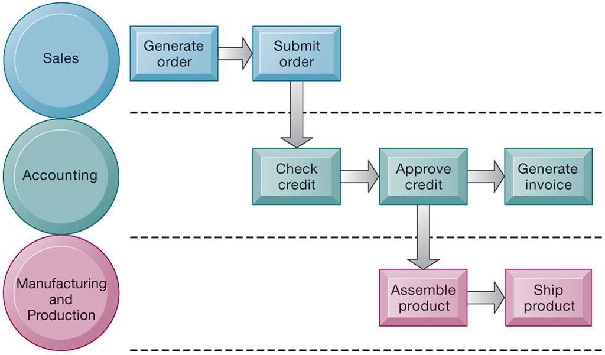
*Gambar 2.1: Alur Pemenuhan Pesanan Lintas Fungsi (Penjualan, Akuntansi, Manufaktur)*

```
┌─────────────────┐       ┌─────────────────┐       ┌─────────────────┐       ┌─────────────────┐
│ DEPARTEMEN      │       │ DEPARTEMEN      │       │ DEPARTEMEN      │       │ DEPARTEMEN      │
│ PENJUALAN       │       │ AKUNTANSI       │       │ PRODUKSI        │       │ PENGIRIMAN      │
└────────┬────────┘       └────────┬────────┘       └────────┬────────┘       └────────┬────────┘
         │                         │                         │                         │
         │ Terima Pesanan          │                         │                         │
         │ Konsumen                │                         │                         │
         ├────────────────────────►│ Periksa Kelayakan       │                         │
         │                         │ Kredit & Otorisasi      │                         │
         │                         ├────────────────────────►│ Rakit Produk /          │
         │                         │                         │ Ambil dari Gudang       │
         │                         │                         ├────────────────────────►│ Kirim Produk &  │
         │                         │                         │                         │ Berikan Faktur  │
         │                         │                         │                         │ ke Konsumen     │
```

- **Jika tanpa sistem informasi terintegrasi:** Pemrosesan lambat, pesanan kertas sering hilang antar meja divisi, data pelanggan terduplikasi, dan waktu tunggu pesanan berminggu-minggu.
- **Dengan sistem terintegrasi:** Pemesanan online memicu verifikasi kredit seketika, menginstruksikan robot gudang merakit barang, dan mencetak label kurir dalam hitungan menit.

### 1.4 Bagaimana Teknologi Informasi Mentransformasi Proses Bisnis
1. **Peningkatan Efisiensi Alur Kerja:** Mengotomatiskan langkah-langkah manual yang repetitif (mengurangi biaya kertas dan tenaga admin).
2. **Transformasi Radikal Alur Informasi:** Menggantikan langkah sekuensial yang lambat dengan pemrosesan paralel instan.
3. **Pemberdayaan Pengambilan Keputusan:** Menghilangkan jeda waktu informasi (*latency*) sehingga pihak operasional dapat mengambil keputusan langsung tanpa menunggu persetujuan birokratis hierarkis.
4. **Penciptaan Model Bisnis Baru:** Mengubah total cara industri beroperasi (misalnya: *Amazon One-Click Ordering*, *Ride-Hailing*).

---

## 2. Sistem Informasi untuk Berbagai Kelompok Manajemen

Suatu organisasi bisnis tidak hanya memiliki satu sistem tunggal, melainkan berbagai sistem khusus yang melayani kebutuhan tingkatan manajerial yang berbeda:

```
                           ▲
                          /                          /   \     EXECUTIVE SUPPORT SYSTEMS (ESS)
                        / ESS \    [Tingkat Strategis: Keputusan Jangka Panjang,
                       /-------\    Data Eksternal & Internal, Dasbor Grafis]
                      /   DSS                        /     &     \  MANAGEMENT INFORMATION SYSTEMS (MIS) &
                    /     MIS     \ DECISION SUPPORT SYSTEMS (DSS)
                   /---------------\[Tingkat Manajemen Menengah: Kontrol,
                  /                 \Analisis Keputusan & Laporan Rangkuman]
                 /     T  P  S                       /                     \TRANSACTION PROCESSING SYSTEMS (TPS)
               /───────────────────────\[Tingkat Operasional: Transaksi Harian,
              ───────────────────────────Aktivitas Rutin, Aliran Data Mentah]
```

### 2.1 Transaction Processing Systems (TPS)
- **Pengguna Utama:** Manajer operasional dan staf lini depan (*operational managers & clerical workers*).
- **Tujuan Utama:** Mencatat dan memproses transaksi rutin harian yang penting untuk menjalankan bisnis (misalnya: transaksi penjualan, pemesanan tiket penerbangan, pembayaran gaji karyawan, pengiriman barang).
- **Karakteristik Kunci:**
  - Volume data masif (*high volume*).
  - Berorientasi internal, aturan terdefinisi secara baku (*highly structured*).
  - Bersifat kritis (*mission-critical*); jika TPS terhenti beberapa menit saja, operasional perusahaan terancam runtuh.
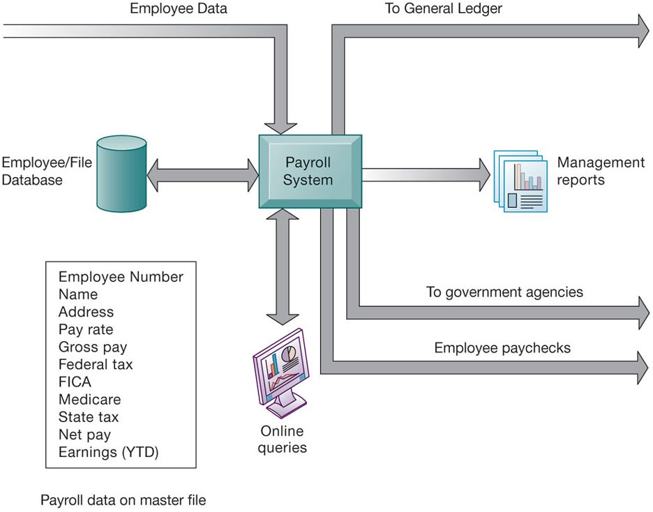
*Gambar 2.2: Alur Pemrosesan Payroll TPS dan Pembaruan Master File*

- **Contoh Nyata: Payroll TPS (Sistem Penggajian)**
  - Mengambil data jam kerja karyawan (*employee time cards*).
  - Mengkalkulasi pajak dan potongan jaminan sosial.
  - Memperbarui file induk data karyawan (*Payroll master file*), menerbitkan slip gaji/transfer bank, dan mengirimkan data biaya tenaga kerja ke buku besar (*General Ledger*).

### 2.2 Management Information Systems (MIS)
- **Pengguna Utama:** Manajer tingkat menengah (*middle management*).

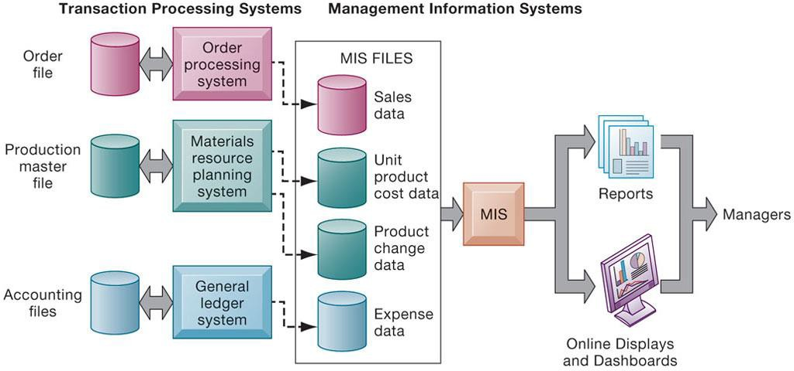
*Gambar 2.3: Bagaimana MIS Memperoleh Data Transaksi Ringkasan dari TPS*
- **Tujuan Utama:** Membantu memantau, mengendalikan, dan mengelola kinerja operasional serta memprediksi performa masa depan melalui laporan ringkasan periodik.
- **Karakteristik Kunci:**
  - Memperoleh input langsung dari data transaksi harian yang dicatat oleh **TPS**.
  - Menjawab pertanyaan operasional terstruktur: *"Berapa total unit produk A yang terjual di cabang barat bulan ini?"*, *"Apakah biaya produksi kuartal ini melampaui anggaran?"*
  - Menyajikan laporan rangkuman terformat (*summary reports*) dan laporan pengecualian (*exception reports*).
  - Memiliki kemampuan analitis sederhana (kalkulasi ringkasan, persentase deviasi dari target).

### 2.3 Decision Support Systems (DSS)
- **Pengguna Utama:** Manajer tingkat menengah, insinyur logistik, dan analis keuangan.
- **Tujuan Utama:** Mendukung pengambilan keputusan yang bersifat **semiterstruktur (*semistructured*)** atau **tidak terstruktur (*unstructured*)**, unik, dan cepat berubah.
- **Karakteristik Kunci:**
  - Menggunakan model analitis matematis yang canggih (pemrograman linear, regresi, simulasi Monte Carlo).
  - Menggabungkan data internal (dari TPS dan MIS) dengan data eksternal (harga komoditas pasar, tren suku bunga bank, tarif kompetitor).
  - Memungkinkan analisis skenario (*What-If Analysis*) dan analisis sensitivitas (*Sensitivity Analysis*).
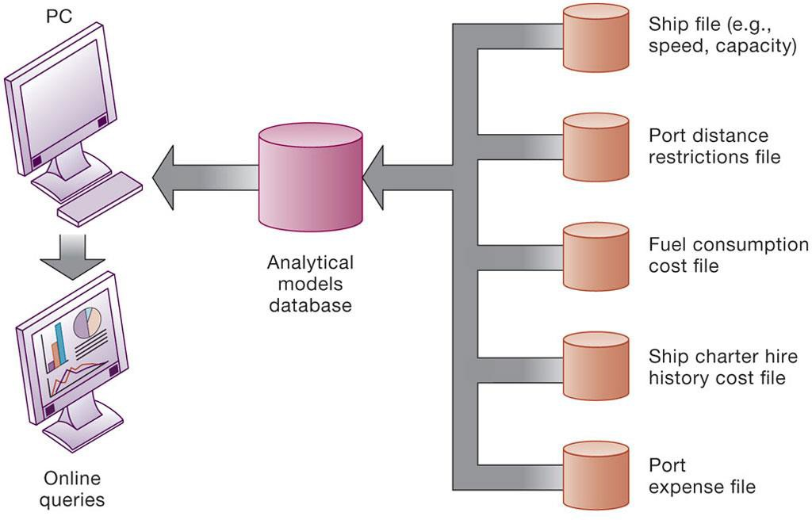
*Gambar 2.4: Voyage-Estimating Decision Support System (DSS Perkapalan)*

- **Contoh Kasus: Voyage-Estimating Decision Support System**
  - Digunakan oleh perusahaan pelayaran kargo global untuk menghitung rute dan jadwal kapal paling optimal.
  - Memperhitungkan kapasitas kargo kapal, ketersediaan dermaga pelabuhan tujuan, konsumsi bahan bakar pada berbagai kecepatan, tarif tol terusan (Suez/Panama), dan prediksi cuaca gelombang laut.

### 2.4 Executive Support Systems (ESS)
- **Pengguna Utama:** Manajemen eksekutif puncak (*senior/executive management: CEO, CFO, COO*).
- **Tujuan Utama:** Mengatasi keputusan strategis jangka panjang yang **tidak terstruktur (*nonroutine decisions*)** yang membutuhkan penilaian, evaluasi, dan wawasan tingkat tinggi.
- **Karakteristik Kunci:**
  - Menyatukan data ringkasan tingkat korporat dari seluruh enterprise dengan data intelijen lingkungan luar (perubahan regulasi pemerintah, merger pesaing, sentimen makroekonomi).
  - Menyajikan informasi melalui **Digital Dashboard** grafis yang intuitif dan mudah dipahami dalam hitungan detik.
  - Memiliki fitur **Drill-Down Capability**: Kemampuan eksekutif untuk mengklik angka agregat tingkat tinggi pada layar dan langsung melihat rincian data transaksi pendukung di baliknya.

### 2.5 Tabel Komparasi Komprehensif: TPS vs MIS vs DSS vs ESS

| Parameter | TPS (*Transaction Processing*) | MIS (*Management Information*) | DSS (*Decision Support*) | ESS (*Executive Support*) |
| :--- | :--- | :--- | :--- | :--- |
| **Tingkatan Manajemen** | Operasional (Lini depan) | Menengah (Manajer operasional/divisi) | Menengah (Analis & spesialis) | Puncak (Direksi & C-Level) |
| **Tipe Keputusan** | Sangat terstruktur, berulang | Terstruktur & semiterstruktur | Semiterstruktur & tidak terstruktur | Sangat tidak terstruktur, strategis |
| **Sumber Masukan Data** | Transaksi fisik internal harian | Data transaksi internal dari TPS | Data internal TPS/MIS + data pasar luar | Data agregat internal + intelijen eksternal |
| **Orientasi Waktu** | Masa sekarang / Real-time harian | Masa lalu & saat ini (Historis) | Masa kini & masa depan (Proyeksi) | Masa depan jangka panjang (3–5 tahun) |
| **Kemampuan Analitik** | Sederhana (kalkulasi aritmatika dasar) | Menengah (perangkuman, rasio) | Canggih (model simulasi, statistik) | Interaktif grafis, pemfilteran, drill-down |

---

## 3. Arsitektur Aplikasi Perusahaan (Enterprise Applications)

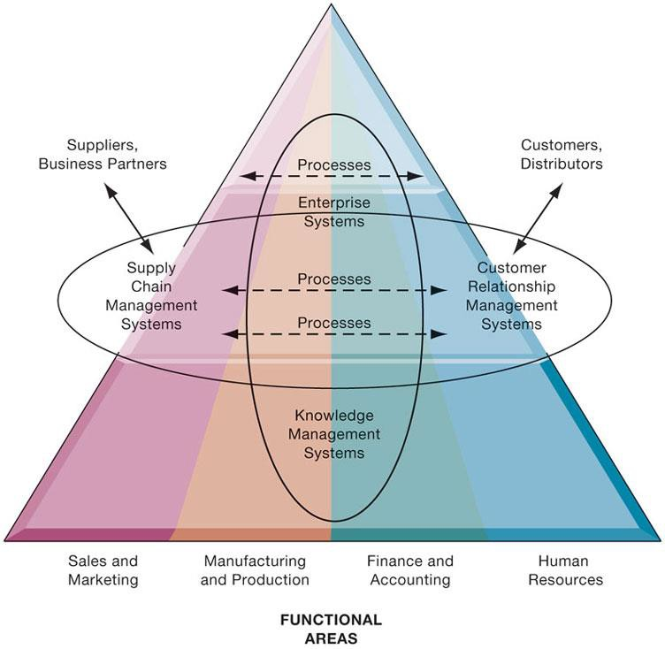
*Gambar 2.5: Arsitektur Aplikasi Enterprise Terintegrasi (ERP, SCM, CRM, KMS)*

### 3.1 Tantangan Silo Fungsional dan Urgensi Integrasi
Banyak perusahaan tradisional menderita masalah **Silo Informasi (*Information Silos*)**:
- Setiap departemen (pemasaran, gudang, keuangan) membangun sistem komputasi sendiri-sendiri yang tidak bisa saling berbicara.
- Mengakibatkan duplikasi data masif, kebingungan laporan keuangan, dan keterlambatan eksekusi layanan pelanggan.
- **Solusi:** Menerapkan **Aplikasi Perusahaan (*Enterprise Applications*)** yang menjangkau seluruh lini fungsional perusahaan untuk mengintegrasikan proses bisnis inti ke dalam satu arsitektur logis.

```
┌────────────────────────────────────────────────────────────────────────┐
│                     ARSITEKTUR APLIKASI ENTERPRISE                     │
│                                                                        │
│   ┌───────────────────┐                     ┌───────────────────┐      │
│   │   SUPPLY CHAIN    │                     │     CUSTOMER      │      │
│   │ MANAGEMENT (SCM)  │                     │RELATIONSHIP (CRM) │      │
│   │ (Pemasok & Mitra) │                     │ (Pelanggan Pasar) │      │
│   └─────────┬─────────┘                     └─────────▲─────────┘      │
│             │                                         │                │
│             ▼                                         │                │
│   ┌───────────────────────────────────────────────────┴─────────────┐  │
│   │             ENTERPRISE RESOURCE PLANNING (ERP)                  │  │
│   │   (Manufaktur, Akuntansi, Keuangan, Sumber Daya Manusia)        │  │
│   └─────────────────────────────────┬───────────────────────────────┘  │
│                                     │                                  │
│                                     ▼                                  │
│   ┌─────────────────────────────────────────────────────────────────┐  │
│   │              KNOWLEDGE MANAGEMENT SYSTEMS (KMS)                 │  │
│   │            (Dokumen, Praktik Terbaik, Riset Karyawan)           │  │
│   └─────────────────────────────────────────────────────────────────┘  │
└────────────────────────────────────────────────────────────────────────┘
```

### 3.2 Enterprise Resource Planning (ERP)
- **Fungsi:** Mengintegrasikan seluruh proses bisnis manufaktur, rantai pasok, penjualan, akuntansi, dan HR ke dalam satu sistem perangkat lunak tunggal dengan basis data terpusat (*single central database*).
- **Manfaat:** Menghilangkan fragmentasi data; ketika perwakilan penjualan memasukkan pesanan pelanggan, departemen akuntansi otomatis menerbitkan faktur, pabrik menjadwalkan produksi, dan persediaan gudang langsung terupdate.

### 3.3 Supply Chain Management (SCM)
- **Fungsi:** Membantu perusahaan mengelola hubungan langsung dengan para pemasok (*suppliers*), perusahaan pengiriman, distributor, dan pusat logistik.
- **Tujuan:** Mendapatkan jumlah produk yang tepat dari sumbernya ke titik konsumsi dengan waktu sesingkat-singkatnya dan biaya serendah-rendahnya (*just-in-time delivery*).
- **Dampak:** Mengurangi efek cambuk (*bullwhip effect*), memangkas biaya penyimpanan gudang berlebih, dan mencegah kekurangan pasokan secara mendadak.

### 3.4 Customer Relationship Management (CRM)
- **Fungsi:** Mengoordinasikan seluruh proses bisnis yang berhubungan langsung dengan pelanggan dalam hal penjualan (*sales*), pemasaran (*marketing*), dan layanan dukungan teknis (*customer service*).
- **Tujuan:** Mengidentifikasi pelanggan yang paling bernilai (*high-value customers*), mempertahankan loyalitas, mempersonalisasi penawaran, dan meningkatkan retensi jangka panjang.

### 3.5 Knowledge Management Systems (KMS)
- **Fungsi:** Mendukung proses penciptaan, pengumpulan, pengorganisasian, pemeliharaan, dan penyebaran pengetahuan dan keahlian bisnis karyawan (*business expertise & intellectual capital*).
- **Komponen:** Repositori dokumen digital, direktori profil keahlian karyawan, dan platform kolaborasi tanya-jawab teknis.

### 3.6 Intranet, Ekstranet, dan E-Business
- **Intranet:** Jaringan internal perusahaan berbasis teknologi internet yang hanya dapat diakses secara privat oleh karyawan resmi untuk melihat kebijakan internal, form cuti, dan repositori dokumen.
- **Ekstranet:** Situs web atau portal intranet perusahaan yang dapat diakses secara terbatas oleh vendor resmi, pemasok, atau mitra bisnis berlisensi untuk memfasilitasi koordinasi rantai pasok.
- **E-Business, E-Commerce, dan E-Government:**
  - *E-Business:* Penggunaan teknologi digital dan internet untuk menjalankan proses bisnis internal utama perusahaan.
  - *E-Commerce:* Bagian dari e-business yang secara spesifik melibatkan jual beli barang dan jasa melalui jaringan internet.
  - *E-Government:* Pemanfaatan internet untuk memfasilitasi hubungan pemerintah dengan warganya (*G2C*), pelaku usaha (*G2B*), atau lembaga pemerintahan lain (*G2G*).

---

## 4. Kolaborasi dan Bisnis Sosial (Social Business)

### 4.1 Definisi dan Manfaat Bisnis Kolaborasi
> [!info] Kolaborasi vs Timbal Balik
> **Kolaborasi (*Collaboration*)** adalah bekerja bersama orang lain untuk mencapai tujuan bersama yang eksplisit. Kolaborasi dapat berlangsung singkat (beberapa menit) atau jangka panjang antar tim lintas divisi.

**Manfaat Terukur dari Budaya Kolaborasi Perusahaan:**
1. *Produktivitas:* Berbagi pengetahuan memangkas pengerjaan ulang (*rework*) dan mengurangi waktu pencarian informasi.
2. *Kualitas:* Anggota tim dapat mendeteksi kekeliruan rekan sejawat secara dini dan menyempurnakan keluaran kerja.
3. *Inovasi:* Pertemuan ide dari disiplin ilmu yang berbeda memicu produk dan layanan terobosan baru.
4. *Layanan Pelanggan:* Masalah pelanggan terselesaikan lebih cepat karena staf lapangan terhubung langsung ke tim ahli teknis.
5. *Kinerja Keuangan:* Hasil riset membuktikan perusahaan berkinerja kolaboratif tinggi mencatatkan pertumbuhan penjualan dan laba superior.

### 4.2 Piramida Persyaratan Kolaborasi
Kolaborasi yang berhasil tidak cukup hanya dengan membeli perangkat lunak canggih. Keberhasilan membutuhkan dua pilar fondasi:

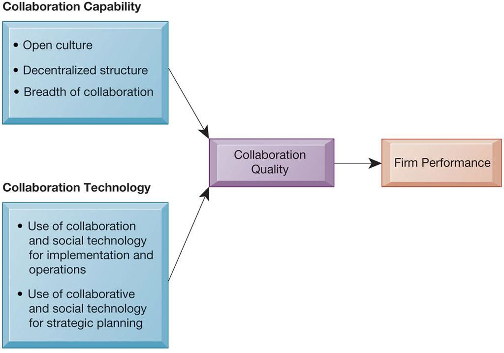
*Gambar 2.6: Persyaratan Keberhasilan Kolaborasi: Budaya Kolaboratif dan Teknologi*
1. **Budaya Kolaboratif (*Collaborative Culture*):** Manajemen puncak tidak menganut komando-kontrol sentralistik yang kaku, melainkan mendorong komunikasi terbuka, penghargaan kerja tim, dan transparansi ide.
2. **Teknologi Kolaborasi (*Collaboration Technology*):** Penyediaan alat-alat digital yang memadai untuk mendukung interaksi tanpa hambatan fisik.

### 4.3 Matriks Kolaborasi Waktu/Ruang (Time/Space Collaboration Matrix)
Kerangka kerja evaluasi alat kolaborasi berdasarkan dimensi waktu (*synchronous vs asynchronous*) dan lokasi geografis (*colocated vs remote*):

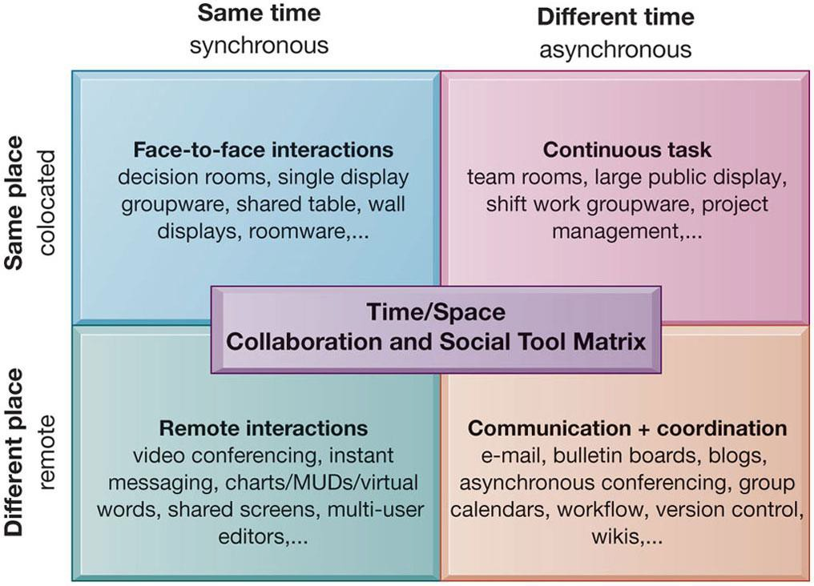
*Gambar 2.7: The Time/Space Collaboration and Social Tool Matrix*

```
                        LOKASI SAMA (Colocated)         LOKASI BERBEDA (Remote)
                   ┌───────────────────────────────┬───────────────────────────────┐
                   │ (Same Time, Same Place)       │ (Same Time, Different Place)  │
 WAKTU BERSAMAAN   │ • Pertemuan tatap muka        │ • Konferensi Video (Zoom, GMeet)│
  (Synchronous)    │ • Papan tulis pintar interaktif│ • Panggilan suara instan (VoIP)│
                   │ • Ruang rapat fisik terpusat  │ • Instant Messaging / Chat    │
                   ├───────────────────────────────┼───────────────────────────────┤
                   │ (Different Time, Same Place)  │ (Different Time, Different Pl)│
 WAKTU BERBEDA     │ • Ruang kerja tim (Shift kerja)│ • Surat Elektronik (Email)    │
  (Asynchronous)   │ • Kios informasi internal     │ • Dokumentasi Proyek / Wikis  │
                   │ • Dropbox file sharing lokal  │ • Alat Manajemen Tugas (Trello)│
                   └───────────────────────────────┴───────────────────────────────┘
```

---

## 5. Hubungan Organisasi dan Sistem Informasi

### 5.1 Hubungan Timbal Balik Dua Arah (Two-Way Relationship)
Hubungan antara organisasi dan teknologi informasi bersifat interaktif dan saling memengaruhi:

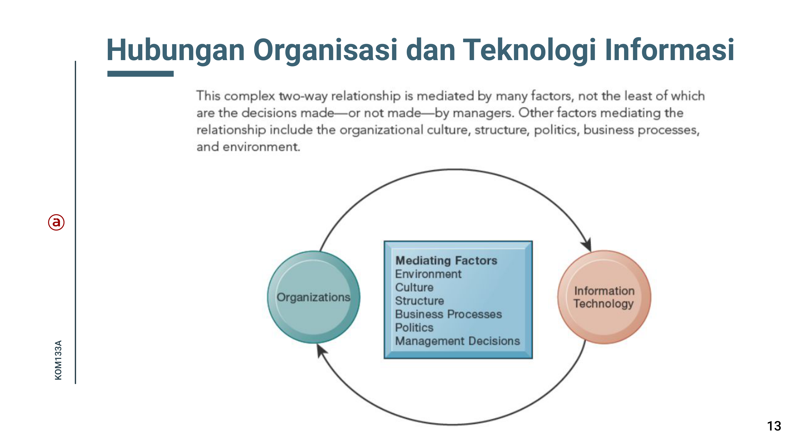
*Gambar 2.8: Hubungan Dua Arah Antara Organisasi dan Teknologi Informasi (Slide Dosen KOM1333A)*

```
┌─────────────────────┐       Faktor Mediasi:       ┌─────────────────────┐
│                     │  • Lingkungan & Pasar       │                     │
│     ORGANISASI      ├─►• Budaya Korporat        ─►│  TEKNOLOGI INFORMASI│
│                     │  • Struktur Organisasi      │                     │
│                     │◄─• Politik & Konflik      ◄─┤                     │
└─────────────────────┘  • Keputusan Manajemen      └─────────────────────┘
```

- Sistem informasi dibangun oleh para manajer untuk melayani kepentingan bisnis perusahaan.
- Pada saat yang sama, organisasi harus waspada dan membuka diri terhadap pengaruh sistem informasi guna memanfaatkan keuntungan dari teknologi baru.

### 5.2 Dampak Ekonomi: Teori Biaya Transaksi dan Teori Agensi
1. **Teori Biaya Transaksi (*Transaction Cost Theory*):**
   - Perusahaan berusaha menekan biaya transaksi (biaya mencari pemasok, bernegosiasi kontrak, memantau pengiriman, dan biaya asuransi).
   - TI secara dramatis menurunkan biaya transaksi di pasar luar. Dampaknya: Perusahaan tidak perlu membeli atau mempekerjakan semua aset sendiri; mereka dapat melakukan *outsourcing* ke pihak luar secara murah dan efisien, sehingga ukuran perusahaan fisik menjadi lebih ramping.
2. **Teori Agensi (*Agency Theory*):**
   - Perusahaan dipandang sebagai simpul kontrak antarindividu yang mementingkan diri sendiri. Pemilik (*principal*) mempekerjakan manajer/karyawan (*agent*) yang harus diawasi agar tidak menyimpang.
   - Pengawasan ini membutuhkan biaya agensi (*agency costs*).
   - TI menyediakan visibilitas data transaksi secara instan bagi pimpinan puncak tanpa memerlukan banyak lapisan pengawas perantara (*middle managers*).
   - Dampaknya: **Perataan Struktur Organisasi (*Flattening Organizations*)**; rentang kendali melebar dan birokrasi terpangkas.

### 5.3 Dampak Perilaku: Resistensi Organisasi terhadap Inovasi TI
Inovasi sistem informasi kerap kali memicu penolakan keras (*resistance*) dari karyawan karena TI mengubah struktur kekuasaan dan alur kerja:

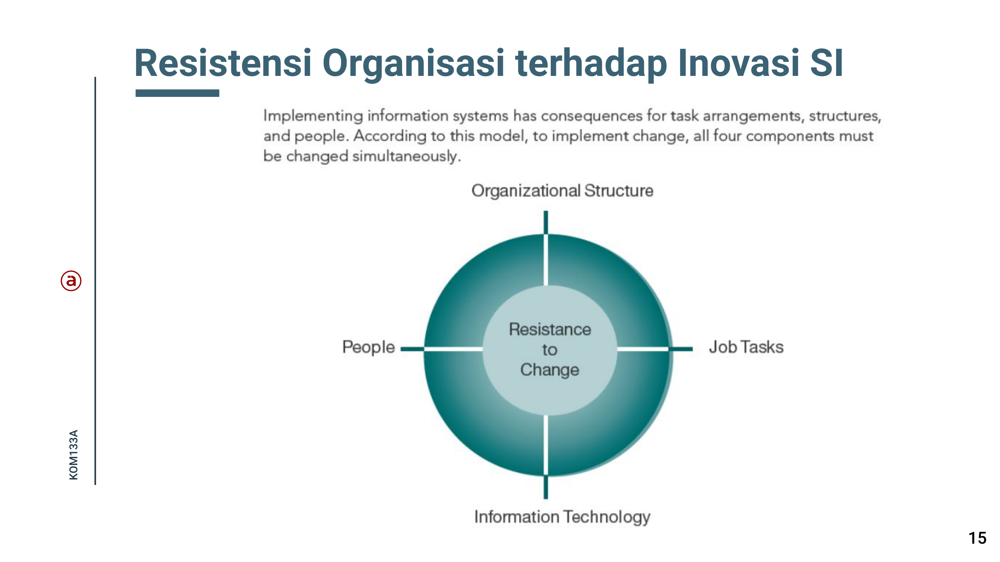
*Gambar 2.9: Resistensi Organisasi terhadap Inovasi SI (Model Belah Ketupat Leavitt)*

```
                      STRUKTUR
                         ▲
                        / \
                       /   \
                      /     \
                     /       \
             TUGAS  ◄─────────►  TEKNOLOGI
                     \       /
                      \     /
                       \   /
                        \ /
                         ▼
                      MANUSIA
```
*(Model Belah Ketupat Organisasi Leavitt / Leavitt's Diamond)*

- Untuk membawa perubahan yang berhasil pada **Teknologi**, perusahaan wajib menyesuaikan ketiga komponen lainnya secara simultan: **Struktur**, **Tugas (*Tasks*)**, dan **Manusia (*People*)**.
- Mengabaikan kesiapan manusia atau memaksakan teknologi pada struktur yang menolak akan berujung pada kegagalan adopsi sistem.

---

## 6. Menggunakan Sistem Informasi untuk Keunggulan Kompetitif

### 6.1 Model 5 Kekuatan Kompetitif Michael Porter
Posisi strategis dan profitabilitas perusahaan di suatu industri ditentukan oleh lima kekuatan lingkungan:

```
                        ┌────────────────────────┐
                        │   PENDATANG BARU       │
                        │    (New Entrants)      │
                        └───────────┬────────────┘
                                    │ Ancaman Masuk
                                    ▼
┌────────────────────────┐      ┌───────┐      ┌────────────────────────┐
│     DAYA TAWAR         │      │PERSAINGAN    │     DAYA TAWAR         │
│      PEMASOK           ├─────►│INDUSTRI├────►│       PEMBELI          │
│    (Suppliers)         │      │(Rivalry)│    │      (Buyers)          │
└────────────────────────┘      └───┬───┘      └────────────────────────┘
                                    ▲
                                    │ Ancaman Substitusi
                        ┌───────────┴────────────┐
                        │    PRODUK PENGGANTI    │
                        │      (Substitutes)     │
                        └────────────────────────┘
```

1. **Pesaing Tradisional (*Traditional Competitors*):** Para pemain lama yang berebut pangsa pasar melalui inovasi dan perang harga.
2. **Pendatang Baru di Pasar (*New Market Entrants*):** Perusahaan baru yang tidak terbebani mesin tua dan memiliki motivasi tinggi mendisrupsi pasar.
3. **Produk dan Layanan Pengganti (*Substitute Products*):** Alternatif yang dapat digunakan konsumen jika harga produk naik (misal: smartphone menggantikan kamera digital saku).
4. **Kekuatan Tawar Pelanggan (*Bargaining Power of Customers*):** Pelanggan memiliki daya tawar tinggi bila mereka dapat dengan mudah beralih ke produk pesaing dengan biaya peralihan (*switching costs*) rendah.
5. **Kekuatan Tawar Pemasok (*Bargaining Power of Suppliers*):** Pemasok memiliki daya tawar tinggi bila perusahaan tidak memiliki alternatif vendor lain untuk pasokan kritisnya.

### 6.2 Empat Strategi Kompetitif Dasar Berbasis SI
Untuk memenangkan persaingan melawan lima kekuatan Porter, perusahaan dapat menerapkan salah satu dari empat strategi generik:

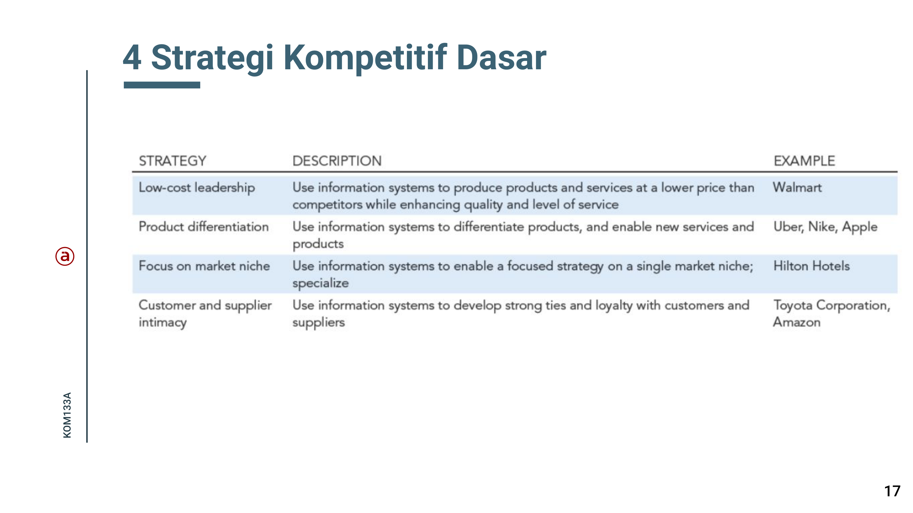
*Gambar 2.10: Empat Strategi Kompetitif Dasar (Slide Dosen KOM1333A)*
1. **Kepemimpinan Biaya Rendah (*Low-Cost Leadership*):**
   - Menggunakan sistem informasi untuk menekan biaya operasional serendah mungkin sehingga mampu menawarkan harga termurah.
   - *Contoh:* Sistem inventaris **Walmart** yang memangkas biaya penyimpanan logistik.
2. **Diferensiasi Produk (*Product Differentiation*):**
   - Menggunakan sistem informasi untuk menciptakan produk dan layanan baru atau mengubah pengalaman konsumen secara unik.
   - *Contoh:* **Apple** (ekosistem iOS/iTunes/iCloud) atau **Nike By You** (kustomisasi sepatu lari secara daring oleh konsumen).
3. **Fokus pada Ceruk Pasar (*Focus on Market Niche*):**
   - Menggunakan sistem informasi untuk menganalisis data spesifik ceruk pasar sempit dan melayaninya lebih unggul dibanding pesaing umum.
   - *Contoh:* Sistem **Hilton OnQ** yang menganalisis riwayat preferensi tamu khusus hotel berbintang.
4. **Memperkuat Keintiman Pelanggan dan Pemasok (*Customer and Supplier Intimacy*):**
   - Menggunakan sistem informasi untuk meningkatkan biaya peralihan (*switching costs*) bagi pelanggan dan mengikat pemasok dalam hubungan erat.
   - *Contoh:* **Amazon** dengan rekomendasi 1-klik dan program langganan Prime.

### 6.3 Model Rantai Nilai (The Value Chain Model)
Model rantai nilai membagi aktivitas perusahaan ke dalam dua kategori:

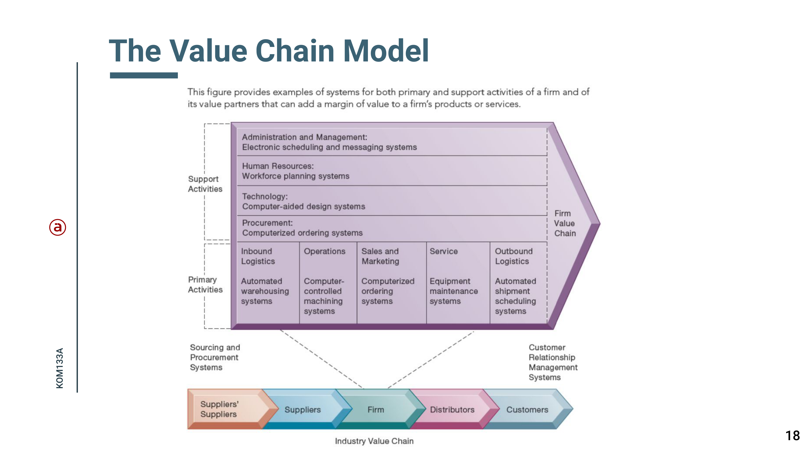
*Gambar 2.11: The Value Chain Model (Aktivitas Utama & Pendukung Porter)* **Aktivitas Utama (*Primary Activities*)** dan **Aktivitas Pendukung (*Support Activities*)**:

```
┌────────────────────────────────────────────────────────────────────────┐
│ AKTIVITAS PENDUKUNG (Support Activities)                               │
│  • Infrastruktur Organisasi: SIM, Akuntansi, Hukum, Manajemen Umum     │
│  • Manajemen Sumber Daya Manusia: Perekrutan, Pelatihan, Penggajian     │
│  • Pengembangan Teknologi: Desain Produk, Riset & Pengembangan R&D     │
│  • Pengadaan (Procurement): Pembelian Mesin, Bahan Mentah, Jasa Luar   │
├────────────────────────────────────────────────────────────────────────┤
│ AKTIVITAS UTAMA (Primary Activities)                                   │
│  ┌────────────┬─────────────┬────────────┬─────────────┬────────────┐  │
│  │  Inbound   │  Operasi /  │  Outbound  │ Pemasaran & │  Layanan   │  │
│  │ Logistik   │ Manufaktur  │  Logistik  │  Penjualan  │ Purnajual  │  │
│  │(Penerimaan │(Perakitan & │(Pengiriman │(Promosi &   │ (Garansi & │  │
│  │Bahan Baku) │ Pengolahan) │ ke Pasar)  │ Transaksi)  │ Perbaikan) │  │
│  └────────────┴─────────────┴────────────┴─────────────┴────────────┘  │
└────────────────────────────────────────────────────────────────────────┘
```
- Melalui analisis rantai nilai, manajer dapat mengidentifikasi pada titik spesifik mana sistem informasi dapat disuntikkan untuk menghasilkan penghematan biaya atau diferensiasi maksimum.

### 6.4 Jaring Nilai (The Value Web)
- Dalam era digital, rantai nilai linier tradisional telah bertransformasi menjadi **Jaring Nilai (*The Value Web*)**.

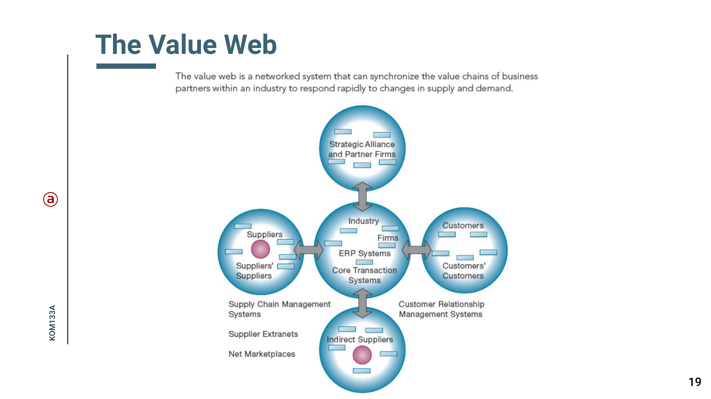
*Gambar 2.12: The Value Web — Ekosistem Jaring Nilai Terkoordinasi Digital*
- Jaring nilai adalah ekosistem kumpulan perusahaan independen yang menyelaraskan rantai nilai mereka menggunakan teknologi informasi untuk memproduksi produk/jasa bagi pasar secara terkoordinasi dan fleksibel.
- Lebih fleksibel dan adaptif terhadap lonjakan permintaan pasar dibandingkan rantai pasok linier kaku.

### 6.5 Strategic Systems Analysis Management Checklist
Berdasarkan materi kuliah slide dosen (KOM1333A), ketika manajer hendak melakukan analisis sistem strategis, mereka wajib mengevaluasi daftar periksa berikut:
1. **Analisis Struktur Industri:** Apa saja kekuatan kompetitif yang bekerja di industri saat ini? Apakah ada pendatang baru yang memanfaatkan platform digital?
2. **Analisis Rantai Nilai Perusahaan:** Di bagian aktivitas mana (inbound, operasi, marketing, support) letak hambatan biaya tertinggi?
3. **Analisis Rantai Nilai Pelanggan & Pemasok:** Bagaimana sistem kita dapat terhubung langsung ke sistem pelanggan untuk menaikkan *switching costs*?
4. **Kesesuaian Kompetensi Inti (*Core Competencies*):** Apakah kapabilitas teknologi informasi internal selaras dengan keunggulan utama perusahaan?

---

## 7. Ringkasan & Latihan Ujian (Cheatsheet)

> [!tip] Rangkuman Cepat untuk Ujian (Exam Quick Sheet)
> 1. **TPS:** Level operasional, volume transaksi tinggi, pemrosesan transaksi harian (contoh: Payroll).
> 2. **MIS:** Level menengah, laporan ringkasan periodik dari TPS untuk memantau performa rutin internal.
> 3. **DSS:** Level menengah, analisis semiterstruktur, model matematis prediktif, analisis *what-if* (contoh: voyage estimation).
> 4. **ESS:** Level direksi/C-level, keputusan strategis tak terstruktur, integrasi internal/eksternal, visual dasbor & *drill-down*.
> 5. **Empat Aplikasi Enterprise:**
>    - ERP: Mengintegrasikan seluruh proses internal ke satu database terpusat.
>    - SCM: Koordinasi rantai pasok dari pemasok ke pabrik dan distributor.
>    - CRM: Pengelolaan relasi, penjualan, dan layanan pelanggan secara terpadu.
>    - KMS: Pengelolaan dan penyebaran pengetahuan/keahlian karyawan.
> 6. **Matriks Waktu/Ruang Kolaborasi:**
>    - Waktu Sama / Tempat Sama: Rapat tatap muka.
>    - Waktu Sama / Tempat Beda: Video conference (Zoom), chat instan.
>    - Waktu Beda / Tempat Sama: Shift kerja bersama, kiosk.
>    - Waktu Beda / Tempat Beda: Email, repositori dokumen tim/wiki.
> 7. **Teori Biaya Transaksi & Agensi:** TI menurunkan biaya transaksi pasar (mendorong outsourcing) dan menekan biaya agensi (membuat struktur organisasi lebih datar / *flattening*).
> 8. **5 Kekuatan Porter & 4 Strategi:** Hadapi persaingan, pendatang baru, produk pengganti, pembeli, dan pemasok melalui kepemimpinan biaya, diferensiasi produk, ceruk pasar, dan keintiman pelanggan/pemasok.
