---
title: "Week 4: IT Infrastructure and Emerging Technologies"
tags:
  - it-infrastructure
  - cloud-computing
  - virtualization
  - moores-law
  - saas-paas-iaas
  - web-services-soa
  - tco
  - obsidian-notes
course: KOM1333A - Sistem Informasi
textbook: "Management Information Systems (Laudon & Laudon, 16th Ed), Chapter 5"
date: 2026-10-08
type: study-note
---

# Week 4: IT Infrastructure and Emerging Technologies

> [!abstract] Ringkasan Eksekutif
> Catatan komprehensif ini menelaah arsitektur dan tren **Infrastruktur Teknologi Informasi (Infrastruktur TI)** berbasis **Chapter 5 Laudon & Laudon**:
> 1. **Definisi & Ekosistem Infrastruktur TI:** Hubungan infrastruktur dengan kapabilitas bisnis.
> 2. **5 Tahap Evolusi Komputasi:** Dari era Mainframe, Personal Computer (PC), Client/Server (arsitektur Multi-tier), Enterprise Computing, hingga Cloud & Mobile Computing.
> 3. **Hukum-Hukum Pendorong Teknologi:** Hukum Moore, Hukum Penyimpanan Digital Massal, Hukum Metcalfe, dan penurunan biaya internet.
> 4. **Tujuh Komponen Ekosistem TI:** Platform perangkat keras, sistem operasi, aplikasi enterprise, database, jaringan, platform web, dan layanan integrasi sistem.
> 5. **Tren Perangkat Keras Kontemporer:** Komputasi Awan (*Cloud Computing: IaaS, PaaS, SaaS*), Virtualisasi, Komputasi Kuantum, BYOD, dan *Green Computing*.
> 6. **Tren Perangkat Lunak Kontemporer:** Perangkat lunak Open Source (Linux), HTML5, Web Services & SOA (*Service-Oriented Architecture*), serta *Outsourcing*.
> 7. **Tata Kelola & Investasi Finansial TI:** Model TCO (*Total Cost of Ownership*) dan Model 6 Kekuatan Kompetitif Investasi Infrastruktur.

---

## Daftar Isi (Table of Contents)
- [[#1. Definisi dan Konsep Fondasi Infrastruktur TI]]
  - [[#1.1 Hubungan Perusahaan, Infrastruktur TI, dan Kapabilitas Bisnis]]
  - [[#1.2 Layanan Seluruh Perusahaan (Firm-Wide Services)]]
- [[#2. Lima Era Evolusi Infrastruktur TI]]
  - [[#2.1 Era Mainframe dan Minicomputer (1959 - Sekarang)]]
  - [[#2.2 Era Personal Computer / PC (1981 - Sekarang)]]
  - [[#2.3 Era Client/Server dan Arsitektur Multi-Tier (1983 - Sekarang)]]
  - [[#2.4 Era Enterprise Computing (1992 - Sekarang)]]
  - [[#2.5 Era Cloud and Mobile Computing (2000 - Sekarang)]]
- [[#3. Pendorong Teknologi dalam Evolusi Infrastruktur]]
  - [[#3.1 Hukum Moore dan Kinerja Mikroprosesor]]
  - [[#3.2 Hukum Penyimpanan Digital Massal (Law of Mass Digital Storage)]]
  - [[#3.3 Hukum Metcalfe dan Ekonomi Jaringan]]
  - [[#3.4 Penurunan Drastis Biaya Komunikasi dan Ledakan Internet]]
  - [[#3.5 Efek Jaringan dan Standarisasi Teknologi]]
- [[#4. Tujuh Komponen Ekosistem Infrastruktur TI]]
- [[#5. Tren Platform Perangkat Keras Kontemporer]]
  - [[#5.1 Platform Digital Seluler dan BYOD (Bring Your Own Device)]]
  - [[#5.2 Virtualisasi (Virtualization)]]
  - [[#5.3 Komputasi Awan (Cloud Computing): Konsep, Model Layanan, dan Model Deployment]]
  - [[#5.4 Komputasi Hijau (Green Computing) dan Prosesor Multi-Core]]
  - [[#5.5 Komputasi Kuantum (Quantum Computing)]]
- [[#6. Tren Platform Perangkat Lunak Kontemporer]]
  - [[#6.1 Open Source Software (OSS) dan Sistem Operasi Linux]]
  - [[#6.2 Perangkat Lunak untuk Web: Java dan HTML5]]
  - [[#6.3 Layanan Web (Web Services) dan Service-Oriented Architecture (SOA)]]
  - [[#6.4 Outsourcing Perangkat Lunak dan Cloud Software Services (SaaS, Mashups, Apps)]]
- [[#7. Manajemen, Tata Kelola, dan Investasi Infrastruktur]]
  - [[#7.1 Mengelola Perubahan Platform dan Skalabilitas]]
  - [[#7.2 Tata Kelola Infrastruktur TI (IT Governance)]]
  - [[#7.3 Model Total Cost of Ownership (TCO)]]
  - [[#7.4 Model Kekuatan Kompetitif untuk Investasi Infrastruktur TI]]
- [[#8. Ringkasan & Latihan Ujian (Cheatsheet)]]

---

## 1. Definisi dan Konsep Fondasi Infrastruktur TI

### 1.1 Hubungan Perusahaan, Infrastruktur TI, dan Kapabilitas Bisnis

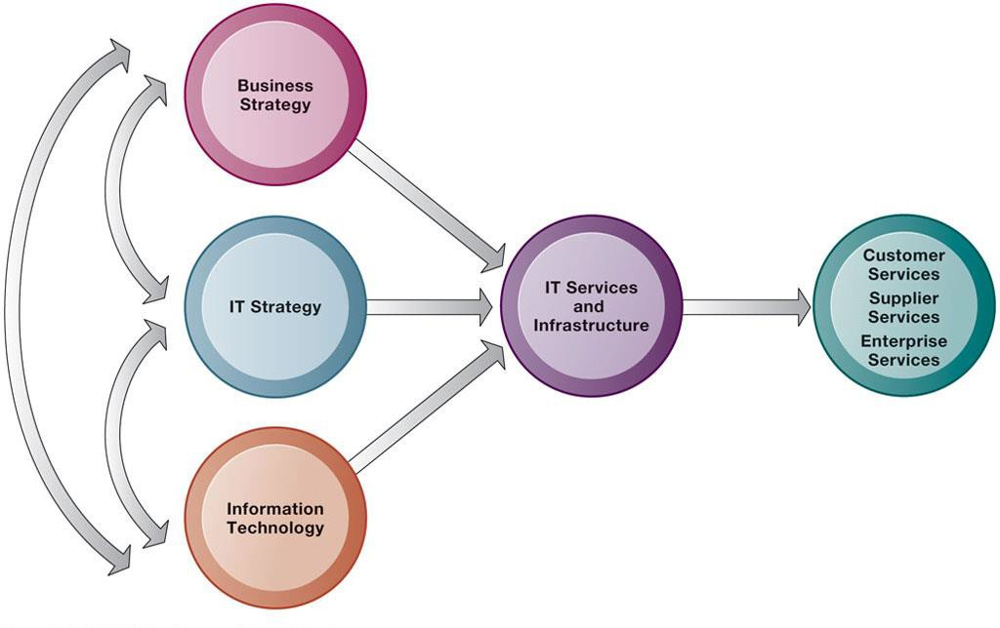
*Gambar 4.1: Hubungan Perusahaan, Infrastruktur TI, dan Kapabilitas Bisnis*

> [!info] Definisi Infrastruktur TI
> **Infrastruktur TI (*IT Infrastructure*)** terdiri dari serangkaian perangkat fisik dan aplikasi perangkat lunak yang diperlukan untuk mengoperasikan seluruh perusahaan. Namun, secara mendalam, infrastruktur TI adalah **serangkaian layanan di seluruh perusahaan (*firm-wide services*)** yang dianggarkan oleh manajemen dan terdiri dari kapabilitas manusia dan teknis.

```
┌────────────────────────────────────────────────────────────────────────┐
│                        STRATEGI BISNIS PERUSAHAAN                      │
│            STRATEGI TI          ◄────────►        STRATEGI SDM         │
└───────────────────────────────────┬────────────────────────────────────┘
                                    │
                                    ▼
┌────────────────────────────────────────────────────────────────────────┐
│                        LAYANAN INFRASTRUKTUR TI                        │
│   (Komputasi, Telekomunikasi, Manajemen Data, Keamanan, Integrasi)     │
└───────────────────────────────────┬────────────────────────────────────┘
                                    │ Menghasilkan
                                    ▼
┌────────────────────────────────────────────────────────────────────────┐
│                        KAPABILITAS BISNIS PERUSAHAAN                   │
│   (Layanan Pelanggan Instan, Efisiensi Rantai Pasok, Analisis Data)    │
└────────────────────────────────────────────────────────────────────────┘
```

### 1.2 Layanan Seluruh Perusahaan (Firm-Wide Services)
Layanan yang disediakan oleh infrastruktur TI meliputi:
- **Layanan Komputasi:** Menghubungkan karyawan, pelanggan, dan pemasok ke dalam lingkungan digital terkoordinasi.
- **Layanan Telekomunikasi:** Menyediakan konektivitas data, suara, dan video antar kantor cabang.
- **Layanan Manajemen Data:** Mengelola penyimpanan basis data korporat dan menyediakan alat analitik data bisnis.
- **Layanan Perangkat Lunak Aplikasi:** Mengoperasikan aplikasi sistem ERP, SCM, CRM, dan KMS.
- **Layanan Manajemen Fasilitas Fisik:** Mengelola data center fisik, pasokan listrik cadangan, dan pendingin server.
- **Layanan Manajemen & Standar TI:** Merumuskan arsitektur teknologi, lisensi, dan prosedur keamanan jaringan.
- **Layanan Pendidikan & Pelatihan TI:** Melatih karyawan agar terampil mengoperasikan sistem kerja baru.
- **Layanan Riset & Pengembangan TI:** Meneliti potensi teknologi baru untuk diserap ke dalam model bisnis.

---

## 2. Lima Era Evolusi Infrastruktur TI

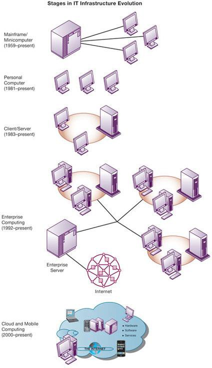
*Gambar 4.2: Tahapan Evolusi Infrastruktur TI (Mainframe, PC, Client/Server, Enterprise, Cloud/Mobile)*

Evolusi infrastruktur TI terbagi ke dalam lima era komputasi utama:

```
Era 1: Mainframe / Minicomputer (1959 - sekarang)
       └── Komputasi terpusat pada mesin raksasa IBM.

Era 2: Personal Computer / PC (1981 - sekarang)
       └── Komputasi mandiri terdesentralisasi (Wintel: Windows + Intel).

Era 3: Client/Server (1983 - sekarang)
       └── Desktop client meminta layanan ke server tersentralisasi (N-tier).

Era 4: Enterprise Computing (1992 - sekarang)
       └── Integrasi aplikasi ERP lintas platform via standar jaringan TCP/IP.

Era 5: Cloud and Mobile Computing (2000 - sekarang)
       └── Pengumpulan sumber daya virtual melalui internet & perangkat seluler.
```

### 2.1 Era Mainframe dan Minicomputer (1959 - Sekarang)
- Ditandai peluncuran komputer komersial mainframe transistor **IBM 7090** dan **IBM 360** (1965).
- **Karakteristik:** Komputasi sangat terpusat (*highly centralized*). Komputer mainframe ditempatkan di ruangan khusus berpendingin tinggi; pengguna mengakses data menggunakan terminal pasif (*dumb terminals*) yang hanya menerima tampilan layar tanpa kemampuan komputasi lokal.
- Era ini juga melahirkan minicomputer (DEC PDP) dengan biaya lebih terjangkau untuk unit bisnis menengah.

### 2.2 Era Personal Computer / PC (1981 - Sekarang)
- Dimulai dengan peluncuran **IBM PC (1981)**. Komputer pribadi menyebar secara masif di meja kerja karyawan sebagai mesin mandiri (*standalone machines*).
- Memunculkan dominasi arsitektur **Wintel Standard** (sistem operasi Microsoft Windows berjalan di atas mikroprosesor Intel). Komputasi menjadi sangat terdesentralisasi sebelum jaringan komputer lokal (LAN) menyatukannya.

### 2.3 Era Client/Server dan Arsitektur Multi-Tier (1983 - Sekarang)
- Komputer desktop/laptop pengguna bertindak sebagai **Client**, terhubung melalui jaringan ke komputer **Server** yang lebih kuat.
- Beban kerja komputasi dibagi (*distributed computing*): Client menangani antarmuka pengguna (*user interface*), sedangkan Server menangani logika aplikasi, manajemen database, dan kendali akses jaringan.

#### Arsitektur Client/Server Bertingkat (Multitier / N-Tier Client/Server Architecture)
Dalam lingkungan bisnis modern dan aplikasi berbasis web, arsitektur dibagi menjadi beberapa lapis (*tiers*):

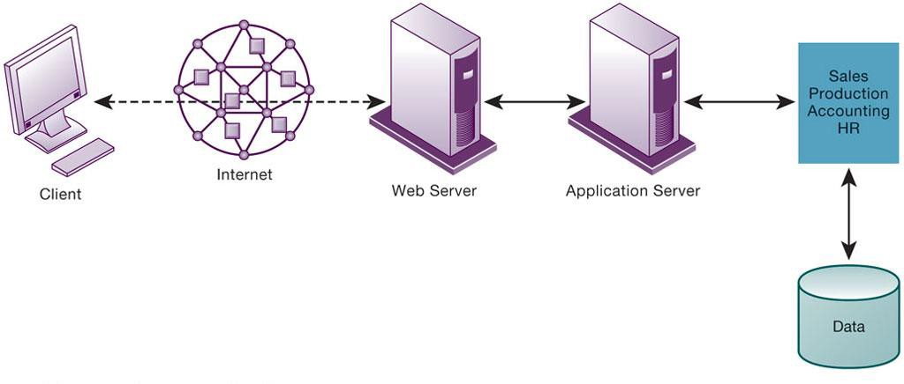
*Gambar 4.3: Arsitektur Jaringan Client/Server Multi-Tier (N-Tier)*

```
┌───────────┐         ┌──────────────┐         ┌──────────────┐         ┌──────────────┐
│  CLIENT   ├────────►│  WEB SERVER  ├────────►│  APPLICATION │├────────►│   DATABASE   │
│ (Browser  │◄────────┤(Menangani    │◄────────┤    SERVER    ││◄────────┤    SERVER    │
│ Pengguna) │         │ Halaman Web) │         │(Logika Bisnis││         │(RDBMS Oracle/│
└───────────┘         └──────────────┘         │ & Kalkulasi) ││         │  SQL Server) │
                                               └──────────────┘         └──────────────┘
```

1. **Client Tier:** Komputer atau smartphone yang menjalankan web browser untuk meminta konten.
2. **Web Server Tier:** Server yang menerima permintaan HTTP/HTTPS, menyajikan file web statis, dan meneruskan permintaan pemrosesan kompleks ke application server.
3. **Application Server Tier:** Menjalankan logika bisnis inti perusahaan (menghitung diskon, memvalidasi kartu kredit, memeriksa kuota inventaris).
4. **Database Server Tier:** Menyimpan, mengambil, dan memperbarui basis data korporat terpusat.

### 2.4 Era Enterprise Computing (1992 - Sekarang)
- Menghubungkan jaringan lokal yang terisolasi dari berbagai departemen ke dalam infrastruktur terintegrasi di seluruh perusahaan.
- Protokol **TCP/IP** diadopsi sebagai standar jaringan bersama.
- Perangkat lunak enterprise seperti **SAP** dan **Oracle** menggabungkan fungsi akuntansi, penjualan, dan manufaktur ke dalam basis data tunggal.

### 2.5 Era Cloud and Mobile Computing (2000 - Sekarang)
- Kapabilitas komputasi (penyimpanan, daya proses CPU, bandwidth, aplikasi) disediakan sebagai utilitas melalui jaringan internet yang dapat diakses dari mana saja.
- Perangkat seluler pintar (*smartphones*) dan tablet menjadi perangkat komputasi primer bagi konsumen dan eksekutif bisnis.

---

## 3. Pendorong Teknologi dalam Evolusi Infrastruktur

### 3.1 Hukum Moore dan Kinerja Mikroprosesor
Dirumuskan oleh Gordon Moore

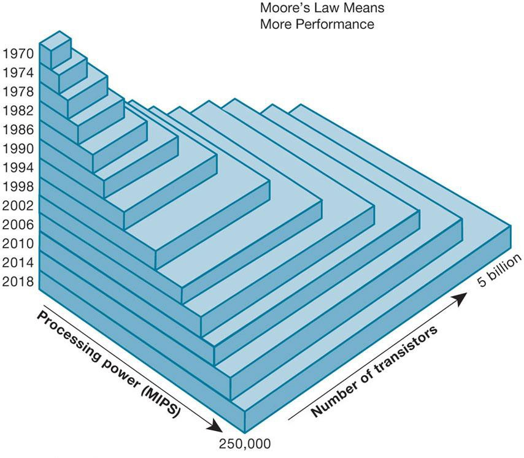
*Gambar 4.4: Hukum Moore dan Peningkatan Eksponensial Kinerja Mikroprosesor*

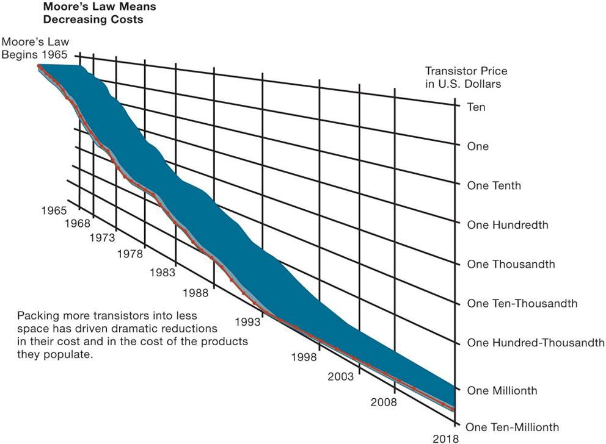
*Gambar 4.5: Penurunan Drastis Biaya Produksi Chip Silikon* (salah satu pendiri Intel) pada tahun 1965:
> [!note] Pernyataan Hukum Moore
> 1. Jumlah transistor pada sebuah chip mikroprosesor berlipat ganda kira-kira setiap 18 hingga 24 bulan.
> 2. Daya komputasi berlipat ganda setiap 18-24 bulan.
> 3. Harga komputasi anjlok separuhnya setiap 18-24 bulan.

- **Batas Fisik Silikon:** Pengecilan sirkuit silikon mulai mendekati batas hukum fisika kuantum (masalah pelepasan panas ekstrem dan kebocoran arus listrik). Solusi industri beralih ke prosesor multi-core, arsitektur 3D chip, material baru (*nanotubes*), dan komputasi awan.

### 3.2 Hukum Penyimpanan Digital Massal (Law of Mass Digital Storage)

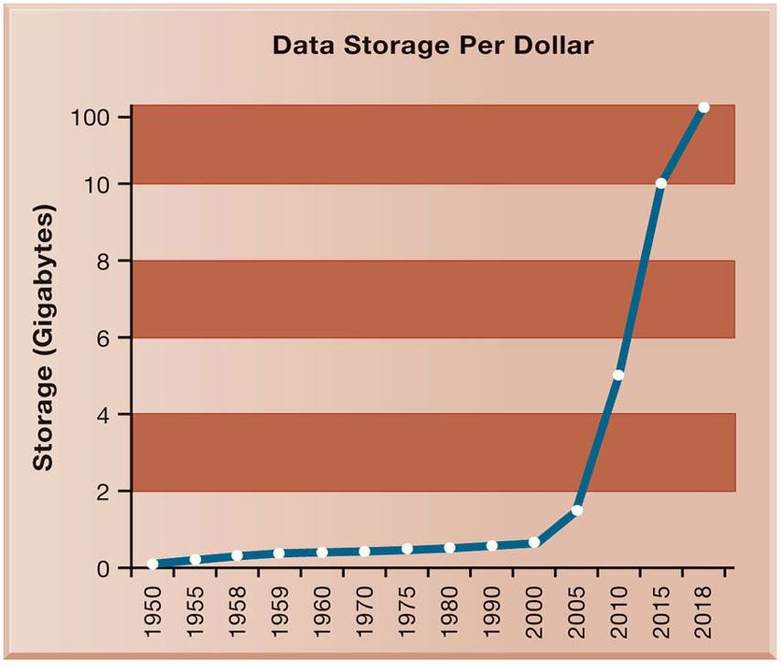
*Gambar 4.6: Lonjakan Kapasitas Penyimpanan Per Dolar 1950-2020*

- Volume informasi digital di dunia berlipat ganda setiap tahun.
- Pada saat yang sama, biaya penyimpanan data digital anjlok secara eksponensial (dari jutaan dolar per gigabyte pada 1950-an menjadi pecahan sen dolar saat ini).
- Memungkinkan korporasi menyimpan arsip rekaman video, log transaksi, dan big data pelanggan secara permanen tanpa khawatir biaya disk storage.

### 3.3 Hukum Metcalfe dan Ekonomi Jaringan
Dirumuskan oleh Robert Metcalfe (penemu Ethernet):
> [!note] Rumus Hukum Metcalfe
> Nilai (*Value*) atau kekuatan suatu jaringan komunikasi bertumbuh secara eksponensial seiring bertambahnya jumlah anggota dalam jaringan tersebut:
> $$V \propto N^2$$
> *(di mana $N$ adalah jumlah pengguna/simpul dalam jaringan)*

- Seiring jumlah pengguna internet dan anggota platform media sosial meledak, nilai ekonomi keterhubungan jaringan meningkat secara kuadratik, menciptakan dorongan luar biasa bagi perusahaan untuk terhubung secara digital.

### 3.4 Penurunan Drastis Biaya Komunikasi dan Ledakan Internet

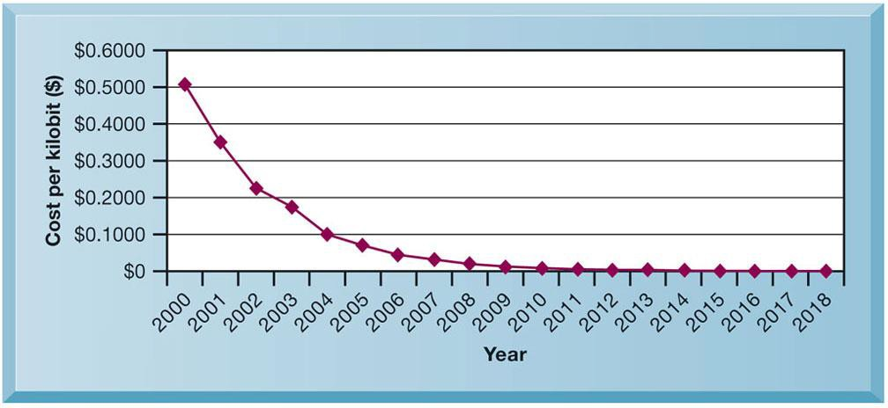
*Gambar 4.7: Penurunan Eksponensial Biaya Komunikasi Internet ($/Mbps)*

- Biaya transmisi data per megabit per detik (Mbps) melalui serat optik dan jaringan internet telah turun ratusan kali lipat.
- Membuka jalan bagi komputasi awan, streaming multimedia resolusi tinggi, dan transfer data gigabit secara instan lintas benua.

### 3.5 Efek Jaringan dan Standarisasi Teknologi
Infrastruktur enterprise mustahil beroperasi tanpa kesepakatan standar universal:
- **ASCII (1958):** Memungkinkan komputer dari produsen berbeda bertukar teks.
- **TCP/IP (1974):** Standar rangkaian protokol komunikasi data internet.
- **Ethernet (1973):** Standar jaringan area lokal (LAN).
- **World Wide Web / W3C (1989):** Standar halaman hiperteks (HTML) dan transmisi web.

---

## 4. Tujuh Komponen Ekosistem Infrastruktur TI

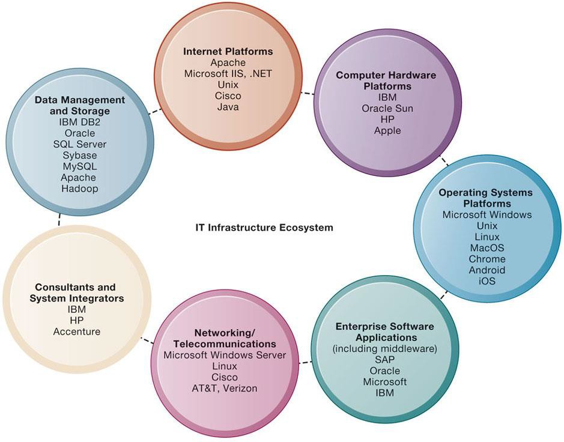
*Gambar 4.8: Tujuh Komponen Ekosistem Infrastruktur TI Korporat*

Infrastruktur TI sebuah korporasi tersusun dari 7 komponen ekosistem utama yang harus terkoordinasi secara harmonis:

```
┌────────────────────────────────────────────────────────────────────────┐
│                    EKOSISTEM INFRASTRUKTUR TI LENGKAP                  │
├────────────────────────────────────────────────────────────────────────┤
│ 1. Platform Perangkat Keras: Server Dell, HPE, IBM; Chip Intel, AMD, ARM│
├────────────────────────────────────────────────────────────────────────┤
│ 2. Platform Sistem Operasi: Microsoft Windows, Linux, Unix, macOS, iOS │
├────────────────────────────────────────────────────────────────────────┤
│ 3. Aplikasi Perangkat Lunak Enterprise: SAP, Oracle, Microsoft Dynamics │
├────────────────────────────────────────────────────────────────────────┤
│ 4. Manajemen Data & Penyimpanan: Oracle DB, MS SQL, MySQL, Apache Spark│
├────────────────────────────────────────────────────────────────────────┤
│ 5. Platform Jaringan & Telekomunikasi: Cisco, Juniper, AT&T, Telkomsel │
├────────────────────────────────────────────────────────────────────────┤
│ 6. Platform Internet: Apache, Microsoft IIS, Amazon Web Services, Azure│
├────────────────────────────────────────────────────────────────────────┤
│ 7. Layanan Integrasi Sistem & Konsultasi: Accenture, IBM Global, Wipro │
└────────────────────────────────────────────────────────────────────────┘
```

1. **Computer Hardware Platforms:** Server korporat berdaya tinggi, mainframe pemrosesan transaksi keuangan, PC desktop, serta chip prosesor 64-bit.
2. **Operating System Platforms:** Sistem operasi server (Linux mendominasi server cloud dan enterprise; Windows Server memimpin pasar direktori korporat) dan OS pengguna (Windows, iOS, Android).
3. **Enterprise Software Applications:** Paket software raksasa penyedia modul ERP, CRM, dan SCM terintegrasi.
4. **Data Management and Storage:** Perangkat lunak RDBMS untuk pengorganisasian data bisnis serta perangkat penyimpanan fisik berskala besar (*Storage Area Networks - SAN*).
5. **Networking/Telecommunications Platforms:** Perangkat keras router, switch jaringan, dan saluran sewa telekomunikasi (*leased lines*).
6. **Internet Platforms:** Perangkat keras, software web server, dan hosting yang menyajikan situs e-commerce dan aplikasi web perusahaan.
7. **Consulting and System Integration Services:** Tenaga konsultan eksternal yang dipekerjakan untuk mengintegrasikan software modern dengan sistem warisan tua (*legacy systems*) yang belum bisa digantikan.

---

## 5. Tren Platform Perangkat Keras Kontemporer

### 5.1 Platform Digital Seluler dan BYOD (Bring Your Own Device)
- Smartphone dan tablet menggantikan PC konvensional untuk sebagian besar kebutuhan koordinasi harian.
- **BYOD (*Bring Your Own Device*):** Kebijakan di mana karyawan diizinkan menggunakan perangkat pribadi mereka untuk mengakses jaringan korporat.
  - *Kelebihan:* Mengurangi biaya pengadaan perangkat keras korporat; kenyamanan karyawan.
  - *Tantangan:* Keamanan data perusahaan rentan bocor jika ponsel hilang; butuh sistem **MDM (*Mobile Device Management*)**.

### 5.2 Virtualisasi (Virtualization)
> [!info] Definisi Virtualisasi
> **Virtualisasi** adalah proses menyajikan serangkaian sumber daya komputasi fisik (seperti daya CPU, RAM, atau penyimpanan disk) sehingga mereka dapat diakses dalam cara yang tidak dibatasi oleh konfigurasi fisik atau lokasi geografis.

- **Hypervisor:** Perangkat lunak (seperti VMware ESXi, Microsoft Hyper-V, KVM) yang memungkinkan satu server fisik tunggal menjalankan banyak mesin virtual (*Virtual Machines - VM*) dengan sistem operasi berbeda secara bersamaan.
- **Server Consolidation:** Sebelum virtualisasi, server fisik rata-rata hanya memiliki utilisasi 10%–15%. Dengan virtualisasi, satu mesin dapat mencapai utilisasi 70%–80%, menghemat drastis biaya perangkat keras, konsumsi listrik data center, dan ruang pendingin ruangan.

### 5.3 Komputasi Awan (Cloud Computing)

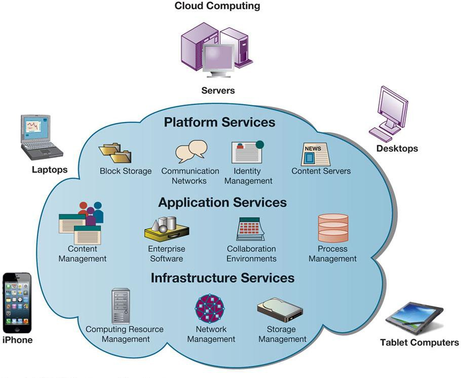
*Gambar 4.9: Platform Komputasi Awan (Resource Pooling & Layanan Berbasis Jaringan)*

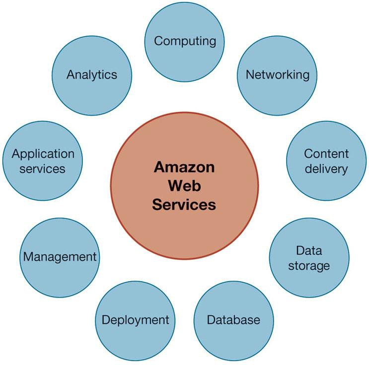
*Gambar 4.10: Arsitektur Layanan Cloud Amazon Web Services (AWS)*

Definisi resmi **NIST (*National Institute of Standards and Technology*)**:
Model yang memungkinkan akses jaringan yang nyaman dan sesuai permintaan (*on-demand*) ke kumpulan sumber daya komputasi bersama yang dapat dikonfigurasi (jaringan, server, penyimpanan, aplikasi) yang dapat disediakan dan dirilis secara cepat dengan upaya manajemen minimal.

#### Lima Karakteristik Kunci Cloud Computing:
1. *On-Demand Self-Service:* Pengguna dapat menambah kapasitas server sendiri secara otomatis tanpa interaksi manusia dengan penyedia layanan.
2. *Ubiquitous Network Access:* Dapat diakses dari mana saja menggunakan perangkat apa saja melalui internet standar.
3. *Location-Independent Resource Pooling:* Sumber daya komputasi penyedia dikumpulkan untuk melayani banyak konsumen (*multi-tenancy*) di mana pengguna tidak tahu lokasi fisik server berada.
4. *Rapid Elasticity:* Kapasitas komputasi dapat dinaikkan atau diturunkan secara elastis seketika sesuai lonjakan trafik.
5. *Measured Service:* Pembayaran berbasis konsumsi aktual (*pay-as-you-go*).

#### Tiga Model Layanan Cloud Computing (SPI Model):
```
┌────────────────────────────────────────────────────────────────────────┐
│ SOFTWARE AS A SERVICE (SaaS)                                          │
│   Pengguna hanya memakai aplikasi siap pakai via browser               │
│   Contoh: Salesforce, Google Workspace, Microsoft 365                  │
├────────────────────────────────────────────────────────────────────────┤
│ PLATFORM AS A SERVICE (PaaS)                                          │
│   Pengembang menyewa platform lingkungan runtime untuk coding aplikasi│
│   Contoh: Google App Engine, AWS Elastic Beanstalk, Heroku             │
├────────────────────────────────────────────────────────────────────────┤
│ INFRASTRUCTURE AS A SERVICE (IaaS)                                     │
│   Perusahaan menyewa mesin virtual mentah, storage, dan jaringan       │
│   Contoh: Amazon EC2 & S3, Microsoft Azure VM, Google Compute Engine   │
└────────────────────────────────────────────────────────────────────────┘
```

#### Tiga Model Deployment Cloud:
- **Public Cloud:** Infrastruktur dimiliki penyedia pihak ketiga dan disewakan kepada publik umum melalui internet (AWS, Azure, GCP).
- **Private Cloud:** Infrastruktur cloud yang dioperasikan semata-mata untuk satu organisasi tunggal, dikelola secara internal atau oleh pihak ketiga di balik firewall privat.
- **Hybrid Cloud:** Model kombinasi di mana perusahaan menggunakan infrastruktur private cloud untuk data sensitif rahasia, namun memanfaatkan public cloud saat terjadi lonjakan trafik musiman (*cloud bursting*).

### 5.4 Komputasi Hijau (Green Computing) dan Prosesor Multi-Core
- **Green Computing:** Praktik merancang, memproduksi, menggunakan, dan membuang komputer, server, dan perangkat terkait secara ramah lingkungan untuk memangkas konsumsi daya listrik data center dan jejak karbon emisi.
- **Prosesor Multi-Core:** Menempatkan dua atau lebih inti prosesor independen pada satu sirkuit terpadu silikon tunggal (dual-core, quad-core, octa-core) guna meningkatkan kecepatan proses komputasi paralel tanpa menghasilkan panas berlebih.

### 5.5 Komputasi Kuantum (Quantum Computing)
- Menggunakan prinsip mekanika kuantum dengan memproses data dalam unit **Qubits (*quantum bits*)**.
- Qubit dapat berada dalam status 0, 1, atau keduanya secara bersamaan (**Superposisi kuantum**), memungkinkan pemrosesan jutaan kemungkinan secara simultan dalam hitungan detik.
- Berpotensi mendisrupsi bidang kriptografi keamanan siber, simulasi material molekuler, dan kecerdasan buatan.

---

## 6. Tren Platform Perangkat Lunak Kontemporer

### 6.1 Open Source Software (OSS) dan Sistem Operasi Linux
- **Open Source Software:** Perangkat lunak yang diproduksi oleh komunitas programmer global di mana kode sumbernya (*source code*) disediakan secara gratis dan bebas dimodifikasi di bawah lisensi publik (misal GNU General Public License).
- **Linux:** Sistem operasi open-source turunan Unix yang diciptakan oleh Linus Torvalds. Linux mendominasi pasar server web global, cloud computing, superkomputer dunia, serta mendasari sistem operasi Android.

### 6.2 Perangkat Lunak untuk Web: Java dan HTML5
- **Java:** Bahasa pemrograman berorientasi objek yang dirancang dengan filosofi *"Write Once, Run Anywhere"* (WORA) berkat keberadaan Java Virtual Machine (JVM).
- **HTML5:** Generasi standar markup web terbaru yang memungkinkan penyematan animasi, grafik interaktif, dan video/audio secara langsung di dalam peramban web tanpa memerlukan plugin pihak ketiga (seperti Adobe Flash yang telah usang).

### 6.3 Layanan Web (Web Services) dan Service-Oriented Architecture (SOA)
> [!info] Definisi Layanan Web
> **Web Services** adalah kumpulan komponen perangkat lunak yang saling bertukar informasi secara universal menggunakan protokol web standar (XML, JSON, SOAP, REST) tanpa memandang sistem operasi atau bahasa pemrograman yang digunakan.

- **Service-Oriented Architecture (SOA):** Pendekatan arsitektur perangkat lunak di mana sistem dibangun dari kumpulan layanan modular independen yang dapat digabungkan kembali untuk melayani berbagai proses bisnis.
- **Contoh Kasus: Dollar Rent A Car**

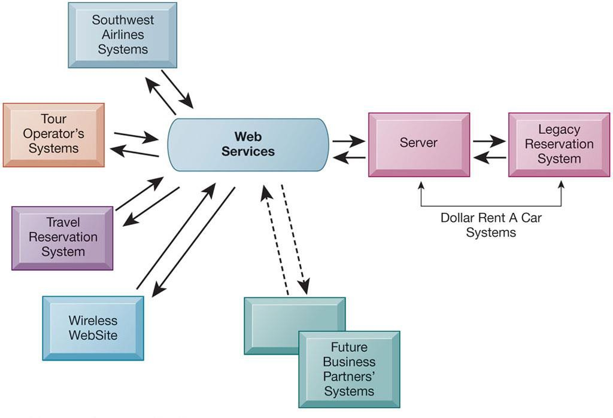
*Gambar 4.11: Arsitektur Web Services Dollar Rent A Car untuk Integrasi Reservasi*

  - Dollar Rent A Car menggunakan web services untuk menghubungkan sistem reservasi mobil sewa internalnya langsung ke situs maskapai penerbangan Southwest Airlines.
  - Penumpang dapat memesan mobil sewaan langsung dari antarmuka tiket penerbangan Southwest tanpa mengharuskan kedua korporasi menulis ulang basis data mereka.

### 6.4 Outsourcing Perangkat Lunak dan Cloud Software Services

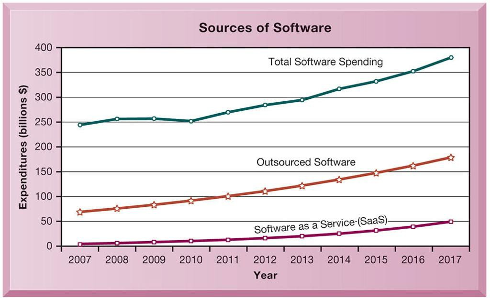
*Gambar 4.12: Pergeseran Sumber Perangkat Lunak Perusahaan ke Arah SaaS & Outsourcing*

Perusahaan masa kini memperoleh perangkat lunak melalui tiga sumber eksternal:
1. **Paket Perangkat Lunak Komersial (*Software Packages*):** Membeli software siap pakai dari vendor (misal paket akuntansi SAP).
2. **Software Outsourcing:** Mengontrak perusahaan luar (sering kali vendor *offshore* di India, Vietnam, atau Eropa Timur) untuk membangun perangkat lunak kustom.
   - Wajib diatur dengan **SLA (*Service Level Agreement*)** yang mendefinisikan standar kinerja, waktu respons, dan penalti jika server tumbang.
3. **Cloud Software Services (SaaS):** Berlangganan perangkat lunak melalui internet secara bulanan/tahunan.

---

## 7. Manajemen, Tata Kelola, dan Investasi Infrastruktur

### 7.1 Mengelola Perubahan Platform dan Skalabilitas
- Bisnis yang tumbuh pesat dapat melampaui kapasitas infrastruktur TI lamanya.
- **Skalabilitas (*Scalability*):** Kemampuan sistem komputasi, jaringan, atau proses untuk berkembang melayani peningkatan beban pengguna dalam jumlah besar tanpa mengalami gangguan penurunan performa.

### 7.2 Tata Kelola Infrastruktur TI (IT Governance)
Siapa yang berwenang mengambil keputusan mengenai infrastruktur TI korporat?
- **Sentralistik:** Divisi TI pusat mengendalikan seluruh anggaran, standar hardware, dan kebijakan software (keuntungan: efisiensi biaya skala besar dan kepatuhan standar).
- **Desentralistik:** Setiap unit divisi bisnis bebas membeli dan mengelola sistemnya sendiri (keuntungan: fleksibel terhadap kebutuhan unit pasar, namun memicu fragmentasi sistem).

### 7.3 Model Total Cost of Ownership (TCO)
Ketika mengevaluasi biaya perangkat keras atau lunak, biaya pembelian awal hanyalah sebagian kecil dari total biaya kepemilikan riil:

```
┌────────────────────────────────────────────────────────────────────────┐
│                   TOTAL COST OF OWNERSHIP (TCO)                        │
├────────────────────────────────────────────────────────────────────────┤
│ BIAYA LANGSUNG (Direct / Acquisition Costs):                           │
│   • Pembelian perangkat keras (server, PC, router)                     │
│   • Pembelian lisensi perangkat lunak                                  │
├────────────────────────────────────────────────────────────────────────┤
│ BIAYA TIDAK LANGSUNG & OPERASIONAL (Indirect / Ongoing Costs):         │
│   • Biaya instalasi dan konfigurasi sistem                             │
│   • Biaya pemeliharaan rutin dan pembaruan lisensi tahunan             │
│   • Biaya pelatihan staf dan pengguna akhir (User Training)            │
│   • Biaya dukungan teknis meja bantuan (Helpdesk Support)              │
│   • Biaya infrastruktur listrik, pendingin ruangan, dan keamanan fisik │
│   • Biaya kerugian downtime (ketika sistem macet dan transaksi hilang) │
└────────────────────────────────────────────────────────────────────────┘
```
- Mengadopsi komputasi awan dan virtualisasi sering kali menurunkan TCO hingga 30%–50% karena memangkas biaya pemeliharaan operasional internal.

### 7.4 Model Kekuatan Kompetitif untuk Investasi Infrastruktur TI

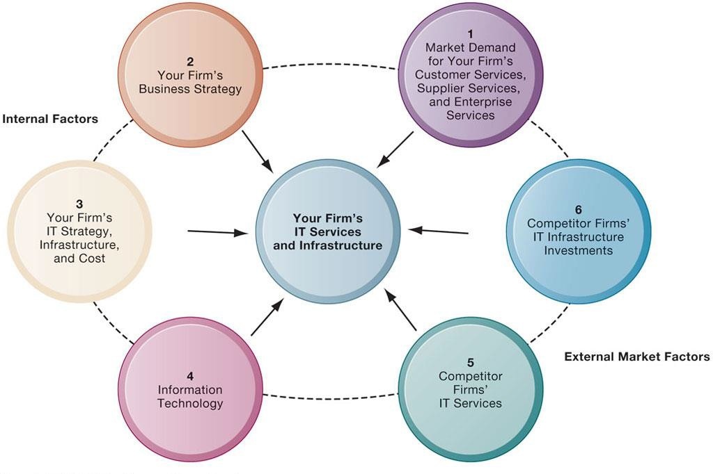
*Gambar 4.13: Model 6 Kekuatan Kompetitif untuk Keputusan Investasi Infrastruktur TI*

Manajer dapat menggunakan model 6 kekuatan kompetitif untuk menentukan berapa besar anggaran yang tepat untuk diinvestasikan pada infrastruktur TI:

```
                           ┌────────────────────────────┐
                           │   PERMINTAAN PASAR AKAN    │
                           │ LAYANAN BISNIS PERUSAHAAN  │
                           └─────────────┬──────────────┘
                                         │
 ┌───────────────────────────┐           ▼           ┌───────────────────────────┐
 │   STRATEGI BISNIS KORPORAT├────────►┌───┐◄────────┤ STRATEGI, INFRASTRUKTUR & │
 │     (Rencana Pertumbuhan) │         │   │         │    BIAYA TI PERUSAHAAN    │
 └───────────────────────────┘         │TI │         └───────────────────────────┘
 ┌───────────────────────────┐         │INV│         ┌───────────────────────────┐
 │    PENILAIAN TEKNOLOGI    ├────────►│   │◄────────┤    LAYANAN TEKNOLOGI      │
 │  INFORMASI (Tren Terkini) │         └───┘         │  PERUSAHAAN PESAING (Bench)│
 └───────────────────────────┘           ▲           └───────────────────────────┘
                                         │
                           ┌─────────────┴──────────────┐
                           │    INVESTASI TI OLEH       │
                           │   PERUSAHAAN PESAING       │
                           └────────────────────────────┘
```

---

## 8. Ringkasan & Latihan Ujian (Cheatsheet)

> [!tip] Rangkuman Cepat untuk Ujian (Exam Quick Sheet)
> 1. **5 Era Evolusi TI:** Mainframe -> PC -> Client/Server -> Enterprise Computing -> Cloud/Mobile.
> 2. **Arsitektur Multi-Tier (N-Tier):** Client (Browser) -> Web Server (Halaman web) -> Application Server (Logika bisnis) -> Database Server (Penyimpanan RDBMS).
> 3. **Hukum Moore:** Transistor berlipat ganda setiap 18-24 bulan, harga komputasi turun 50%.
> 4. **Hukum Metcalfe:** Nilai jaringan meningkat proporsional terhadap kuadrat jumlah anggotanya ($V \propto N^2$).
> 5. **Virtualisasi:** Memisahkan OS dari hardware fisik menggunakan Hypervisor untuk server consolidation (utilisasi naik ke 70-80%).
> 6. **Model Cloud SPI:**
>    - IaaS: Sewa server mentah, disk, dan jaringan (AWS EC2).
>    - PaaS: Sewa platform development dan database runtime (App Engine).
>    - SaaS: Sewa software aplikasi jadi lewat web (Salesforce, Google Workspace).
> 7. **Web Services & SOA:** Pertukaran data universal menggunakan protokol terbuka (XML, JSON, REST) untuk integrasi sistem heterogen (contoh: Dollar Rent A Car).
> 8. **TCO (Total Cost of Ownership):** Biaya riil TI mencakup biaya akuisisi awal DITAMBAH biaya pelatihan, instalasi, dukungan teknis, listrik, dan biaya downtime.
